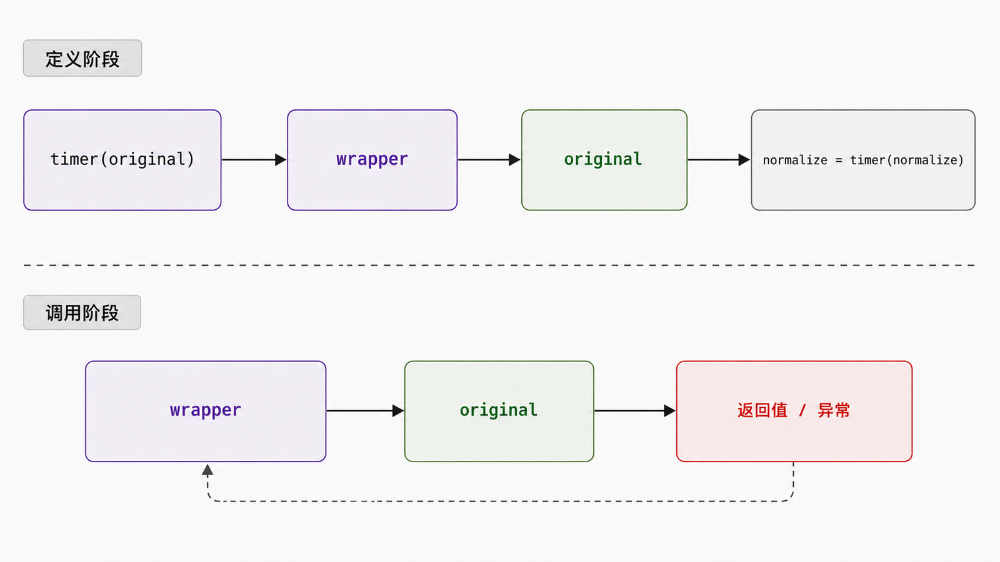
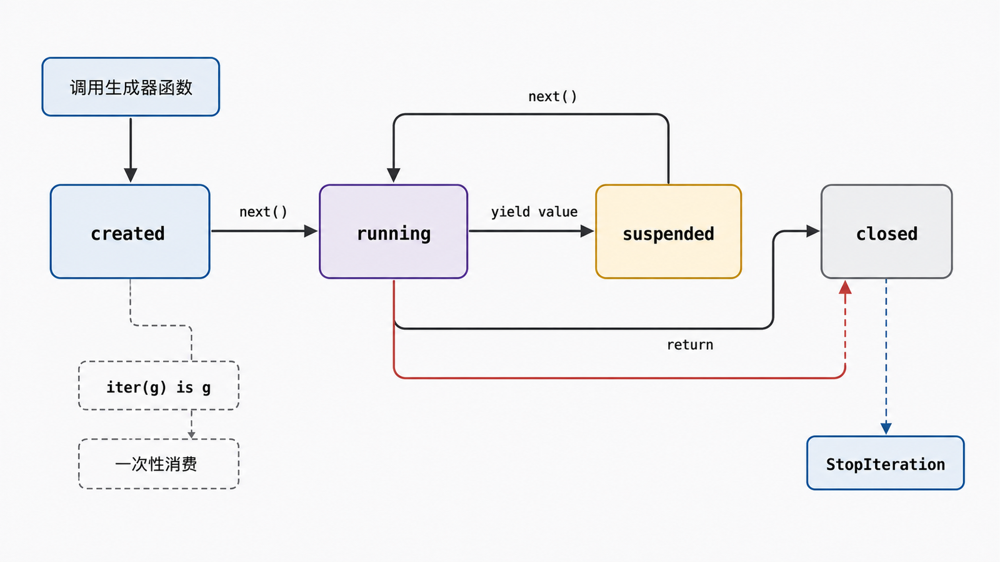

## 前置知识与学习目标

你需要会定义函数、传参、捕获异常和编写 `for` 循环。本文用“报表流水线”贯穿全系列：数据记录从文件进入程序，经过校验、转换、导出和发送。

学完后，你应该能够：

1. 解释装饰器为何是“接收可调用对象并返回可调用对象”。
2. 区分可迭代对象、迭代器与生成器，并说出 `for` 的停止条件。
3. 用装饰器处理横切关注点，用生成器构造只遍历一次的惰性数据流。
4. 识别元数据丢失、迭代器耗尽和资源生命周期过长等失败边界。

## 真实场景与核心问题

报表流水线需要记录每个处理步骤的耗时，还要逐行处理可能有数 GB 的输入。如果把计时逻辑复制进每个函数，业务代码会被污染；如果先把所有行读进列表，内存会随输入线性增长。

两个问题看似无关，实质都在控制“什么时候做事”：装饰器把行为包在函数调用前后，生成器把计算推迟到请求下一个值时。

## 装饰器：在不改调用方的前提下包装行为

函数是对象，可以被传入、保存和返回。装饰器语法：

```python
@timer
def normalize(record):
    ...
```

等价于：

```python
def normalize(record):
    ...

normalize = timer(normalize)
```

装饰发生在函数定义执行时，不是每次调用时。真正的业务调用进入包装函数，再由包装函数调用原函数。

<!-- figure-anchor:s17-f01 -->

<!-- figure-ref:s17-f01 -->



<!-- snippet: id=python-intermediate-17-01 mode=compile python=3.12-3.14 deps=stdlib -->

```python
from collections.abc import Callable
from functools import wraps
from time import perf_counter
from typing import ParamSpec, TypeVar

P = ParamSpec("P")
R = TypeVar("R")


def timed(func: Callable[P, R]) -> Callable[P, R]:
    @wraps(func)
    def wrapper(*args: P.args, **kwargs: P.kwargs) -> R:
        started = perf_counter()
        try:
            return func(*args, **kwargs)
        finally:
            elapsed = perf_counter() - started
            print(f"{func.__name__}: {elapsed:.6f}s")

    return wrapper


@timed
def normalize(record: dict[str, str]) -> dict[str, str]:
    return {key: value.strip() for key, value in record.items()}


assert normalize({"name": " Ada "}) == {"name": "Ada"}
assert normalize.__name__ == "normalize"
```

`ParamSpec` 与 `TypeVar` 保留参数和返回值的静态类型关系，`wraps` 复制 `__name__`、`__doc__` 等元数据，`finally` 保证原函数抛异常时仍记录耗时。装饰器不应吞掉未知异常。

带参数装饰器只是多一层“配置函数”：`retry(attempts=3)` 先接收配置并返回装饰器，装饰器再接收目标函数。三层闭包虽然合法，但如果状态、分支和生命周期变复杂，类或显式组合通常更清楚。

## 迭代协议：`for` 实际做了什么

术语必须严格区分：

| 术语                   | 最小契约                                      | 是否一次性 |
| ---------------------- | --------------------------------------------- | ---------- |
| 可迭代对象（iterable） | `iter(obj)` 能返回迭代器                      | 不一定     |
| 迭代器（iterator）     | `iter(it) is it`，并支持 `next(it)`           | 通常是     |
| 生成器（generator）    | 由含 `yield` 的函数或生成器表达式创建的迭代器 | 是         |

`for item in source` 的核心语义可以压缩为：

```python
iterator = iter(source)
while True:
    try:
        item = next(iterator)
    except StopIteration:
        break
    # 使用 item
```

迭代器被耗尽后不会自动回到开头。列表是可重复迭代的容器，每次 `iter(list)` 可得到新迭代器；生成器对象则保存一次执行状态。

## 生成器：把循环状态交给解释器保存

调用含 `yield` 的函数时，函数体不会立刻执行，而是返回生成器对象。每次 `next()` 从上次暂停点继续，遇到下一个 `yield` 再暂停；正常返回对应 `StopIteration`。

<!-- figure-anchor:s17-f02 -->

<!-- figure-ref:s17-f02 -->



<!-- snippet: id=python-intermediate-17-02 mode=compile python=3.12-3.14 deps=stdlib -->

```python
from collections.abc import Iterable, Iterator


def valid_records(rows: Iterable[str]) -> Iterator[dict[str, str]]:
    for line_number, row in enumerate(rows, start=1):
        text = row.strip()
        if not text or text.startswith("#"):
            continue
        name, separator, amount = text.partition(",")
        if not separator:
            raise ValueError(f"line {line_number}: missing comma")
        yield {"name": name.strip(), "amount": amount.strip()}


source = ["# name,amount", "Ada, 10", "Linus, 20"]
stream = valid_records(source)
assert next(stream) == {"name": "Ada", "amount": "10"}
assert list(stream) == [{"name": "Linus", "amount": "20"}]
assert list(stream) == []
```

流水线可继续用生成器表达式连接：

```python
amounts = (int(record["amount"]) for record in valid_records(source))
total = sum(amounts)
```

惰性意味着低峰值内存和更快首条输出，不意味着“免费”：整个序列仍会消耗 CPU；第二次遍历需要重新创建数据源；如果生成器持有打开的文件，文件可能直到生成器关闭才释放。资源边界应放在显式 `with` 中，并在同一作用域完成消费。

## 常见误区与适用边界

### 把装饰器当作普通注释

装饰器会替换原名字指向的对象，可能改变异常、签名、同步/异步语义。公共装饰器应保留元数据并明确是否可重入、是否线程安全。

### 用生成器后还要求随机访问

生成器不支持 `stream[10]`，也不适合需要反复排序、回看或多次聚合的流程。数据规模可控且需要随机访问时，列表更直接。

### 手动抛出 `StopIteration`

生成器用 `return` 表示结束。业务失败应抛有语义的异常；不要用 `StopIteration` 伪装解析错误。

### 把三个概念绑成固定组合

装饰器与迭代协议彼此独立。只有当调用包装和惰性数据流同时解决当前问题时才组合使用，不要为了“高级”增加间接层。

## 本篇自检

<details>
<summary>1. `@timer` 在什么时候执行，`wrapper` 又在什么时候执行？</summary>

定义被装饰函数时执行 `timer(original)` 并替换函数名；每次调用这个名字时执行返回的 `wrapper`。

</details>

<details>
<summary>2. 为什么 `list(stream)` 第二次通常为空？</summary>

生成器是一次性迭代器。第一次消费已经把执行推进到结束，第二次不会自动重建或回到起点。

</details>

<details>
<summary>3. 什么时候应优先返回列表而不是生成器？</summary>

结果规模可控，并且调用方需要随机访问、多次遍历、排序或稳定快照时，列表的契约更合适。

</details>

## 本篇总结

装饰器控制一次函数调用的外层行为；迭代协议规定如何逐个取值；生成器用 `yield` 实现保存执行状态的迭代器。正确选择取决于契约，而不是语法新奇程度。

## 下一篇衔接

下一篇把函数与数据进一步组织成对象：报表任务应该保存什么状态，类与实例的命名空间如何分工，以及什么时候根本不需要类。

## 资料来源与版本基线

- [Python 术语表：decorator](https://docs.python.org/3/glossary.html#term-decorator)
- [Python `functools.wraps`](https://docs.python.org/3/library/functools.html#functools.wraps)
- [Python Iterator Types](https://docs.python.org/3/library/stdtypes.html#iterator-types)
- [Python `yield` expressions](https://docs.python.org/3/reference/expressions.html#yield-expressions)

版本基线：Python 3.12–3.14；示例只依赖标准库。
