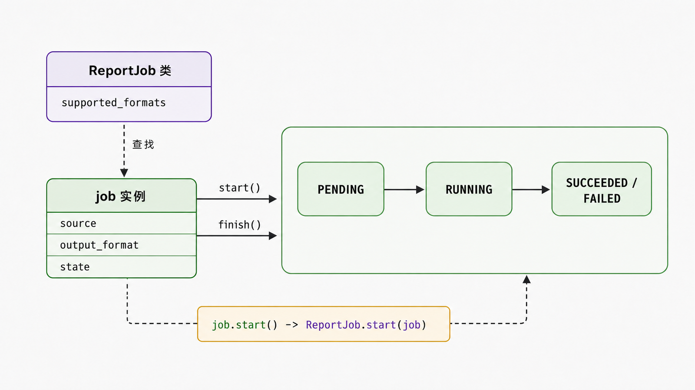

## 前置知识与学习目标

你需要理解函数、字典、异常和模块。本文继续使用报表流水线，但只回答一个问题：什么时候应该把数据与行为组织成对象？

学完后，你应该能够：

1. 从职责和不变量设计类，而不是把一组函数机械搬进类。
2. 区分类对象、实例对象、类属性、实例属性与绑定方法。
3. 解释实例属性的查找顺序和可变类属性的共享风险。
4. 在数据类、普通类、函数和模块之间做出有依据的选择。

## 真实场景与核心问题

报表任务包含输入路径、输出格式和当前状态。规则要求：任务只能从 `PENDING` 进入 `RUNNING`，成功后进入 `SUCCEEDED`，失败后进入 `FAILED`。如果状态散落在多个字典和函数里，任何调用方都能写出非法组合。

面向对象的价值不是“把代码放进 `class`”，而是让一个对象维护自己的不变量，并通过有限接口与其他对象协作。

## 核心机制：类定义类型，实例承载具体状态

执行 `class ReportJob: ...` 会创建一个类对象。调用 `ReportJob(...)` 通常经过 `__new__` 创建实例，再由 `__init__` 初始化。`__init__` 必须返回 `None`，它不是“创建对象本身”的函数。

<!-- figure-anchor:s18-f01 -->

<!-- figure-ref:s18-f01 -->



<!-- snippet: id=python-intermediate-18-01 mode=compile python=3.12-3.14 deps=stdlib -->

```python
from dataclasses import dataclass, field
from enum import Enum, auto
from pathlib import Path


class JobState(Enum):
    PENDING = auto()
    RUNNING = auto()
    SUCCEEDED = auto()
    FAILED = auto()


@dataclass
class ReportJob:
    source: Path
    output_format: str
    state: JobState = field(default=JobState.PENDING, init=False)

    supported_formats = frozenset({"csv", "json"})

    def __post_init__(self) -> None:
        if self.output_format not in self.supported_formats:
            raise ValueError(f"unsupported format: {self.output_format}")

    def start(self) -> None:
        if self.state is not JobState.PENDING:
            raise RuntimeError(f"cannot start from {self.state.name}")
        self.state = JobState.RUNNING

    def finish(self, *, succeeded: bool) -> None:
        if self.state is not JobState.RUNNING:
            raise RuntimeError(f"cannot finish from {self.state.name}")
        self.state = JobState.SUCCEEDED if succeeded else JobState.FAILED


job = ReportJob(Path("orders.csv"), "csv")
job.start()
job.finish(succeeded=True)
assert job.state is JobState.SUCCEEDED
```

这个类的核心不是字段数量，而是状态转换由方法守住。`supported_formats` 是不可变类属性，所有实例可以安全共享；`state` 是实例属性，每个任务独立。

## 命名空间与属性查找

常见实例属性查找可先理解为：实例命名空间 → 类命名空间 → 基类（按 MRO）。描述符可以参与并改变细节，下一篇的绑定方法与 `property` 会继续展开。

```python
assert job.output_format == job.__dict__["output_format"]
assert job.supported_formats == ReportJob.__dict__["supported_formats"]
```

类体中的函数被访问时会通过描述符协议形成绑定方法：

```python
bound = job.start
assert bound.__self__ is job
assert bound.__func__ is ReportJob.start
```

因此 `job.start()` 会自动把 `job` 作为第一个参数传给 `ReportJob.start`。`self` 只是约定俗成的参数名，不是关键字。

## 类属性与实例属性的共享边界

最常见的错误是把可变容器放在类上，却把它当作每个实例的默认值：

```python
class BrokenJob:
    warnings: list[str] = []  # 所有实例共享
```

数据类应使用 `field(default_factory=list)`：

<!-- snippet: id=python-intermediate-18-02 mode=compile python=3.12-3.14 deps=stdlib -->

```python
from dataclasses import dataclass, field


@dataclass
class JobResult:
    warnings: list[str] = field(default_factory=list)


first = JobResult()
second = JobResult()
first.warnings.append("empty row")
assert second.warnings == []
```

## 从职责到协作

设计类时可以用四个问题压缩范围：

| 问题               | `ReportJob` 的回答           |
| ------------------ | ---------------------------- |
| 对象代表什么？     | 一次报表任务                 |
| 必须始终成立什么？ | 格式受支持，状态转换合法     |
| 对外承诺什么？     | `start()`、`finish()`        |
| 不负责什么？       | 解析文件、发送邮件、认证用户 |

不属于本对象的职责应交给协作者，而不是不断扩张成“万能类”。例如导出策略可作为参数传入，邮件发送由单独服务负责。

## 常见误区与适用边界

### 每个名词都建一个类

只有数据转换且没有长期状态或不变量时，纯函数通常更容易测试。只保存数据时可考虑 `dataclass`、`NamedTuple` 或不可变映射。

### 直接暴露所有状态

Python 没有绝对私有，但这不等于没有封装。调用方若直接写 `job.state = JobState.SUCCEEDED`，就绕过了合法转换；稳定接口依赖约定、文档、类型和测试共同维护。

### 继承等于复用

继承表达“是一种”且要满足父类契约。仅为复用几行代码而继承容易产生错误耦合；组合会在第 30 篇系统比较。

### `__dict__` 就是完整对象模型

实例和类通常有 `__dict__`，但 `__slots__`、描述符和扩展类型可能改变存储与查找方式。业务代码不要依赖内部字典布局。

## 本篇自检

<details>
<summary>1. 为什么 `supported_formats` 适合作为类属性，而 `state` 不适合？</summary>

支持格式是所有任务共享且不可变的规则；状态描述某一次具体任务，必须由每个实例独立保存。

</details>

<details>
<summary>2. `job.start()` 中的 `job` 如何传入方法？</summary>

函数在类上作为描述符；从实例读取时形成绑定方法，绑定方法调用时自动把实例作为第一个参数传入。

</details>

<details>
<summary>3. 什么情况下函数比类更合适？</summary>

逻辑是无状态转换、输入到输出的纯变换，没有需要跨调用维护的不变量或生命周期时，函数通常更直接。

</details>

## 本篇总结

类用于定义职责和规则，实例用于承载具体状态。好的对象通过小而稳定的接口守住不变量，并把其他职责交给协作者；类不是组织代码的唯一答案。

## 下一篇衔接

下一篇深入对象接口的动态部分：实例方法、类方法和静态方法如何绑定，如何用类型检查和反射构建受控的导出插件注册表。

## 资料来源与版本基线

- [Python Tutorial：Classes](https://docs.python.org/3/tutorial/classes.html)
- [Python Data model](https://docs.python.org/3/reference/datamodel.html)
- [Python `dataclasses`](https://docs.python.org/3/library/dataclasses.html)

版本基线：Python 3.12–3.14；示例只依赖标准库。
