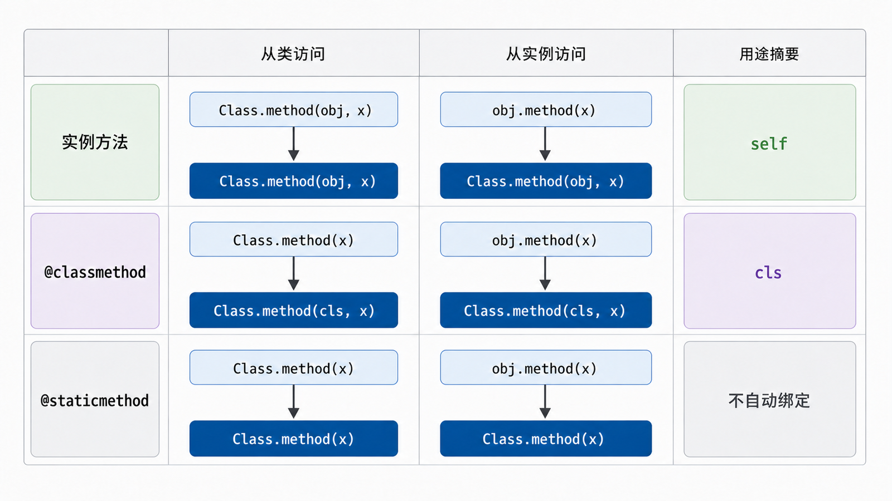
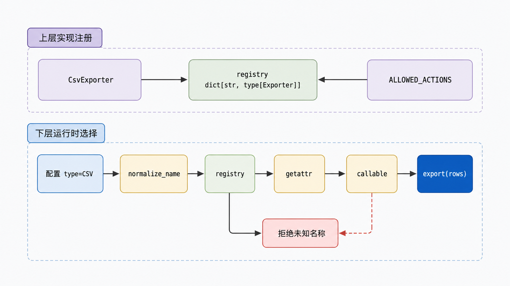

## 前置知识与学习目标

你需要理解上一章的类、实例和属性查找。本文只解决报表流水线中的“动态选择导出器”：配置给出 `csv` 或 `json`，程序如何安全找到并调用对应实现？

学完后，你应该能够：

1. 根据第一个隐式参数区分实例方法、类方法与静态方法。
2. 说明 `isinstance`、`issubclass` 与精确 `type(...) is ...` 的差异。
3. 用 `getattr` 做有白名单和默认值的反射，而不是执行任意用户输入。
4. 识别 `__getattr__`、`__getattribute__` 和属性写入钩子的递归风险。

## 真实场景与核心问题

配置文件写着 `exporter: csv`。最危险的实现是把任意字符串拼成代码再 `eval`；另一个脆弱方案是无限增长的 `if/elif`。更稳妥的方式是把允许的名字注册到明确映射中，然后按统一契约创建实例。

## 三种方法的绑定规则

| 定义方式        | 从类访问       | 从实例访问      | 典型用途                 |
| --------------- | -------------- | --------------- | ------------------------ |
| 普通实例方法    | 未绑定函数     | 绑定实例 `self` | 读取或修改实例状态       |
| `@classmethod`  | 绑定类 `cls`   | 仍绑定类 `cls`  | 替代构造器、类级注册     |
| `@staticmethod` | 原样可调用对象 | 原样可调用对象  | 与类语义相关的无状态函数 |

<!-- figure-anchor:s19-f01 -->

<!-- figure-ref:s19-f01 -->



<!-- snippet: id=python-intermediate-19-01 mode=compile python=3.12-3.14 deps=stdlib -->

```python
from __future__ import annotations

from abc import ABC, abstractmethod
from collections.abc import Mapping
from typing import ClassVar


class Exporter(ABC):
    registry: ClassVar[dict[str, type[Exporter]]] = {}

    def __init__(self, destination: str) -> None:
        self.destination = destination

    @abstractmethod
    def export(self, rows: list[dict[str, object]]) -> str:
        raise NotImplementedError

    @classmethod
    def register(cls, name: str, implementation: type[Exporter]) -> None:
        normalized = cls.normalize_name(name)
        if normalized in cls.registry:
            raise ValueError(f"duplicate exporter: {normalized}")
        if not issubclass(implementation, cls):
            raise TypeError("implementation must inherit Exporter")
        cls.registry[normalized] = implementation

    @classmethod
    def from_config(cls, config: Mapping[str, str]) -> Exporter:
        name = cls.normalize_name(config["type"])
        try:
            implementation = cls.registry[name]
        except KeyError as error:
            raise ValueError(f"unknown exporter: {name}") from error
        return implementation(config["destination"])

    @staticmethod
    def normalize_name(name: str) -> str:
        return name.strip().lower().replace("-", "_")


class CsvExporter(Exporter):
    def export(self, rows: list[dict[str, object]]) -> str:
        return f"{self.destination}:{len(rows)} rows"


Exporter.register("csv", CsvExporter)
exporter = Exporter.from_config({"type": "CSV", "destination": "out.csv"})
assert isinstance(exporter, Exporter)
assert exporter.export([{"amount": 10}]) == "out.csv:1 rows"
```

`from_config` 使用 `cls` 而不是写死 `Exporter`，因此子类继承时仍能遵循动态类。`normalize_name` 不读取类或实例状态，放在静态方法中只是为了命名空间；若其他模块也需要它，模块级函数可能更自然。

## 类型检查：契约兼容还是精确类型

`isinstance(obj, Exporter)` 接受 `Exporter` 及其子类，适合检查“是否满足这条名义继承契约”；`type(obj) is CsvExporter` 只接受精确类型，通常用于序列化分派等确实禁止子类的场景。

`issubclass(CsvExporter, Exporter)` 的第一个参数必须是类。不要用一长串 `isinstance` 代替多态；如果调用方只需要 `export()`，更好的设计是让对象提供稳定接口，或用 `typing.Protocol` 做静态结构化检查。

运行时 `isinstance(obj, SomeProtocol)` 只有在协议标注 `@runtime_checkable` 时可用，而且只检查属性是否存在，不验证完整签名。它不能替代真实调用测试。

## 反射：让字符串访问属性，但限制输入边界

Python 的四个常用反射函数是：

- `hasattr(obj, name)`：内部尝试 `getattr`，捕获 `AttributeError`。
- `getattr(obj, name[, default])`：按字符串读取属性。
- `setattr(obj, name, value)`：按字符串写属性。
- `delattr(obj, name)`：按字符串删除属性。

<!-- figure-anchor:s19-f02 -->

<!-- figure-ref:s19-f02 -->



<!-- snippet: id=python-intermediate-19-02 mode=compile python=3.12-3.14 deps=stdlib -->

```python
ALLOWED_ACTIONS = {"export"}


def invoke(exporter: Exporter, action: str, rows: list[dict[str, object]]) -> str:
    if action not in ALLOWED_ACTIONS:
        raise ValueError(f"action is not allowed: {action}")
    method = getattr(exporter, action, None)
    if method is None or not callable(method):
        raise TypeError(f"action is not callable: {action}")
    return method(rows)


assert invoke(exporter, "export", []) == "out.csv:0 rows"
```

反射的边界在“名字来自哪里”。来自内部常量的名字通常可控；来自 HTTP、YAML 或命令行的字符串必须经过白名单映射。不要把 `_secret`、双下划线属性或任意方法暴露成远程调用面。

## 属性钩子与失败边界

`__getattribute__` 拦截所有实例属性读取；`__getattr__` 只在正常查找失败后调用；`__setattr__` 拦截写入；`__delattr__` 拦截删除。覆盖这些方法时，内部应调用 `object.__getattribute__` 或 `object.__setattr__`，否则再次走自己的钩子会无限递归。

动态代理、ORM 和懒加载框架会使用这些钩子；普通业务类优先用明确属性或 `property`。隐式魔法越多，调试、类型检查和错误定位成本越高。

## 常见误区与适用边界

### 静态方法“性能更好”

选择静态方法是语义判断，不是性能优化。若函数不属于类的公共概念，放模块级更清楚。

### `hasattr` 没有副作用

属性访问可能执行描述符、`property` 或 `__getattr__`。`hasattr` 不是对内部字典的纯检查，属性代码的副作用和异常仍需考虑。

### 反射等于插件系统

反射只是动态访问机制。完整插件系统还需要注册、冲突策略、版本兼容、生命周期、错误隔离和安全边界。

### `isinstance` 能证明行为正确

它最多证明名义类型关系；实现仍可能违反返回值、异常或副作用契约。核心行为必须测试。

## 本篇自检

<details>
<summary>1. 为什么替代构造器通常用 `classmethod`？</summary>

它接收动态类 `cls`，子类继承后可构造子类实例；写死基类名会破坏这种扩展性。

</details>

<details>
<summary>2. 为什么不能直接 `getattr(service, user_input)()`？</summary>

用户可能访问未授权方法、内部状态或带副作用的属性。应先映射或白名单校验，再确认结果可调用。

</details>

<details>
<summary>3. `isinstance` 与 `type(obj) is T` 的主要差别是什么？</summary>

前者接受 `T` 的实例及其子类实例，后者只接受精确类型 `T`。

</details>

## 本篇总结

绑定规则决定方法自动接收实例还是类；类型检查用于表达有限的运行时契约；反射把字符串变成动态访问能力。三者组合时，注册表和白名单是比任意属性调用更清晰的安全边界。

## 下一篇衔接

下一篇把“对象提供统一接口”推进到封装与多态：如何保护状态不变量，以及不同导出器为什么能在不检查具体类型的情况下被替换。

## 资料来源与版本基线

- [Python `classmethod`](https://docs.python.org/3/library/functions.html#classmethod)
- [Python `staticmethod`](https://docs.python.org/3/library/functions.html#staticmethod)
- [Python `isinstance`](https://docs.python.org/3/library/functions.html#isinstance)
- [Python Data model：customizing attribute access](https://docs.python.org/3/reference/datamodel.html#customizing-attribute-access)

版本基线：Python 3.12–3.14；示例只依赖标准库。
