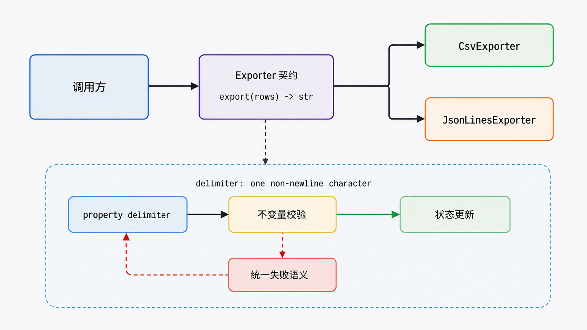
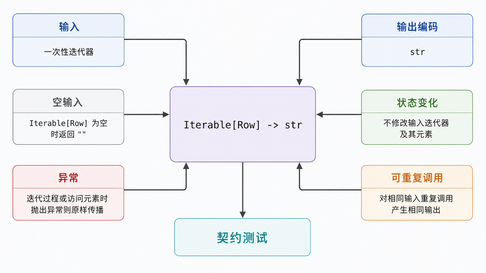

## 前置知识与学习目标

你需要理解类、实例、方法绑定与类型检查。本文只回答：如何让不同导出器可替换，同时不让调用方破坏对象内部状态？

学完后，你应该能够：

1. 把封装解释为“稳定接口保护不变量”，而不是“让属性绝对不可见”。
2. 说明单下划线、双下划线名称改写与 `property` 的真实作用。
3. 用抽象基类或 `Protocol` 表达导出器契约，并通过同一调用点实现多态。
4. 识别接口过宽、异常语义不一致和盲目鸭子类型的边界。

## 真实场景与核心问题

CSV 与 JSON 导出器内部配置不同，但流水线只想调用 `export(rows)`。与此同时，分隔符必须是单个字符，编码一旦开始导出就不能随意改变。

封装解决“对象如何保持有效”，多态解决“调用方如何只依赖共同能力”。两者共同降低变化传播。

## 封装：隐藏的是变化，不是秘密

Python 的约定层次：

| 写法       | 含义                            | 强制性                   |
| ---------- | ------------------------------- | ------------------------ |
| `name`     | 公共接口                        | 无访问限制               |
| `_name`    | 非公共实现细节                  | 约定                     |
| `__name`   | 类体内名称改写为 `_Class__name` | 防意外覆盖，不是安全边界 |
| `property` | 把方法暴露成受控属性接口        | 可校验读写               |

双下划线主要避免子类无意覆盖，并不能阻止有意访问。密码、令牌等敏感信息的保护依赖权限、进程边界、加密和日志策略，不能靠名称改写。

<!-- figure-anchor:s20-f01 -->

<!-- figure-ref:s20-f01 -->



<!-- snippet: id=python-intermediate-20-01 mode=compile python=3.12-3.14 deps=stdlib -->

```python
from collections.abc import Iterable, Mapping


class CsvExporter:
    def __init__(self, delimiter: str = ",") -> None:
        self.delimiter = delimiter
        self._started = False

    @property
    def delimiter(self) -> str:
        return self._delimiter

    @delimiter.setter
    def delimiter(self, value: str) -> None:
        if getattr(self, "_started", False):
            raise RuntimeError("delimiter cannot change after export starts")
        if len(value) != 1 or value in {"\r", "\n"}:
            raise ValueError("delimiter must be one non-newline character")
        self._delimiter = value

    def export(self, rows: Iterable[Mapping[str, object]]) -> str:
        materialized = list(rows)
        self._started = True
        if not materialized:
            return ""
        fields = list(materialized[0])
        lines = [self.delimiter.join(fields)]
        lines.extend(
            self.delimiter.join(str(row.get(field, "")) for field in fields)
            for row in materialized
        )
        return "\n".join(lines)


exporter = CsvExporter(";")
assert exporter.export([{"name": "Ada", "amount": 10}]) == "name;amount\nAda;10"
```

`property` 允许以后增加校验而不改变 `exporter.delimiter` 这个公共访问形式。但属性读取应保持便宜、可预测；涉及网络、重试或长时间计算的动作更适合显式方法。

## 多态：调用方依赖能力而不是具体类型

Python 常见两种契约表达：

- 抽象基类（ABC）：运行时名义契约，可阻止未实现抽象方法的类被实例化。
- `typing.Protocol`：静态结构化契约，只关心对象是否具有所需成员。

<!-- figure-anchor:s20-f02 -->

<!-- figure-ref:s20-f02 -->



<!-- snippet: id=python-intermediate-20-02 mode=compile python=3.12-3.14 deps=stdlib -->

```python
from collections.abc import Iterable, Mapping
from typing import Protocol


Row = Mapping[str, object]


class Exporter(Protocol):
    def export(self, rows: Iterable[Row]) -> str: ...


class JsonLinesExporter:
    def export(self, rows: Iterable[Row]) -> str:
        import json

        return "\n".join(
            json.dumps(dict(row), ensure_ascii=False, sort_keys=True) for row in rows
        )


def run_export(exporter: Exporter, rows: Iterable[Row]) -> str:
    return exporter.export(rows)


result = run_export(JsonLinesExporter(), [{"name": "Ada", "amount": 10}])
assert result == '{"amount": 10, "name": "Ada"}'
```

`run_export` 不检查 `CsvExporter` 或 `JsonLinesExporter`。只要静态类型契约与真实行为都兼容，新实现就能替换旧实现。这是鸭子类型的工程化版本：“像鸭子”不仅要有同名方法，还要满足参数、返回值、异常和副作用约定。

## 接口契约必须包含失败语义

只写 `export(rows) -> str` 还不完整。团队至少要约定：

- 输入能否是一次性迭代器，函数是否会消费它。
- 空输入返回空字符串还是只有表头。
- 字段缺失、不可序列化值和 I/O 失败抛什么异常。
- 输出是否稳定排序，换行与编码是什么。
- 方法是否可重复调用，是否修改对象状态。

Liskov 替换原则在这里不是抽象口号：如果某个导出器对空输入崩溃、另一个静默返回，调用方就无法真正替换它们。

## 常见误区与适用边界

### getter/setter 越多越封装

无校验、无不变量的机械 getter/setter 只增加样板。普通公共属性完全可以直接使用；当访问语义需要保持稳定或加入规则时再用 `property`。

### 双下划线提供安全性

名称改写可被观察和绕过，不是权限控制。它主要减少继承层级中的命名碰撞。

### 所有对象都接受同一巨大接口

接口越宽，实现越难替换。按调用方实际需要拆成小协议，例如 `Exporter`、`Closable`、`SupportsPreview`，不要强迫所有实现提供无意义方法。

### 捕获所有异常并返回 `None`

这会抹平失败语义，调用方无法区分“空结果”和“导出失败”。只转换已知异常，并保留异常链。

## 本篇自检

<details>
<summary>1. 为什么 `__token` 不是安全存储？</summary>

双下划线只是名称改写，仍可通过改写后的名字等方式访问；它不提供权限、加密或进程隔离。

</details>

<details>
<summary>2. 两个类都有 `export` 方法就一定可互换吗？</summary>

不一定。它们还必须兼容参数、返回值、异常、状态变化和资源生命周期等行为契约。

</details>

<details>
<summary>3. 什么时候 `property` 不合适？</summary>

操作昂贵、需要网络或重试、可能产生明显副作用时，显式方法更能让调用成本和失败边界可见。

</details>

## 本篇总结

封装用稳定接口保护对象不变量，多态让调用方只依赖所需能力。Python 的开放性并不取消边界，而是把边界更多交给小接口、类型、异常约定和测试共同表达。

## 下一篇衔接

下一篇离开对象模型，进入报表附件传输：Base64 如何把字节分组映射为 ASCII，填充为何出现，以及它为什么不是加密。

## 资料来源与版本基线

- [Python Tutorial：Private Variables](https://docs.python.org/3/tutorial/classes.html#private-variables)
- [Python `property`](https://docs.python.org/3/library/functions.html#property)
- [Python `abc`](https://docs.python.org/3/library/abc.html)
- [Python `typing.Protocol`](https://docs.python.org/3/library/typing.html#typing.Protocol)

版本基线：Python 3.12–3.14；示例只依赖标准库。
