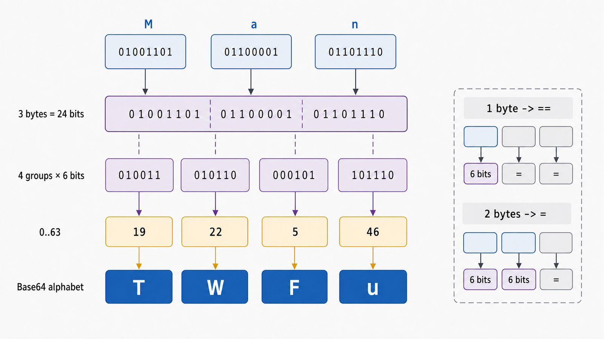

## 前置知识与学习目标

你需要知道文本最终按字符编码变成字节，并理解二进制位。本文继续使用报表流水线：把一个小型二进制附件放进只接受文本的 JSON 字段。

学完后，你应该能够：

1. 手算 3 字节如何变成 4 个 Base64 字符。
2. 解释 `=` 填充、标准字母表与 URL-safe 字母表。
3. 正确处理 `str`、`bytes`、字符编码和严格解码。
4. 说明 Base64 的体积成本与安全边界。

## 真实场景与核心问题

JSON 字符串不能直接承载任意二进制字节。Base64 把字节转换成有限 ASCII 字符，使二进制能经过文本通道；它只改变表示，不提供保密性或完整性。

## 核心机制：每 24 位拆成四组 6 位

Base64 的基本步骤：

1. 每 3 个输入字节组成 24 位。
2. 从左到右拆成 4 组，每组 6 位。
3. 每个 6 位数值范围是 0–63，作为 64 字符字母表的索引。
4. 最后一组不足 3 字节时补零位，并用 `=` 标记缺失的输出位置。

以 ASCII 文本 `Man` 为例：

```text
M        a        n
01001101 01100001 01101110
010011 010110 000101 101110
19     22     5      46
T      W      F      u
```

因此 `b"Man"` 编码为 `b"TWFu"`。

<!-- figure-anchor:s21-f01 -->

<!-- figure-ref:s21-f01 -->



## 填充与长度关系

输入余数决定填充：

| 输入字节数 mod 3 | 有效 6 位组 | 填充 | 示例           |
| ---------------- | ----------- | ---- | -------------- |
| 0                | 4           | 无   | `Man` → `TWFu` |
| 1                | 2           | `==` | `M` → `TQ==`   |
| 2                | 3           | `=`  | `Ma` → `TWE=`  |

输出长度（保留填充时）为 `4 * ceil(n / 3)`。大数据的渐近体积增加约三分之一，另有协议换行、JSON 引号等额外开销。Base64 不适合替代对象存储或流式二进制传输。

## Python 编解码契约

现代 `base64` 接口的编码输入是 bytes-like 对象，返回 ASCII `bytes`；解码返回原始 `bytes`。文本必须先明确字符编码。

<!-- snippet: id=python-intermediate-21-01 mode=compile python=3.12-3.14 deps=stdlib -->

```python
import base64
import binascii


def encode_text(text: str) -> str:
    raw = text.encode("utf-8")
    return base64.b64encode(raw).decode("ascii")


def decode_text(encoded: str) -> str:
    try:
        raw = base64.b64decode(encoded, validate=True)
    except binascii.Error as error:
        raise ValueError("invalid Base64 payload") from error
    return raw.decode("utf-8")


payload = encode_text("报表")
assert decode_text(payload) == "报表"
assert base64.b64encode(b"Man") == b"TWFu"
```

`validate=True` 会拒绝非字母表字符，而默认模式可能先丢弃它们再检查填充。对来自外部边界的协议字段，严格验证通常更合适；如果协议允许空白或换行，应在明确规范下预处理，而不是无条件宽容。

## 标准与 URL-safe 字母表

标准 Base64 使用 `+` 和 `/`；URL-safe 变体用 `-` 和 `_` 替代它们：

<!-- snippet: id=python-intermediate-21-02 mode=compile python=3.12-3.14 deps=stdlib -->

```python
import base64

raw = b"\xfb\xff"
assert base64.b64encode(raw) == b"+/8="
assert base64.urlsafe_b64encode(raw) == b"-_8="
assert base64.urlsafe_b64decode(b"-_8=") == raw
```

URL-safe 不等于可以直接放进任意 URL：结果仍可能含 `=`，具体协议可能省略填充并规定恢复方式。JWT 的各段使用 Base64url 且通常不带填充，这是 JWT 协议的规则，不应混同于普通 `urlsafe_b64encode`。

## 常见误区与适用边界

### Base64 是加密或哈希

任何人都能解码。敏感数据仍需经过经过审查的加密协议；完整性需要 MAC、数字签名或协议自带认证。

### 编码后内容更小

通常更大。已经压缩的图片、PDF 再 Base64 不会因此压缩；若协议允许，直接发送二进制更高效。

### `str` 与 `bytes` 可以混用

Base64 处理字节，UTF-8 处理文本到字节的映射。两层必须分别命名和测试，避免依赖平台默认编码。

### 解码成功就代表可信

解码只证明表示形式可解析，不证明来源、类型、大小或内容安全。解码前后都应设置长度上限，并按真实文件格式验证。

## 本篇自检

<details>
<summary>1. 为什么 3 字节恰好对应 4 个 Base64 字符？</summary>

3 字节是 24 位，Base64 每个字符携带 6 位索引，`24 / 6 = 4`。

</details>

<details>
<summary>2. `=` 是否属于原始数据？</summary>

不是。它是编码表示中的填充标记，用于指出最后 24 位组缺少多少输入字节。

</details>

<details>
<summary>3. 为什么外部输入宜使用严格解码？</summary>

默认宽容模式可能忽略非字母表字符；严格模式能让非法输入在边界处明确失败，减少歧义和隐藏错误。

</details>

## 本篇总结

Base64 是 8 位字节到 6 位索引的可逆表示：3 字节变 4 字符，尾部用填充描述不完整分组。它解决文本通道兼容性，不解决加密、完整性或压缩。

## 下一篇衔接

下一篇进入交互式验证工具：用 IPython 快速检查编码结果、对象类型、性能和异常，同时避免 Notebook 的隐藏状态污染结论。

## 资料来源与版本基线

- [RFC 4648：Base-N Encodings](https://www.rfc-editor.org/rfc/rfc4648)
- [Python `base64`](https://docs.python.org/3/library/base64.html)
- [Python `binascii`](https://docs.python.org/3/library/binascii.html)

版本基线：Python 3.12–3.14；示例只依赖标准库。
