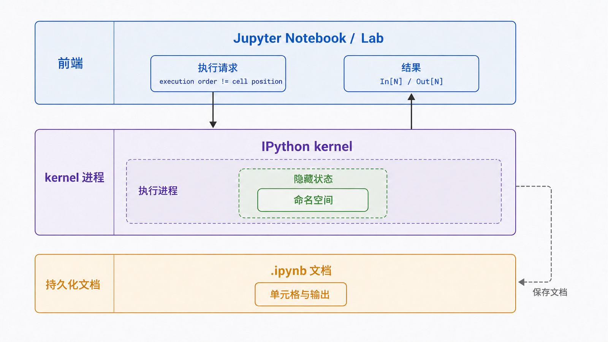
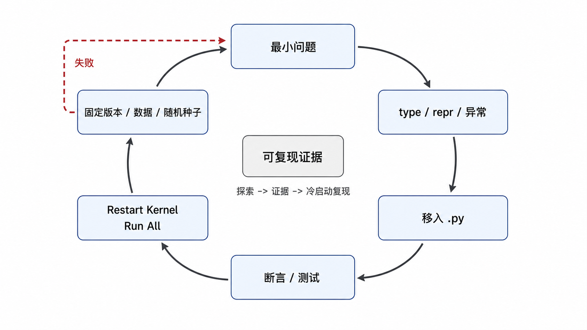

## 前置知识与学习目标

你需要能在终端运行 Python 和安装包。本文聚焦一个问题：如何把交互式探索变成可重复验证，而不是留下只能在当前会话运行的代码片段？

学完后，你应该能够：

1. 区分 IPython shell、IPython kernel、Jupyter 前端与 Notebook 文档。
2. 使用对象自省、历史、`%run`、`%timeit` 和 `%debug` 建立反馈循环。
3. 解释 Notebook 的执行计数为何可能不等于从上到下顺序。
4. 把探索结果迁移到脚本和测试，并验证冷启动可复现性。

## 真实场景与核心问题

你在 Notebook 中验证了 Base64 解码函数，保存后交给同事却出现 `NameError`。原因可能是某个变量来自早先已执行但后来删除的单元格。交互环境的优势是反馈快，风险是进程状态会长期存活。

## 组件与状态边界

| 组件           | 职责                                   |
| -------------- | -------------------------------------- |
| IPython shell  | 增强的交互提示符、自省、历史、魔术命令 |
| IPython kernel | 执行代码并维护进程内命名空间           |
| Jupyter 前端   | Notebook、Lab、Console 等用户界面      |
| `.ipynb` 文档  | 单元格、输出和元数据的 JSON 文档       |

同一个 kernel 可以执行多个单元格，变量、导入、随机状态和打开的资源都留在进程里。保存 Notebook 不等于保存完整运行环境。

<!-- figure-anchor:s22-f01 -->

<!-- figure-ref:s22-f01 -->



## 高价值交互工具

### 对象自省

```ipython
In [1]: payload?
In [2]: decode_text??
In [3]: type(payload), len(payload)
In [4]: payload.<TAB>
```

`?` 显示签名、文档等信息；`??` 在可用时还会显示源代码。Tab 补全适合探索对象，但不能替代官方文档或静态类型。

### 运行脚本而不是复制脚本

把稳定实现放进 `report_lab.py`：

<!-- snippet: id=python-intermediate-22-01 mode=compile python=3.12-3.14 deps=stdlib -->

```python
import base64


def round_trip(data: bytes) -> bytes:
    return base64.b64decode(base64.b64encode(data), validate=True)


if __name__ == "__main__":
    assert round_trip("报表".encode("utf-8")) == "报表".encode("utf-8")
```

然后在 IPython 中：

```ipython
In [1]: %run report_lab.py
In [2]: round_trip(b"abc")
Out[2]: b'abc'
```

`%run` 每次从磁盘重新读取脚本，并把执行后的名字带入交互命名空间。稳定代码在文件里，交互会话只负责提出问题。

### 测量与调试

```ipython
In [3]: %timeit round_trip(b"x" * 4096)
In [4]: %run -d report_lab.py
In [5]: %pdb on
In [6]: %debug
```

`%timeit` 会多轮执行并报告统计量，适合微基准；它不等于端到端性能测试。`%debug` 可在异常后进入调试器检查调用栈，减少临时 `print`。

### 历史是线索，不是版本控制

```ipython
In [7]: %history -n 1-6
In [8]: In[3]
In [9]: Out[2]
```

IPython 保存输入历史，并在会话中缓存输出引用。大对象可能因 `Out` 缓存继续被引用；在内存实验中可用分号抑制输出缓存，或显式 `%reset`/重启 kernel。

## 可复现的探索闭环

<!-- figure-anchor:s22-f02 -->

<!-- figure-ref:s22-f02 -->



推荐循环：

1. 用最小输入在 IPython 提出一个可证伪的问题。
2. 用 `type`、`repr`、长度和异常检查输入输出。
3. 把稳定逻辑移入 `.py` 文件，写断言或测试。
4. 重启 kernel，从空状态运行脚本或“Restart Kernel and Run All”。
5. 固定 Python 与依赖版本，记录数据样本和随机种子。

Notebook 适合保留叙事、图表与实验记录；库代码、凭据、复杂分支和自动化测试应放在普通源码文件中。发布前应清除敏感输出和无关执行结果。

## 常见误区与适用边界

### 单元格位置等于执行顺序

真正顺序由 `In [N]` 决定。任意跳转执行会产生隐藏依赖；最终必须用冷启动从上到下验证。

### `%timeit` 证明生产更快

微基准可能忽略 I/O、预热、数据规模、缓存和并发。先定义要优化的业务指标，再选择代表性测量。

### `!command` 与 Python 子进程完全相同

`!` 由 IPython 提供，跨 shell 的引用和环境行为可能不同。生产代码需要 `subprocess` 的显式参数、退出码和超时。

### Notebook 可以安全保存密钥

输出、历史、检查点和分享副本都可能泄露秘密。凭据应来自受控环境或密钥系统，并在展示前脱敏。

## 本篇自检

<details>
<summary>1. 为什么“保存并能打开 Notebook”不代表可复现？</summary>

文档可能依赖当前 kernel 中未在可见单元格重建的变量、导入、文件或随机状态。

</details>

<details>
<summary>2. `%run script.py` 相比粘贴代码有什么优势？</summary>

脚本成为单一来源，可被编辑器、测试和版本控制复用；每次 `%run` 都从磁盘重新读取。

</details>

<details>
<summary>3. `%timeit` 的结论何时不应外推到生产？</summary>

当生产瓶颈包含 I/O、并发、缓存、不同数据分布或端到端开销，而微基准未覆盖这些条件时。

</details>

## 本篇总结

IPython 的核心价值是缩短“提问—观察—修正”循环；可复现性来自把稳定逻辑移入源码和测试，并在空状态重跑。交互状态应被当作临时实验环境，而不是隐形依赖。

## 下一篇衔接

下一篇使用同样的“文件接口、内存实现”思想，比较 `StringIO` 与 `BytesIO`：什么时候需要文本流，什么时候必须保留原始字节。

## 资料来源与版本基线

- [IPython 官方交互教程](https://ipython.readthedocs.io/en/stable/interactive/tutorial.html)
- [IPython 内置魔术命令](https://ipython.readthedocs.io/en/stable/interactive/magics.html)
- [Jupyter Notebook 文档](https://jupyter-notebook.readthedocs.io/en/stable/)

版本基线：IPython 9.x、Python 3.12–3.14；核心脚本示例只依赖标准库。
