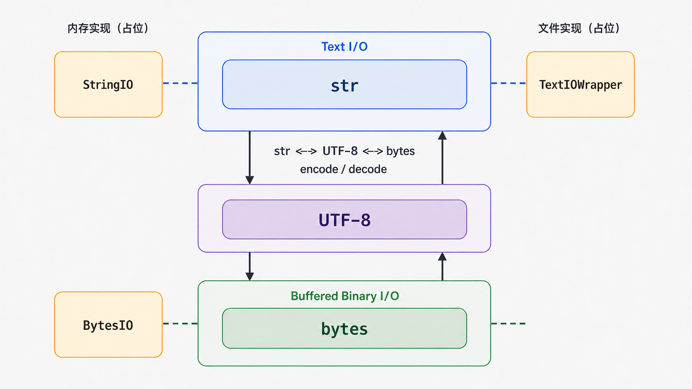
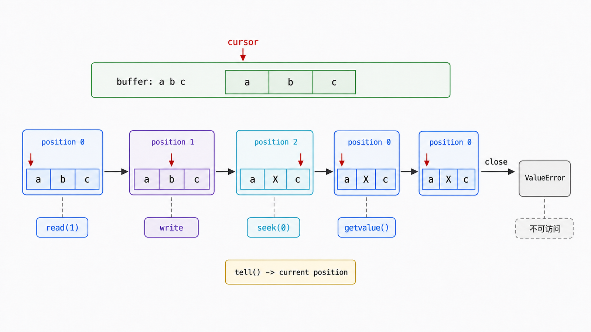

## 前置知识与学习目标

你需要理解 `str`、`bytes`、UTF-8 和 `with`。本文解决报表流水线中的一个接口问题：如何在不写临时文件的情况下复用接受文件对象的代码？

学完后，你应该能够：

1. 根据数据边界选择 `StringIO` 或 `BytesIO`。
2. 解释 `read`、`write`、`seek`、`tell` 与游标位置。
3. 用 `TextIOWrapper` 连接字节流与文本编码层。
4. 识别关闭后访问、忘记回卷和大对象复制等边界。

## 真实场景与核心问题

CSV 生成器接收文本文件对象，邮件附件接口需要字节。把中间结果写到磁盘会增加清理、权限和并发命名问题。`io` 模块提供内存中的文件式对象，使同一套流接口可以连接不同存储实现。

## 文本流、二进制流与原始流

Python I/O 分层可简化为：

| 层             | 读写单位 | 代表接口/对象                             |
| -------------- | -------- | ----------------------------------------- |
| 文本 I/O       | `str`    | `TextIOBase`、`StringIO`、`TextIOWrapper` |
| 缓冲二进制 I/O | `bytes`  | `BufferedIOBase`、`BytesIO`               |
| 原始 I/O       | `bytes`  | `RawIOBase`、文件描述符包装               |

文本流负责字符编码和换行语义；二进制流保留原始字节。不要把“内容看起来像文字”当作边界判断：压缩包、图片、SMTP 附件和加密结果都应按字节处理。

<!-- figure-anchor:s23-f01 -->

<!-- figure-ref:s23-f01 -->



## `StringIO`：内存中的文本文件

<!-- snippet: id=python-intermediate-23-01 mode=compile python=3.12-3.14 deps=stdlib -->

```python
import csv
from io import StringIO


def render_csv(rows: list[dict[str, object]]) -> str:
    buffer = StringIO(newline="")
    writer = csv.DictWriter(buffer, fieldnames=["name", "amount"])
    writer.writeheader()
    writer.writerows(rows)
    return buffer.getvalue()


text = render_csv([{"name": "Ada", "amount": 10}])
assert text.splitlines() == ["name,amount", "Ada,10"]
```

`getvalue()` 返回完整内容，不受当前游标影响。若用 `read()`，则从当前位置读取：

```python
buffer = StringIO("abc")
assert buffer.read(1) == "a"
assert buffer.tell() == 1
buffer.seek(0)
assert buffer.read() == "abc"
```

写入同样推进游标。创建 `StringIO("abc")` 后游标从开头开始；若想追加，应先 `seek(0, 2)`，或直接使用更明确的数据组合方式。

## `BytesIO`：内存中的二进制文件

<!-- figure-anchor:s23-f02 -->

<!-- figure-ref:s23-f02 -->



<!-- snippet: id=python-intermediate-23-02 mode=compile python=3.12-3.14 deps=stdlib -->

```python
import gzip
from io import BytesIO


def compress_report(text: str) -> bytes:
    raw = text.encode("utf-8")
    output = BytesIO()
    with gzip.GzipFile(fileobj=output, mode="wb", mtime=0) as archive:
        archive.write(raw)
    return output.getvalue()


compressed = compress_report("name,amount\nAda,10\n")
assert gzip.decompress(compressed).decode("utf-8") == "name,amount\nAda,10\n"
```

`BytesIO.getbuffer()` 返回共享底层缓冲区的可写视图，可避免一次复制；视图存活期间不能调整或关闭缓冲区。只有在性能证据明确时再使用这种更强契约。

## 用 `TextIOWrapper` 显式连接编码层

有时底层 API 给你字节流，上层库却要求文本流：

<!-- snippet: id=python-intermediate-23-03 mode=compile python=3.12-3.14 deps=stdlib -->

```python
from io import BytesIO, TextIOWrapper

raw = BytesIO()
text = TextIOWrapper(raw, encoding="utf-8", newline="")
text.write("报表\n")
text.flush()
assert raw.getvalue() == "报表\n".encode("utf-8")

# 避免 text 关闭时连带关闭仍需使用的 raw。
text.detach()
assert not raw.closed
```

`flush()` 把文本编码器和缓冲层中的数据推到底层字节流；`detach()` 分离包装层。一般业务代码优先让单个上下文管理器拥有整个流，只有确实需要移交所有权时才分离。

## 常见误区与适用边界

### 写完马上 `read()` 得到空串

游标已在末尾。先 `seek(0)`，或使用 `getvalue()` 获取全部内容。

### `StringIO` 自动完成 UTF-8 编码

它只保存 `str`。只有跨入字节边界时才调用 `.encode(...)` 或使用 `TextIOWrapper`。

### 内存流总比临时文件好

大报表会占用进程内存，`getvalue()` 还可能复制数据。无法设定可靠上限时，应使用流式处理或 `tempfile.SpooledTemporaryFile`，让数据超过阈值后落盘。

### 关闭后仍能 `getvalue()`

关闭后的 `StringIO`/`BytesIO` 操作会失败。返回值应在所有者关闭对象前取得，并明确谁负责关闭。

## 本篇自检

<details>
<summary>1. `read()` 与 `getvalue()` 在游标语义上有什么差别？</summary>

`read()` 从当前游标读取并推进游标；`getvalue()` 返回全部缓冲内容，不依赖当前游标。

</details>

<details>
<summary>2. 为什么图片附件应使用 `BytesIO`？</summary>

图片是任意二进制数据，不能在未定义编码的情况下解释成 `str`；`BytesIO` 保留原始字节。

</details>

<details>
<summary>3. 什么时候应避免内存流？</summary>

输入规模不受控、需要真正流式传输、内存预算紧张或必须让外部进程按路径读取时，应考虑文件或可溢写临时文件。

</details>

## 本篇总结

`StringIO` 提供文本文件式接口，`BytesIO` 提供二进制文件式接口；两者都维护游标和生命周期。选择依据是 `str`/`bytes` 边界与资源预算，不是是否“看起来像文件”。

## 下一篇衔接

下一篇回到类创建过程：普通类为何已经足够，元类在哪个阶段介入，以及为何单例通常不该是元类教学的默认目标。

## 资料来源与版本基线

- [Python `io` 模块](https://docs.python.org/3/library/io.html)
- [Python `csv` 模块](https://docs.python.org/3/library/csv.html)
- [Python `tempfile.SpooledTemporaryFile`](https://docs.python.org/3/library/tempfile.html#tempfile.SpooledTemporaryFile)

版本基线：Python 3.12–3.14；示例只依赖标准库。
