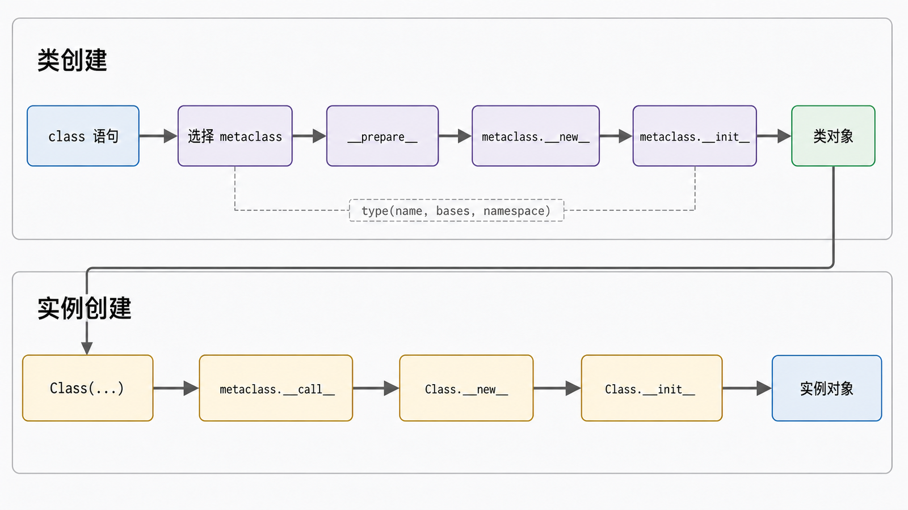
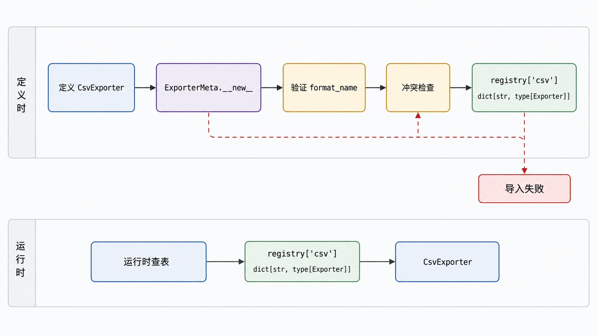

## 前置知识与学习目标

你需要理解类、实例、继承和方法绑定。本文只回答：类对象在定义阶段如何被创建，什么规则值得放到元类中？

学完后，你应该能够：

1. 解释“实例由类创建，类通常由 `type` 创建”。
2. 区分类创建阶段与实例创建阶段的 `__new__`、`__init__`、`__call__`。
3. 用元类在类定义时验证声明并建立注册表。
4. 说明单例的全局状态、测试隔离、并发和生命周期代价。

## 真实场景与核心问题

报表系统允许开发者声明导出器类。每个具体导出器必须给出唯一 `format_name`，且实现 `export`。如果直到第一次请求才发现声明错误，故障离根因太远；元类可以在导入模块、执行类定义时立即验证。

## 类本身也是对象

通常：

```python
class CsvExporter:
    pass
```

与下面的动态创建在结果结构上相近：

<!-- snippet: id=python-intermediate-24-01 mode=compile python=3.12-3.14 deps=stdlib -->

```python
def export(self, rows):
    return f"{len(rows)} rows"


CsvExporter = type(
    "CsvExporter",
    (object,),
    {"format_name": "csv", "export": export},
)

instance = CsvExporter()
assert type(CsvExporter) is type
assert isinstance(instance, CsvExporter)
assert instance.export([1, 2]) == "2 rows"
```

`type(name, bases, namespace)` 创建类对象。正常 `class` 语句还涉及解析元类、准备命名空间、执行类体、处理描述符与 `__init_subclass__` 等步骤，不能简单理解为字符串拼接。

<!-- figure-anchor:s24-f01 -->

<!-- figure-ref:s24-f01 -->



## 两条调用链不要混淆

类创建阶段：

```text
class 语句
-> 选择 metaclass
-> metaclass.__prepare__（可选）
-> 执行类体得到 namespace
-> metaclass.__new__
-> metaclass.__init__
-> 类对象
```

实例创建阶段：

```text
Class(...)
-> metaclass.__call__
-> Class.__new__
-> Class.__init__
-> 实例对象
```

类的 `__new__` 创建实例；元类的 `__new__` 创建类。元类的 `__call__` 可以改变调用类对象时的实例化过程，但这是一条影响广、难调试的钩子。

## 合理示例：在定义时验证并注册

<!-- figure-anchor:s24-f02 -->

<!-- figure-ref:s24-f02 -->



<!-- snippet: id=python-intermediate-24-02 mode=compile python=3.12-3.14 deps=stdlib -->

```python
from __future__ import annotations

from abc import ABCMeta, abstractmethod
from typing import ClassVar


class ExporterMeta(ABCMeta):
    registry: dict[str, type[Exporter]] = {}

    def __new__(
        mcls,
        name: str,
        bases: tuple[type, ...],
        namespace: dict[str, object],
        **kwargs: object,
    ) -> ExporterMeta:
        cls = super().__new__(mcls, name, bases, namespace, **kwargs)
        if not namespace.get("_is_base", False):
            format_name = getattr(cls, "format_name", None)
            if not isinstance(format_name, str) or not format_name:
                raise TypeError(f"{name} must define a non-empty format_name")
            if format_name in mcls.registry:
                raise ValueError(f"duplicate format_name: {format_name}")
            mcls.registry[format_name] = cls
        return cls


class Exporter(metaclass=ExporterMeta):
    _is_base: ClassVar[bool] = True

    @abstractmethod
    def export(self, rows: list[dict[str, object]]) -> str:
        raise NotImplementedError


class CsvExporter(Exporter):
    _is_base = False
    format_name = "csv"

    def export(self, rows: list[dict[str, object]]) -> str:
        return f"csv:{len(rows)}"


assert ExporterMeta.registry["csv"] is CsvExporter
```

这个规则针对所有派生类、必须在类定义时执行，元类有合理位置。但更简单的需求优先考虑：类装饰器、`__init_subclass__`、显式注册函数或普通工厂。它们的局部性和可测试性通常更好。

## 单例：能做，不等于应该做

元类可以缓存 `__call__` 的结果，使每个类只创建一个实例。但“全局唯一”常带来：

- 测试之间共享状态，顺序影响结果。
- 构造参数只在第一次调用生效，后续调用语义含糊。
- 线程、进程和解释器之间的“唯一”范围不同。
- 资源关闭、热更新和依赖替换困难。

模块本身在单个解释器的导入缓存中通常已提供自然的共享命名空间。需要共享服务时，更推荐在应用入口显式创建一次，并通过参数传给使用者：

<!-- snippet: id=python-intermediate-24-03 mode=compile python=3.12-3.14 deps=stdlib -->

```python
class ExportService:
    def __init__(self, registry: dict[str, type]) -> None:
        self.registry = registry


service = ExportService(ExporterMeta.registry)


def handle_request(service: ExportService, format_name: str) -> type:
    return service.registry[format_name]


assert handle_request(service, "csv") is CsvExporter
```

显式依赖让测试可以传入隔离的注册表，也让生命周期所有者可见。

## 常见误区与适用边界

### 元类是“高级版类”

元类的特殊点是它创建类对象。业务对象的常规规则不应因为追求高级语法而放进元类。

### `type()` 动态创建类需要 `exec`

`type` 接受名称、基类和命名空间即可。拼接并执行不可信字符串会引入代码执行风险。

### 单例在多进程中全局唯一

普通内存缓存最多保证一个解释器进程内、一个类键下的复用。跨进程唯一性需要外部协调和明确一致性协议。

### 元类可随意组合

多继承的基类具有不兼容元类时会发生 metaclass conflict。若只是注册或验证，`__init_subclass__` 往往更容易组合。

## 本篇自检

<details>
<summary>1. `CsvExporter()` 首先调用谁的 `__call__`？</summary>

调用类对象时先进入其元类的 `__call__`；默认实现再协调 `CsvExporter.__new__` 与 `CsvExporter.__init__`。

</details>

<details>
<summary>2. 什么规则值得放进元类？</summary>

必须一致作用于一族类、需要在类定义阶段验证或改写，并且类装饰器、显式注册或 `__init_subclass__` 不足以清晰表达的规则。

</details>

<details>
<summary>3. 为什么依赖注入通常比单例更易测试？</summary>

依赖由调用方显式传入，测试可替换并隔离实例，状态和关闭责任不会隐藏在全局缓存中。

</details>

## 本篇总结

元类控制类对象的创建，普通类控制实例对象的创建。它适合类族级、定义时的强规则；单例只是可实现的一个实例化策略，通常不应掩盖全局状态和生命周期成本。

## 下一篇衔接

下一篇从类创建转向序列协议：`start:stop:step` 如何先变成 `slice` 对象，再根据具体序列长度归一化。

## 资料来源与版本基线

- [Python Data model：Metaclasses](https://docs.python.org/3/reference/datamodel.html#metaclasses)
- [Python `type`](https://docs.python.org/3/library/functions.html#type)
- [Python `__init_subclass__`](https://docs.python.org/3/reference/datamodel.html#object.__init_subclass__)
- [Python `abc`](https://docs.python.org/3/library/abc.html)

版本基线：Python 3.12–3.14；示例只依赖标准库。
