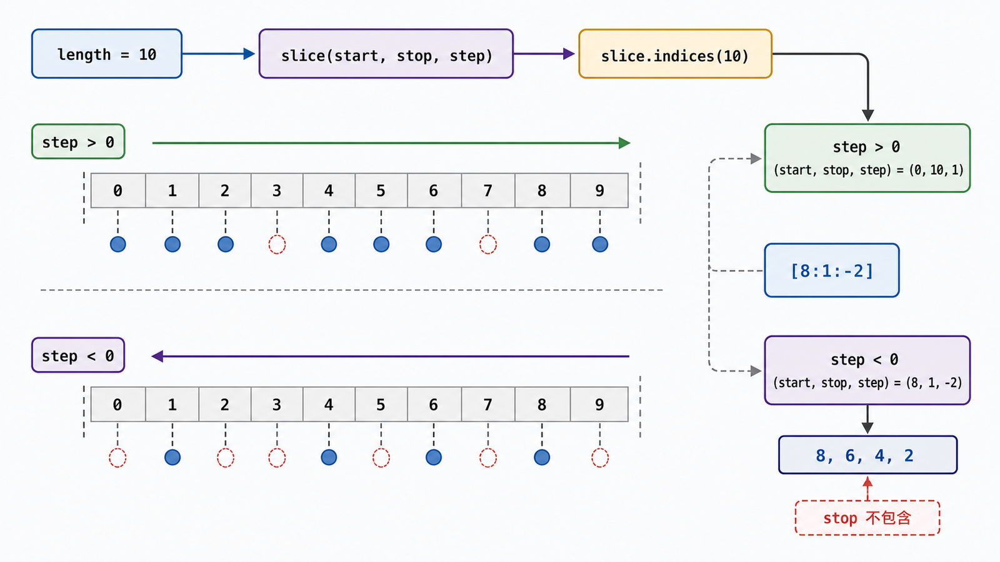
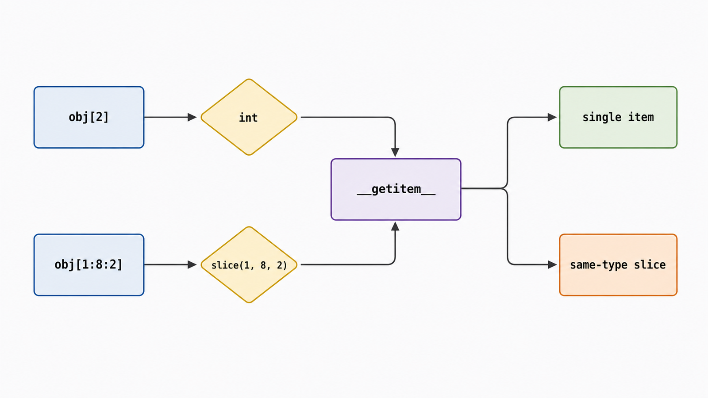

## 前置知识与学习目标

你需要理解序列、索引和 `range`。本文用“把报表任务按批次处理”回答一个问题：`seq[start:stop:step]` 的省略值、负数和越界值究竟如何被解释？

学完后，你应该能够：

1. 说明切片语法先构造 `slice` 对象，再交给目标对象处理。
2. 用 `slice.indices(length)` 解释正负步长与越界归一化。
3. 预测内置序列切片的索引集合、复制语义和赋值边界。
4. 为自定义序列正确处理整数索引与切片索引。

## 真实场景与核心问题

任务列表有 10 项，调度器要取每三项一批、最后三项、倒序抽样。背诵 `[::-1]` 不足以解释 `items[8:1:-2]` 为什么包含 8 却不包含 1。统一模型是：切片等价于一组 `range(start, stop, step)` 索引。

## 核心机制：语法生成 `slice`

解释器对 `obj[1:8:2]` 的关键效果是调用：

```python
obj.__getitem__(slice(1, 8, 2))
```

所以切片不是列表专属语法。任何对象都能在 `__getitem__` 中接收 `slice` 并定义自己的返回语义。

<!-- figure-anchor:s25-f01 -->

<!-- figure-ref:s25-f01 -->



## 归一化：默认值依赖步长方向

`slice.indices(length)` 把 `None`、负索引和越界值转换成适用于给定长度的三元组，可直接传给 `range`。

<!-- snippet: id=python-intermediate-25-01 mode=compile python=3.12-3.14 deps=stdlib -->

```python
items = list("abcdefghij")

cases = [
    slice(None, None, None),
    slice(2, 8, 2),
    slice(-3, None, None),
    slice(None, None, -1),
    slice(8, 1, -2),
]

for part in cases:
    start, stop, step = part.indices(len(items))
    expected = [items[index] for index in range(start, stop, step)]
    assert items[part] == expected

assert slice(None, None, 1).indices(10) == (0, 10, 1)
assert slice(None, None, -1).indices(10) == (9, -1, -1)
assert items[8:1:-2] == ["i", "g", "e", "c"]
```

正步长默认从 0 走向 `length`；负步长默认从 `length - 1` 走向概念上的 `-1`。两者都遵守 stop 不包含。`step == 0` 没有前进方向，会抛 `ValueError`。

## Shape 与复杂度

对 `list`、`tuple`、`str`、`bytes` 等内置序列，普通切片通常创建新对象，时间和额外空间与结果长度 `k` 成正比，即 `O(k)`。浅复制 `items[:]` 复制的是元素引用，不递归复制嵌套对象。

结果长度可由归一化后的 `range` 决定：

```python
def slice_length(part: slice, length: int) -> int:
    return len(range(*part.indices(length)))
```

不同第三方对象可定义不同语义。例如一些数组库的切片可能返回共享底层数据的视图；不要把列表的复制行为外推到所有对象。

## 切片赋值与删除

列表切片还能出现在赋值目标：

<!-- snippet: id=python-intermediate-25-02 mode=compile python=3.12-3.14 deps=stdlib -->

```python
values = [0, 1, 2, 3, 4]
values[1:4] = [10, 20]
assert values == [0, 10, 20, 4]

values[::2] = [100, 200]
assert values == [100, 10, 200, 4]

del values[1:3]
assert values == [100, 4]
```

步长为 1 的切片赋值可改变列表长度；扩展切片（`step != 1`）的右侧元素数量必须与目标位置数量一致，否则抛 `ValueError`。

## 自定义序列：同时处理整数与切片

<!-- figure-anchor:s25-f02 -->

<!-- figure-ref:s25-f02 -->



<!-- snippet: id=python-intermediate-25-03 mode=compile python=3.12-3.14 deps=stdlib -->

```python
from collections.abc import Iterator, Sequence
from typing import overload


class BatchView(Sequence[str]):
    def __init__(self, values: list[str]) -> None:
        self._values = values

    def __len__(self) -> int:
        return len(self._values)

    @overload
    def __getitem__(self, index: int) -> str: ...

    @overload
    def __getitem__(self, index: slice) -> "BatchView": ...

    def __getitem__(self, index: int | slice) -> str | "BatchView":
        if isinstance(index, slice):
            return BatchView(self._values[index])
        return self._values[index]

    def __iter__(self) -> Iterator[str]:
        return iter(self._values)


batches = BatchView(["a", "b", "c", "d"])
assert list(batches[1::2]) == ["b", "d"]
```

这里选择返回复制后的同类型对象。若要实现真正视图，需要保存原序列和索引映射，并明确原序列变化时视图如何表现。

## 常见误区与适用边界

### 负索引与负步长是一回事

负索引先相对长度解释位置；负步长决定遍历方向。两者可以独立出现。

### 越界切片一定抛 `IndexError`

内置序列切片会把边界裁剪到有效范围，通常返回空或较短结果；单个越界整数索引才会抛 `IndexError`。

### `a[:]` 是深复制

它只创建外层新序列，嵌套可变对象仍共享。需要深复制时评估 `copy.deepcopy` 的语义和成本。

### 大数据分页应使用列表切片

若数据在数据库、远程 API 或巨大文件中，先完整加载再切片会浪费资源。应把范围下推到数据源，并定义稳定排序。

## 本篇自检

<details>
<summary>1. 为什么 `items[::-1]` 能反转序列？</summary>

负步长使默认 start 归一化为最后一个索引，默认 stop 为概念上的 -1，`range` 从右向左遍历全部有效索引。

</details>

<details>
<summary>2. `items[8:1:-2]` 为什么不包含索引 1？</summary>

切片与 `range` 一样采用不包含 stop 的半开区间；访问索引为 8、6、4、2。

</details>

<details>
<summary>3. `list` 切片与第三方数组切片的内存语义一定相同吗？</summary>

不一定。列表通常复制元素引用；第三方数组可能返回共享底层数据的视图，必须查看该类型契约。

</details>

## 本篇总结

切片语法产生 `slice(start, stop, step)`，具体对象解释它。对内置序列，可用 `slice.indices(length)` 和 `range` 统一推导正负步长、默认值、越界裁剪与结果长度。

## 下一篇衔接

下一篇把内存中的报表结果发送出去：先构造 MIME 消息，再通过 SMTP 传输，并明确 TLS、认证、附件与重试边界。

## 资料来源与版本基线

- [Python Expressions：Slicings](https://docs.python.org/3/reference/expressions.html#slicings)
- [Python `slice`](https://docs.python.org/3/library/functions.html#slice)
- [Python Common Sequence Operations](https://docs.python.org/3/library/stdtypes.html#common-sequence-operations)

版本基线：Python 3.12–3.14；示例只依赖标准库。
