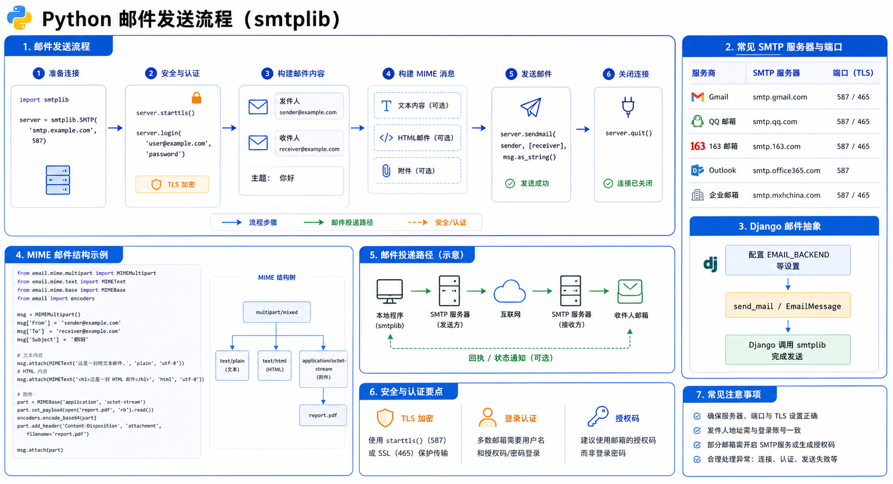

# Python 发送邮件



##  使用smtplib模块发送邮件
```python
import smtplib
from email.mime.text import MIMEText
from email.header import Header
msg_from = '***@qq.com'  # 发送方邮箱
passwd = '****'  # 填入发送方邮箱的授权码(填入自己的授权码，相当于邮箱密码)
msg_to = ['****@qq.com','**@163.com','*****@163.com']  # 收件人邮箱
# msg_to = '616564099@qq.com'  # 收件人邮箱

subject = "邮件标题"  # 主题
content = "邮件内容，我是邮件内容，哈哈哈"
# 生成一个MIMEText对象（还有一些其它参数）
msg = MIMEText(content)
# 放入邮件主题
msg['Subject'] = subject
# 也可以这样传参
# msg['Subject'] = Header(subject, 'utf-8')
# 放入发件人
msg['From'] = msg_from
# 放入收件人
# msg['To'] = '616564099@qq.com'
# msg['To'] = '发给你的邮件啊'
try:
    # 通过ssl方式发送，服务器地址，端口
    s = smtplib.SMTP_SSL("smtp.qq.com", 465)
    # 登录到邮箱
    s.login(msg_from, passwd)
    # 发送邮件：发送方，收件方，要发送的消息
    s.sendmail(msg_from, msg_to, msg.as_string())
    print('成功')
except s.SMTPException as e:
    print(e)
finally:
    s.quit()
```
## 发送html格式邮件
```python
import smtplib
from email.mime.text import MIMEText
from email.header import Header

msg_from = '123456@qq.com'  # 发送方邮箱
passwd = 'ldoetnwqdjqqbjjj'  # 填入发送方邮箱的授权码(填入自己的授权码，相当于邮箱密码)
msg_to = ['654321@qq.com']  # 收件人邮箱
# msg_to = '654321@qq.com'  # 收件人邮箱

subject = "邮件标题"  # 主题
# *************发送html的邮件**********
content = '''
<p>Python 邮件发送测试...</p>
<p><a href="http://www.baidu.com">这是一个链接</a></p>
'''
# 生成一个MIMEText对象
msg = MIMEText(content)
# 放入邮件主题
msg['Subject'] = subject
# 也可以这样传参
# msg['Subject'] = Header(subject, 'utf-8')
# 放入发件人
msg['From'] = msg_from
# 放入收件人
# msg['To'] = '616564099@qq.com'
# msg['To'] = '发给你的邮件啊'
try:
    # 通过ssl方式发送
    s = smtplib.SMTP_SSL("smtp.qq.com", 465)
    # 登录到邮箱
    s.login(msg_from, passwd)
    # 发送邮件：发送方，收件方，要发送的消息
    s.sendmail(msg_from, msg_to, msg.as_string())
    print('成功')
except s.SMTPException as e:
    print(e)
finally:
    s.quit()
```
## 发送带附件的邮件
```python
import smtplib
from email.mime.text import MIMEText
from email.header import Header
from email.mime.multipart import MIMEMultipart
from email.mime.base import MIMEBase
from email.mime.image import MIMEImage
from email import  encoders
msg_from = '306334678@qq.com'  # 发送方邮箱
passwd = '***'  # 填入发送方邮箱的授权码(填入自己的授权码，相当于邮箱密码)
msg_to = ['616564099@qq.com']  # 收件人邮箱

subject = "邮件标题"  # 主题
# 创建一个带附件的实例
msg = MIMEMultipart()
# 放入邮件主题
msg['Subject'] = subject
# 也可以这样传参
# msg['Subject'] = Header(subject, 'utf-8')
# 放入发件人
msg['From'] = msg_from

# 邮件正文内容
msg.attach(MIMEText('Python 邮件发送测试……', 'plain', 'utf-8'))

# 构造附件1，传送当前目录下的 test.txt 文件
att1 = MIMEText(open('test.txt', 'rb').read(), 'base64', 'utf-8')
att1["Content-Type"] = 'application/octet-stream'
# 这里的filename可以任意写，写什么名字，邮件中显示什么名字
att1["Content-Disposition"] = 'attachment; filename="test.txt"'
msg.attach(att1)

# 构造附件2，
with open('test.png', 'rb') as f:
    # 设置附件的MIME和文件名，这里是png类型:
    mime = MIMEBase('image', 'png', filename='test.png')
    # 加上必要的头信息:
    mime.add_header('Content-Disposition', 'attachment', filename='test.png')
    mime.add_header('Content-ID', '<0>')
    mime.add_header('X-Attachment-Id', '0')
    # 把附件的内容读进来:
    mime.set_payload(f.read())
    # 用Base64编码:
    encoders.encode_base64(mime)
    # 添加到MIMEMultipart:
    msg.attach(mime)
# 构造附件3，图片格式
fp = open('test.png', 'rb')
msgImage = MIMEImage(fp.read())
fp.close()
# 定义图片 ID，在 HTML 文本中引用
msgImage.add_header('Content-ID', '<image1>')
msg.attach(msgImage)
try:
    # 通过ssl方式发送
    s = smtplib.SMTP_SSL("smtp.qq.com", 465)
    # 登录到邮箱
    s.login(msg_from, passwd)
    # 发送邮件：发送方，收件方，要发送的消息
    s.sendmail(msg_from, msg_to, msg.as_string())
    print('成功')
except s.SMTPException as e:
    print(e)
finally:
    s.quit()
```
## Django发送邮件

#### 在setting中配置
```python
# EMAIL_BACKEND = 'django.core.mail.backends.smtp.EmailBackend'
EMAIL_HOST = 'smtp.qq.com'  # 如果是 163 改成 smtp.163.com
EMAIL_PORT = 465
EMAIL_HOST_USER = '123456@qq.com'  # 帐号
EMAIL_HOST_PASSWORD = '***'  # 密码
DEFAULT_FROM_EMAIL = EMAIL_HOST_USER
# 这样收到的邮件，收件人处就会这样显示
DEFAULT_FROM_EMAIL = 'abc <123456@qq.com>'
EMAIL_USE_SSL = True   # 使用ssl
# EMAIL_USE_TLS = False # 使用tls
# EMAIL_USE_SSL 和 EMAIL_USE_TLS 是互斥的，即只能有一个为 True

```
#### view视图函数
```python
from django.core.mail import send_mail
import threading
from mybbs import settings

t = threading.Thread(target=send_mail, args=("您的文章%s新增了一条评论内容" ,
                                                'ddd',
                                                settings.EMAIL_HOST_USER,
                                                ["616564099@qq.com"])
                        )
t.start()
```
#### 一次性发多封邮件
```python
from django.core.mail import send_mass_mail

message1 = ('第一封邮件标题', '这是邮件内容', 'from@example.com', ['first@example.com', 'other@example.com'])
message2 = ('第二封邮件标题', '这是邮件内容', 'from@example.com', ['second@test.com'])
'''
fail_silently: （可选）布尔值。为 False 时， send_mail 会抛出 smtplib.SMTPException 异常。smtplib 文档列出了所有可能的异常。 这些异常都是 SMTPException 的子类
'''
send_mass_mail((message1, message2), fail_silently=False)
'''
send_mail 每次发邮件都会建立一个连接，发多封邮件时建立多个连接。而 send_mass_mail 是建立单个连接发送多封邮件，所以一次性发送多封邮件时 send_mass_mail 要优于 send_mail。
'''
```
#### 携带附件或发送html（需要接收方支持）
```python
from django.core.mail import EmailMultiAlternatives
# subject 主题 content 内容 to_addr 是一个列表，发送给哪些人
msg = EmailMultiAlternatives('邮件标题', '邮件内容', '发送方', ['接收方'])
msg.content_subtype = "html"
# 添加附件（可选）
msg.attach_file('test.txt')
# 发送
msg.send()
```
备注：send_mail 每次发邮件都会建立一个连接，发多封邮件时建立多个连接。而 send_mass_mail 是建立单个连接发送多封邮件，所以一次性发送多封邮件时 send_mass_mail 要优于 send_mail。

## 各大邮箱smtp服务器及端口
```
新浪邮箱smtp服务器
外发服务器:smtp.vip.sina.com
收件服务器:pop3.vip.sina.com
新浪免费邮件
外发服务器:smtp.sina.com.cn
收件服务器:pop3.sina.com.cn
163邮箱smtp服务器
pop： pop.163.com
smtp： smtp.163.com
QQ邮箱smtp服务器及端口
接收邮件服务器：imap.exmail.qq.com，使用SSL，端口号993
发送邮件服务器：smtp.exmail.qq.com，使用SSL，端口号465或587
yahoo邮箱smtp服务器
接：pop.mail.yahoo.com.cn
发：smtp.mail.yahoo.com
126邮箱smtp服务器
pop： pop.126.com
smtp： smtp.126.com
雅虎邮箱
POP3：pop.mail.yahoo.cn
SMTP：smtp.mail.yahoo.cn
SMTP端口号：25
搜狐邮箱
POP3：pop3.sohu.com
SMTP：smtp.sohu.com
SMTP端口号：25
TOM邮箱
POP3：pop.tom.com
SMTP：smtp.tom.com
SMTP端口号：25
Gmail邮箱
POP3：pop.gmail.com
SMTP：smtp.gmail.com
SMTP端口号：587 或 25
QQ邮箱
POP3：pop.exmail.qq.com
SMTP：smtp.exmail.qq.com
SMTP端口号：25
```

---
