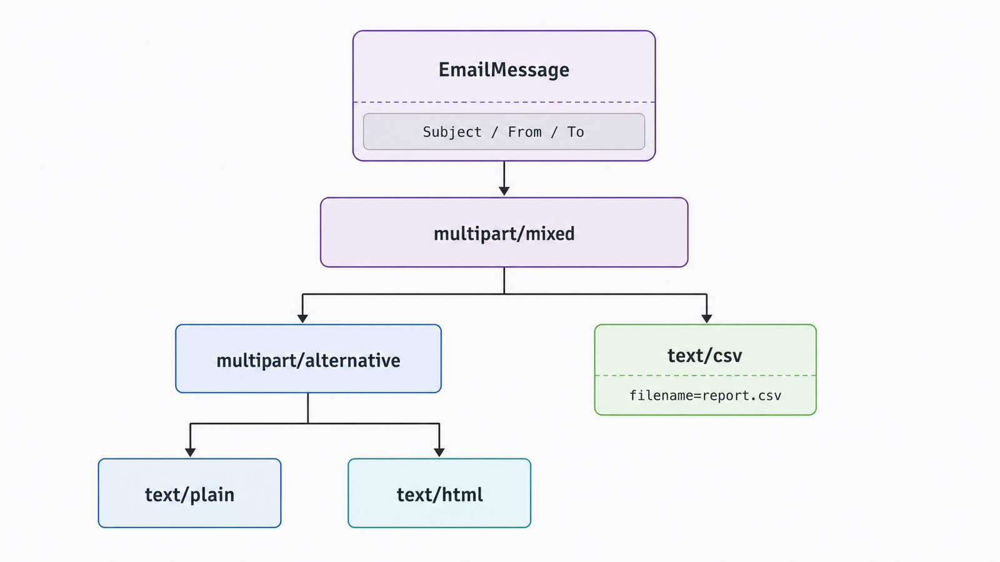
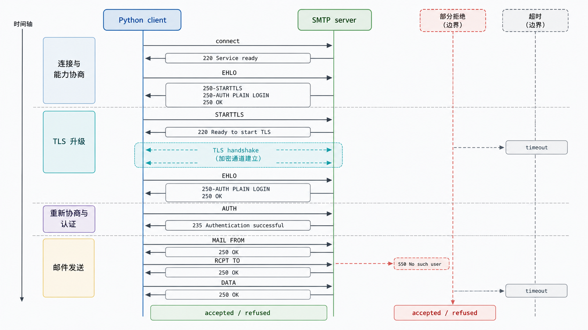

## 前置知识与学习目标

你需要理解 `bytes`、上下文管理器和异常。本文让报表流水线把 CSV 附件发送给收件人，只回答“消息如何构造、SMTP 如何传输、失败如何处理”。

学完后，你应该能够：

1. 区分 MIME 消息模型与 SMTP 传输协议。
2. 用 `EmailMessage` 构造文本、HTML 替代内容和附件。
3. 正确选择隐式 TLS 或 STARTTLS，并从外部注入凭据。
4. 识别部分收件人失败、重复发送、超时和测试隔离边界。

## 真实场景与核心问题

“发送邮件”至少包含两层：`email` 包构造符合 MIME 规则的消息；`smtplib` 与邮件服务器建立 SMTP 会话并传输。把它们分开后，可以在不联网的情况下验证消息结构，再对传输层做少量集成测试。

<!-- figure-anchor:s26-f01 -->

<!-- figure-ref:s26-f01 -->



## 构造消息：正文、HTML 与附件

<!-- snippet: id=python-intermediate-26-01 mode=compile python=3.12-3.14 deps=stdlib -->

```python
from email.message import EmailMessage
from email.policy import SMTP


def build_report_message(
    *,
    sender: str,
    recipient: str,
    csv_bytes: bytes,
) -> EmailMessage:
    message = EmailMessage()
    message["Subject"] = "日报表"
    message["From"] = sender
    message["To"] = recipient
    message.set_content("报表已生成，请查看附件。")
    message.add_alternative(
        "<p>报表已生成，请查看附件。</p>",
        subtype="html",
    )
    message.add_attachment(
        csv_bytes,
        maintype="text",
        subtype="csv",
        filename="report.csv",
    )
    return message


msg = build_report_message(
    sender="reports@example.com",
    recipient="reader@example.net",
    csv_bytes="name,amount\nAda,10\n".encode("utf-8"),
)
serialized = msg.as_bytes(policy=SMTP)
assert b"multipart/mixed" in serialized
assert msg["Subject"] == "日报表"
```

`multipart/alternative` 表示同一正文的纯文本和 HTML 版本；添加附件后外层通常成为 `multipart/mixed`。不要手写 MIME 边界，也不要把大附件全部 Base64 后塞进普通正文。

## 传输：TLS、认证与超时

服务器配置通常给出两种模式，不能仅凭端口猜测：

- 隐式 TLS：连接开始即在 TLS 中，使用 `smtplib.SMTP_SSL`。
- STARTTLS：先建立 SMTP，再升级到 TLS，使用 `SMTP.starttls()`。

<!-- figure-anchor:s26-f02 -->

<!-- figure-ref:s26-f02 -->



<!-- snippet: id=python-intermediate-26-02 mode=compile python=3.12-3.14 deps=stdlib -->

```python
import smtplib
import ssl
from email.message import EmailMessage


def send_with_starttls(
    message: EmailMessage,
    *,
    host: str,
    port: int,
    username: str,
    password: str,
) -> None:
    context = ssl.create_default_context()
    with smtplib.SMTP(host, port, timeout=15) as client:
        client.ehlo()
        client.starttls(context=context)
        client.ehlo()
        client.login(username, password)
        refused = client.send_message(message)
        if refused:
            raise RuntimeError(f"recipients refused: {sorted(refused)}")
```

用户名和密码应来自环境或密钥管理系统，不进入源码、Notebook 输出或日志。`ssl.create_default_context()` 使用系统信任链并验证证书；不要为了“能连上”关闭证书验证。

## 输入、输出与失败边界

| 阶段     | 输入                 | 成功证据         | 典型失败               |
| -------- | -------------------- | ---------------- | ---------------------- |
| 构造     | 地址、正文、附件字节 | 可解析 MIME 树   | 无效地址、附件类型错误 |
| 连接     | host、port、timeout  | SMTP banner/EHLO | DNS、超时、拒绝连接    |
| TLS      | SSL context          | 证书验证通过     | 证书或协议不兼容       |
| 认证     | 用户名、密钥         | 服务器接受       | 凭据、权限或策略错误   |
| 投递接受 | MIME 消息、收件人    | 服务器接受收件人 | 全部或部分收件人拒绝   |
| 最终送达 | 邮件系统队列         | 收件箱/退信证据  | 垃圾策略、下游退信     |

`send_message` 成功只说明当前服务器接受了传输，不保证最终进入收件箱。

## 重试与测试

网络超时发生在消息被服务器接受之后时，客户端可能不知道结果。盲目重试会重复发送。生产系统应给业务邮件分配稳定消息 ID/任务 ID，在队列或数据库中记录状态，并把自动重试限制在已知可重试错误。

单元测试应验证 `EmailMessage` 的头、MIME 层级、附件名和载荷；传输测试使用本地测试 SMTP 服务或供应商沙箱，绝不在普通测试中发送真实邮件。

## 常见误区与适用边界

### 端口 465/587 永远对应固定模式

它们是常见约定，但实际配置必须来自服务商。模式和端口不匹配会握手失败。

### HTML 正文可以省略纯文本

纯文本替代提高兼容性和可访问性，也让安全过滤器与纯文本客户端有合理内容。

### SMTP 接受等于最终送达

后续仍可能退信、被策略拦截或进入垃圾箱。需要送达保证时必须处理退信与供应商事件。

### 捕获 `Exception` 后无限重试

认证失败、地址拒绝等不是瞬时故障；无限重试会放大负载和重复投递。应分类、限次、退避并保留可观测状态。

## 本篇自检

<details>
<summary>1. `EmailMessage` 与 `smtplib` 各负责什么？</summary>

前者构造和序列化消息/MIME 结构；后者建立 SMTP 会话并把消息传给服务器。

</details>

<details>
<summary>2. 为什么 STARTTLS 后通常再次 `EHLO`？</summary>

升级后的安全会话可能暴露不同扩展能力，重新问候可刷新服务器能力列表。

</details>

<details>
<summary>3. SMTP 超时后为什么不能默认立即重发？</summary>

超时可能发生在服务器已接受消息但响应丢失之后，直接重发可能造成重复邮件。

</details>

## 本篇总结

邮件发送应拆成可离线验证的 MIME 构造和带安全边界的 SMTP 传输。TLS、凭据、超时、部分失败和幂等状态都属于接口契约，而不是示例之外的附加项。

## 下一篇衔接

下一篇关注长时间运行的报表服务：对象何时释放、循环引用如何处理，以及如何用 `gc`、`weakref` 和 `tracemalloc` 找到真正的内存保留路径。

## 资料来源与版本基线

- [Python `email` examples](https://docs.python.org/3/library/email.examples.html)
- [Python `EmailMessage`](https://docs.python.org/3/library/email.message.html#email.message.EmailMessage)
- [Python `smtplib`](https://docs.python.org/3/library/smtplib.html)
- [Python `ssl.create_default_context`](https://docs.python.org/3/library/ssl.html#ssl.create_default_context)

版本基线：Python 3.12–3.14；示例只依赖标准库。SMTP 参数必须以邮件服务商当前文档为准。
