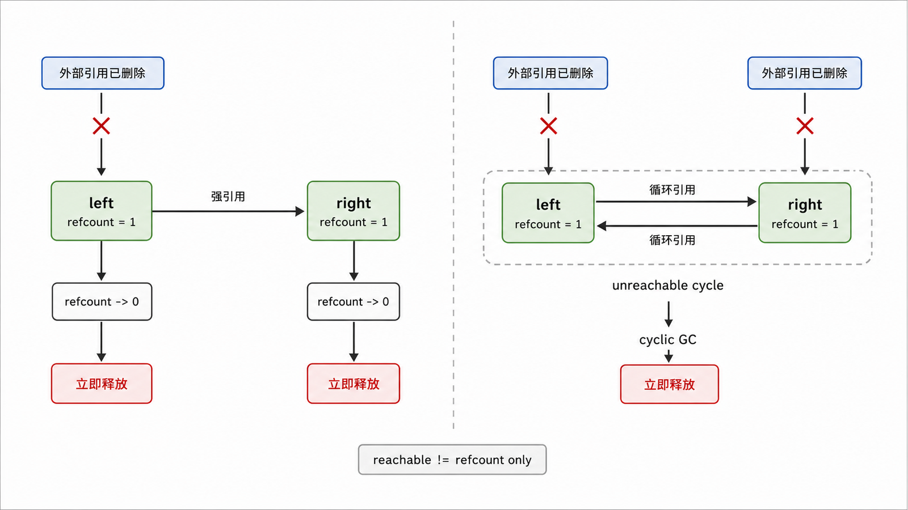
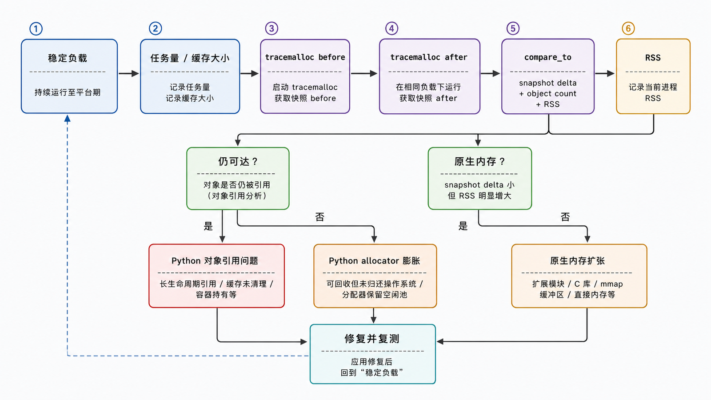

## 前置知识与学习目标

你需要理解对象引用、容器和上下文管理器。本文以 CPython 3.12–3.14 为基线，解决报表服务运行数天后内存持续上升的问题。

学完后，你应该能够：

1. 区分引用计数与循环垃圾回收的职责。
2. 解释“不可达对象”“仍被缓存持有”和“进程 RSS 未下降”的差异。
3. 使用 `weakref`、`gc` 与 `tracemalloc` 收集证据。
4. 避免依赖析构时机、手动调阈值和强制 `collect()` 的常见误区。

## 真实场景与核心问题

报表任务完成后，业务变量已 `del`，进程内存却不下降。可能原因至少有三类：对象仍被全局缓存或回调引用；对象形成不可达引用环，等待循环收集；对象已释放给 Python 分配器，但内存暂未归还操作系统。

“内存上涨”等于线索，不等于垃圾回收器失效。

## CPython 的两套机制

CPython 主要用引用计数管理对象寿命：强引用增加计数，引用消失减少计数，计数到零时通常立即释放。仅靠引用计数无法回收互相引用且外部已不可达的对象，因此还有循环垃圾回收器跟踪适合参与环的容器对象。

<!-- figure-anchor:s27-f01 -->

<!-- figure-ref:s27-f01 -->



<!-- snippet: id=python-intermediate-27-01 mode=compile python=3.12-3.14 deps=stdlib -->

```python
import gc
import weakref


class Node:
    def __init__(self, name: str) -> None:
        self.name = name
        self.peer: Node | None = None


left = Node("left")
right = Node("right")
left.peer = right
right.peer = left
left_ref = weakref.ref(left)
right_ref = weakref.ref(right)

del left, right
gc.collect()

assert left_ref() is None
assert right_ref() is None
```

弱引用不增加对象的强引用计数，适合缓存、观察者和回指等“不要因此延长寿命”的关系。但并非所有类型都支持弱引用，且取出弱引用后对象仍可能已消失，调用方必须处理 `None`。

## 分代是优化策略，不是业务契约

循环收集器按代管理被跟踪对象，利用“多数新对象很快死亡”的经验减少每次扫描成本。代数、阈值含义和自由线程构建的触发条件会随 CPython 版本演进；业务代码不应假设固定默认阈值或精确回收时刻。

可观察接口包括：

```python
gc.isenabled()
gc.get_count()
gc.get_threshold()
gc.get_stats()
```

它们用于诊断当前运行时，不应写成跨版本不变量。禁用 GC 只影响循环收集，不关闭引用计数；在没有基准、停顿和内存证据时不要调阈值。

## 先找“谁还在引用”，再谈泄漏

常见强引用来源：

- 无上限字典或 LRU 缓存。
- 日志 handler、事件订阅和回调闭包。
- 后台任务、队列和线程局部变量。
- IPython/Notebook 输出历史。
- 异常 traceback 保存局部变量。

`gc.get_referrers` 可能包含调试器自身临时对象，结果必须谨慎解释。更稳定的第一步通常是比较分配快照。

<!-- figure-anchor:s27-f02 -->

<!-- figure-ref:s27-f02 -->



<!-- snippet: id=python-intermediate-27-02 mode=compile python=3.12-3.14 deps=stdlib -->

```python
import tracemalloc


def allocate_reports(count: int) -> list[bytes]:
    return [b"x" * 1024 for _ in range(count)]


tracemalloc.start()
before = tracemalloc.take_snapshot()
reports = allocate_reports(100)
after = tracemalloc.take_snapshot()

top = after.compare_to(before, "lineno")
assert top

del reports
tracemalloc.stop()
```

生产排查应在相同负载阶段比较快照，按模块和 traceback 聚合，并同时记录任务量、缓存大小与进程 RSS。`tracemalloc` 追踪 Python 分配，不覆盖所有扩展库的原生内存。

## 资源释放不应交给 GC 猜时机

文件、套接字、锁和事务要用 `with` 或显式 `close()`。对象回收时机在不同 Python 实现、不同并发和不同引用图下不保证一致；`__del__` 还会增加循环和解释器关闭阶段的复杂性。

```python
from pathlib import Path

with Path("report.txt").open("w", encoding="utf-8") as file:
    file.write("done")
```

## 常见误区与适用边界

### `del obj` 会立刻释放对象

它只删除一个名字到对象的引用。其他容器、闭包、traceback 或缓存仍可能持有对象。

### `gc.collect()` 是内存优化按钮

频繁强制收集会增加停顿，也无法释放仍可达对象。它适合受控诊断或极少数有测量依据的生命周期边界。

### RSS 不下降说明对象没释放

Python 分配器或系统分配器可能保留内存供后续复用。应结合对象数量、快照和稳定负载判断。

### `sys.getrefcount(obj)` 给出业务引用数

把对象传给函数本身会产生临时引用，调试工具也可能增加引用。它适合相对观察，不是精确所有权证明。

## 本篇自检

<details>
<summary>1. 引用计数为什么不能单独回收两个互相引用的不可达对象？</summary>

两者仍各自持有对方的强引用，引用计数不会降到零；循环收集器需要从可达性角度识别这个孤立环。

</details>

<details>
<summary>2. 为什么文件关闭不能依赖对象析构？</summary>

回收时机不是跨实现稳定契约；资源可能长时间占用。上下文管理器提供确定的退出边界。

</details>

<details>
<summary>3. 内存增长时第一步为什么不是调 GC 阈值？</summary>

增长可能来自仍可达缓存、原生扩展或分配器保留。应先用负载指标和快照定位分配与引用来源。

</details>

## 本篇总结

在 CPython 中，引用计数处理多数对象，循环垃圾回收器补足不可达引用环。内存排查的核心是区分可达性、分配来源和操作系统指标，并用确定性资源管理取代对回收时机的假设。

## 下一篇衔接

下一篇处理报表日志：正则引擎如何回溯，贪婪、勉强和占有量词怎样改变搜索空间，以及何时应换用解析器。

## 资料来源与版本基线

- [Python `gc`](https://docs.python.org/3/library/gc.html)
- [Python Garbage collector design](https://devguide.python.org/internals/garbage-collector/)
- [Python `weakref`](https://docs.python.org/3/library/weakref.html)
- [Python `tracemalloc`](https://docs.python.org/3/library/tracemalloc.html)

版本基线：CPython 3.12–3.14。代际实现与阈值是版本相关实现细节，示例不把默认值写成固定契约。
