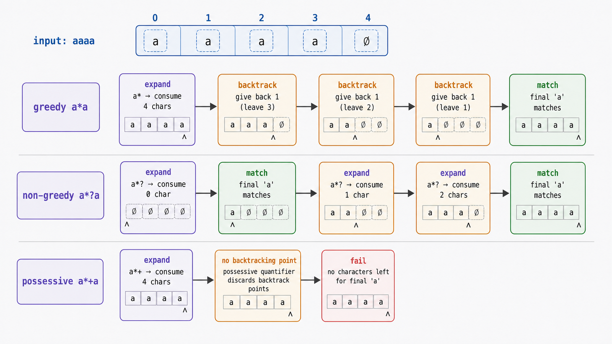
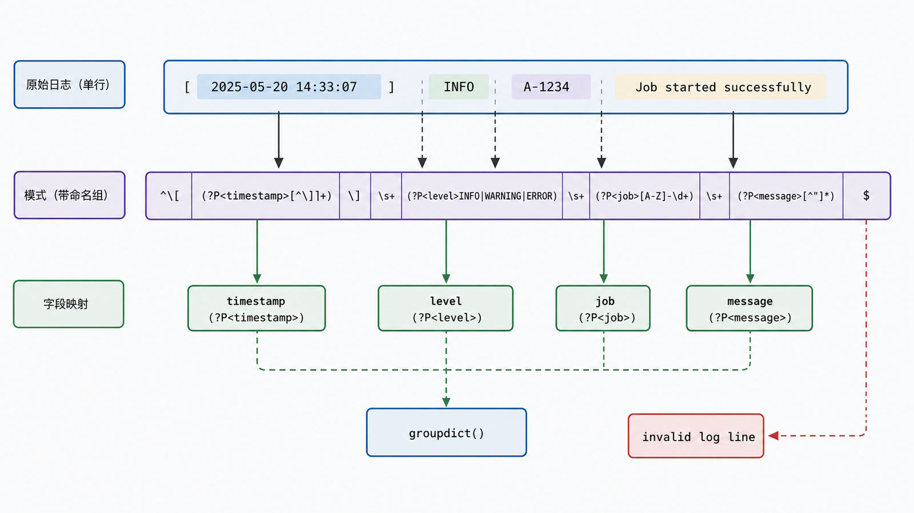

## 前置知识与学习目标

你需要会用原始字符串、字符类和 `re.search`。本文用报表服务日志回答一个问题：量词匹配过多或性能失控时，引擎发生了什么？

学完后，你应该能够：

1. 通过“先扩张、失败、回溯”解释贪婪和勉强量词。
2. 说明占有量词与原子组为何禁止在其内部回溯。
3. 用命名组、非捕获组和反向引用表达清晰契约。
4. 识别灾难性回溯、输入上限与“应该用解析器”的边界。

## 真实场景与核心问题

日志行是：

```text
[2026-07-17T10:20:30Z] level=ERROR job=R-42 message="export failed"
```

我们要提取时间、级别、任务 ID 和消息。如果用 `.*` 到处吞字符，结果可能跨过预期边界；在恶意或异常长输入上，含糊的嵌套量词还可能触发大量回溯。

## 回溯引擎的三种量词策略

Python 的 `re` 是回溯型引擎。以 `a*a` 匹配 `aaaa` 为例，贪婪 `a*` 先吃完 4 个字符，发现末尾 `a` 无字符可用，再退回一个字符后成功。

| 策略        | 写法                 | 初始选择 | 后续失败时     |
| ----------- | -------------------- | -------- | -------------- |
| 贪婪        | `*`、`+`、`{m,n}`    | 尽可能多 | 允许回溯变少   |
| 勉强/非贪婪 | `*?`、`+?`、`{m,n}?` | 尽可能少 | 允许扩张变多   |
| 占有        | `*+`、`++`、`{m,n}+` | 尽可能多 | 不允许交还字符 |

占有量词和原子组 `(?>...)` 从 Python 3.11 加入标准库 `re`。

<!-- figure-anchor:s28-f01 -->

<!-- figure-ref:s28-f01 -->



<!-- snippet: id=python-intermediate-28-01 mode=compile python=3.12-3.14 deps=stdlib -->

```python
import re

text = "aaaa"
assert re.fullmatch(r"a*a", text) is not None
assert re.fullmatch(r"a*?a", text) is not None
assert re.fullmatch(r"a*+a", text) is None

html = "<p>first</p><p>second</p>"
assert re.findall(r"<p>.*</p>", html) == [html]
assert re.findall(r"<p>.*?</p>", html) == ["<p>first</p>", "<p>second</p>"]
```

非贪婪不是“更快”或“正确”的同义词；它仍会回溯，只是尝试顺序相反。占有量词能剪掉搜索分支，但也可能让本可通过回溯成功的模式失败。

## 用边界约束替代通配符猜测

日志格式中，消息被双引号包围。若不支持转义引号，`[^\"]*` 比 `.*?` 更直接，因为它明确禁止跨过引号。

<!-- figure-anchor:s28-f02 -->

<!-- figure-ref:s28-f02 -->



<!-- snippet: id=python-intermediate-28-02 mode=compile python=3.12-3.14 deps=stdlib -->

```python
import re

LOG_PATTERN = re.compile(
    r"^\[(?P<timestamp>[^\]]+)\] "
    r"level=(?P<level>INFO|WARNING|ERROR) "
    r"job=(?P<job>[A-Z]-\d+) "
    r'message="(?P<message>[^\"]*)"$'
)


def parse_log(line: str) -> dict[str, str]:
    match = LOG_PATTERN.fullmatch(line)
    if match is None:
        raise ValueError("invalid log line")
    return match.groupdict()


parsed = parse_log(
    '[2026-07-17T10:20:30Z] level=ERROR job=R-42 message="export failed"'
)
assert parsed["level"] == "ERROR"
assert parsed["job"] == "R-42"
```

命名组 `(?P<name>...)` 同时捕获并记录语义；非捕获组 `(?:...)` 只分组不占编号；反向引用 `(?P=name)` 要求后文与已捕获文本相同。捕获组不是数据验证的终点，时间戳仍应交给日期解析器验证。

## 性能：减少含糊路径

典型危险模式是相互重叠的嵌套量词，例如 `^(a+)+$` 在长串 `a` 后跟一个不匹配字符时可能探索大量分割方式。改进顺序：

1. 给输入设置业务长度上限。
2. 使用 `fullmatch` 或明确锚点缩小范围。
3. 用互斥字符类替代 `.*`。
4. 消除重叠嵌套量词和无用可选分支。
5. 在语义允许时使用占有量词或原子组剪枝。
6. 对复杂嵌套语法改用专用解析器。

性能优化必须用代表性正常输入和对抗输入一起测试，避免只优化成功路径。

## 常见误区与适用边界

### `.*?` 永远能正确解析 HTML

真实 HTML 有嵌套、属性、注释、脚本和错误恢复规则。正则只适合受控、扁平、已知边界的片段；通用 HTML 应用解析器。

### 捕获组越多越好

只为优先级分组时用 `(?:...)`，避免编号因插入新组而漂移。需要业务字段时优先命名组。

### `search`、`match`、`fullmatch` 可互换

`search` 在任意位置查找，`match` 从开头匹配但可剩余字符，`fullmatch` 要求整个字符串满足模式。验证协议字段通常需要 `fullmatch`。

### 编译正则会消除回溯风险

`re.compile` 复用解析结果并提高可读性，但不会改变模式的搜索空间。

## 本篇自检

<details>
<summary>1. `a*+a` 为什么不能匹配 `aaaa`？</summary>

占有 `a*+` 吃完全部字符后不建立可回溯点，末尾 `a` 失败时不能从前一量词取回字符。

</details>

<details>
<summary>2. 为什么 `[^\"]*` 常比 `.*?` 更适合简单引号字段？</summary>

前者直接表达“除引号外的字符”，搜索边界更明确；后者允许任意字符并依赖后续失败来决定停止位置。

</details>

<details>
<summary>3. 什么时候应放弃正则改用解析器？</summary>

输入具有递归嵌套、复杂转义、上下文相关语义或标准规定的错误恢复时，专用解析器更可靠。

</details>

## 本篇总结

贪婪与勉强改变尝试顺序，占有量词和原子组切断内部回溯。稳健模式优先用明确边界减少含糊路径，并把长度限制、失败输入与解析器选择纳入安全设计。

## 下一篇衔接

下一篇把“搜索空间”换成调用空间：递归如何用调用栈保存状态，终止条件为何必须推进，以及 Python 为什么不做尾调用消除。

## 资料来源与版本基线

- [Python `re`](https://docs.python.org/3/library/re.html)
- [Python Regular Expression HOWTO](https://docs.python.org/3/howto/regex.html)

版本基线：Python 3.12–3.14；占有量词和原子组要求 Python 3.11+。
