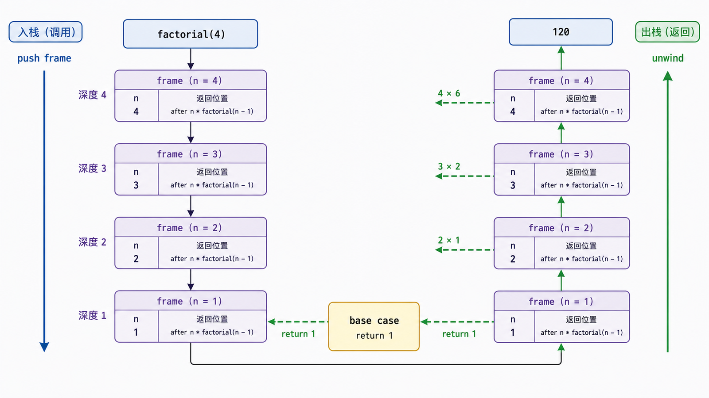
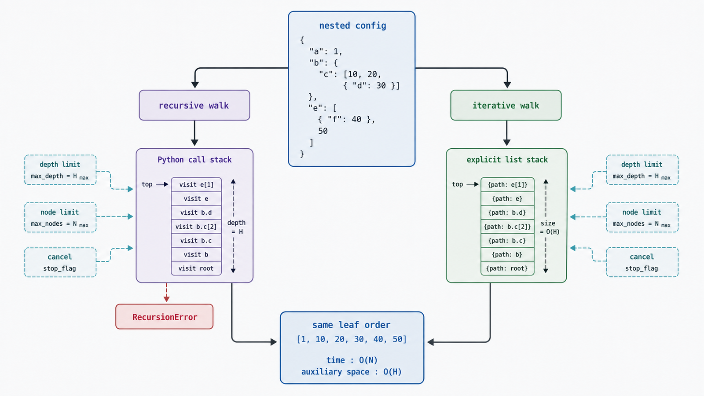

## 前置知识与学习目标

你需要理解函数调用、列表和异常。本文用“遍历嵌套报表目录树”回答：何时递归能直接映射问题结构，何时应改为显式栈？

学完后，你应该能够：

1. 为递归函数写出基本情形、递归步骤和严格推进的终止度量。
2. 解释调用栈如何保存每一层局部状态。
3. 分析递归的时间、空间复杂度与重复子问题。
4. 说明 CPython 不做尾调用消除，并用迭代安全替代深递归。

## 真实场景与核心问题

报表配置由嵌套映射、列表和标量组成。要列出所有叶子路径，问题天然递归：一个节点要么是叶子，要么包含更小的节点。递归代码能贴合定义，但输入可能恶意构造得极深，调用栈不是无限资源。

## 递归的三项正确性条件

任何递归函数都应明确：

1. 基本情形：何时不再递归。
2. 递归步骤：如何把问题缩成同类子问题。
3. 终止度量：某个非负量每次都严格减小。

阶乘中度量是 `n`；树遍历中不是数值减一，而是沿边进入有限树中严格更深的子节点。若图可能含环，还需要 visited 集合，不能把图当树。

<!-- figure-anchor:s29-f01 -->

<!-- figure-ref:s29-f01 -->



<!-- snippet: id=python-intermediate-29-01 mode=compile python=3.12-3.14 deps=stdlib -->

```python
from collections.abc import Iterator, Mapping, Sequence
from typing import TypeAlias

Node: TypeAlias = Mapping[str, "Node"] | Sequence["Node"] | str | int | float | bool | None


def walk_leaves(node: Node, path: tuple[str, ...] = ()) -> Iterator[tuple[str, object]]:
    if isinstance(node, Mapping):
        for key, value in node.items():
            yield from walk_leaves(value, (*path, str(key)))
        return

    if isinstance(node, Sequence) and not isinstance(node, (str, bytes, bytearray)):
        for index, value in enumerate(node):
            yield from walk_leaves(value, (*path, str(index)))
        return

    yield ".".join(path), node


config: Node = {"export": {"formats": ["csv", "json"], "retries": 2}}
assert list(walk_leaves(config)) == [
    ("export.formats.0", "csv"),
    ("export.formats.1", "json"),
    ("export.retries", 2),
]
```

`yield from` 把子生成器的产出转发给调用方。函数对每个节点做常数级额外工作，时间 `O(N)`；最大调用栈与树高 `H` 成正比，即 `O(H)`。

## 调用栈保存什么

递归调用不会“跳回函数开头并覆盖变量”。每次调用创建新的 frame，保存参数、局部变量、返回位置和求值状态。以 `factorial(4)` 为例：

```text
factorial(4)
  factorial(3)
    factorial(2)
      factorial(1) -> 1
    -> 2 * 1
  -> 3 * 2
-> 4 * 6
```

递归深度达到解释器限制会抛 `RecursionError`。提高限制可能导致更严重的栈问题，不是通用修复。

## Python 的尾递归不会自动变成常量栈

尾调用指递归调用是函数返回前最后一步，但 CPython 保留每一层 frame 以提供清晰 traceback，不进行尾调用消除。因此下面仍是 `O(n)` 栈空间：

```python
def factorial_tail(n: int, acc: int = 1) -> int:
    if n <= 1:
        return acc
    return factorial_tail(n - 1, acc * n)
```

对线性深度问题应写循环：

<!-- snippet: id=python-intermediate-29-02 mode=compile python=3.12-3.14 deps=stdlib -->

```python
def factorial(n: int) -> int:
    if not isinstance(n, int) or isinstance(n, bool):
        raise TypeError("n must be an integer")
    if n < 0:
        raise ValueError("n must be non-negative")

    result = 1
    for value in range(2, n + 1):
        result *= value
    return result


assert factorial(0) == 1
assert factorial(5) == 120
```

## 用显式栈控制深度与遍历顺序

<!-- figure-anchor:s29-f02 -->

<!-- figure-ref:s29-f02 -->



<!-- snippet: id=python-intermediate-29-03 mode=compile python=3.12-3.14 deps=stdlib -->

```python
from collections.abc import Iterator, Mapping, Sequence


def walk_leaves_iterative(node: object) -> Iterator[tuple[str, object]]:
    stack: list[tuple[tuple[str, ...], object]] = [((), node)]
    while stack:
        path, current = stack.pop()
        if isinstance(current, Mapping):
            children = [((*path, str(key)), value) for key, value in current.items()]
            stack.extend(reversed(children))
        elif isinstance(current, Sequence) and not isinstance(
            current, (str, bytes, bytearray)
        ):
            children = [((*path, str(i)), value) for i, value in enumerate(current)]
            stack.extend(reversed(children))
        else:
            yield ".".join(path), current
```

显式栈放在堆内存中，仍消耗 `O(H)` 或更高空间，但不受 Python 调用深度同样限制，并可加入节点上限、深度上限和取消信号。

## 重复子问题与记忆化

树遍历通常每个节点访问一次；朴素 Fibonacci 会重复计算相同 `fib(k)`，时间呈指数增长。可用动态规划或 `functools.cache` 把不同子问题降到 `O(n)`，但缓存会增长，并要求参数可哈希、函数结果适合复用。

## 常见误区与适用边界

### 有基本情形就一定终止

递归参数若没有向基本情形推进，条件永远不会触达。必须说明严格下降的度量或有限无环结构。

### 尾递归在 Python 中自动优化

CPython 不做尾调用消除。尾递归仍可能触发 `RecursionError`。

### 树遍历可直接用于任意图

图可能有环和共享节点。需要 visited 集合，并先定义“同一节点”的身份与重复访问语义。

### 递归总比循环慢或总比循环优雅

判断依据是问题结构、最大深度、可读性和资源边界。浅层树递归很自然，任意深用户输入则显式栈更稳妥。

## 本篇自检

<details>
<summary>1. 递归正确性的三个核心部分是什么？</summary>

基本情形、把问题缩小的递归步骤，以及每次严格推进到终止的度量或有限结构。

</details>

<details>
<summary>2. 为什么尾递归阶乘仍可能在 Python 中溢出？</summary>

CPython 不消除尾调用，每次调用仍创建并保留 frame，深度继续增长。

</details>

<details>
<summary>3. 什么时候要给树遍历增加 visited 集合？</summary>

当输入实际是可能有环或共享节点的图时，需要记录已访问身份，防止无限循环或重复处理。

</details>

## 本篇总结

递归把问题结构映射到调用栈，必须同时证明基本情形、规模推进和资源上界。CPython 不优化尾递归；面对任意深输入，显式栈能提供更可控的深度、取消和失败边界。

## 下一篇衔接

下一篇回到对象协作：继承如何建立“是一种”关系，多继承的 C3 MRO 如何决定查找顺序，以及组合为什么常是更稳健的复用方式。

## 资料来源与版本基线

- [Python `RecursionError`](https://docs.python.org/3/library/exceptions.html#RecursionError)
- [Python `sys.getrecursionlimit`](https://docs.python.org/3/library/sys.html#sys.getrecursionlimit)
- [Python `functools.cache`](https://docs.python.org/3/library/functools.html#functools.cache)

版本基线：CPython 3.12–3.14；示例只依赖标准库。
