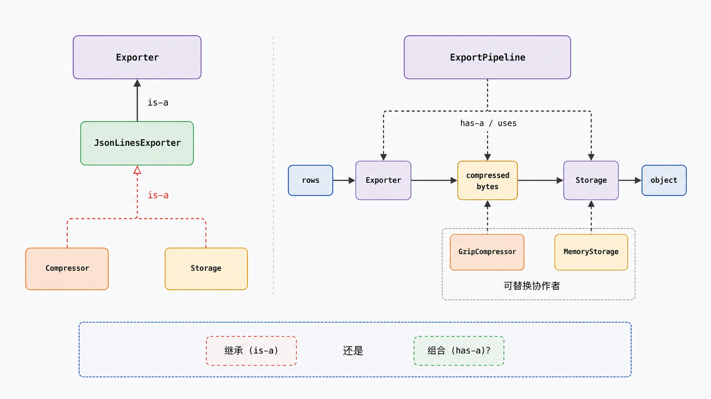
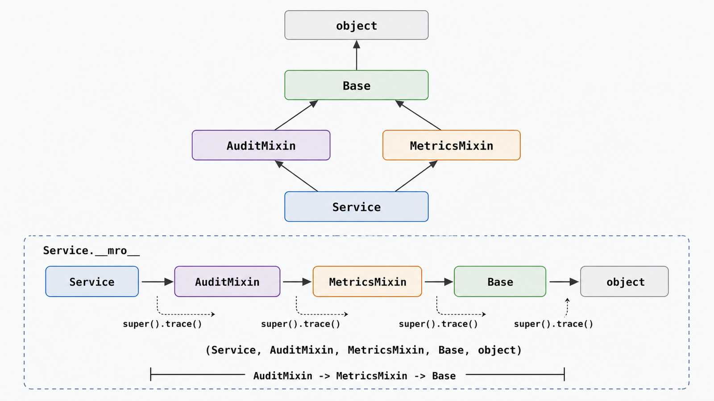

## 前置知识与学习目标

你需要理解类、实例、封装和多态。本文只回答：导出器需要压缩、审计和存储能力时，应使用继承、Mixin 还是组合？

学完后，你应该能够：

1. 区分“是一种”的继承与“拥有/使用”的组合。
2. 用 `Class.__mro__` 预测属性与方法查找顺序。
3. 解释 `super()` 表示 MRO 中的下一个实现，而不是固定父类。
4. 写出可协作的多继承方法，并识别签名冲突与脆弱基类问题。

## 真实场景与核心问题

`CsvExporter` 与 `JsonExporter` 都要压缩输出并写入对象存储。如果为了复用把 `Compressor`、`StorageClient` 全部继承进来，会把“导出器是一种压缩器”这种错误关系写进类型层级。组合更准确：导出器使用压缩器和存储器。

## 单继承：替换必须满足父类契约

继承适合表达稳定的“是一种”关系。子类不仅复用代码，还承诺可以在父类位置使用。若子类收紧输入、扩大副作用或改变异常语义，就可能违反替换原则。

<!-- snippet: id=python-intermediate-30-01 mode=compile python=3.12-3.14 deps=stdlib -->

```python
from abc import ABC, abstractmethod
from collections.abc import Iterable, Mapping

Row = Mapping[str, object]


class Exporter(ABC):
    @abstractmethod
    def export(self, rows: Iterable[Row]) -> bytes:
        raise NotImplementedError


class JsonLinesExporter(Exporter):
    def export(self, rows: Iterable[Row]) -> bytes:
        import json

        text = "\n".join(json.dumps(dict(row), sort_keys=True) for row in rows)
        return text.encode("utf-8")


assert isinstance(JsonLinesExporter(), Exporter)
```

抽象基类表达名义契约，但不能自动验证所有行为。空输入、编码、顺序和异常仍需要契约测试。

## 组合：把变化放在可替换协作者中

<!-- figure-anchor:s30-f01 -->

<!-- figure-ref:s30-f01 -->



<!-- snippet: id=python-intermediate-30-02 mode=compile python=3.12-3.14 deps=stdlib -->

```python
from dataclasses import dataclass
from typing import Protocol
import gzip


class Compressor(Protocol):
    def compress(self, data: bytes) -> bytes: ...


class GzipCompressor:
    def compress(self, data: bytes) -> bytes:
        return gzip.compress(data, mtime=0)


class Storage(Protocol):
    def put(self, key: str, data: bytes) -> None: ...


@dataclass
class MemoryStorage:
    objects: dict[str, bytes]

    def put(self, key: str, data: bytes) -> None:
        self.objects[key] = data


class ExportPipeline:
    def __init__(
        self,
        exporter: Exporter,
        compressor: Compressor,
        storage: Storage,
    ) -> None:
        self.exporter = exporter
        self.compressor = compressor
        self.storage = storage

    def run(self, key: str, rows: Iterable[Row]) -> None:
        raw = self.exporter.export(rows)
        self.storage.put(key, self.compressor.compress(raw))


storage = MemoryStorage({})
pipeline = ExportPipeline(JsonLinesExporter(), GzipCompressor(), storage)
pipeline.run("daily.jsonl.gz", [{"amount": 10}])
assert gzip.decompress(storage.objects["daily.jsonl.gz"]) == b'{"amount": 10}'
```

组合让压缩和存储策略可以独立替换，测试也能注入内存实现。代价是需要显式转发与装配，但依赖关系更可见。

## 多继承与 C3 MRO

Python 用 C3 线性化计算 MRO，目标包括保持局部父类顺序和单调性。直接查看比猜测可靠：

<!-- figure-anchor:s30-f02 -->

<!-- figure-ref:s30-f02 -->



<!-- snippet: id=python-intermediate-30-03 mode=compile python=3.12-3.14 deps=stdlib -->

```python
class Base:
    def trace(self) -> list[str]:
        return ["Base"]


class AuditMixin(Base):
    def trace(self) -> list[str]:
        return ["AuditMixin", *super().trace()]


class MetricsMixin(Base):
    def trace(self) -> list[str]:
        return ["MetricsMixin", *super().trace()]


class Service(AuditMixin, MetricsMixin):
    pass


assert Service.__mro__ == (Service, AuditMixin, MetricsMixin, Base, object)
assert Service().trace() == ["AuditMixin", "MetricsMixin", "Base"]
```

在 `AuditMixin` 中，`super().trace()` 进入 `MetricsMixin`，不是写死的 `Base`。协作式多继承要求链上的实现都调用 `super()`、接受兼容参数、且每个职责只处理一次。某个类直接调用 `Base.trace(self)` 会截断或重复链路。

Mixin 应小、无独立身份、职责单一，并清楚声明它依赖哪些方法。需要复杂状态、构造参数或资源生命周期的能力通常更适合组合。

## 常见误区与适用边界

### `super()` 等于“调用父类”

它根据当前类和实例类型沿 MRO 找下一个实现；多继承中下一个类未必是源码中直观的父类。

### 为复用一段实现就继承

继承会同时引入接口、状态和未来变化。若没有可替换的“是一种”关系，提取函数或组合对象更稳妥。

### 多继承只要没有同名方法就安全

构造签名、属性名、异常约定和未来版本新增方法都可能冲突。Mixin 契约也需要测试。

### MRO 能解决语义冲突

MRO 只决定查找顺序，不能判断哪个实现符合业务语义。含糊的菱形层级仍应重构。

## 本篇自检

<details>
<summary>1. 为什么“导出器继承压缩器”通常关系错误？</summary>

导出器不是一种压缩器，只是在执行中使用压缩能力；组合更准确地表达“拥有/使用”。

</details>

<details>
<summary>2. `super()` 在 Mixin 中会调用谁？</summary>

调用运行时类的 MRO 中、当前实现之后的下一个兼容实现，而不是固定写死的某个父类。

</details>

<details>
<summary>3. 协作式多继承为什么要求签名兼容？</summary>

同一组参数要沿 MRO 传递；某个类拒绝、吞掉或重复处理参数会让调用链中断或语义不一致。

</details>

## 本篇总结

继承表达可替换的“是一种”关系，组合表达显式协作。C3 MRO 给多继承一个稳定查找顺序，`super()` 沿这个顺序协作；它不能替代清晰的职责和兼容契约。

## 下一篇衔接

下一篇把对象协作放进 Web 边界：Cookie 是浏览器传输机制，Session 是服务端状态模型，Token 是凭据；三者如何组合而不是互相替代。

## 资料来源与版本基线

- [Python Tutorial：Inheritance](https://docs.python.org/3/tutorial/classes.html#inheritance)
- [Python `super`](https://docs.python.org/3/library/functions.html#super)
- [Python MRO HOWTO](https://docs.python.org/3/howto/mro.html)
- [Python `abc`](https://docs.python.org/3/library/abc.html)

版本基线：Python 3.12–3.14；示例只依赖标准库。
