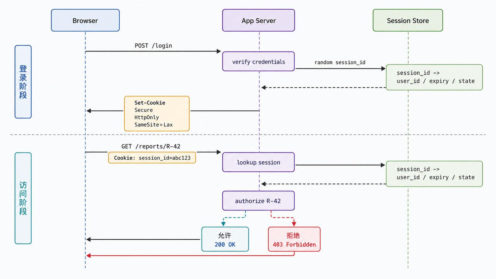
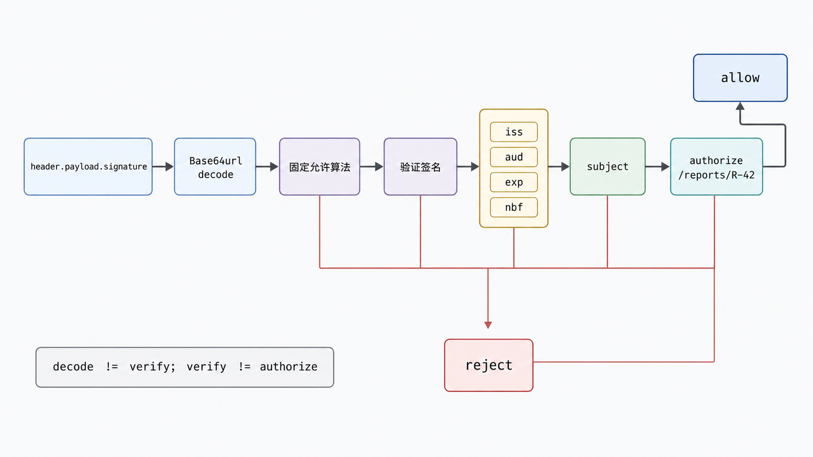
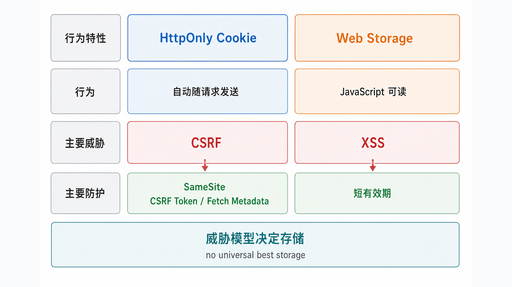

## 前置知识与学习目标

你需要理解 HTTP 请求/响应、HTTPS 和哈希/签名的基本区别。本文保护“下载报表”接口，只回答：用户登录后，后续请求如何携带并验证身份上下文？

学完后，你应该能够：

1. 区分认证（你是谁）、会话（跨请求维持状态）与授权（你能做什么）。
2. 说明 Cookie、Session、Token 和 JWT 不处于同一分类层级。
3. 比较服务端会话与自包含访问令牌的撤销、扩展和泄漏边界。
4. 写出 Cookie 与 JWT 的最小安全验证清单。

## 真实场景与核心问题

用户登录后请求 `/reports/R-42`。服务端不仅要知道“凭据有效”，还要检查当前用户是否有权读取 R-42。认证成功不能替代对象级授权。

## 四个概念放回正确层级

| 概念    | 本质                                                | 常见位置                          |
| ------- | --------------------------------------------------- | --------------------------------- |
| Cookie  | 浏览器按作用域自动保存和发送的 HTTP 状态机制        | 请求 `Cookie` / 响应 `Set-Cookie` |
| Session | 服务端维护的一段会话状态，客户端通常只持有不透明 ID | Redis/数据库/内存 + Cookie ID     |
| Token   | 持有者提交的凭据字符串                              | Cookie 或 `Authorization` 头      |
| JWT     | 一种可签名/加密的紧凑令牌格式                       | 常作为访问令牌，但并非唯一格式    |

Cookie 可以承载 Session ID，也可以承载 Token；Token 也可以不是 JWT。把 Cookie 与 JWT 说成互斥方案，会混淆传输位置与状态模型。

<!-- figure-anchor:s31-f01 -->

<!-- figure-ref:s31-f01 -->



## 服务端 Session 流程

```text
POST /login + credentials
-> 服务器验证
-> 生成高熵、无业务含义的 session_id
-> 服务端存储 session_id -> user_id / expiry / state
-> Set-Cookie: __Host-session=...; Secure; HttpOnly; SameSite=Lax; Path=/

GET /reports/R-42 + Cookie
-> 查 Session
-> 验证过期/撤销
-> 检查 user_id 是否可读 R-42
```

Session 的优点是撤销和状态更新直接；代价是每次请求需要共享状态查询与生命周期治理。Session ID 只应是随机查找键，不应嵌入用户敏感信息。

## 自包含 Token / JWT 流程

签名 JWT 通常是三段 Base64url 文本：`header.payload.signature`。Payload 可读，不是加密；签名用于检测篡改和验证签发者。

<!-- figure-anchor:s31-f02 -->

<!-- figure-ref:s31-f02 -->



验证不能只“成功解码”：

1. 固定允许的算法，拒绝令牌自行决定任意算法。
2. 验证签名与密钥来源。
3. 验证 `iss`（签发者）、`aud`（受众）、`exp`（过期）和适用时的 `nbf`。
4. 限制时钟偏差、令牌大小与有效期。
5. 根据资源再次执行授权。
6. 设计撤销、密钥轮换和泄漏响应。

下面只展示“解析已验证 Claims 后的业务校验”，不实现密码学；生产必须使用成熟库并按库文档固定算法和 Claims：

<!-- snippet: id=python-intermediate-31-01 mode=compile python=3.12-3.14 deps=stdlib -->

```python
from collections.abc import Mapping
from datetime import datetime, timezone


def validate_claims(
    claims: Mapping[str, object],
    *,
    expected_issuer: str,
    expected_audience: str,
    now: datetime,
) -> str:
    if claims.get("iss") != expected_issuer:
        raise ValueError("unexpected issuer")

    audience = claims.get("aud")
    audiences = {audience} if isinstance(audience, str) else set(audience or [])
    if expected_audience not in audiences:
        raise ValueError("unexpected audience")

    expires_at = claims.get("exp")
    if not isinstance(expires_at, (int, float)) or isinstance(expires_at, bool):
        raise ValueError("missing or invalid exp")
    if now.timestamp() >= expires_at:
        raise ValueError("token expired")

    subject = claims.get("sub")
    if not isinstance(subject, str) or not subject:
        raise ValueError("missing subject")
    return subject


now = datetime(2026, 7, 17, tzinfo=timezone.utc)
claims = {
    "iss": "https://auth.example.com",
    "aud": "reports-api",
    "sub": "user-7",
    "exp": now.timestamp() + 300,
}
assert validate_claims(
    claims,
    expected_issuer="https://auth.example.com",
    expected_audience="reports-api",
    now=now,
) == "user-7"
```

## Cookie 安全属性与威胁映射

<!-- figure-anchor:s31-f03 -->

<!-- figure-ref:s31-f03 -->



推荐会话 Cookie 形态：

```http
Set-Cookie: __Host-session=<opaque>; Path=/; Secure; HttpOnly; SameSite=Lax
```

| 属性/措施                   | 主要作用                       | 不能单独解决             |
| --------------------------- | ------------------------------ | ------------------------ |
| `Secure`                    | 仅通过 HTTPS 发送              | 终端泄漏、服务端日志泄漏 |
| `HttpOnly`                  | 阻止 JavaScript 直接读取       | XSS 发起已认证请求       |
| `SameSite`                  | 限制部分跨站发送               | 全部 CSRF 场景           |
| `__Host-`                   | 强制 Secure、Path=/、无 Domain | 应用自身授权缺陷         |
| CSRF Token / Fetch Metadata | 验证请求意图                   | XSS                      |

Cookie 自动随请求发送，因此需要 CSRF 防护；把访问令牌放进 Web Storage 则暴露给同源 JavaScript，XSS 风险模型不同。不存在脱离应用架构的单一“最佳存储位置”。

## Session 与自包含 Token 的选择

| 维度           | 服务端 Session       | 短期自包含访问令牌             |
| -------------- | -------------------- | ------------------------------ |
| 即时撤销       | 直接删除/标记状态    | 需短有效期、拒绝列表或版本状态 |
| 每请求状态查询 | 通常需要             | 签名验证后可减少中心查询       |
| 状态更新       | 服务端立即生效       | 旧令牌 Claims 在过期前仍旧     |
| 泄漏影响       | 取决于会话寿命与撤销 | 持有者可用到过期/撤销          |
| 复杂度         | 状态存储与扩展       | 密钥、Claims、轮换、撤销       |

浏览器单体应用通常不必为了“无状态”强行使用 JWT；跨服务委托与标准化受众场景可能更适合短期访问令牌。应从威胁模型和撤销要求选择。

## 常见误区与适用边界

### JWT Payload 看不懂所以安全

Base64url 可直接解码。不要放密码、密钥或不应暴露给客户端的个人信息。

### 签名有效就完成授权

签名只验证令牌完整性和签发控制；仍要验证 Claims，并对具体资源执行权限检查。

### `SameSite` 可以替代全部 CSRF 防御

它是纵深防御的一层。复杂登录、跨站导航、旧浏览器或业务例外仍需框架级 CSRF 方案和请求意图校验。

### 刷新令牌就是更长的访问令牌

刷新令牌权限更敏感，应只发给授权服务器、轮换并检测重用；资源 API 不应把它当访问令牌接受。

## 本篇自检

<details>
<summary>1. Cookie、Session 与 JWT 为什么不是三选一？</summary>

Cookie 是浏览器传输/存储机制，Session 是服务端状态模型，JWT 是令牌格式；Cookie 可以承载 Session ID 或令牌。

</details>

<details>
<summary>2. JWT 签名验证通过后还必须检查什么？</summary>

至少检查允许算法、签发者、受众、过期/生效时间等 Claims，并对目标资源重新授权。

</details>

<details>
<summary>3. `HttpOnly` 为什么不能完全阻止 XSS 滥用会话？</summary>

它阻止脚本读取 Cookie，但恶意脚本仍可能从受害者页面发起会自动携带 Cookie 的请求。

</details>

## 本篇总结

认证确认身份，会话跨请求维持状态，授权决定资源访问。Cookie、Session、Token 和 JWT 位于不同层级；安全设计必须覆盖传输、验证、撤销、CSRF/XSS 与对象级授权。

## 下一篇衔接

下一篇把报表流水线配置落到 YAML：缩进如何构造映射、序列和标量，隐式类型与锚点为何可能带来跨解析器差异。

## 资料来源与版本基线

- [MDN Session management](https://developer.mozilla.org/en-US/docs/Web/Security/Authentication/Session_management)
- [MDN Secure cookie configuration](https://developer.mozilla.org/en-US/docs/Web/Security/Practical_implementation_guides/Cookies)
- [RFC 7519：JSON Web Token](https://www.rfc-editor.org/rfc/rfc7519)
- [RFC 8725：JWT Best Current Practices](https://www.rfc-editor.org/rfc/rfc8725)
- [RFC 9700：OAuth 2.0 Security Best Current Practice](https://www.rfc-editor.org/rfc/rfc9700)

版本基线：截至 2026-07 的 Web 安全建议。生产实现应使用维护中的框架/令牌库，不手写密码学验证。
