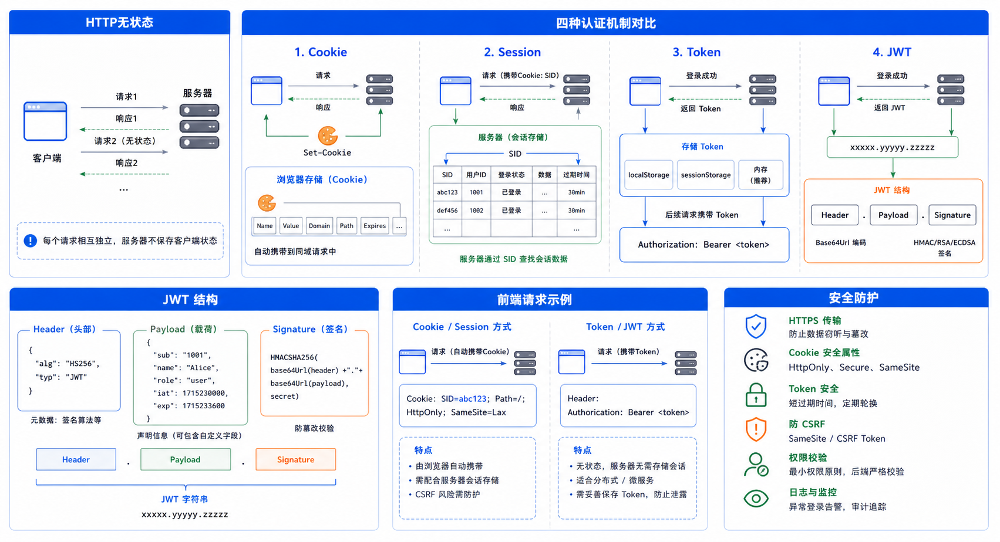

> Web身份认证是Web开发的核心技术，本文详细介绍Cookie、Session、Token的原理和实践。



## 认证、会话与授权

认证回答“你是谁”，会话让多个请求连续关联到该身份，授权回答“你能否操作这个资源”。登录成功不等于拥有所有权限；每个服务端请求仍需对象级授权。

浏览器应用通常优先使用服务端 Session：Cookie 只保存至少 128 位熵的随机会话 ID，服务端保存用户、创建时间、最后活动时间和撤销状态。登录/提权后轮换 ID，退出时服务端失效。Cookie 至少设置 `Secure`、`HttpOnly` 和适合业务的 `SameSite`；所有依赖 Cookie 修改状态的请求启用 CSRF Token。

<!-- snippet: id=web-auth-random-session-id mode=run python=3.12-3.14 deps=stdlib -->
```python
import secrets

session_id = secrets.token_urlsafe(32)
assert len(session_id) >= 43
assert session_id != secrets.token_urlsafe(32)
```

密码使用框架提供的 Argon2id、scrypt 或带升级参数的 PBKDF2 等自适应哈希；禁止明文、MD5、SHA-1 或一次 SHA-256。登录、验证码、找回密码和刷新令牌端点都需要限流、统一错误信息和审计日志。

## Token/JWT 校验清单

JWT 是签名容器，不是加密容器。使用成熟库并固定允许的算法，验证签名、`iss`、`aud`、`exp`、`nbf`，限制时钟偏差和令牌大小；不要接受令牌头动态指定任意算法/密钥。访问令牌保持短期，刷新令牌轮换并能撤销，密钥按 `kid` 平滑轮换。

| 失败路径 | 必须行为 |
| --- | --- |
| 密码错误、用户不存在 | 返回相同外部错误，内部限流并审计 |
| Session 固定攻击 | 登录成功后销毁旧 ID 并创建新 ID |
| JWT 过期/错 issuer/错 audience | 拒绝，不自动降级为匿名高权限 |
| 用户被禁用或权限被收回 | 服务端当前状态优先于令牌旧声明 |
| CSRF Token 缺失 | Cookie 认证的状态修改请求返回 403 |

完整实践应通过框架测试客户端验证登录成功、错误密码、会话轮换、退出撤销、对象级 403、CSRF 缺失和过期令牌；测试密钥必须明显无效且与生产完全隔离。
