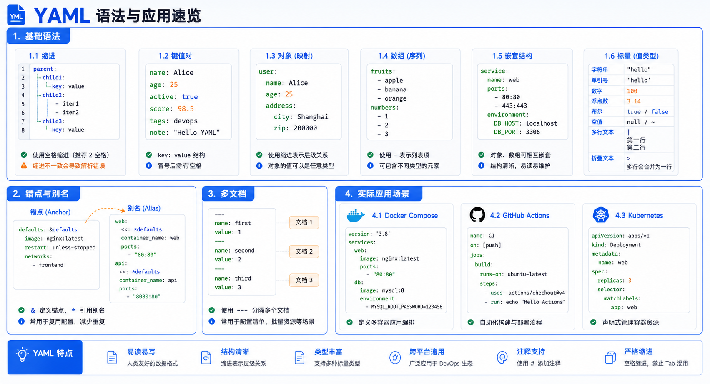

> YAML（Yet Another Markup Language）是一种人类可读的数据序列化格式，常用于配置文件。

## 基本语法

| 规则 | 说明 |
|------|------|
| **大小写敏感** | `Name` 和 `name` 是不同的 |
| **缩进表示层级** | 使用空格缩进，不允许 Tab |
| **# 注释** | `#` 到行尾为注释内容 |
| **列表使用 `-`** | 连词线开头表示列表项 |

> **注意**：缩进时只允许使用空格，相同层级的元素左侧必须对齐。



## 数据结构

YAML 支持三种数据结构：

| 类型 | 说明 | 示例 |
|------|------|------|
| **对象** | 键值对集合 | `{name: "张三"}` |
| **数组** | 有序列表 | `["a", "b", "c"]` |
| **纯量** | 单一不可分值 | `123`, `true` |

## 对象

### 基本写法

<!-- snippet: id=yaml-tutorial-basics-01 mode=display python=3.12-3.14 deps=stdlib -->
```yaml
name: 张三
age: 25
```

**转换为 JSON**：

<!-- snippet: id=yaml-tutorial-basics-02 mode=display python=3.12-3.14 deps=stdlib -->
```json
{
  "name": "张三",
  "age": 25
}
```

### 行内写法

<!-- snippet: id=yaml-tutorial-basics-03 mode=display python=3.12-3.14 deps=stdlib -->
```yaml
person: {name: 张三, age: 25}
```

## 数组

### 基本写法

<!-- snippet: id=yaml-tutorial-basics-04 mode=display python=3.12-3.14 deps=stdlib -->
```yaml
fruits:
  - 苹果
  - 香蕉
  - 橙子
```

**转换为 JSON**：

<!-- snippet: id=yaml-tutorial-basics-05 mode=display python=3.12-3.14 deps=stdlib -->
```json
{
  "fruits": ["苹果", "香蕉", "橙子"]
}
```

### 行内写法

<!-- snippet: id=yaml-tutorial-basics-06 mode=display python=3.12-3.14 deps=stdlib -->
```yaml
fruits: [苹果, 香蕉, 橙子]
```

### 嵌套数组

<!-- snippet: id=yaml-tutorial-basics-07 mode=display python=3.12-3.14 deps=stdlib -->
```yaml
-
  - 苹果
  - 香蕉
-
  - 橙子
  - 葡萄
```

## 复合结构

对象和数组可以嵌套使用：

<!-- snippet: id=yaml-tutorial-basics-08 mode=display python=3.12-3.14 deps=stdlib -->
```yaml
languages:
  - Ruby
  - Python
  - JavaScript

websites:
  Ruby: ruby-lang.org
  Python: python.org
  JavaScript: developer.mozilla.org
```

**转换为 JSON**：

<!-- snippet: id=yaml-tutorial-basics-09 mode=display python=3.12-3.14 deps=stdlib -->
```json
{
  "languages": ["Ruby", "Python", "JavaScript"],
  "websites": {
    "Ruby": "ruby-lang.org",
    "Python": "python.org",
    "JavaScript": "developer.mozilla.org"
  }
}
```

## 纯量（标量）

### 字符串

<!-- snippet: id=yaml-tutorial-basics-10 mode=display python=3.12-3.14 deps=stdlib -->
```yaml
name: 张三
message: "你好\n世界"  # 双引号支持转义
content: |
  多行文本
  保留换行
```

### 布尔值

<!-- snippet: id=yaml-tutorial-basics-11 mode=display python=3.12-3.14 deps=stdlib -->
```yaml
is_active: true
is_deleted: false
```

### 数值

<!-- snippet: id=yaml-tutorial-basics-12 mode=display python=3.12-3.14 deps=stdlib -->
```yaml
count: 25
price: 19.99
negative: -10
scientific: 1.5e10
```

### 空值

<!-- snippet: id=yaml-tutorial-basics-13 mode=display python=3.12-3.14 deps=stdlib -->
```yaml
empty: null
also_empty: ~
```

### 日期时间

<!-- snippet: id=yaml-tutorial-basics-14 mode=display python=3.12-3.14 deps=stdlib -->
```yaml
created_at: 2024-01-01
created_time: 2024-01-01T10:30:00
```

## 特殊语法

### 锚点与别名

复用相同的值：

<!-- snippet: id=yaml-tutorial-basics-15 mode=display python=3.12-3.14 deps=stdlib -->
```yaml
defaults:
  host: &default_host "localhost"
  port: &default_port 8080

development:
  host: *default_host
  port: *default_port
```

### 多文档

使用 `---` 分隔多个文档：

<!-- snippet: id=yaml-tutorial-basics-16 mode=display python=3.12-3.14 deps=stdlib -->
```yaml
---
title: 文档1
content: 内容1
---
title: 文档2
content: 内容2
```

## 实际应用

### Docker Compose 配置

<!-- snippet: id=yaml-tutorial-basics-17 mode=display python=3.12-3.14 deps=stdlib -->
```yaml
version: '3.8'

services:
  web:
    image: nginx
    ports:
      - "80:80"
    environment:
      - NODE_ENV=production
    volumes:
      - ./html:/usr/share/nginx/html

  db:
    image: mysql:8.0
    environment:
      MYSQL_ROOT_PASSWORD: secret
    volumes:
      - db_data:/var/lib/mysql

volumes:
  db_data:
```

### GitHub Actions

<!-- snippet: id=yaml-tutorial-basics-18 mode=display python=3.12-3.14 deps=stdlib -->
```yaml
name: CI

on:
  push:
    branches: [main]
  pull_request:
    branches: [main]

jobs:
  build:
    runs-on: ubuntu-latest
    steps:
      - uses: actions/checkout@v3
      - name: Setup Python
        uses: actions/setup-python@v4
        with:
          python-version: '3.10'
      - run: python -m pip install -r requirements.txt
      - run: pytest
```

### Kubernetes 配置

<!-- snippet: id=yaml-tutorial-basics-19 mode=display python=3.12-3.14 deps=stdlib -->
```yaml
apiVersion: v1
kind: Pod
metadata:
  name: my-app
  labels:
    app: my-app
spec:
  containers:
    - name: app
      image: my-app:latest
      ports:
        - containerPort: 8080
      resources:
        limits:
          memory: "128Mi"
          cpu: "500m"
```

## 小结

- **YAML** 是一种人类友好的数据格式
- **缩进** 表示层级关系，使用空格
- **对象** 使用键值对，`key: value`
- **数组** 使用 `-` 前缀
- **纯量** 包括字符串、数字、布尔值等
- **广泛应用**：配置文件、CI/CD、容器编排等
