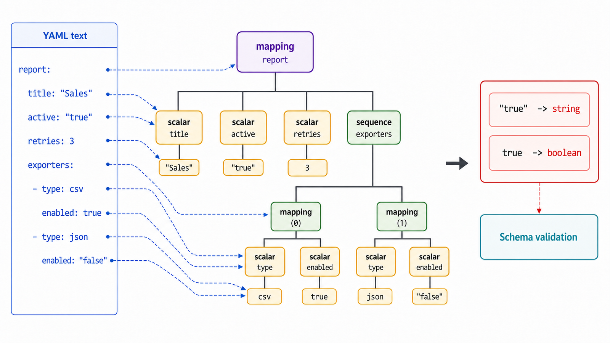
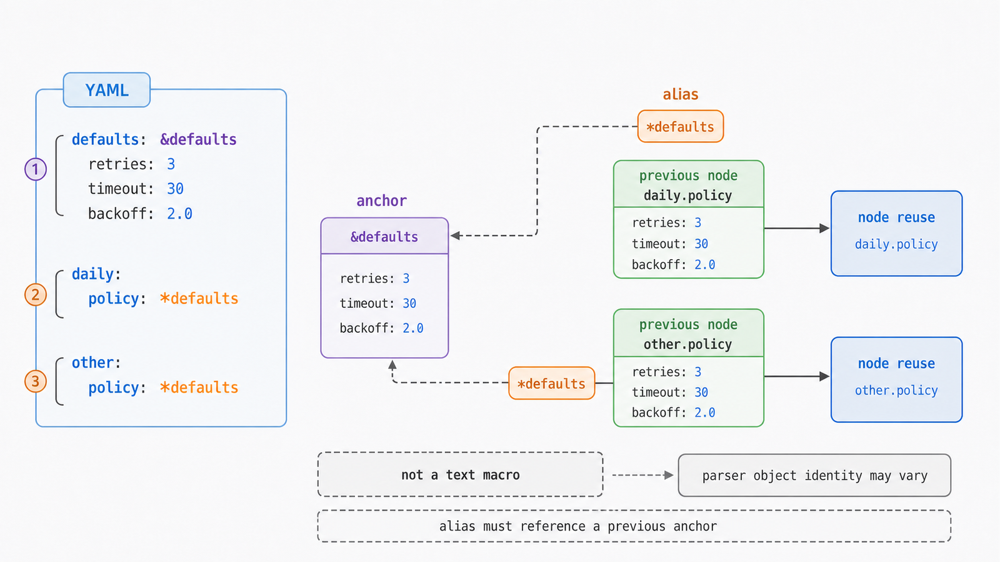

## 前置知识与学习目标

你需要理解 Python 字典、列表、字符串和配置文件。本文给报表流水线编写最终配置，只回答：YAML 文本如何变成映射、序列和标量，哪些写法会造成歧义或安全问题？

学完后，你应该能够：

1. 把 YAML 内容归类为 mapping、sequence 和 scalar。
2. 正确使用缩进、块/流式集合、引号与多行标量。
3. 解释锚点和别名复用的是节点，不是模板语言。
4. 用安全加载、Schema 校验和版本约束控制解析边界。

## 真实场景与核心问题

报表服务需要描述输入、导出器、重试和邮件收件人。YAML 适合人读写，但“看起来像字符串”的值可能被解析器解析成布尔、数字或日期；缩进错误还可能改变整棵数据结构。

## 核心模型：三种节点

YAML 1.2 的常用数据结构可归纳为：

| 节点     | Python 常见结果                 | YAML 示例     |
| -------- | ------------------------------- | ------------- |
| mapping  | `dict`                          | `name: daily` |
| sequence | `list`                          | `- csv`       |
| scalar   | `str`、`int`、`bool`、`None` 等 | `retries: 3`  |

缩进决定块结构，不能用 Tab 代替结构缩进。冒号分隔键值，短横线引入序列项；同层元素必须对齐。

<!-- figure-anchor:s32-f01 -->

<!-- figure-ref:s32-f01 -->



```yaml
version: 1
report:
  name: daily-sales
  source: data/orders.csv
  exporters:
    - type: csv
      destination: out/report.csv
    - type: jsonl
      destination: out/report.jsonl
  retry:
    attempts: 3
    backoff_seconds: [1, 2, 4]
```

对应概念 Shape：

```text
mapping
└─ report: mapping
   ├─ name: scalar
   ├─ exporters: sequence[mapping]
   └─ retry: mapping
```

## 标量：能省引号，不代表应该省

YAML 提供普通、单引号和双引号标量。双引号处理转义，单引号主要通过重复单引号表示字面单引号。对可能被解析成其他类型或含特殊字符的值，显式引号更稳妥：

```yaml
enabled: true
literal_true: "true"
port: 8080
port_text: "08080"
empty_value: null
empty_text: ""
schedule: "08:00"
```

YAML 1.1 与 1.2、不同库采用的 Schema 对隐式类型解析可能不同。例如某些旧解析器把 `yes`/`no` 当布尔。跨工具配置应使用目标工具支持的明确子集，并对关键字符串加引号。

## 多行文本与换行语义

```yaml
literal: |
  line one
  line two

folded: >
  this is folded
  into one line
```

`|` 保留行结构，`>` 通常折叠普通换行为保留空格的连续文本；尾部换行还受 chomping 标记 `-`/`+` 影响。证书、脚本和 Markdown 等对换行敏感的内容应写测试，不能仅凭视觉判断。

## 锚点、别名与合并边界

锚点 `&name` 标记节点，别名 `*name` 引用之前的锚点：

<!-- figure-anchor:s32-f02 -->

<!-- figure-ref:s32-f02 -->



```yaml
defaults: &defaults
  retries: 3
  timeout_seconds: 10

daily:
  policy: *defaults
```

别名表示节点复用；解析后的对象是否共享身份以及修改传播行为取决于库的数据模型。不要把别名当字符串宏。

常见 `<<` 合并键不是 YAML 1.2 核心规范中的通用模板机制，工具支持不一。跨平台配置优先显式字段或在应用层实现可测试的合并规则。

## Python 加载：解析后仍需 Schema 校验

Python 标准库不含 YAML 解析器。下面使用第三方 PyYAML；`safe_load` 限制为标准 YAML 标签，避免任意 Python 对象构造，但它不会替你验证业务字段。

<!-- snippet: id=python-intermediate-32-01 mode=display python=3.12-3.14 deps=pyyaml -->

```python
from collections.abc import Mapping
from pathlib import Path

import yaml


def load_config(path: Path) -> dict[str, object]:
    if path.stat().st_size > 1_000_000:
        raise ValueError("configuration file is too large")

    with path.open("r", encoding="utf-8") as file:
        data = yaml.safe_load(file)

    if not isinstance(data, Mapping):
        raise ValueError("top-level YAML node must be a mapping")
    if data.get("version") != 1:
        raise ValueError("unsupported configuration version")
    if not isinstance(data.get("report"), Mapping):
        raise ValueError("report must be a mapping")
    return dict(data)
```

验证层至少应检查：顶层类型、必需键、未知键策略、枚举、范围、路径、列表长度和版本号。解析成功只说明语法可读，不说明配置对业务有效。

## 多文档与工具边界

`---` 可开始文档，`...` 可结束文档。一个文件含多个文档时，加载 API 可能只接受单文档或返回迭代器；必须选择与工具契约一致的 API。Kubernetes 等工具对 YAML 还施加自己的 Schema 和对象规则，这些规则不属于 YAML 语法本身。

## 常见误区与适用边界

### YAML 是带注释的 JSON

YAML 1.2 以兼容 JSON 为目标，但还包含锚点、标签、多行标量和更复杂的解析规则；不同实现也存在差异。

### `safe_load` 后数据一定安全可用

它主要限制危险类型构造。资源消耗、超大别名图、业务字段、路径和下游命令仍需限制和验证。

### 锚点适合大规模继承模板

复杂别名和合并会让最终值难以追踪，并可能缺乏跨工具兼容。配置生成、显式默认值或应用层合并更可测试。

### YAML 适合所有数据交换

机器到机器高频协议通常更重视解析一致性、Schema 和性能；JSON、Protobuf 等可能更合适。YAML 的优势主要是人类维护的配置和文档。

## 本篇自检

<details>
<summary>1. YAML 的三种核心节点是什么？</summary>

映射（mapping）、序列（sequence）和标量（scalar）。

</details>

<details>
<summary>2. 为什么关键字符串有时应显式加引号？</summary>

不同 YAML 版本、Schema 和解析器可能把普通标量隐式解析成布尔、数字、日期或 null；引号能明确字符串意图。

</details>

<details>
<summary>3. `safe_load` 为什么不能替代业务 Schema 校验？</summary>

它限制可构造的标签类型，但不知道应用所需键、范围、枚举、未知字段和跨字段不变量。

</details>

## 本篇总结

YAML 用缩进和少量符号表示 mapping、sequence 与 scalar。可靠使用需要明确标量类型、限制锚点复杂度、采用安全解析器，并在解析后执行独立业务 Schema 校验。

## 下一篇衔接

本篇是 Python 中级 17–32 的收束。下一阶段可进入 Python 高级系列：并发、网络、描述符和自定义协议会继续使用本系列建立的对象边界、流接口、资源管理和可验证示例方法。

## 资料来源与版本基线

- [YAML 1.2.2 Specification](https://yaml.org/spec/1.2.2/)
- [YAML 1.2.2 Vocabulary](https://yaml.org/spec/1.2.2/ext/glossary/)
- [PyYAML Documentation](https://pyyaml.org/wiki/PyYAMLDocumentation)

版本基线：YAML 1.2.2；Python 3.12–3.14；Python 示例依赖 PyYAML，业务配置应同时锁定解析器版本与 Schema。
