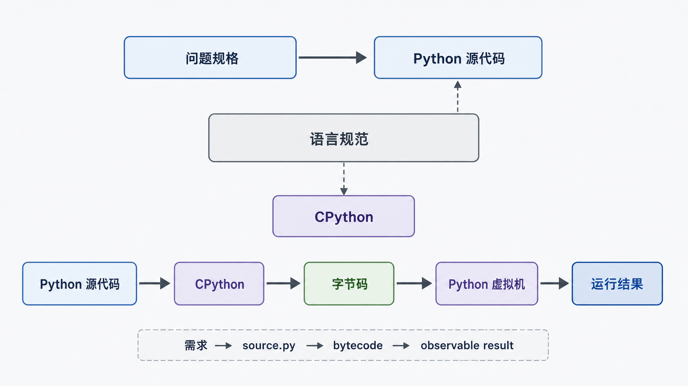

编程不是“背语法”，而是把一个可重复的问题写成计算机能执行、能验证的步骤。本系列会持续实现一个小型 `order_report` 订单汇总工具：读取订单，计算金额，输出报告，并逐步补上文件、模块、异常和日志。

## 前置知识与学习目标

不要求编程经验，只需会打开终端和文本编辑器。学完后你应该能：

- 用“输入—处理—输出—失败”描述一个程序；
- 区分源代码、语言规范、语言实现与运行时；
- 解释为什么“编译型/解释型”不是给语言贴的永久标签；
- 把一个模糊需求改写成可验证的步骤。

## 从订单汇总问题开始

需求“统计订单总额”至少包含四类信息：

| 部分 | `order_report` 中的问题                      |
| ---- | -------------------------------------------- |
| 输入 | 订单来自键盘、文件还是网络？金额是什么格式？ |
| 处理 | 数量乘单价后，折扣和税费按什么顺序计算？     |
| 输出 | 输出到终端、文件还是接口？小数保留几位？     |
| 失败 | 空文件、非法数字、权限不足时怎么办？         |

算法是解决问题的有限步骤，程序则是算法、数据和运行环境的具体实现。只有结果可观察、失败可说明，需求才真正落地。

## 从源代码到运行结果

<!-- figure:s01-f01:start -->

<!-- figure:s01-f01:end -->

源码是遵守某种语法的文本；语言规范定义语法和语义；语言实现负责把源码变成机器可执行的行为。以常用的 CPython 为例，源码通常先被编译为字节码，再由 Python 虚拟机执行。这个过程同时包含“编译”和“解释”，因此只说“Python 是解释型语言”会掩盖关键机制。

高级语言的实现可采用提前编译、即时编译、虚拟机解释或多种方式组合。真正影响选择的是部署环境、性能、生态、团队经验与维护成本，而不是单一标签。

## 语言层级解决了什么问题

| 层级     | 主要抽象               | 代价                     |
| -------- | ---------------------- | ------------------------ |
| 机器指令 | 处理器可直接执行的编码 | 与硬件强绑定，人类难维护 |
| 汇编语言 | 用助记符表示指令       | 仍需理解寄存器和指令集   |
| 高级语言 | 函数、对象、模块等抽象 | 需要编译器或解释器实现   |

抽象提高开发效率，但不会消灭底层约束。文件最终仍是字节，内存仍有限，外部输入仍可能失败。后续文章会逐层把这些边界显式化。

## 选择 Python 的理由与边界

Python 适合自动化、数据处理、Web、测试和教学，因为语法紧凑、标准库丰富、跨平台性好。它不保证在所有计算密集型或硬实时场景中都是最佳选择；实际工程常由 Python 负责流程编排，把性能热点交给原生扩展、数据库或专用服务。

不要用流行榜单决定技术选型。榜单口径和年份会变化，而任务约束才是可复查的依据。

## 把需求写成可验证步骤

`order_report` 的第一版规格可以写成：

1. 接收数量 `quantity` 和单价 `unit_price`；
2. 校验数量为非负整数、单价为非负十进制数；
3. 计算 `subtotal = quantity × unit_price`；
4. 以两位小数输出；
5. 输入非法时返回清楚的错误，不产生看似正确的结果。

这份规格为下一篇的输入、类型转换和运算符提供了明确上下文。

## 常见误区与适用边界

- “程序就是代码文件”：文件只是载体，运行结果还取决于实现、依赖、配置和输入。
- “高级语言一定慢”：性能取决于实现、算法、I/O、数据规模和优化路径。
- “能运行就正确”：缺少预期输出与失败用例时，只能证明某次没有立刻崩溃。
- “Python 屏蔽了底层”：它提供抽象，但编码、进程、路径与内存边界仍然存在。

## 自检题

1. 为什么不能把 Python 简单等同于“逐行解释、不经过编译”？
2. 一个可验证程序规格至少应描述哪四类信息？
3. 如果任务要求微秒级硬实时响应，为什么需要重新评估 Python？

参考答案

1. CPython 会先把源码编译为字节码再执行，其他实现还可能使用即时编译；“语言”和“实现方式”应分开讨论。
2. 输入、处理、输出和失败边界。
3. 垃圾回收、运行时调度与操作系统都会引入不可控延迟，应根据实时约束选择实现和平台。

## 本篇总结

编程的核心是把问题转成可执行、可观察、可验证的步骤。源码、语言规范、实现和运行时是不同层次；语言选择应服务于约束，而不是服务于标签。

## 下一篇衔接

下一篇把 `quantity` 和 `unit_price` 从终端读入，解释 `input()` 为什么返回字符串，以及类型转换、算术、比较、布尔短路和身份比较各自解决什么问题。

## 资料来源

- [Python 3.14 教程](https://docs.python.org/3.14/tutorial/index.html)
- [Python 3.14 语言参考：执行模型](https://docs.python.org/3.14/reference/executionmodel.html)
- [Python 词汇表：bytecode、CPython、interpreter](https://docs.python.org/3.14/glossary.html)
