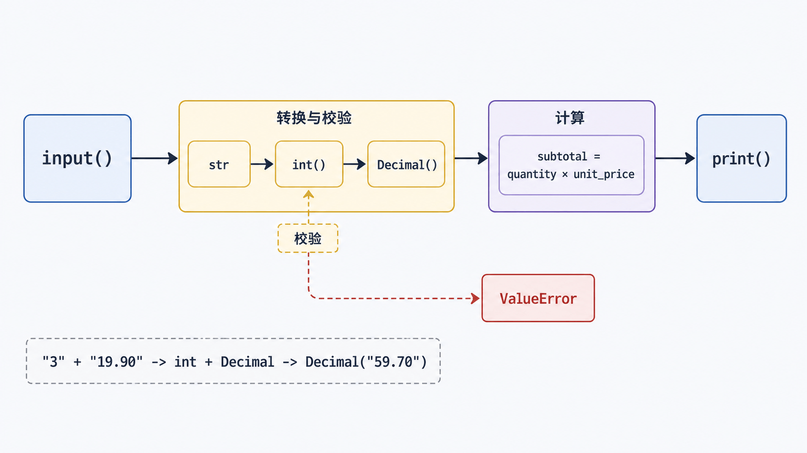
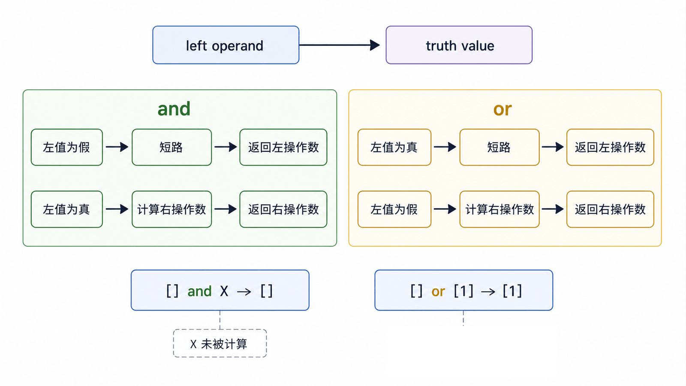

`input()` 和 `print()` 是程序与终端的边界。边界上的数据必须先确认类型，再参与运算；否则字符串拼接、除法语义和布尔判断都可能制造“能运行但答案错”的程序。

## 前置知识与学习目标

你应理解上一篇的“输入—处理—输出—失败”模型。学完后你应该能：

- 解释 `input()`、类型转换和 `print()` 的数据流；
- 正确选择 `/`、`//`、`%`、`**` 和比较运算；
- 解释 `and`、`or` 的短路与返回值；
- 区分 `==` 与 `is`，并识别转换失败。

## 终端输入始终先是文本

<!-- figure:s02-f01:start -->



<!-- figure:s02-f01:end -->

Python 3 的 `input(prompt)` 读取一行并返回 `str`。即使用户键入 `3`，得到的也是 `"3"`。需要数值时应显式转换，并在输入边界处理 `ValueError`。

<!-- snippet: id=python-input-validated-order mode=run python=3.12-3.14 deps=stdlib -->

```python
from decimal import Decimal, InvalidOperation

raw_quantity = "3"
raw_price = "19.90"

try:
    quantity = int(raw_quantity)
    unit_price = Decimal(raw_price)
except (ValueError, InvalidOperation) as exc:
    raise ValueError("quantity 或 unit_price 格式非法") from exc

if quantity < 0 or unit_price < 0:
    raise ValueError("数量和单价不能为负数")

subtotal = quantity * unit_price
assert subtotal == Decimal("59.70")
print(f"小计：{subtotal:.2f}")
```

金额示例使用 `Decimal`，因为二进制浮点数不适合直接表达所有十进制金额。第 4 篇会进一步解释类型选择。

## 算术、比较和赋值

| 运算      | 含义                       | 容易忽略的边界                    |
| --------- | -------------------------- | --------------------------------- |
| `a / b`   | 真除法，结果通常为 `float` | `b == 0` 抛 `ZeroDivisionError`   |
| `a // b`  | 向负无穷取整的商           | `-3 // 2 == -2`                   |
| `a % b`   | 与整除配套的余数           | 满足 `a == (a // b) * b + a % b`  |
| `a ** b`  | 幂                         | 优先级高于一元负号：`-2**2 == -4` |
| `==`、`<` | 值相等或次序比较           | 不兼容类型的次序比较会报错        |
| `+=` 等   | 增强赋值                   | 可变对象可能原地修改，第 7 篇详解 |

<!-- snippet: id=python-operator-invariants mode=run python=3.12-3.14 deps=stdlib -->

```python
a, b = -7, 3
quotient, remainder = divmod(a, b)
assert (quotient, remainder) == (-3, 2)
assert a == quotient * b + remainder

x, y = 10, 20
x, y = y, x
assert (x, y) == (20, 10)
```

序列解包要求左右元素数量匹配；`head, *middle, tail = values` 可收集剩余元素。

## 布尔上下文与短路

<!-- figure:s02-f02:start -->



<!-- figure:s02-f02:end -->

空字符串、空容器、数值零和 `None` 在布尔上下文中为假。`and` 与 `or` 会短路，并返回某个操作数，不一定返回 `bool`。

<!-- snippet: id=python-boolean-short-circuit mode=run python=3.12-3.14 deps=stdlib -->

```python
orders = []
label = orders and "有订单"
fallback = orders or ["示例订单"]

assert label == []
assert fallback == ["示例订单"]
assert not orders
```

用 `if orders:` 判断是否为空很自然；若接口必须产生布尔值，显式写 `bool(orders)`。

## 值相等、身份与成员

- `a == b` 比较值；
- `a is b` 判断是否为同一个对象，主要用于 `x is None`；
- `item in container` 做成员测试，具体成本取决于容器。

不要用 `is` 比较整数或字符串。CPython 可能复用某些对象，但这是实现细节，不能作为业务逻辑。

## 输出是接口，不只是调试

`print(*objects, sep=" ", end="\n", file=..., flush=False)` 会把对象转换为文本。对用户输出应明确单位和格式；对程序间交换应使用 JSON 等结构化格式，而不是解析人类可读的 `print()` 文本。

## 常见误区与适用边界

- 直接对 `input()` 结果做加法，会得到字符串拼接。
- `and`、`or` 返回操作数；不要假设结果总是 `True`/`False`。
- 链式比较 `0 <= x < 10` 只求值一次中间操作数，优于重复表达式。
- 运算符优先级难以一眼确认时加括号；清晰度比记口诀重要。
- 不要用 `eval(input())` 进行“万能转换”，它会执行不可信代码。

## 自检题

1. 为什么 `input()` 得到的 `"12"` 不能直接与整数 `3` 相加？
2. `[] or [1]` 的结果是什么，为什么不是字面量 `True`？
3. 比较两个订单字典内容是否相同应使用 `==` 还是 `is`？

<details>
<summary>参考答案</summary>

1. `input()` 返回 `str`，必须先按业务规则转换为数值。
2. 结果是 `[1]`；`or` 返回第一个真值操作数，若左侧为假则返回右侧。
3. 使用 `==`。`is` 只判断两个名字是否指向同一个对象。

</details>

## 本篇总结

外部输入先是文本，必须经过转换与校验才能进入计算。运算符不仅有符号，还包含类型、短路、取整和对象身份等语义边界。

## 下一篇衔接

下一篇把单次金额计算扩展为多条订单：用 `if` 选择路径，用 `for` 遍历数据，用 `while` 处理重试，并解释 `break`、`continue` 与循环 `else` 的真实控制流。

## 资料来源

- [Python 教程：输入与输出](https://docs.python.org/3.14/tutorial/inputoutput.html)
- [Python 语言参考：表达式与运算符优先级](https://docs.python.org/3.14/reference/expressions.html)
- [Python 标准类型：真值、比较和数值类型](https://docs.python.org/3.14/library/stdtypes.html)
