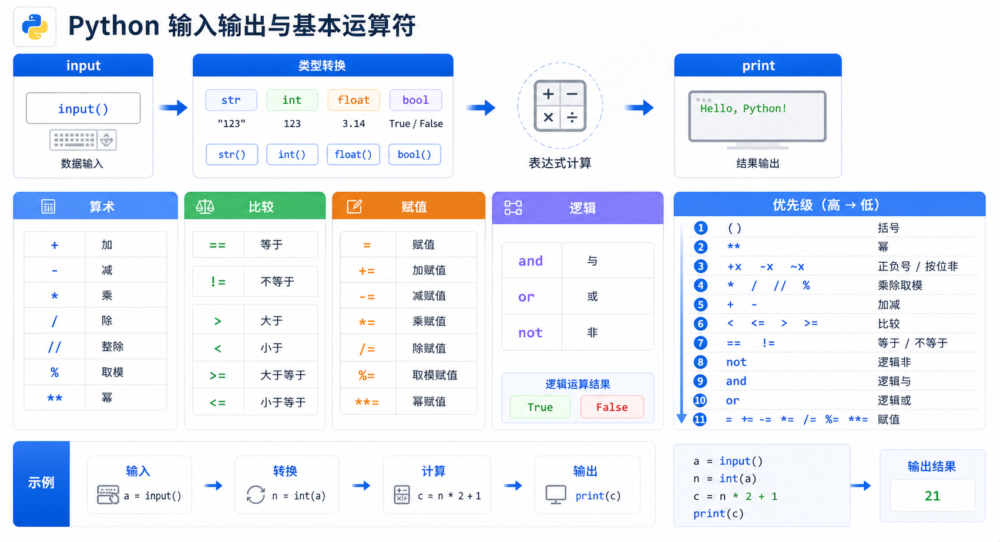

> Python 中的输入输出和基本运算符是编程的基础。本文将详细介绍 input() 和 print() 的使用，以及算术运算、比较运算、赋值运算和逻辑运算等基本运算符。



## 输入与输出

### input() 函数

在 Python 3 中，`input()` 会将用户输入的任何内容都存成 `str` 类型。

<!-- snippet: id=python-input-output-basic-operators-01 mode=compile python=3.12-3.14 deps=stdlib -->
```python
name = input("请输入您的用户名: ")     # name = "egon"
pwd = input("请输入您的密码: ")         # pwd = '123'

if name == 'egon' and pwd == '123':
    print('登陆成功')
else:
    print('用户名或者密码输错了')
```

### 输入转换与失败路径

Python 3.12–3.14 的 `input()` 始终返回字符串。需要数值时显式转换，并捕获转换失败；不要执行用户输入。

<!-- snippet: id=python-input-validated-conversion mode=run python=3.12-3.14 deps=stdlib -->
```python
raw = "18"
try:
    age = int(raw)
except ValueError as exc:
    raise ValueError("age must be an integer") from exc
assert age == 18
```

## 基本运算符

### 1. 算术运算

<!-- snippet: id=python-input-output-basic-operators-03 mode=compile python=3.12-3.14 deps=stdlib -->
```python
# 基本算术运算
print(10 + 1.1)      # 加法
print(10 / 3)        # 除法：有整数部分有余数部分
print(10 // 3)        # 整除：去掉小数部分
print(10 % 3)         # 取余
print(2 ** 3)         # 幂运算：2的3次方
```

### 2. 比较运算

比较运算只能在同类型之间进行，其中 `int` 与 `float` 同属于数字类型。

<!-- snippet: id=python-input-output-basic-operators-04 mode=compile python=3.12-3.14 deps=stdlib -->
```python
print(10 > 3.1)   # True
print(10 >= 10)   # True

# 字符串按 Unicode 码点逐项进行字典序比较
msg1 = 'abcdefg'
msg2 = 'abce'
print(msg2 > msg1)  # True（按字符逐个比较）

# 列表比较
list1 = ['a', 1, 'b']
list2 = ['a', 2]
list3 = ['a', 'b']
list4 = ['c', 'b']
print(list4 > list1)  # True（'c' > 'a'）
```

### 3. 赋值运算

#### 增量赋值

<!-- snippet: id=python-input-output-basic-operators-05 mode=compile python=3.12-3.14 deps=stdlib -->
```python
age = 18
age = age + 1
age += 1  # age = age + 1
print(age)  # 20
```

#### 链式赋值

<!-- snippet: id=python-input-output-basic-operators-06 mode=compile python=3.12-3.14 deps=stdlib -->
```python
x = 10
y = x
print(x is y)  # True

a = b = c = d = e = 111  # 链式赋值
print(a is b is c is d is e)  # True
```

#### 交叉赋值

<!-- snippet: id=python-input-output-basic-operators-07 mode=compile python=3.12-3.14 deps=stdlib -->
```python
x = 10
y = 20

# 传统方式
temp = x
x = y
y = temp

# Python 方式（更简洁）
x, y = y, x
print(x, y)  # 20 10
```

#### 解压赋值

<!-- snippet: id=python-input-output-basic-operators-08 mode=compile python=3.12-3.14 deps=stdlib -->
```python
nums = [1, 2, 3, 4, 5]

# 传统方式
a = nums[0]
b = nums[1]
c = nums[2]
d = nums[3]
e = nums[4]

# 解压赋值
a, b, c, d, e = nums
print(a, b, c, d, e)  # 1 2 3 4 5

# 使用下划线忽略某些值
a, b, c, _, _ = nums  # 变量和_等于5个，对应列表五个元素
print(a, b, c)  # 1 2 3

# 使用 * 接收剩余值
a, b, *_ = nums  # 只要列表的前两个值
print(a, b)  # 1 2
```

### 4. 逻辑运算

#### and（与）

`and` 连接左右两个条件，两个条件必须都成立，最后结果才为 `True`。一旦左边条件为假则最终结果就为假，没有必要再去计算右面条件的值。

<!-- snippet: id=python-input-output-basic-operators-09 mode=compile python=3.12-3.14 deps=stdlib -->
```python
print(1 > 2 and 3 > 1)  # False（左边为 False）
```

#### or（或）

`or` 连接左右两个条件，两个条件但凡有一个成立，结果就为 `True`。一旦左边条件为 `True` 则最终结果就为 `True`。

<!-- snippet: id=python-input-output-basic-operators-10 mode=compile python=3.12-3.14 deps=stdlib -->
```python
print(3 > 1 or 1 > 2)  # True（左边为 True）
```

#### not（非）

`not` 用于取反。

<!-- snippet: id=python-input-output-basic-operators-11 mode=compile python=3.12-3.14 deps=stdlib -->
```python
print(not 1 > 2)  # True
print(not 1 > 2 or 3 > 1)  # True
print((True and (False or True)) or (False and True))  # True
```

## Python 运算符优先级

以下运算符优先级顺序依次递增（从低到高）：

| 优先级 | 运算符 | 说明 |
|--------|--------|------|
| 最低 | `lambda` | Lambda 表达式 |
| ... | `or` | 逻辑运算符 |
| ... | `and` | 逻辑运算符 |
| ... | `not x` | 逻辑运算符 |
| ... | `in`, `not in` | 成员测试 |
| ... | `is`, `is not` | 同一性测试 |
| ... | `<`, `<=`, `>`, `>=`, `!=`, `==` | 比较 |
| ... | `\|` | 按位或 |
| ... | `^` | 按位异或 |
| ... | `&` | 按位与 |
| ... | `<<`, `>>` | 移位 |
| ... | `+`, `-` | 加法、减法 |
| ... | `*`, `/`, `%` | 乘法、除法、取余 |
| 最高 | `+x`, `-x` | 正负号 |

> **记忆技巧**：记住"**运算**"两个字，"运"（移位、按位）→ "算"（算术）→ "符"（逻辑）

## 小结

| 类别 | 运算符 | 说明 |
|------|--------|------|
| **算术运算** | `+`, `-`, `*`, `/`, `//`, `%`, `**` | 加减乘除、整除、取余、幂运算 |
| **比较运算** | `==`, `!=`, `<`, `>`, `<=`, `>=` | 等于、不等于、小于、大于等 |
| **赋值运算** | `=`, `+=`, `-=`, `*=`, `/=` 等 | 赋值和增量赋值 |
| **逻辑运算** | `and`, `or`, `not` | 与、或、非 |
| **位运算** | `&`, `\|`, `^`, `~`, `<<`, `>>` | 按位与、或、异或、取反、移位 |
| **成员运算** | `in`, `not in` | 是否在序列中 |
| **身份运算** | `is`, `is not` | 是否是同一对象 |

掌握这些基本运算符，可以帮助你进行各种数据操作和逻辑判断。
