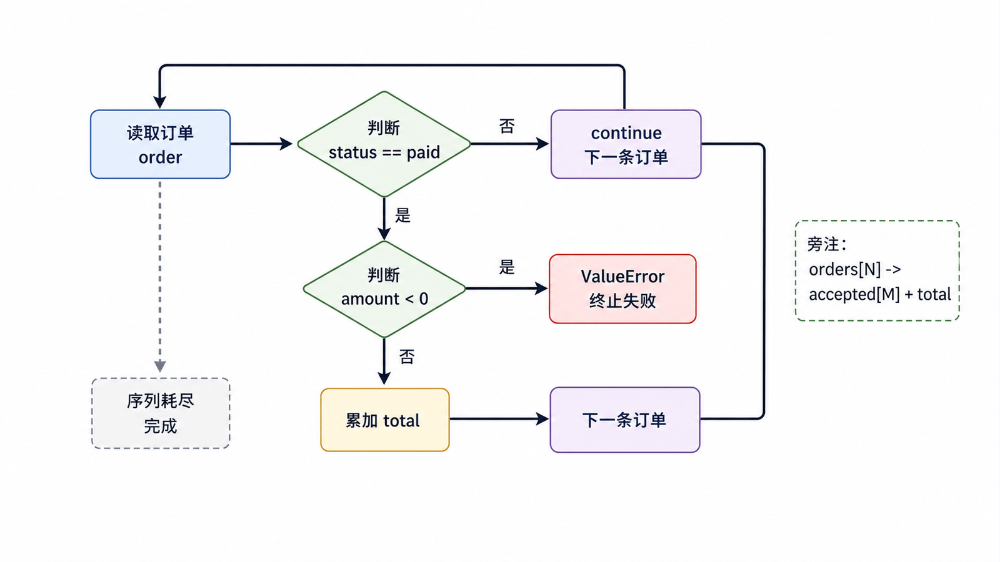
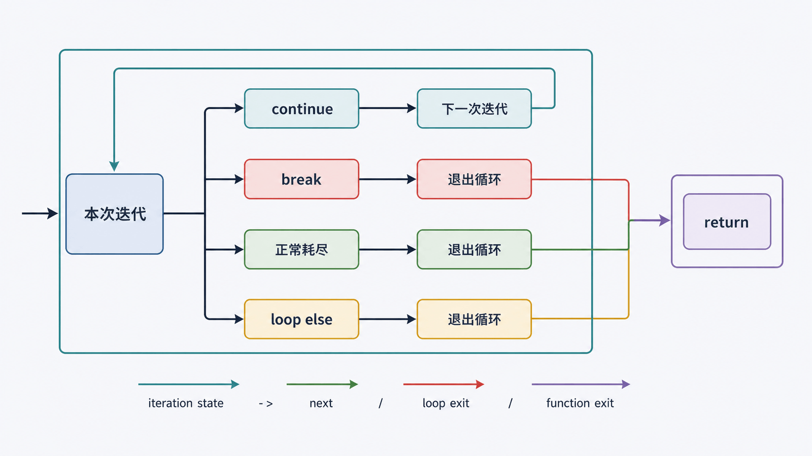

流程控制决定“下一条执行哪段代码”。最可靠的学习方式不是背语法，而是跟踪条件、当前元素、累计状态和退出原因。

## 前置知识与学习目标

你应会转换输入、比较数值并理解真值。学完后你应该能：

- 用互斥分支表达订单状态规则；
- 在“遍历已有数据”和“等待条件改变”之间选择 `for` 或 `while`；
- 准确预测 `break`、`continue` 和循环 `else`；
- 写出有终止条件、可验证输出的最小循环。

## 贯穿场景：筛选可结算订单

<!-- figure:s03-f01:start -->



<!-- figure:s03-f01:end -->

订单包含 `id`、`status` 和 `amount`。规则是：已支付且金额为正的订单进入汇总；取消订单跳过；发现负金额立即终止并报告数据损坏。

## if：只让一个业务分支生效

`if`/`elif`/`else` 是一条互斥链，按顺序测试，执行第一个为真的分支。多个独立 `if` 则可能执行多个分支。

<!-- snippet: id=python-order-status-branch mode=run python=3.12-3.14 deps=stdlib -->

```python
def classify(status: str) -> str:
    if status == "paid":
        return "可结算"
    if status in {"cancelled", "refunded"}:
        return "不计入"
    return "待处理"

assert classify("paid") == "可结算"
assert classify("pending") == "待处理"
```

若条件互斥，使用一条分支链可直接表达“最多选一个”；若检查项彼此独立，例如同时验证金额和状态，则可使用多个 `if` 收集全部问题。

## for：遍历一个可迭代对象

`for` 每次从迭代器取得一个元素，适合容器、文件行、`range()` 和生成器。需要索引时优先 `enumerate()`，同时遍历多组数据可用 `zip()`。

<!-- snippet: id=python-order-loop-state mode=run python=3.12-3.14 deps=stdlib -->

```python
from decimal import Decimal

orders = [
    {"id": "A001", "status": "paid", "amount": Decimal("19.90")},
    {"id": "A002", "status": "cancelled", "amount": Decimal("8.00")},
    {"id": "A003", "status": "paid", "amount": Decimal("30.10")},
]

total = Decimal("0")
accepted = []
for order in orders:
    if order["status"] != "paid":
        continue
    if order["amount"] < 0:
        raise ValueError(f"{order['id']} 金额为负")
    accepted.append(order["id"])
    total += order["amount"]

assert accepted == ["A001", "A003"]
assert total == Decimal("50.00")
```

`continue` 跳到下一次迭代；它不会退出循环。把状态更新遗漏在 `continue` 前是 `while` 无限循环的常见原因。

## while：直到条件改变

`while` 适合重试、读取直到哨兵值、轮询状态等“次数事先未知”的过程。循环必须有进展条件、最大尝试次数或超时。

<!-- snippet: id=python-bounded-retry-loop mode=run python=3.12-3.14 deps=stdlib -->

```python
responses = iter(["", "oops", "12"])
quantity = None

for attempt in range(1, 4):
    raw = next(responses)
    try:
        quantity = int(raw)
    except ValueError:
        continue
    if quantity >= 0:
        break
else:
    raise ValueError("三次输入均无效")

assert quantity == 12
assert attempt == 3
```

这里用有限 `for` 表达最多三次尝试，比 `while True` 更容易证明会终止。

## break、continue 与循环 else

<!-- figure:s03-f02:start -->



<!-- figure:s03-f02:end -->

- `break` 只退出最内层循环；
- `continue` 跳过本次剩余语句；
- 循环 `else` 在“没有执行 `break`”时运行，包括零次迭代；
- `return` 会直接离开整个函数，常比多层标志变量清晰。

循环 `else` 适合表达“找遍了仍未找到”或“所有尝试都失败”，不表示普通 `if` 的反面。

## 状态变化表

| 时刻 | `order.id` | 动作       | `accepted`    | `total` |
| ---- | ---------- | ---------- | ------------- | ------- |
| 初始 | —          | 初始化     | `[]`          | `0`     |
| 1    | A001       | 接受并累加 | `[A001]`      | `19.90` |
| 2    | A002       | `continue` | `[A001]`      | `19.90` |
| 3    | A003       | 接受并累加 | `[A001,A003]` | `50.00` |

把关键中间状态写出来，是定位“少算、重复算、无法退出”的最快方法。

## 常见误区与适用边界

- 修改正在遍历的列表可能跳过元素；通常遍历副本或构造新列表。
- `range(stop)` 不包含 `stop`；`range(3)` 产生 `0,1,2`。
- 不要用无限循环掩盖缺失的终止条件；网络轮询还需超时和退避。
- 深层嵌套会隐藏退出路径；可提取函数并用早返回简化。
- `match` 适合结构化模式匹配，但简单状态枚举用 `if` 已足够，本篇不展开。

## 自检题

1. 多个独立 `if` 与一条 `if`/`elif` 链的核心差异是什么？
2. `for ... else` 的 `else` 在什么情况下不执行？
3. 为什么“最多重试三次”通常更适合 `for range(3)` 而不是无界 `while True`？

<details>
<summary>参考答案</summary>

1. 多个 `if` 可命中多个分支；`if`/`elif` 链最多命中一个。
2. 循环体执行了 `break` 时不执行。
3. 最大次数直接编码在迭代范围中，更容易审查终止性；无界循环需要额外计数和退出逻辑。

</details>

## 本篇总结

分支表达选择，循环表达重复。选择结构时应先说清是否互斥、迭代对象是什么、状态怎样变化、以什么原因退出。

## 下一篇衔接

下一篇为订单的数字、文本、序列、映射和状态集合选择合适的数据类型，并用“顺序、可变性、唯一性、键访问”解释容器边界。

## 资料来源

- [Python 教程：流程控制](https://docs.python.org/3.14/tutorial/controlflow.html)
- [Python 语言参考：复合语句](https://docs.python.org/3.14/reference/compound_stmts.html)
- [Python 教程：循环技巧](https://docs.python.org/3.14/tutorial/datastructures.html#looping-techniques)
