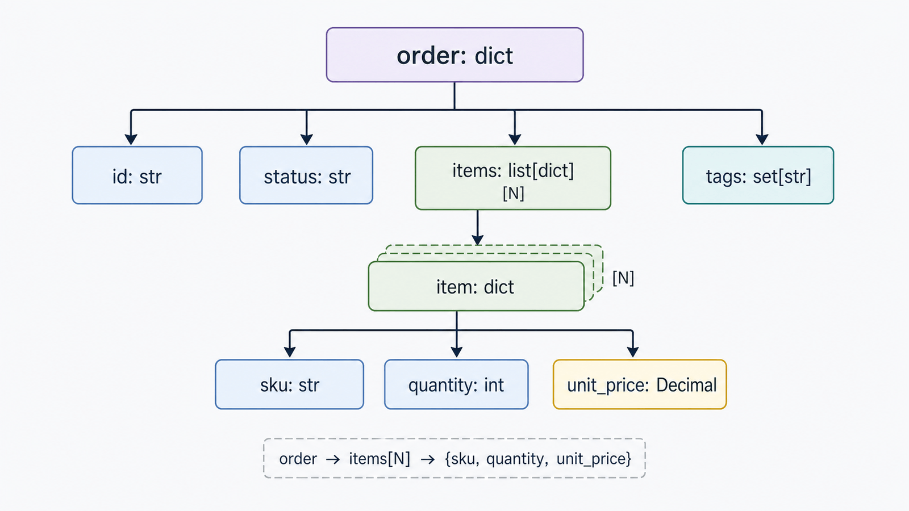
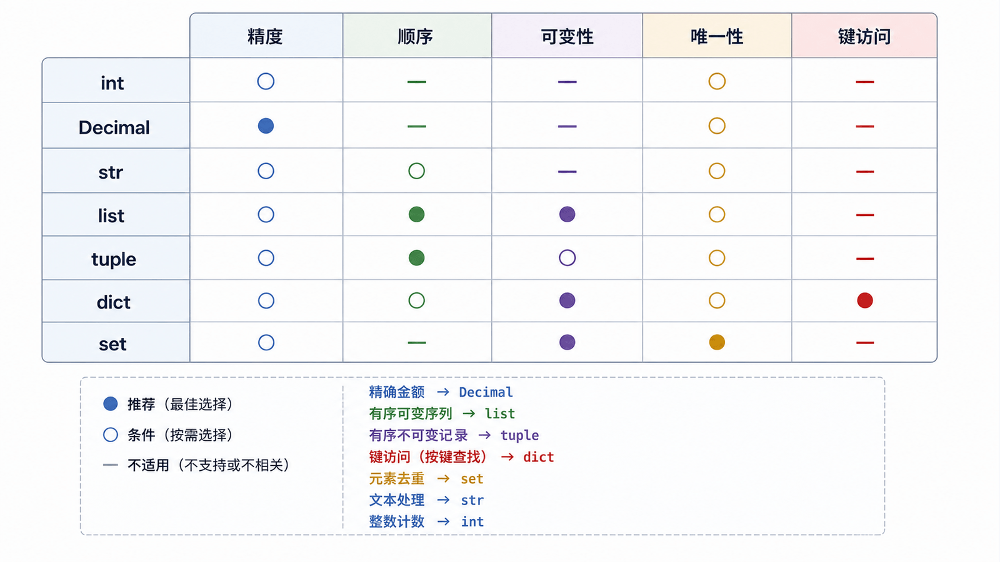

选择数据类型是在声明约束：是否保序、能否修改、是否需要按键查找、是否允许重复，以及数值是否必须精确。方法清单会遗忘，这些选择维度可以迁移到新场景。

## 前置知识与学习目标

你应会使用变量、运算符、分支和循环。学完后你应该能：

- 按业务约束选择 `int`、`Decimal`、`str` 和容器；
- 区分可变、不可变、可哈希与保持插入顺序；
- 预测常见方法是原地修改还是返回新对象；
- 用一条订单记录解释嵌套数据的 Shape。

## 订单数据的 Shape

<!-- figure:s04-f01:start -->



<!-- figure:s04-f01:end -->

本系列统一使用如下最小结构：

<!-- snippet: id=python-order-data-shape mode=run python=3.12-3.14 deps=stdlib -->

```python
from decimal import Decimal

order = {
    "id": "A001",
    "customer": "Ada",
    "status": "paid",
    "items": [
        {"sku": "PEN", "quantity": 2, "unit_price": Decimal("3.50")},
        {"sku": "BOOK", "quantity": 1, "unit_price": Decimal("19.90")},
    ],
    "tags": {"new", "gift"},
}

total = sum(
    item["quantity"] * item["unit_price"] for item in order["items"]
)
assert total == Decimal("26.90")
```

可以把 Shape 写成：`order: dict[str, object]`，其中 `items: list[dict]`、`tags: set[str]`。Python 运行时不强制这个注解，但清楚的结构能让输入校验和函数接口更可靠。

## 数值：范围、精度与语义

- `int` 表示任意精度整数，适合数量和计数；
- `float` 是二进制浮点数，适合科学计算和允许近似的测量；
- `Decimal` 属于标准库，适合按十进制规则计算金额；
- `bool` 是 `int` 的子类，但业务上应作为状态而非数量使用。

<!-- snippet: id=python-decimal-boundary mode=run python=3.12-3.14 deps=stdlib -->

```python
from decimal import Decimal

assert 0.1 + 0.2 != 0.3
assert Decimal("0.1") + Decimal("0.2") == Decimal("0.3")
```

不要从 `float` 构造金额 `Decimal(0.1)`，因为误差已经进入；从字符串构造更可控。

## 文本与二进制

`str` 是 Unicode 文本，`bytes` 是字节序列。`str` 不可变，因此 `replace()`、`strip()`、`lower()` 都返回新字符串。文本与字节的转换属于第 6 篇的编码边界。

<!-- snippet: id=python-string-method-result mode=run python=3.12-3.14 deps=stdlib -->

```python
raw = "  A001,paid  "
clean = raw.strip().lower()
order_id, status = clean.split(",", maxsplit=1)
assert raw == "  A001,paid  "
assert (order_id, status) == ("a001", "paid")
```

`strip(chars)` 把 `chars` 当“字符集合”，不是删除固定前后缀；固定前后缀使用 `removeprefix()` 和 `removesuffix()`。

## list 与 tuple：有序序列

`list` 可变，适合会增删改的同类元素序列；`tuple` 不可变，适合固定位置记录或不可变返回值。二者都保序、支持索引和切片。

常用列表方法中，`append`、`extend`、`sort`、`reverse` 原地修改并返回 `None`；`sorted(iterable)` 返回新列表。

<!-- snippet: id=python-list-mutation-contract mode=run python=3.12-3.14 deps=stdlib -->

```python
amounts = [30, 10, 20]
result = amounts.sort()
assert result is None
assert amounts == [10, 20, 30]

coordinates = (120.1, 30.2)
longitude, latitude = coordinates
assert latitude == 30.2
```

队列从列表头部 `pop(0)` 的成本高；大量先进先出操作应使用 `collections.deque`，第 14 篇介绍。

## dict：按键访问且保持插入顺序

字典是可变映射；从 Python 3.7 起，插入顺序是语言保证。键必须可哈希，常见键包括字符串、数字和只包含可哈希元素的元组。`get()` 适合缺失时有默认值的读取；必须存在的键直接用 `[]`，让 `KeyError` 暴露数据缺口。

<!-- snippet: id=python-dict-access-contract mode=run python=3.12-3.14 deps=stdlib -->

```python
order = {"id": "A001", "status": "paid"}
assert order["id"] == "A001"
assert order.get("coupon") is None

order.setdefault("tags", []).append("new")
assert order["tags"] == ["new"]
```

`setdefault()` 会把默认对象存入字典，复杂更新用显式分支通常更清楚。

## set 与 frozenset：唯一性和集合关系

`set` 可变、无索引、元素唯一，本身不可哈希；`frozenset` 不可变且在元素均可哈希时可哈希。不要依赖集合的显示顺序。

<!-- snippet: id=python-set-relations mode=run python=3.12-3.14 deps=stdlib -->

```python
required = {"id", "status", "items"}
received = {"id", "status", "items", "coupon"}

missing = required - received
extra = received - required
assert missing == set()
assert extra == {"coupon"}
assert required <= received
```

## 类型选择矩阵

<!-- figure:s04-f02:start -->



<!-- figure:s04-f02:end -->

| 需求           | 首选      | 关键边界                         |
| -------------- | --------- | -------------------------------- |
| 计数、索引     | `int`     | 不用于表达缺失值                 |
| 十进制金额     | `Decimal` | 从字符串构造，统一舍入规则       |
| 文本           | `str`     | 不可变；不是原始字节             |
| 可变有序集合   | `list`    | 查找成员通常为线性成本           |
| 固定有序记录   | `tuple`   | 内含可变对象时整体未必可哈希     |
| 键值记录       | `dict`    | 保持插入顺序，但按键而非位置建模 |
| 去重与集合运算 | `set`     | 无稳定索引，本身不可哈希         |

## 常见误区与适用边界

- “不可变”不等于“内部永远不含可变对象”；含列表的元组仍不可哈希。
- `dict` 保持插入顺序，但若业务依赖排序规则，应显式 `sorted()`。
- 集合适合成员和关系运算，不适合需要重复计数的序列。
- 不要把所有数据塞进一个深层字典；稳定业务模型可进一步使用 `dataclass`，本基础系列不展开。
- 方法链前先确认返回值；原地方法通常返回 `None`。

## 自检题

1. 为什么金额示例使用 `Decimal("19.90")` 而不是 `Decimal(19.90)`？
2. `set` 能否作为字典键？`frozenset` 呢？
3. 为什么 `items.sort()` 不能直接赋给 `sorted_items`？

<details>
<summary>参考答案</summary>

1. 字符串精确保留十进制输入；`float` 近似值会把误差带入 `Decimal`。
2. `set` 不可哈希，不能；元素可哈希的 `frozenset` 可以。
3. `list.sort()` 原地排序并返回 `None`；需要新列表应使用 `sorted(items)`。

</details>

## 本篇总结

类型是约束的载体。先判断精度、顺序、可变性、唯一性和访问方式，再选择类型与方法，比按“常用 API 清单”学习更可靠。

## 下一篇衔接

下一篇把订单金额和状态渲染成人类可读报告，统一讲解 f-string、格式说明迷你语言、`repr` 调试表示以及不应使用字符串拼接的边界。

## 资料来源

- [Python 标准类型](https://docs.python.org/3.14/library/stdtypes.html)
- [Python 教程：数据结构](https://docs.python.org/3.14/tutorial/datastructures.html)
- [decimal：十进制定点与浮点运算](https://docs.python.org/3.14/library/decimal.html)
