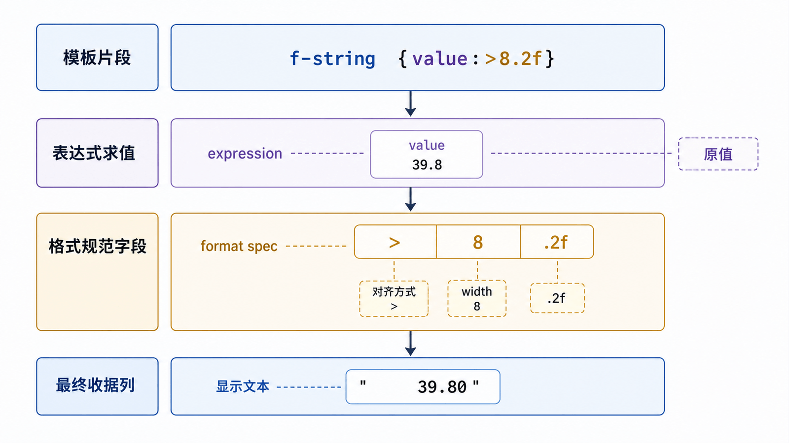

字符串格式化的核心不是三套语法，而是把“值”和“显示规则”分离：值参与计算，格式只决定它如何被人看到。

## 前置知识与学习目标

你应理解字符串不可变、数值类型和订单 Shape。学完后你应该能：

- 优先用 f-string 生成局部、可读的文本；
- 读懂格式规范 `[[fill]align][sign][width][grouping][.precision][type]`；
- 区分 `str()`、`repr()` 与 `!s`、`!r`；
- 在日志、模板和不可信输入场景选择安全方案。

## 贯穿示例：渲染订单收据

<!-- figure:s05-f01:start -->



<!-- figure:s05-f01:end -->

<!-- snippet: id=python-format-order-receipt mode=run python=3.12-3.14 deps=stdlib -->

```python
from decimal import Decimal

order_id = "A001"
quantity = 2
unit_price = Decimal("19.90")
total = quantity * unit_price

line = f"{order_id:<8} {quantity:>3d} × {unit_price:>8.2f} = {total:>8.2f}"
assert line == "A001       2 ×    19.90 =    39.80"
```

花括号左侧是表达式，冒号右侧是格式规范。`<` 左对齐、`>` 右对齐、`^` 居中；宽度是最小宽度，不会截断超长内容；`.2f` 表示固定两位小数。

## f-string：局部值的首选

f-string 可直接引用变量和表达式，适合值就在附近的代码。常用示例：

<!-- snippet: id=python-fstring-format-spec mode=run python=3.12-3.14 deps=stdlib -->

```python
ratio = 19 / 22
count = 1234567
value = 42

assert f"{ratio:.2%}" == "86.36%"
assert f"{count:,d}" == "1,234,567"
assert f"{value:#010x}" == "0x0000002a"
assert f"{{literal}}" == "{literal}"
```

动态宽度和精度可嵌套：`f"{value:{width}.{precision}f}"`。格式化发生在字符串构造时，不会改变原值。

## str.format()：模板与数据分离

模板由配置或复用函数持有、值稍后传入时，`str.format()` 仍很实用。

<!-- snippet: id=python-format-template mode=run python=3.12-3.14 deps=stdlib -->

```python
template = "订单 {id}：{total:.2f} 元"
text = template.format(id="A001", total=39.8)
assert text == "订单 A001：39.80 元"
```

不要让不可信用户控制 `format` 模板；字段访问可能暴露对象属性。面向用户的简单占位模板可考虑 `string.Template`，并对允许的变量做白名单校验。

## 百分号格式化：兼容旧代码与日志

`%s`、`%d`、`%.2f` 常见于旧代码。新业务文本通常用 f-string，但 `logging` 推荐把模板和参数分开：

<!-- snippet: id=python-logging-lazy-format mode=compile python=3.12-3.14 deps=stdlib -->

```python
import logging

logger = logging.getLogger(__name__)
order_id = "A001"
total = 39.8
logger.info("order=%s total=%.2f", order_id, total)
```

日志系统只在该级别启用时执行格式化，也能保留模板与参数结构。不要先写 `logger.debug(f"...")` 处理昂贵表达式。

## 转换标志与调试输出

`!s` 调用 `str()`，偏向用户阅读；`!r` 调用 `repr()`，偏向调试并暴露引号、转义等信息；`!a` 使用 ASCII 转义表示。

<!-- snippet: id=python-format-conversions mode=run python=3.12-3.14 deps=stdlib -->

```python
status = "已支付\n"
assert f"{status!s}" == "已支付\n"
assert f"{status!r}" == "'已支付\\n'"
```

调试语法 `f"{variable=}"` 很方便，但不要把密码、令牌或个人信息写入日志。

## 格式不是数据协议

人类可读收据可以对齐和本地化；程序间交换应使用 JSON/CSV 等明确格式。不要用字符串拼接构造 SQL、Shell 命令或 HTML：它们各有专用参数化与转义机制。

## 常见误区与适用边界

- `.2f` 是显示舍入，不替代业务金额的舍入政策。
- 显示宽度按代码点近似，不保证中英文在所有终端视觉等宽。
- f-string 表达式会执行；不要把外部文本当成待求值的 f-string。
- `%u` 在 Python 中不提供真正的无符号整数语义。
- 日期时间对象支持自身格式规范，但时区问题应先在数据层解决。

## 自检题

1. `:.2f` 会修改原始数值吗？
2. 为什么日志中推荐 `logger.info("id=%s", order_id)`？
3. 外部用户提供完整格式模板时，为什么不能直接对任意对象调用 `.format()`？

<details>
<summary>参考答案</summary>

1. 不会，它只决定字符串表示。
2. 日志级别关闭时可避免不必要的格式化，并保留模板与参数。
3. 格式字段可以访问属性或下标，可能暴露不应公开的数据；应限制模板能力和变量集合。

</details>

## 本篇总结

新代码优先用 f-string，复用模板可用 `str.format()`，旧代码和日志需要读懂 `%`。先保证数据正确，再决定对齐、精度和表示形式。

## 下一篇衔接

下一篇把收据写入 UTF‑8 文件：区分 `str` 与 `bytes`、编码与解码、文本与二进制模式、上下文管理、换行和原子替换。

## 资料来源

- [Python 教程：格式化输出](https://docs.python.org/3.14/tutorial/inputoutput.html#fancier-output-formatting)
- [格式规范迷你语言](https://docs.python.org/3.14/library/string.html#formatspec)
- [logging：优化与格式化](https://docs.python.org/3.14/howto/logging.html)
