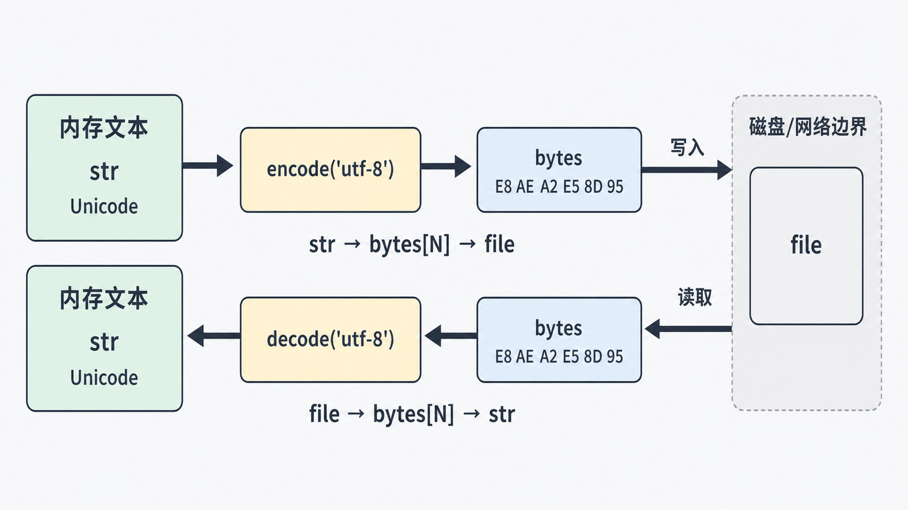
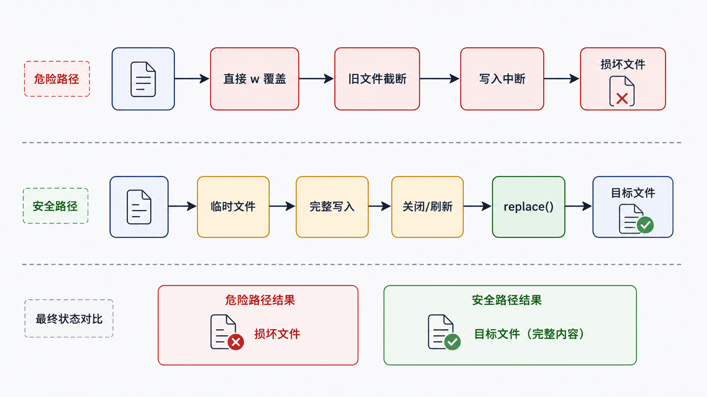

乱码通常不是“中文问题”，而是边界两端对同一组字节采用了不同编码。文件损坏则常来自写入中断、模式选错或路径假设错误。

## 前置知识与学习目标

你应理解 `str`、`bytes` 和字符串格式化。学完后你应该能：

- 解释 Unicode 码点、UTF‑8 字节与编解码方向；
- 正确选择文本/二进制模式和 `r/w/a/x`；
- 用 `with`、`pathlib` 和流式迭代安全处理文件；
- 识别覆盖写、路径穿越、编码失败和部分写入边界。

## 文本与字节的唯一转换方向

<!-- figure:s06-f01:start -->



<!-- figure:s06-f01:end -->

Python 的 `str` 表示 Unicode 文本，`bytes` 表示原始字节：

`str --encode(encoding)--> bytes --decode(encoding)--> str`

<!-- snippet: id=python-unicode-roundtrip mode=run python=3.12-3.14 deps=stdlib -->

```python
text = "订单 A001：39.80 元"
payload = text.encode("utf-8")

assert isinstance(text, str)
assert isinstance(payload, bytes)
assert payload.decode("utf-8") == text
```

Unicode 为字符分配码点；UTF‑8 是把码点编码为 1–4 个字节的方案。Unicode 不是“固定两字节编码”，UTF‑8 也不是对 Unicode 的简单压缩。

## 文本文件边界

文本模式负责把文件字节按 `encoding` 解码为 `str`，写入时反向编码。二进制模式直接读写 `bytes`，不能传 `encoding`。

<!-- snippet: id=python-file-roundtrip mode=run python=3.12-3.14 deps=stdlib -->

```python
from pathlib import Path
from tempfile import TemporaryDirectory

with TemporaryDirectory() as tmp:
    path = Path(tmp) / "report.txt"
    path.write_text("订单 A001\n", encoding="utf-8", newline="\n")
    assert path.read_text(encoding="utf-8") == "订单 A001\n"
```

显式写 `encoding="utf-8"` 能避免不同系统默认编码造成差异。`errors="strict"` 是默认且通常最安全；只有协议明确允许时才用 `replace` 等容错策略，并记录数据损失。

## 文件模式是一份破坏性合同

| 模式 | 不存在     | 已存在   | 主要风险           |
| ---- | ---------- | -------- | ------------------ |
| `r`  | 报错       | 从头读   | 编码或权限失败     |
| `w`  | 创建       | 立即截断 | 误覆盖             |
| `a`  | 创建       | 追加     | 重复写入、并发交错 |
| `x`  | 创建       | 报错     | 适合防止意外覆盖   |
| `b`  | 与上述组合 | 读写字节 | 调用者负责格式     |

`+` 表示同时读写，但文件指针和缓冲行为更难推理；能分开读写时优先分开。

## 流式读取与文件指针

大文件不要无条件 `read()` 到内存。文本文件可逐行迭代；二进制文件可固定块读取。文本流中的 `tell()` 返回可用于同一流 `seek()` 的不透明位置，不应把它简单理解为字符索引。

<!-- snippet: id=python-stream-lines mode=run python=3.12-3.14 deps=stdlib -->

```python
from io import StringIO

stream = StringIO("A001,paid\n\nA002,cancelled\n")
rows = [line.rstrip("\n") for line in stream if line.strip()]
assert rows == ["A001,paid", "A002,cancelled"]
```

这里只移除换行，避免 `strip()` 意外删掉业务需要的首尾空格。

## 原子写入：先完整生成，再替换

<!-- figure:s06-f02:start -->



<!-- figure:s06-f02:end -->

重要文件不应直接用 `w` 覆盖。先在同一目录写临时文件、刷新并关闭，再用 `Path.replace()` 替换目标；同一文件系统中的替换通常具有原子性，但持久化保证仍取决于操作系统和文件系统。

<!-- snippet: id=python-atomic-text-replace mode=run python=3.12-3.14 deps=stdlib -->

```python
from pathlib import Path
from tempfile import TemporaryDirectory

with TemporaryDirectory() as tmp:
    root = Path(tmp)
    target = root / "report.txt"
    temporary = root / "report.txt.tmp"
    temporary.write_text("complete\n", encoding="utf-8", newline="\n")
    temporary.replace(target)
    assert target.read_text(encoding="utf-8") == "complete\n"
```

## 路径与信任边界

不要把用户输入直接拼到目标路径后写文件。先解析根目录与候选路径，再验证候选仍位于允许根目录；符号链接、竞态和权限要求更高时，应使用操作系统级安全接口或隔离目录。

## 常见误区与适用边界

- Python 3 源码默认 UTF‑8，但这不决定你读写的业务文件编码。
- `b"中文"` 不是合法的非 ASCII bytes 字面量；先写字符串再编码。
- `with` 保证离开块时关闭文件，但不会自动保证业务数据正确或写入原子性。
- `a` 不能自动防止重复记录；重试写入需要幂等 ID。
- `newline` 和平台换行会影响 CSV 等协议，应按格式规范设置。

## 自检题

1. 从网络收到 `bytes` 后要得到文本，应调用 `encode` 还是 `decode`？
2. 为什么重要配置不宜直接用 `open(path, "w")` 更新？
3. 文本模式下 `seek(3)` 为什么不能理解成“跳到第 4 个 Unicode 字符”？

<details>
<summary>参考答案</summary>

1. 调用 `bytes.decode(encoding)`。
2. `w` 会先截断旧文件，中途失败可能只剩部分内容；应先写临时文件再替换。
3. 编码是变长的，文本流还包含解码缓冲；只有 `tell()` 返回的位置才适合作为同一流的安全 `seek()` 位置。

</details>

## 本篇总结

文本和字节只在明确编码边界转换；文件模式决定读取、创建、截断或追加行为。可靠文件处理还需要显式编码、上下文管理、流式读取、路径验证和原子替换。

## 下一篇衔接

下一篇解释变量名如何绑定对象、可变对象为何会共享变化，以及赋值、浅拷贝和深拷贝分别复制了什么。

## 资料来源

- [Python Unicode 指南](https://docs.python.org/3.14/howto/unicode.html)
- [Python 教程：读写文件](https://docs.python.org/3.14/tutorial/inputoutput.html#reading-and-writing-files)
- [io：文本与二进制 I/O](https://docs.python.org/3.14/library/io.html)
