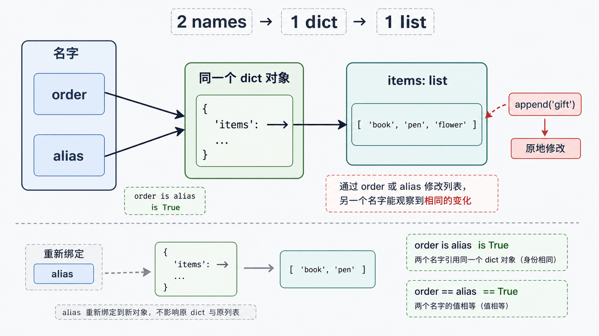
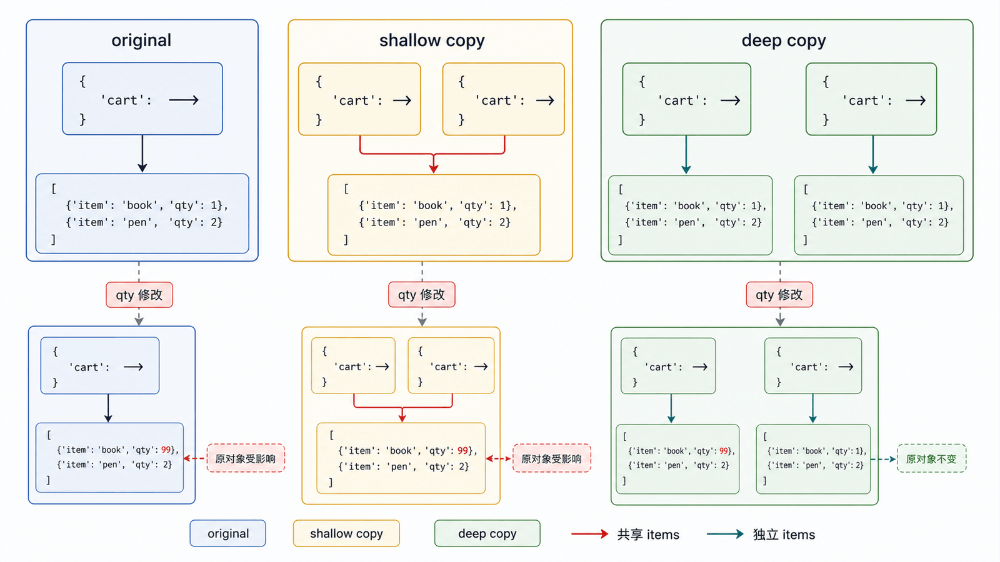

Python 变量更准确地说是“名字”。赋值把名字绑定到对象；它既不会自动复制对象，也不等同于 C 指针运算。

## 前置知识与学习目标

你应理解可变与不可变类型。学完后你应该能：

- 画出赋值后名字与对象的引用关系；
- 区分重新绑定与原地修改；
- 预测浅拷贝、深拷贝对嵌套对象的影响；
- 避免依赖整数缓存、字符串驻留和引用计数等实现细节。

## 赋值不复制对象

<!-- figure:s07-f01:start -->



<!-- figure:s07-f01:end -->

<!-- snippet: id=python-name-binding-alias mode=run python=3.12-3.14 deps=stdlib -->

```python
order = {"id": "A001", "tags": ["new"]}
alias = order

alias["tags"].append("gift")
assert order["tags"] == ["new", "gift"]
assert alias is order
```

两个名字指向同一个字典；修改对象会从两个名字观察到。若写 `alias = {"id": "A002"}`，只是让 `alias` 重新绑定，新字典不会改变 `order`。

## 相等与身份

`==` 由对象的相等协议比较值；`is` 比较身份。业务内容比较用 `==`，单例哨兵用 `is None`。`id()` 在对象存活期间唯一，但不要把它当持久内存地址。

不要编写 `1000 is 1000` 或字符串 `is` 示例来推断缓存规则。常量折叠、驻留和小整数复用随实现和上下文变化。

## 浅拷贝只复制最外层容器

<!-- figure:s07-f02:start -->



<!-- figure:s07-f02:end -->

<!-- snippet: id=python-shallow-copy-graph mode=run python=3.12-3.14 deps=stdlib -->

```python
from copy import copy

original = {"id": "A001", "items": [{"sku": "PEN", "qty": 1}]}
shallow = copy(original)

assert shallow is not original
assert shallow["items"] is original["items"]

shallow["items"][0]["qty"] = 2
assert original["items"][0]["qty"] == 2
```

`dict.copy()`、列表切片和 `list(existing)` 都是常见浅拷贝：新建外层容器，但复用其中元素的引用。

## 深拷贝递归复制可复制部分

<!-- snippet: id=python-deep-copy-graph mode=run python=3.12-3.14 deps=stdlib -->

```python
from copy import deepcopy

original = {"items": [{"sku": "PEN", "qty": 1}]}
detached = deepcopy(original)
detached["items"][0]["qty"] = 2

assert original["items"][0]["qty"] == 1
assert detached["items"] is not original["items"]
```

`deepcopy` 使用记忆表处理共享关系和循环引用，但并非“所有层都得到全新对象”：函数、类等会原样返回，对象也可自定义复制行为。大型对象图深拷贝昂贵且可能复制了本应共享的资源。

## 更好的工程选择

| 需求                   | 方法                                   |
| ---------------------- | -------------------------------------- |
| 只改外层键，不改嵌套值 | 浅拷贝后更新                           |
| 需要独立的可变嵌套快照 | 受控 `deepcopy`，并写行为测试          |
| 只更新少量嵌套字段     | 显式重建受影响路径                     |
| 跨进程或持久化         | 使用序列化协议，不把 `deepcopy` 当协议 |

不可变数据、明确的数据类和纯函数通常比随处深拷贝更容易推理。

## 生命周期与垃圾回收边界

CPython 主要使用引用计数，并用循环垃圾回收器处理部分引用环；其他 Python 实现可以采用不同策略。不要依赖对象在某一行后立刻销毁。文件和锁等资源必须使用 `with` 或显式关闭。

## 常见误区与适用边界

- “参数按引用传递”容易误导；更准确是调用时把形参绑定到实参对象，第 8 篇展开。
- 不可变对象“修改”实际创建新对象并重新绑定名字。
- 深拷贝不是撤销系统，也不适合复制数据库连接、文件句柄和线程锁。
- 常量名全大写只是约定，Python 不会阻止重新绑定。
- LEGB 属于名称查找，集中放到第 9 篇，不与对象拷贝混讲。

## 自检题

1. `b = a` 后修改列表 `b.append(1)`，为什么 `a` 也变化？
2. 浅拷贝字典后修改嵌套列表，原字典为何仍受影响？
3. 为什么不能依赖 `id()` 是可长期保存的内存地址？

<details>
<summary>参考答案</summary>

1. 两个名字绑定同一个列表对象。
2. 浅拷贝只新建外层字典，嵌套列表引用被复用。
3. `id` 只在对象生命周期内唯一，对象销毁后可复用；不同实现也不保证它就是物理地址。

</details>

## 本篇总结

先画“名字—对象—嵌套对象”关系，再判断是重新绑定还是原地修改。浅拷贝复制外壳，深拷贝递归处理对象图；二者都应由实际隔离需求驱动。

## 下一篇衔接

下一篇把订单计算封装为函数，解释参数绑定、返回值、位置/关键字参数、`*args`/`**kwargs`、可变默认值以及清晰的函数合同。

## 资料来源

- [Python 数据模型：对象、值与类型](https://docs.python.org/3.14/reference/datamodel.html#objects-values-and-types)
- [copy：浅拷贝与深拷贝](https://docs.python.org/3.14/library/copy.html)
- [gc：垃圾回收接口](https://docs.python.org/3.14/library/gc.html)
