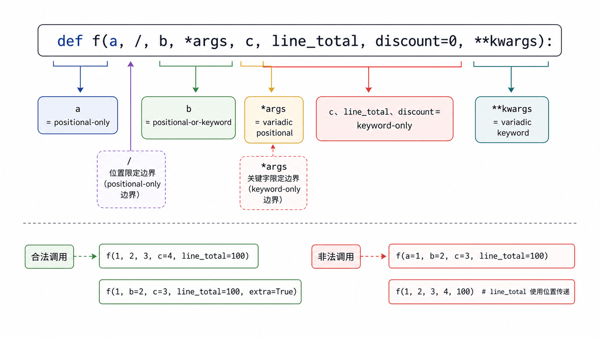
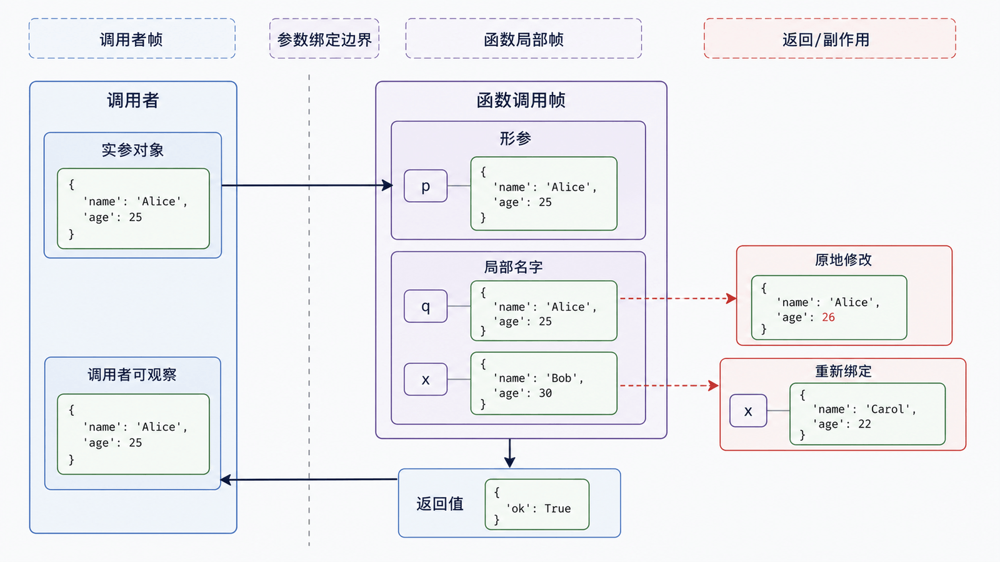

函数把一段变化隔离在清晰边界内。高质量函数首先是一份合同：接受什么、返回什么、可能失败什么、是否修改传入对象。

## 前置知识与学习目标

你应理解名字绑定、可变对象和异常信号。学完后你应该能：

- 写出输入、输出、副作用和失败边界明确的函数；
- 解释实参与形参如何绑定；
- 正确使用位置限定 `/`、关键字限定 `*`、`*args` 与 `**kwargs`；
- 避免共享可变默认值。

## 一个可验证的函数合同

<!-- figure:s08-f02:start -->



<!-- figure:s08-f02:end -->

<!-- snippet: id=python-function-contract mode=run python=3.12-3.14 deps=stdlib -->

```python
from decimal import Decimal

def line_total(
    quantity: int,
    unit_price: Decimal,
    /,
    *,
    discount: Decimal = Decimal("0"),
) -> Decimal:
    """返回一条订单明细的折后金额，不修改输入对象。"""
    if quantity < 0 or unit_price < 0:
        raise ValueError("数量和单价不能为负数")
    if not Decimal("0") <= discount <= Decimal("1"):
        raise ValueError("discount 必须在 [0, 1] 内")
    return quantity * unit_price * (Decimal("1") - discount)

assert line_total(2, Decimal("19.90"), discount=Decimal("0.1")) == Decimal("35.820")
```

`/` 前参数只能按位置传，`*` 后参数只能按关键字传。这能稳定 API：调用处清楚表达 `discount` 的语义。

## 调用时发生了什么

<!-- figure:s08-f01:start -->



<!-- figure:s08-f01:end -->

调用函数会创建新的执行帧，并按签名把实参对象绑定到局部形参名。重新绑定形参不影响调用者名字；通过形参原地修改共享的可变对象，则调用者可观察到变化。

<!-- snippet: id=python-parameter-binding mode=run python=3.12-3.14 deps=stdlib -->

```python
def rebind(items):
    items = []

def mutate(items):
    items.append("A001")

orders = []
rebind(orders)
assert orders == []
mutate(orders)
assert orders == ["A001"]
```

因此函数文档应明确是否修改参数，而不是用“传值/传引用”的二分口号代替对象图。

## 返回值与早返回

执行 `return value` 会立即结束函数；没有显式返回值时返回 `None`。逗号分隔的多个返回表达式会构成一个元组，可在调用处解包。

<!-- snippet: id=python-return-result-shape mode=run python=3.12-3.14 deps=stdlib -->

```python
def parse_status(text: str) -> tuple[bool, str]:
    status = text.strip().lower()
    if status not in {"paid", "cancelled"}:
        return False, "unknown status"
    return True, status

ok, value = parse_status(" PAID ")
assert (ok, value) == (True, "paid")
```

稳定接口中，复杂结果可使用命名元组或数据类；本篇先聚焦基本返回语义。

## 默认值只求值一次

默认参数在执行 `def` 时求值，并保存在函数对象上。可变默认对象会被多次调用共享。

<!-- snippet: id=python-safe-default-parameter mode=run python=3.12-3.14 deps=stdlib -->

```python
def add_order(order_id: str, bucket: list[str] | None = None) -> list[str]:
    if bucket is None:
        bucket = []
    bucket.append(order_id)
    return bucket

assert add_order("A001") == ["A001"]
assert add_order("A002") == ["A002"]
```

不可变默认值通常安全。若 `None` 本身是有效业务值，应使用私有哨兵对象区分“未传入”和“显式传 None”。

## 收集与解包参数

`*args` 把额外位置实参收集为元组，`**kwargs` 把额外关键字实参收集为字典；调用处的 `*iterable` 和 `**mapping` 执行解包。

<!-- snippet: id=python-args-kwargs-forward mode=run python=3.12-3.14 deps=stdlib -->

```python
def total(*amounts: int, scale: int = 1) -> int:
    return sum(amounts) * scale

values = [10, 20, 30]
options = {"scale": 2}
assert total(*values, **options) == 120
```

不要为了“以后扩展”无条件暴露 `**kwargs`，它会隐藏拼写错误和真实接口。包装器转发参数时才尤其有用。

## 类型注解与运行时校验

注解主要服务于读者和静态工具，默认不会阻止错误类型进入。外部输入仍需运行时解析与校验。函数应优先小而明确：复杂流程拆成“解析—验证—计算—渲染”。

## 常见误区与适用边界

- 返回值不必赋给变量才“生效”；未接收只是结果被丢弃。
- 不要用浅拷贝掩盖可变默认值，直接用 `None` 或哨兵表达生命周期。
- `*args`/`**kwargs` 是约定名，不是关键字，但遵循约定更易读。
- 函数内使用 `global` 会扩大隐式状态，本篇优先显式参数与返回值。
- 深浅拷贝由第 7 篇主责，本篇只说明参数是否被修改。

## 自检题

1. 为什么函数内 `param = []` 不会清空调用者的列表？
2. 为什么 `def f(items=[]): ...` 会跨调用共享状态？
3. `def f(x, /, *, verbose=False)` 对调用方式施加了什么约束？

<details>
<summary>参考答案</summary>

1. 它只把局部名字 `param` 重新绑定到新列表。
2. 默认列表在定义函数时只创建一次，并保存在函数对象上。
3. `x` 只能按位置传入，`verbose` 只能按关键字传入。

</details>

## 本篇总结

函数调用是对象到局部名字的绑定。可靠函数通过签名、校验、返回值和副作用说明建立合同；特殊参数用于约束调用方式，而不是增加炫技语法。

## 下一篇衔接

下一篇把函数视为对象，讲解高阶函数、LEGB、`global`/`nonlocal`、闭包捕获与循环中的晚绑定问题。

## 资料来源

- [Python 教程：定义函数](https://docs.python.org/3.14/tutorial/controlflow.html#defining-functions)
- [Python 教程：特殊参数](https://docs.python.org/3.14/tutorial/controlflow.html#special-parameters)
- [Python 语言参考：函数定义](https://docs.python.org/3.14/reference/compound_stmts.html#function-definitions)
