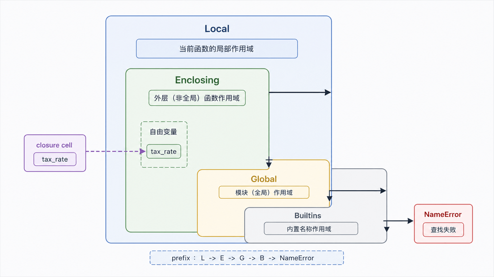
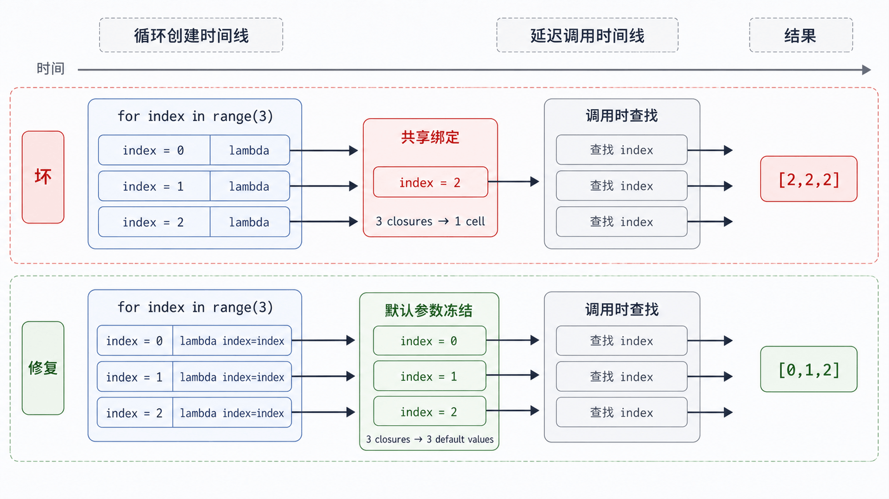

函数不仅能被调用，它本身也是对象：可以赋值、存入容器、作为参数传入，也可以从另一个函数返回。闭包则把函数与它需要的外围环境一起保留下来。

## 前置知识与学习目标

你应理解函数签名、参数绑定和可变对象。学完后你应该能：

- 把函数当作值构造小型处理流水线；
- 用 LEGB 解释名称从哪里解析；
- 用闭包封存只读配置或受控状态；
- 识别循环闭包晚绑定和滥用 `global` 的风险。

## 函数对象与高阶函数

<!-- snippet: id=python-higher-order-pipeline mode=run python=3.12-3.14 deps=stdlib -->

```python
def normalize_status(value: str) -> str:
    return value.strip().lower()

def validate_status(value: str) -> str:
    if value not in {"paid", "cancelled"}:
        raise ValueError(f"unknown status: {value}")
    return value

def pipe(value, *steps):
    for step in steps:
        value = step(value)
    return value

assert pipe(" PAID ", normalize_status, validate_status) == "paid"
```

接受函数或返回函数的函数称为高阶函数。`sorted(key=...)`、`map()`、`filter()` 都属于这一类。简单变换常用推导式更直观；当操作需要复用或组合时再提取函数。

## 名称空间与 LEGB

<!-- figure:s09-f01:start -->



<!-- figure:s09-f01:end -->

名字在使用位置按词法作用域查找：Local（当前函数）、Enclosing（外围函数）、Global（当前模块）、Builtins。查找关系由函数定义位置决定，不由调用位置决定。

<!-- snippet: id=python-legb-lookup mode=run python=3.12-3.14 deps=stdlib -->

```python
tax_rate = 0.13

def make_reporter():
    prefix = "订单"
    def report(order_id: str) -> str:
        return f"{prefix} {order_id}，税率 {tax_rate:.0%}"
    return report

report = make_reporter()
assert report("A001") == "订单 A001，税率 13%"
```

`prefix` 来自 Enclosing，`tax_rate` 来自 Global，`str`/`format` 等名称最终可来自 Builtins。不要用局部变量覆盖 `list`、`sum` 等内置名称。

## 闭包：函数与自由变量

<!-- snippet: id=python-closure-tax-calculator mode=run python=3.12-3.14 deps=stdlib -->

```python
from decimal import Decimal

def make_tax_calculator(rate: Decimal):
    if not Decimal("0") <= rate <= Decimal("1"):
        raise ValueError("rate 必须在 [0, 1]")
    def calculate(amount: Decimal) -> Decimal:
        return amount * rate
    return calculate

vat = make_tax_calculator(Decimal("0.13"))
assert vat(Decimal("100")) == Decimal("13.00")
assert vat.__closure__[0].cell_contents == Decimal("0.13")
```

`calculate` 使用的 `rate` 是自由变量。外层调用结束后，闭包单元仍保存它。这个模式适合少量配置；状态和行为复杂时，显式类通常更清晰。

## nonlocal 与受控状态

`nonlocal` 让内层函数重新绑定最近的外围函数变量；`global` 则指向模块级变量。二者都应谨慎，因为隐式状态会增加测试和并发难度。

<!-- snippet: id=python-nonlocal-counter mode=run python=3.12-3.14 deps=stdlib -->

```python
def make_counter():
    count = 0
    def increment() -> int:
        nonlocal count
        count += 1
        return count
    return increment

next_id = make_counter()
assert (next_id(), next_id()) == (1, 2)
```

这个计数器不是线程安全、进程安全或持久化 ID 生成器；它只用于解释闭包状态。

## 晚绑定陷阱

<!-- figure:s09-f02:start -->



<!-- figure:s09-f02:end -->

闭包在调用时查找自由变量，而不是在创建函数时复制当前值。因此循环中生成多个函数时，它们可能共享最后一个循环变量。

<!-- snippet: id=python-closure-late-binding mode=run python=3.12-3.14 deps=stdlib -->

```python
bad = [lambda: index for index in range(3)]
assert [fn() for fn in bad] == [2, 2, 2]

fixed = [lambda index=index: index for index in range(3)]
assert [fn() for fn in fixed] == [0, 1, 2]
```

默认参数在函数创建时求值，因此这里可冻结当前值。也可用 `functools.partial`，表达更明确。

## 常见误区与适用边界

- “嵌套函数”不自动等于闭包；必须引用外围非全局名字。
- `map()` 是惰性迭代器；不消费就不会执行变换。
- `global`/`nonlocal` 只影响名字重新绑定；修改共享可变对象不需要声明。
- 不要把 `__closure__` 当业务接口，它更适合学习和调试。
- 装饰器建立在闭包和高阶函数之上，但为保持基础系列边界，本篇只说明原理。

## 自检题

1. LEGB 中的 E 表示什么？
2. 为什么循环里创建的 `lambda` 常全部返回最后一个循环值？
3. 什么时候应把闭包改为类？

<details>
<summary>参考答案</summary>

1. Enclosing，即词法外围函数作用域。
2. 自由变量在调用时查找，多个闭包共享同一个循环变量绑定。
3. 当状态字段、行为、生命周期或并发约束变复杂，需要显式接口和可检查状态时。

</details>

## 本篇总结

函数是一等对象，名称按词法作用域解析。闭包保存自由变量，适合把少量配置与行为组合；对可变状态、晚绑定和隐式全局依赖要保持警惕。

## 下一篇衔接

下一篇不再罗列“71 个函数”，而是按转换、迭代、聚合、反射和动态执行的风险来选择内置函数，并说明 `lambda` 的适用边界。

## 资料来源

- [Python 教程：作用域和命名空间](https://docs.python.org/3.14/tutorial/classes.html#python-scopes-and-namespaces)
- [Python 语言参考：命名与绑定](https://docs.python.org/3.14/reference/executionmodel.html#naming-and-binding)
- [Python 教程：Lambda 表达式](https://docs.python.org/3.14/tutorial/controlflow.html#lambda-expressions)
