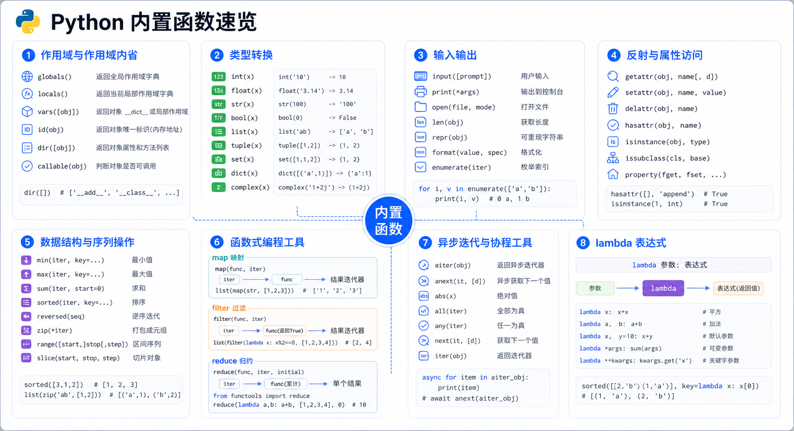

> Python 为我们提供了 71 个内置函数，它们可以直接使用。本文将详细介绍常用的内置函数和匿名函数 lambda 的使用方法，并涵盖 Python 3.12 的新特性。



## 内置函数一览

截止到 Python 3.12，Python 一共为我们提供了 **71 个内置函数**。

| 函数 | 说明 |
|------|------|
| **abs()** | 返回绝对值 |
| **aiter()** | 返回异步迭代器 (Python 3.10+) |
| **all()** | 判断可迭代对象是否全部为 True |
| **anext()** | 获取异步迭代器的下一个元素 (Python 3.10+) |
| **any()** | 判断可迭代对象是否有任意一个为 True |
| **ascii()** | 返回对象的可打印表示 |
| **bin()** | 转换为二进制 |
| **bool()** | 转换为布尔值 |
| **breakpoint()** | 进入调试器 (Python 3.7+) |
| **bytearray()** | 创建字节数组 |
| **bytes()** | 转换为字节串 |
| **callable()** | 判断对象是否可调用 |
| **chr()** | 数字转字符 |
| **classmethod()** | 类方法装饰器 |
| **compile()** | 编译代码为代码对象 |
| **complex()** | 创建复数 |
| **delattr()** | 删除对象属性 |
| **dict()** | 创建字典 |
| **dir()** | 返回对象的属性列表 |
| **divmod()** | 返回商和余数的元组 |
| **enumerate()** | 返回枚举对象 |
| **eval()** | 执行字符串表达式 |
| **exec()** | 执行字符串代码 |
| **filter()** | 过滤序列 |
| **float()** | 转换为浮点数 |
| **format()** | 格式化字符串 |
| **frozenset()** | 创建不可变集合 |
| **getattr()** | 获取对象属性 |
| **globals()** | 返回全局变量字典 |
| **hasattr()** | 判断对象是否有属性 |
| **hash()** | 返回哈希值 |
| **help()** | 显示帮助信息 |
| **hex()** | 转换为十六进制 |
| **id()** | 返回对象标识 |
| **input()** | 获取用户输入 |
| **int()** | 转换为整数 |
| **isinstance()** | 判断对象类型 |
| **issubclass()** | 判断类继承关系 |
| **iter()** | 创建迭代器 |
| **len()** | 返回长度 |
| **list()** | 创建列表 |
| **locals()** | 返回局部变量字典 |
| **map()** | 映射函数 |
| **max()** | 返回最大值 |
| **memoryview()** | 返回内存查看对象 |
| **min()** | 返回最小值 |
| **next()** | 获取下一个元素 |
| **object()** | 创建对象 |
| **oct()** | 转换为八进制 |
| **open()** | 打开文件 |
| **ord()** | 字符转数字 |
| **pow()** | 幂运算 |
| **print()** | 打印输出 |
| **property()** | 属性装饰器 |
| **range()** | 生成序列 |
| **repr()** | 返回对象的字符串表示 |
| **reversed()** | 反转序列 |
| **round()** | 四舍五入 |
| **set()** | 创建集合 |
| **setattr()** | 设置对象属性 |
| **slice()** | 切片对象 |
| **sorted()** | 排序 |
| **staticmethod()** | 静态方法装饰器 |
| **str()** | 转换为字符串 |
| **sum()** | 求和 |
| **super()** | 调用父类方法 |
| **tuple()** | 创建元组 |
| **type()** | 返回对象类型 |
| **vars()** | 返回对象属性字典 |
| **zip()** | 聚合多个序列 |
| **__import__()** | 动态导入模块 |

## 作用域相关

### globals()

获取全局变量的字典。

<!-- snippet: id=python-built-in-functions-lambda-01 mode=compile python=3.12-3.14 deps=stdlib -->
```python
name = "Alice"
age = 25

print(globals())
# {'name': 'Alice', 'age': 25, ...}
```

### locals()

获取执行本方法所在命名空间内的局部变量的字典。

<!-- snippet: id=python-built-in-functions-lambda-02 mode=compile python=3.12-3.14 deps=stdlib -->
```python
def test():
    name = "Bob"
    age = 30
    print(locals())

test()
# {'name': 'Bob', 'age': 30}
```

## 字符串解析与动态代码边界

`eval()` 和 `exec()` 会执行 Python 代码，不能用于解析用户输入、配置、网络响应或数据库字段。即使限制 `globals`/`locals`，也不能把它们改造成可靠的安全沙箱。

需要解析 Python 字面量时，使用 `ast.literal_eval()`；跨系统交换数据优先使用 JSON，并在解析后校验字段、类型和大小。

<!-- snippet: id=python-built-in-functions-safe-literal-eval mode=run python=3.12-3.14 deps=stdlib -->
```python
import ast
import json

literal = ast.literal_eval("{'names': ['Ada', 'Lin'], 'enabled': True}")
payload = json.loads('{"page": 2, "size": 20}')

assert literal["enabled"] is True
assert payload == {"page": 2, "size": 20}
```

`compile()` 的合理用途主要是开发工具、模板引擎或受控代码生成。它只负责生成代码对象，并不会验证代码是否安全。业务系统如果需要“可配置表达式”，应定义允许的操作符并解析 AST，或采用成熟的受限表达式语言，而不是执行任意 Python 源码。

## 输入输出相关

### input()

<!-- snippet: id=python-built-in-functions-lambda-06 mode=compile python=3.12-3.14 deps=stdlib -->
```python
s = input("请输入内容: ")
print(s)  # 输入什么打印什么，数据类型是 str
```

### print()

<!-- snippet: id=python-built-in-functions-lambda-07 mode=compile python=3.12-3.14 deps=stdlib -->
```python
def print(self, *args, sep=' ', end='\n', file=None, flush=False):
    """
    print(value, ..., sep=' ', end='\n', file=sys.stdout, flush=False)
    
    参数说明：
    - value: 要打印的值
    - sep: 打印多个值之间的分隔符，默认为空格
    - end: 每一次打印的结尾，默认为换行符
    - file: 默认是输出到屏幕，如果设置为文件句柄，输出到文件
    - flush: 立即把内容输出到流文件，不作缓存
    """
```

**示例**：打印进度条

<!-- snippet: id=python-built-in-functions-lambda-08 mode=compile python=3.12-3.14 deps=stdlib -->
```python
import time

for i in range(0, 101, 2):
    time.sleep(0.1)
    char_num = i // 2
    per_str = '\r%s%% : %s' % (i, '*' * char_num)
    print(per_str, end='', flush=True)
```

## 类与对象相关

### type()

返回变量的数据类型。

<!-- snippet: id=python-built-in-functions-lambda-09 mode=compile python=3.12-3.14 deps=stdlib -->
```python
x = 10
print(type(x))  # <class 'int'>
```

### id()

返回一个变量的内存地址。

<!-- snippet: id=python-built-in-functions-lambda-10 mode=compile python=3.12-3.14 deps=stdlib -->
```python
x = 10
print(id(x))  # 140734...（内存地址）
```

### hash()

返回一个可哈希变量的哈希值。

<!-- snippet: id=python-built-in-functions-lambda-11 mode=compile python=3.12-3.14 deps=stdlib -->
```python
t = (1, 2, 3)
l = [1, 2, 3]

print(hash(t))  # 可哈希，正常输出
# print(hash(l))  # TypeError: unhashable type: 'list'
```

> **注意**：每次执行程序，内容相同的变量 hash 值在这一次执行过程中不会发生改变。

### callable()

检查一个对象是否是可调用的。

<!-- snippet: id=python-built-in-functions-lambda-12 mode=compile python=3.12-3.14 deps=stdlib -->
```python
def func():
    pass

print(callable(func))  # True
print(callable(123))    # False
```

### hasattr()

判断对象是否包含对应的属性。

<!-- snippet: id=python-built-in-functions-lambda-13 mode=compile python=3.12-3.14 deps=stdlib -->
```python
class Person:
    name = "Alice"

p = Person()
print(hasattr(p, 'name'))  # True
print(hasattr(p, 'age'))   # False
```

### getattr()

返回一个对象属性值。

<!-- snippet: id=python-built-in-functions-lambda-14 mode=compile python=3.12-3.14 deps=stdlib -->
```python
class Person:
    name = "Alice"
    age = 25

p = Person()
print(getattr(p, 'name'))       # Alice
print(getattr(p, 'age', 0))     # 25（带默认值）
print(getattr(p, 'gender', 'Unknown'))  # Unknown
```

### delattr()

删除属性。

<!-- snippet: id=python-built-in-functions-lambda-15 mode=compile python=3.12-3.14 deps=stdlib -->
```python
class Person:
    name = "Alice"
    age = 25

delattr(Person, 'age')
# 或者
del Person.name
```

### dir()

返回模块的属性列表。

<!-- snippet: id=python-built-in-functions-lambda-16 mode=compile python=3.12-3.14 deps=stdlib -->
```python
print(dir(list))  # 查看列表的内置方法
print(dir(int))   # 查看整数的内置方法
```

## 数据结构相关

### 进制转换

<!-- snippet: id=python-built-in-functions-lambda-17 mode=compile python=3.12-3.14 deps=stdlib -->
```python
# 二进制
print(bin(10))   # 0b1010

# 八进制
print(oct(10))   # 0o12

# 十六进制
print(hex(10))   # 0xa
```

### chr() 和 ord()

<!-- snippet: id=python-built-in-functions-lambda-18 mode=compile python=3.12-3.14 deps=stdlib -->
```python
# ord: 字符转数字
print(ord('A'))  # 65
print(ord('a'))   # 97

# chr: 数字转字符
print(chr(65))   # A
print(chr(97))   # a
```

### bytearray()

返回一个新字节数组，数组里的元素是可变的。

<!-- snippet: id=python-built-in-functions-lambda-19 mode=compile python=3.12-3.14 deps=stdlib -->
```python
ret = bytearray('alex', encoding='utf-8')
print(ret[0])    # 101
ret[0] = 65
print(ret)        # bytearray(b'Alex')
```

### memoryview()

返回内存查看对象。

<!-- snippet: id=python-built-in-functions-lambda-20 mode=compile python=3.12-3.14 deps=stdlib -->
```python
ret = memoryview(bytes('你好', encoding='utf-8'))
print(len(ret))                          # 6
print(bytes(ret[:3]).decode('utf-8'))   # 你
print(bytes(ret[3:]).decode('utf-8'))   # 好
```

### frozenset()

返回一个冻结的集合，冻结后集合不能再添加或删除任何元素。

<!-- snippet: id=python-built-in-functions-lambda-21 mode=compile python=3.12-3.14 deps=stdlib -->
```python
a = frozenset(range(10))
print(a)  # frozenset({0, 1, 2, 3, 4, 5, 6, 7, 8, 9})
```

### reversed()

反转序列。

<!-- snippet: id=python-built-in-functions-lambda-22 mode=compile python=3.12-3.14 deps=stdlib -->
```python
l = (1, 2, 23, 213, 5612, 342, 43)
print(list(reversed(l)))  # [43, 342, 5612, 213, 23, 2, 1]
```

### slice()

创建切片对象。

<!-- snippet: id=python-built-in-functions-lambda-23 mode=compile python=3.12-3.14 deps=stdlib -->
```python
l = (1, 2, 23, 213, 5612, 342, 43)
sli = slice(1, 5, 2)
print(l[sli])  # (2, 213)
```

## 数据集合相关

### max() 和 min()

<!-- snippet: id=python-built-in-functions-lambda-24 mode=compile python=3.12-3.14 deps=stdlib -->
```python
salaries = {
    'egon': 3000,
    'alex': 100000000,
    'wupeiqi': 10000,
    'yuanhao': 2000
}

# 按值取最大/最小 key
print(max(salaries, key=lambda k: salaries[k]))  # alex
print(min(salaries, key=lambda k: salaries[k]))  # yuanhao
```

### sorted()

对 List、Dict 进行排序。

<!-- snippet: id=python-built-in-functions-lambda-25 mode=compile python=3.12-3.14 deps=stdlib -->
```python
# 按绝对值排序
l1 = [1, 3, 5, -2, -4, -6]
l2 = sorted(l1, key=abs)
print(l2)  # [1, -2, -3, -4, 5, 6]

# 按长度排序
l = [[1, 2], [3, 4, 5, 6], (7,), '123']
print(sorted(l, key=len))  # [(7,), '123', [1, 2], [3, 4, 5, 6]]

# 按值排序
nums = [10, -1, 11, 9, 23]
print(sorted(nums))  # [-1, 9, 10, 11, 23]

# 按薪资排序
salaries = {
    'egon': 3000,
    'alex': 100000000,
    'wupeiqi': 10000,
    'yuanhao': 2000
}
print(sorted(salaries, key=lambda k: salaries[k]))              # 升序
print(sorted(salaries, key=lambda k: salaries[k], reverse=True))  # 降序
```

### enumerate()

将一个可遍历的数据对象组合为一个索引序列。

<!-- snippet: id=python-built-in-functions-lambda-26 mode=compile python=3.12-3.14 deps=stdlib -->
```python
seasons = ['Spring', 'Summer', 'Fall', 'Winter']
print(list(enumerate(seasons, start=1)))
# [(1, 'Spring'), (2, 'Summer'), (3, 'Fall'), (4, 'Winter')]
```

### all() 和 any()

<!-- snippet: id=python-built-in-functions-lambda-27 mode=compile python=3.12-3.14 deps=stdlib -->
```python
# all: 所有元素都为 True 才返回 True
print(all([1, 2, 3]))      # True
print(all([1, 0, 3]))      # False
print(all([]))              # True（空列表返回 True）

# any: 任意一个元素为 True 就返回 True
print(any([0, 0, 1]))       # True
print(any([0, 0, 0]))      # False
print(any([]))              # False（空列表返回 False）
```

## 映射与过滤

### filter()

过滤序列。

<!-- snippet: id=python-built-in-functions-lambda-28 mode=compile python=3.12-3.14 deps=stdlib -->
```python
# 过滤出偶数
nums = [1, 2, 3, 4, 5, 6]
result = filter(lambda x: x % 2 == 0, nums)
print(list(result))  # [2, 4, 6]
```

### map()

映射函数。

<!-- snippet: id=python-built-in-functions-lambda-29 mode=compile python=3.12-3.14 deps=stdlib -->
```python
# 每个元素平方
nums = [1, 2, 3, 4, 5]
result = map(lambda x: x ** 2, nums)
print(list(result))  # [1, 4, 9, 16, 25]
```

### reduce()

（需要导入 `from functools import reduce`）

<!-- snippet: id=python-built-in-functions-lambda-30 mode=compile python=3.12-3.14 deps=stdlib -->
```python
from functools import reduce

# 求和
nums = [1, 2, 3, 4, 5]
result = reduce(lambda x, y: x + y, nums)
print(result)  # 15

# 求积
result = reduce(lambda x, y: x * y, nums)
print(result)  # 120
```

### 异步迭代器增强（aiter/anext）

Python 3.10 引入的 `aiter()` 和 `anext()` 函数在 Python 3.12 中得到进一步完善：

<!-- snippet: id=python-built-in-functions-lambda-31 mode=compile python=3.12-3.14 deps=stdlib -->
```python
import asyncio

async def async_generator():
    for i in range(5):
        yield i
        await asyncio.sleep(0.1)

async def main():
    ag = async_generator()
    
    # aiter() - 获取异步迭代器
    async_iter = aiter(ag)
    
    # anext() - 获取下一个异步元素
    try:
        value = await anext(async_iter)
        print(f"Received: {value}")  # 0
        
        # 带默认值
        value = await anext(async_iter, "default")
        print(f"Received: {value}")  # 1
    except StopAsyncIteration:
        print("迭代完成")

asyncio.run(main())
```
## 匿名函数 lambda

### 基本语法

<!-- snippet: id=python-built-in-functions-lambda-32 mode=compile python=3.12-3.14 deps=stdlib -->
```python
函数名 = lambda 参数: 返回值
```

### 示例

<!-- snippet: id=python-built-in-functions-lambda-33 mode=compile python=3.12-3.14 deps=stdlib -->
```python
# 普通函数
def calc(n):
    return n ** n

print(calc(10))

# 换成匿名函数
calc = lambda n: n ** n
print(calc(10))

# 带多个参数
add = lambda x, y: x + y
print(add(1, 3))  # 4
```

### 特点

1. **参数可以有多个，用逗号隔开**
2. **匿名函数不管逻辑多复杂，只能写一行**
3. **逻辑执行结束后的内容就是返回值**
4. **返回值和正常的函数一样可以是任意数据类型**

### 与其他函数配合使用

#### 与 max()、min() 配合

<!-- snippet: id=python-built-in-functions-lambda-34 mode=compile python=3.12-3.14 deps=stdlib -->
```python
salaries = {
    'egon': 3000,
    'alex': 100000000,
    'wupeiqi': 10000,
    'yuanhao': 2000
}

print(max(salaries, key=lambda k: salaries[k]))
print(min(salaries, key=lambda k: salaries[k]))
```

#### 与 sorted() 配合

<!-- snippet: id=python-built-in-functions-lambda-35 mode=compile python=3.12-3.14 deps=stdlib -->
```python
nums = [10, -1, 11, 9, 23]
print(sorted(nums))
print(sorted(nums, reverse=True))

salaries = {
    'egon': 3000,
    'alex': 100000000,
    'wupeiqi': 10000,
    'yuanhao': 2000
}
print(sorted(salaries, key=lambda k: salaries[k]))
print(sorted(salaries, key=lambda k: salaries[k], reverse=True))
```

## 小结

### 内置函数分类

| 类别 | 函数 |
|------|------|
| **类型转换** | int, float, str, bool, list, dict, set, tuple, bytes, bytearray, complex |
| **进制转换** | bin, oct, hex |
| **数学运算** | abs, pow, divmod, round, sum, min, max |
| **序列操作** | len, sorted, reversed, enumerate, zip, slice |
| **对象属性** | type, id, hash, dir, getattr, setattr, hasattr, delattr, vars |
| **作用域** | globals, locals |
| **可调用性** | callable |
| **执行代码** | eval, exec, compile |
| **输入输出** | input, print, open |
| **函数式编程** | filter, map, reduce |
| **异步迭代** | aiter, anext (Python 3.10+) |
| **调试** | breakpoint (Python 3.7+), help |
| **内存视图** | memoryview, ascii |
| **装饰器** | classmethod, staticmethod, property |

### lambda 函数的适用场景

1. **简单的计算逻辑**：一行就能搞定的情况
2. **作为参数传递**：如 `max()`, `min()`, `sorted()` 等
3. **一次性使用**：不需要多次调用的简单函数

> **注意**：虽然 lambda 函数简洁，但复杂的逻辑还是应该使用普通函数来保持代码可读性。

掌握这些内置函数和 lambda 表达式的使用，可以让你的 Python 代码更加简洁和优雅。
