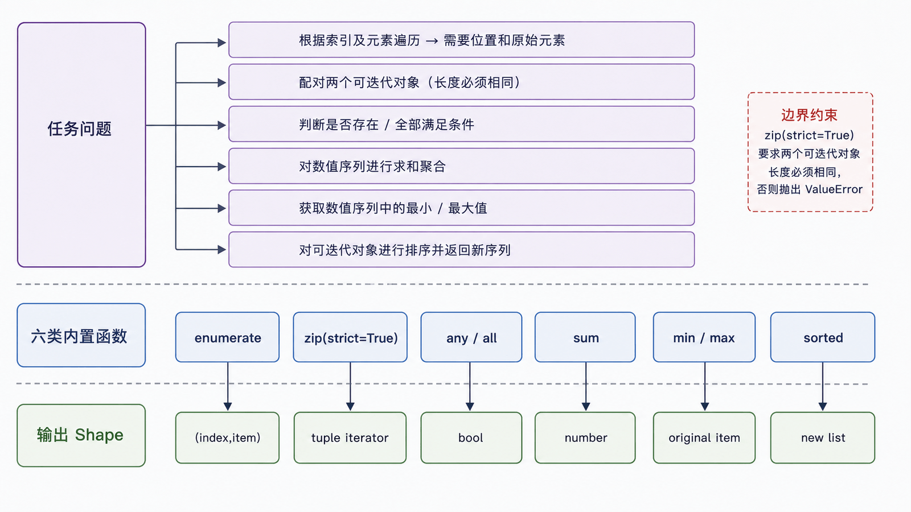

内置函数的数量会随 Python 版本变化，“背完 71 个”既不稳定也不等于会解决问题。本篇建立一套选择路径：先确认输入协议和期望输出 Shape，再选转换、迭代、聚合或检查工具。

## 前置知识与学习目标

你应会函数、容器、迭代和异常。学完后你应该能：

- 按任务选择常用内置函数，而非记忆清单；
- 解释迭代器的惰性与一次消费；
- 为 `sorted`、`min`、`max` 正确编写 `key`；
- 避免对不可信输入使用 `eval`、`exec` 和危险反射。

## 转换不是校验

`int`、`float`、`str`、`list`、`tuple`、`dict`、`set` 等构造器会尝试创建目标类型，失败时抛异常。转换成功也不代表业务合法，例如 `int("-3")` 成功但订单数量可能不允许负数。

<!-- snippet: id=python-builtins-convert-validate mode=run python=3.12-3.14 deps=stdlib -->

```python
def parse_quantity(raw: str) -> int:
    quantity = int(raw)
    if quantity < 0:
        raise ValueError("quantity 不能为负数")
    return quantity

assert parse_quantity("3") == 3
```

## 迭代、配对与聚合

<!-- figure:s10-f01:start -->



<!-- figure:s10-f01:end -->

<!-- snippet: id=python-builtins-order-summary mode=run python=3.12-3.14 deps=stdlib -->

```python
orders = [
    {"id": "A002", "amount": 30},
    {"id": "A001", "amount": 20},
]

indexed = list(enumerate(orders, start=1))
ids = list(map(lambda order: order["id"], orders))
paid_total = sum(order["amount"] for order in orders)
largest = max(orders, key=lambda order: order["amount"])
ordered = sorted(orders, key=lambda order: order["id"])

assert indexed[0][0] == 1
assert ids == ["A002", "A001"]
assert paid_total == 50
assert largest["id"] == "A002"
assert [row["id"] for row in ordered] == ["A001", "A002"]
```

常用关系：

| 目的          | 工具                           | 输出 Shape                 |
| ------------- | ------------------------------ | -------------------------- |
| 带索引迭代    | `enumerate(iterable, start)`   | `(index, item)` 迭代器     |
| 并行配对      | `zip(a, b, strict=True)`       | 元组迭代器；长度不等时报错 |
| 任一/全部满足 | `any` / `all`                  | `bool`，会短路             |
| 汇总数字      | `sum`                          | 数值；不用于拼字符串       |
| 选择极值      | `min` / `max(key=...)`         | 原元素，不是 key 值        |
| 排序副本      | `sorted(key=..., reverse=...)` | 新列表，稳定排序           |

`map`、`filter`、`zip`、`enumerate` 返回惰性迭代器，消费一次后通常不能“倒带”。简单筛选映射用推导式往往更清楚。

## 检查、协议与反射

- `isinstance(obj, Type)` 检查类型协议，比 `type(obj) is Type` 更支持继承；
- `callable(obj)` 表示对象看起来可调用，但调用仍可能失败；
- `getattr(obj, name, default)` 适合受控名称；不要让外部输入任意选择私有属性；
- `hasattr` 会调用属性访问并只吞掉 `AttributeError`，属性本身可能有副作用；
- `dir` 和 `help` 适合交互探索，不是稳定序列化接口。

## lambda 的真实边界

`lambda` 只能包含一个表达式，适合短小、局部、无需文档的 `key` 函数。表达式复杂、有分支、需复用或需测试时改用 `def`。

<!-- snippet: id=python-lambda-key-boundary mode=run python=3.12-3.14 deps=stdlib -->

```python
orders = [{"id": "A2", "amount": 10}, {"id": "A1", "amount": 20}]
orders_by_amount = sorted(orders, key=lambda order: (order["amount"], order["id"]))
assert [order["id"] for order in orders_by_amount] == ["A2", "A1"]
```

## eval、exec 与 compile 的风险

`eval` 执行表达式，`exec` 执行语句；限制 `globals`/`locals` 不是可靠沙箱。不可信输入绝不能交给它们。解析 JSON 用 `json.loads`，解析 Python 字面量可在严格场景用 `ast.literal_eval`，业务规则应实现明确语法或白名单解释器。

## 生成器与内存边界

`list(range(10_000_000))` 会立即分配大量对象；`range` 和生成器表达式按需产生值。惰性降低峰值内存，但错误可能延迟到消费时发生，调试时要记录消费边界。

## 常见误区与适用边界

- `all([])` 为 `True`，`any([])` 为 `False`，这是空集逻辑，不是异常。
- `sorted` 返回新列表，`list.sort` 原地修改并返回 `None`。
- `hash()` 不是跨进程稳定摘要，安全与持久标识使用专用协议。
- `open()` 虽是内置函数，其文件与编码边界由第 6 篇主责。
- 内置函数表以当前官方文档为准，不把数量写进长期标题承诺。

## 自检题

1. `max(orders, key=...)` 返回订单还是 key 的计算结果？
2. 为什么 `zip(a, b, strict=True)` 比普通 `zip` 更适合要求等长的数据？
3. 把 `eval` 的 `__builtins__` 设为空，能否把不可信表达式变成安全沙箱？

<details>
<summary>参考答案</summary>

1. 返回原订单元素。
2. 普通 `zip` 会静默截断到较短输入，`strict=True` 会暴露长度不一致。
3. 不能；Python 对象模型仍可能提供逃逸路径，应使用明确解析器和白名单语义。

</details>

## 本篇总结

内置函数按输入协议与输出 Shape 选择。优先组合小函数、推导式和惰性迭代；动态执行不是普通数据解析工具。

## 下一篇衔接

下一篇把 `order_report` 拆成包，跟踪 `import` 的查找、创建、缓存和执行过程，并处理绝对/相对导入与循环依赖。

## 资料来源

- [Python 3.14 内置函数](https://docs.python.org/3.14/library/functions.html)
- [Python 标准类型：迭代器](https://docs.python.org/3.14/library/stdtypes.html#iterator-types)
- [ast.literal_eval 的边界](https://docs.python.org/3.14/library/ast.html#ast.literal_eval)
