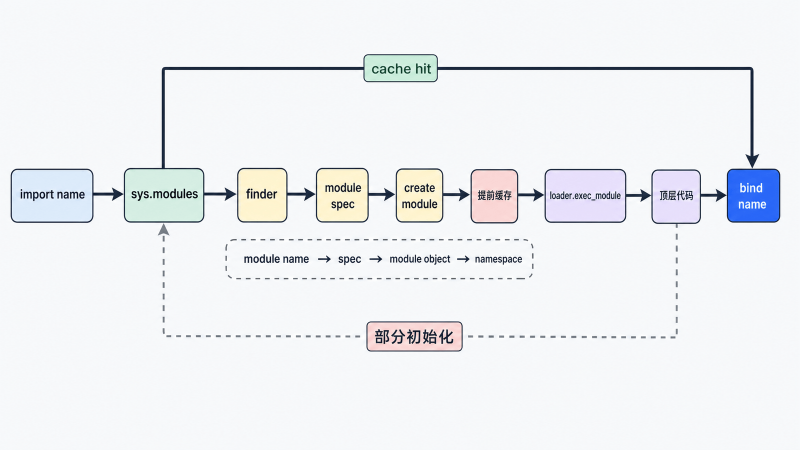
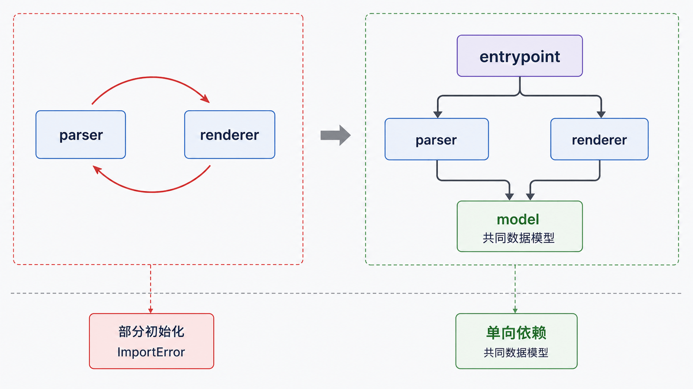

模块解决代码组织与名称隔离，包解决模块分组。`import` 不是文本复制，而是一次“查找—创建—缓存—执行—绑定”的协议。

## 前置知识与学习目标

你应理解函数、名称空间和文件路径。学完后你应该能：

- 设计职责清晰的包结构；
- 解释首次导入与 `sys.modules` 缓存；
- 区分绝对导入、显式相对导入与脚本入口；
- 从依赖图而不是“挪动 import”角度解决循环导入。

## order_report 包结构

```text
order_report/
├── __init__.py
├── __main__.py
├── parser.py
├── calculator.py
└── renderer.py
```

`parser` 只负责把外部数据变成订单；`calculator` 只负责计算；`renderer` 只负责输出。`__main__.py` 组合它们，使 `python -m order_report` 成为稳定入口。

## 一次 import 的关键阶段

<!-- figure:s11-f01:start -->



<!-- figure:s11-f01:end -->

1. 检查目标是否已在 `sys.modules`；
2. 由 finder 根据模块名和搜索路径找到 spec；
3. 创建模块对象并提前放入 `sys.modules`；
4. loader 执行模块顶层代码；
5. 把模块或导入的名称绑定到当前名称空间。

提前缓存可以支持递归导入，但也意味着循环依赖可能看到“部分初始化模块”。真正的字典名称是 `sys.modules`，不是 `sys.module`。

<!-- snippet: id=python-import-cache-observation mode=run python=3.12-3.14 deps=stdlib -->

```python
import json
import sys

assert sys.modules["json"] is json
before = id(json)
import json as json_again
assert id(json_again) == before
```

模块顶层代码通常只在首次导入时执行。`importlib.reload()` 主要用于交互实验，不是生产热更新方案，旧引用也不会自动替换。

## import 与 from import

`import order_report.parser` 绑定清晰的限定名称；`from order_report.parser import parse` 把 `parse` 直接绑定到当前模块，使用方便但更容易重名。`from module import *` 隐藏依赖来源，应避免；`__all__` 只控制星号导出的公共名字，不是安全边界。

包内部可写：

<!-- snippet: id=python-package-relative-import mode=display python=3.12-3.14 deps=stdlib -->

```python
# order_report/__main__.py
from .calculator import total
from .parser import parse_orders
from .renderer import render
```

显式相对导入依赖包上下文。直接执行 `python order_report/__main__.py` 可能失败，应从包的父目录运行 `python -m order_report`。

## 搜索路径与影子模块

路径导入器会使用 `sys.path`。其初始化受入口脚本目录或当前目录、`PYTHONPATH`、标准库、虚拟环境和 site 配置影响。不要在业务代码中随意 `sys.path.insert()` 修补项目结构；使用可安装包、虚拟环境和模块入口。

把本地文件命名为 `json.py`、`logging.py` 等会遮蔽标准库。诊断时检查：

<!-- snippet: id=python-module-origin mode=run python=3.12-3.14 deps=stdlib -->

```python
import json

assert json.__spec__ is not None
print(json.__spec__.origin)
```

## 循环导入是依赖设计信号

<!-- figure:s11-f02:start -->



<!-- figure:s11-f02:end -->

若 `parser` 导入 `renderer`，同时 `renderer` 又导入 `parser` 的顶层名称，后者可能尚未定义。优先解决方案：

1. 把共同数据模型或常量提取到低层模块；
2. 让依赖方向单向，例如入口层组合各模块；
3. 仅在确实延迟可选依赖时使用函数内导入，并说明原因。

“把 import 挪到文件末尾”只是在赌初始化顺序，不能消除结构问题。

## 包、命名空间包与 pyc

普通包通常含 `__init__.py`；Python 也支持无该文件的命名空间包，可跨多个目录组合。`.pyc` 是与 Python 实现/版本相关的字节码缓存，用于减少解析编译开销，不是加密格式，也不应当作跨版本发布物。

## 常见误区与适用边界

- 模块是对象和名称空间，不只是 `.py` 文件；扩展模块与命名空间包也可导入。
- 包不一定必须有 `__init__.py`，但基础项目用普通包更显式。
- 导入缓存按模块名索引；同一文件用不一致名称导入可能产生意外双实例。
- 不在库模块导入时执行网络请求、启动线程或读取生产配置；顶层副作用会让测试和工具导入困难。
- 依赖安装与 `pyproject.toml` 属于包装发布专题，本篇不展开。

## 自检题

1. 为什么循环导入可能看到“部分初始化模块”？
2. 包内 `from .parser import parse` 为什么适合配合 `python -m order_report`？
3. 本地 `logging.py` 为什么可能让 `import logging` 得到错误模块？

<details>
<summary>参考答案</summary>

1. 模块对象在执行顶层代码前就放入 `sys.modules`，递归导入能找到对象但所需名称可能尚未定义。
2. `-m` 建立正确包上下文，点号可解析到同一包。
3. 当前入口目录通常位于搜索路径前部，本地同名文件会遮蔽标准库。

</details>

## 本篇总结

模块提供名称空间，包组织依赖。导入系统先查缓存，再按 spec 查找和执行；循环导入应通过分层和依赖反转解决，而非依赖偶然顺序。

## 下一篇衔接

下一篇为解析、文件和计算错误建立异常合同：捕获具体异常、保留异常链、用 `else` 分隔成功路径，并用 `finally` 或 `with` 清理资源。

## 资料来源

- [Python 教程：模块](https://docs.python.org/3.14/tutorial/modules.html)
- [Python 语言参考：导入系统](https://docs.python.org/3.14/reference/import.html)
- [importlib：导入系统实现](https://docs.python.org/3.14/library/importlib.html)
