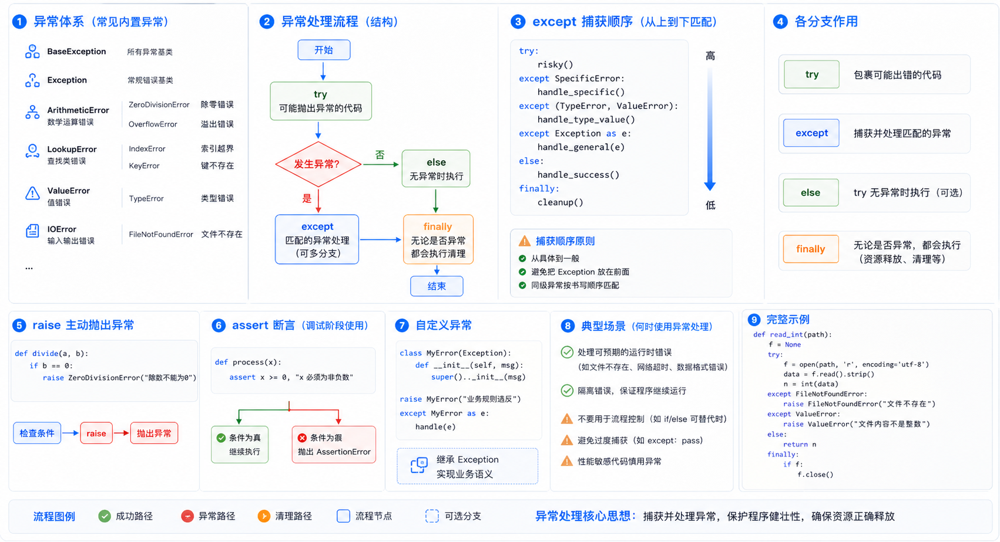

> 异常是程序运行时发生错误的信号。学会处理异常可以让程序更加健壮和容错。本文将详细介绍 Python 的异常处理机制。



## 什么是异常

异常就是程序运行时发生错误的信号。当程序出现错误时，会产生一个异常，若程序没有处理它，则会抛出该异常，程序的运行也随之终止。

### 错误的两种类型

1. **语法错误**：必须在程序执行前就改正
2. **逻辑错误**：可以预见的错误

### 常见语法错误

```text
# 语法错误示例
if  # 缺少条件
def test  # 缺少冒号
class Foo  # 缺少冒号
print(haha)  # 变量未定义
```

### 常见逻辑错误

```python
# TypeError: int 类型不可迭代
for i in 3:
    pass

# ValueError
num = input(">>: ")  # 输入 hello
int(num)

# NameError
aaa

# IndexError
l = ['egon', 'aa']
l[3]

# KeyError
dic = {'name': 'egon'}
dic['age']

# AttributeError
class Foo:
    pass
Foo.x

# ZeroDivisionError
res = 1 / 0
```

## 异常的种类

Python 中不同的异常可以用不同的类型去标识，一个异常标识一种错误。

### 常用异常类型

| 异常类型 | 说明 |
|----------|------|
| `AttributeError` | 试图访问对象没有的属性 |
| `IOError` | 输入/输出异常，无法打开文件 |
| `ImportError` | 无法引入模块或包 |
| `IndentationError` | 语法错误，代码没有正确对齐 |
| `IndexError` | 下标索引超出序列边界 |
| `KeyError` | 试图访问字典里不存在的键 |
| `KeyboardInterrupt` | Ctrl+C 被按下 |
| `NameError` | 使用一个还未被赋予对象的变量 |
| `SyntaxError` | Python 代码非法 |
| `TypeError` | 传入对象类型与要求的不符合 |
| `UnboundLocalError` | 试图访问还未被设置的局部变量 |
| `ValueError` | 传入一个调用者不期望的值 |
| `ZeroDivisionError` | 除数为零 |

## 异常处理

为了保证程序的健壮性与容错性，需要对异常进行处理。

### 预判处理（if 语句）

如果错误发生的条件是可预知的，需要用 `if` 进行处理：

```python
AGE = 10
while True:
    age = input('>>: ').strip()
    if age.isdigit():  # 只有在 age 为字符串形式的整数时，下面代码才不会出错
        age = int(age)
        if age == AGE:
            print('you got it')
            break
```

### 异常捕获（try...except）

如果错误发生的条件是不可预知的，则需要用 `try...except`：

```python
# 基本语法
try:
    # 被检测的代码块
    pass
except Exception as exc:
    # try 中一旦检测到异常，就执行这个位置的逻辑
    print(exc)

# 示例
try:
    f = open('a.txt')
    g = (line.strip() for line in f)
    print(next(g))
    print(next(g))
except StopIteration:
    f.close()
```

## 异常处理的几种形式

### 1. 基本语法

```python
s1 = 'hello'
try:
    int(s1)
except ValueError as e:  # 捕获 ValueError
    print(e)
```

### 2. 多分支处理

```python
s1 = 'hello'
try:
    int(s1)
except IndexError as e:
    print(e)
except KeyError as e:
    print(e)
except ValueError as e:
    print(e)
```

### 3. 万能异常 Exception

```python
s1 = 'hello'
try:
    int(s1)
except Exception as e:  # 捕获所有异常
    print(e)
```

### 4. 多分支 + 万能异常

```python
s1 = 'hello'
try:
    int(s1)
except IndexError as e:
    print(e)
except KeyError as e:
    print(e)
except ValueError as e:
    print(e)
except Exception as e:  # 作为最后的安全网
    print(e)
```

### 5. else 和 finally

```python
s1 = 'hello'
try:
    int(s1)
except IndexError as e:
    print(e)
except ValueError as e:
    print(e)
else:
    print('try 内代码块没有异常则执行我')
finally:
    print('无论异常与否，都会执行该模块，通常进行清理工作')
```

## 主动触发异常

### raise 语句

```python
try:
    raise TypeError('类型错误')
except Exception as e:
    print(e)
```

### 自定义异常

```python
class MyException(BaseException):
    def __init__(self, msg):
        self.msg = msg

    def __str__(self):
        return self.msg

try:
    raise MyException('自定义错误')
except MyException as e:
    print(e)
```

### 断言 assert

```python
print("上半部分。。。")
l = [1, 2, 3, 4, 5, 6]

# 断言：条件成立则继续执行，不成立则抛出异常
assert len(l) == 5, "列表的长度必须为 5"

print("下半部分。。。")
```

## 什么时候用异常处理

### 注意事项

> 不要滥用异常处理。如果错误发生的条件可预知，应该使用 `if` 语句预防，而不是用 `try...except`。

### 最佳实践

1. **可预知的错误**：使用 `if` 语句预防
2. **不可预知的错误**：使用 `try...except` 处理
3. **清理工作**：使用 `finally` 块

```python
# 示例：正确使用异常处理
try:
    f = open('file.txt', 'r')
    data = f.read()
except FileNotFoundError:
    print("文件不存在")
else:
    print("读取成功")
finally:
    if 'f' in locals():  # 检查变量是否存在
        f.close()
```

## 小结

| 关键字 | 说明 |
|--------|------|
| **try** | 捕获异常的代码块 |
| **except** | 处理特定异常 |
| **else** | try 代码块无异常时执行 |
| **finally** | 无论是否异常都执行 |
| **raise** | 主动抛出异常 |
| **assert** | 断言，条件不成立时抛出异常 |

### 异常处理的作用

1. 把错误处理和真正的工作分开来
2. 代码更易组织，更清晰
3. 更安全，不至于由于小的疏忽而使程序意外崩溃

掌握异常处理，可以让你的 Python 程序更加健壮和可靠。
