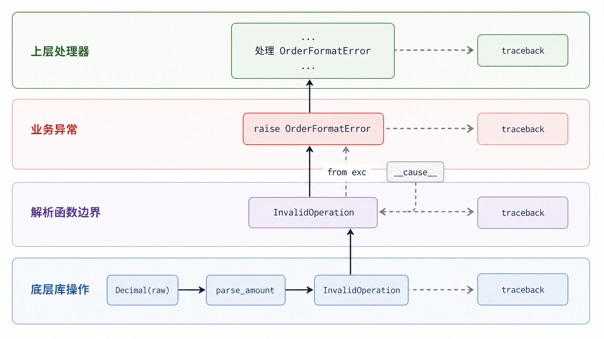
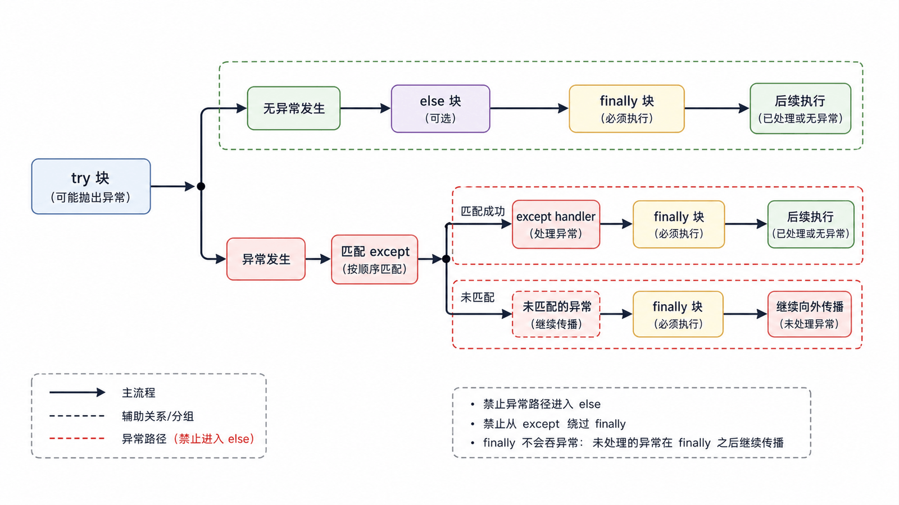

异常是控制流中的失败信号。好的异常处理不会“让程序永不崩溃”，而是在正确层次增加上下文、执行清理，并让调用者决定重试、降级还是终止。

## 前置知识与学习目标

你应理解函数合同、文件边界和模块分层。学完后你应该能：

- 区分语法错误、运行时异常和错误业务结果；
- 只捕获能处理的具体异常，并缩小 `try` 范围；
- 用 `raise ... from ...` 保留根因；
- 正确选择 `else`、`finally`、`with` 和断言。

## 异常沿调用栈传播

当操作抛出异常，当前语句停止，Python 沿调用栈寻找匹配的 `except`。找不到处理器时程序以 traceback 终止。traceback 是诊断证据，不应被无差别吞掉。

## 在抽象边界转换异常

<!-- figure:s12-f01:start -->



<!-- figure:s12-f01:end -->

<!-- snippet: id=python-exception-chain mode=run python=3.12-3.14 deps=stdlib -->

```python
from decimal import Decimal, InvalidOperation

class OrderFormatError(ValueError):
    """订单外部文本不符合约定格式。"""

def parse_amount(raw: str) -> Decimal:
    try:
        amount = Decimal(raw)
    except InvalidOperation as exc:
        raise OrderFormatError(f"非法金额：{raw!r}") from exc
    if amount < 0:
        raise OrderFormatError("金额不能为负数")
    return amount

assert parse_amount("19.90") == Decimal("19.90")
try:
    parse_amount("oops")
except OrderFormatError as exc:
    assert isinstance(exc.__cause__, InvalidOperation)
```

自定义业务异常通常继承 `Exception` 的合适子类，而不是 `BaseException`。`KeyboardInterrupt`、`SystemExit` 等直接继承 `BaseException`，普通业务代码不应拦截它们。

## try、except、else、finally 的职责

<!-- figure:s12-f02:start -->



<!-- figure:s12-f02:end -->

<!-- snippet: id=python-try-else-finally mode=run python=3.12-3.14 deps=stdlib -->

```python
events = []

try:
    value = int("3")
except ValueError:
    events.append("invalid")
else:
    events.append(f"accepted:{value}")
finally:
    events.append("finished")

assert events == ["accepted:3", "finished"]
```

- `try` 只包可能出现且准备处理的操作；
- `except` 从具体到一般排列；
- `else` 放成功后续，避免把后续错误误当成解析错误；
- `finally` 无论是否异常都运行，适合必须清理的资源。

文件、锁和事务优先使用上下文管理器，因为它把获取与释放组合成结构化合同。

## 捕获 Exception 的正确位置

应用入口、任务工作器或请求边界可能捕获 `Exception` 以记录上下文并转换为退出码/响应；底层函数通常应捕获具体异常。捕获后若无法恢复，应使用裸 `raise` 重新抛出，保留原 traceback。

不要写 `except Exception: pass`。它会把数据损坏、编程错误和真实基础设施故障伪装成成功。

## EAFP 与 LBYL

Python 常使用 EAFP：先执行操作，失败再捕获异常。例如“先检查文件存在再打开”存在检查与使用之间的竞态，直接打开并处理 `FileNotFoundError` 更可靠。纯业务范围校验则适合显式 `if`。

关键不是口诀，而是操作是否原子、失败是否常见、异常是否能在此层恢复。

## assert 不是输入校验

`assert condition` 用于开发期不变量；优化模式 `python -O` 可移除断言。外部输入、权限和业务规则必须用显式判断并抛异常。

## 失败边界与清理

- 重试只针对暂时性、幂等操作，并设置次数/超时；
- 日志记录一次完整异常，避免每层重复打印；
- 不在 `finally` 中无条件 `return`，它可能压制正在传播的异常；
- 多个并发任务的独立错误可使用 `ExceptionGroup`/`except*`，但基础串行流程不必引入。

## 常见误区与适用边界

- `SyntaxError` 通常在代码执行前修复，不属于普通业务恢复路径。
- `IOError` 是 `OSError` 的兼容别名；现代代码按具体 `OSError` 子类处理。
- 自定义异常只需携带有用上下文，通常无需重写 `__str__`。
- `finally` 保证执行机会，不保证进程被强杀、断电或解释器崩溃时完成。
- 异常不替代返回值；“查无数据”若是正常结果，可返回 `None` 或空集合并在合同中说明。

## 自检题

1. 为什么自定义业务异常应继承 `Exception` 而非 `BaseException`？
2. `else` 为什么能帮助缩小异常捕获范围？
3. 为什么 `assert user_has_permission` 不能用于生产权限校验？

<details>
<summary>参考答案</summary>

1. 普通 `except Exception` 应能捕获业务异常，同时保留 `KeyboardInterrupt`、`SystemExit` 等系统退出信号。
2. 只有 `try` 中指定操作的异常会被捕获，成功后的代码错误不会被误分类。
3. `-O` 可移除断言，安全校验必须始终执行。

</details>

## 本篇总结

异常处理的目标是保留证据并明确责任：底层增加语义，上层决定策略；具体捕获、异常链和结构化清理共同形成可诊断失败路径。

## 下一篇衔接

下一篇进入标准库工程工具：用时区感知时间、`secrets`、`pathlib`、环境变量和命令行参数完成可复现的订单任务。

## 资料来源

- [Python 教程：错误和异常](https://docs.python.org/3.14/tutorial/errors.html)
- [内置异常层级](https://docs.python.org/3.14/library/exceptions.html)
- [Python 语言参考：try 语句](https://docs.python.org/3.14/reference/compound_stmts.html#the-try-statement)
