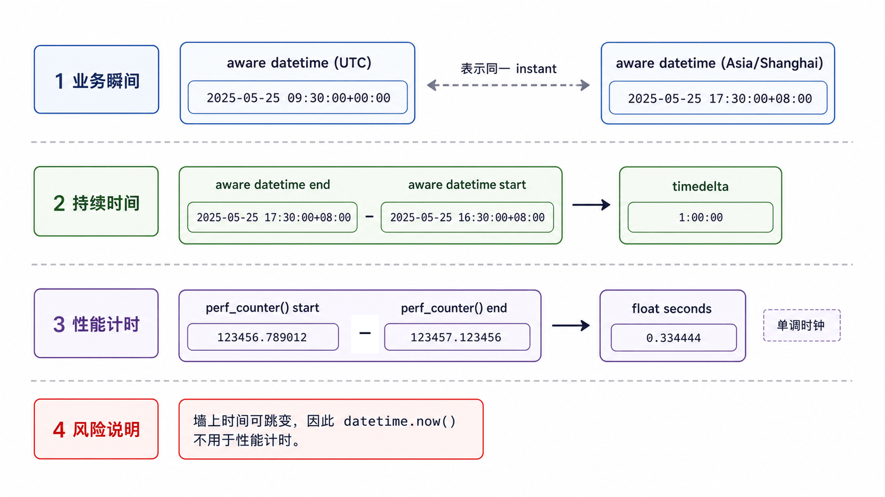
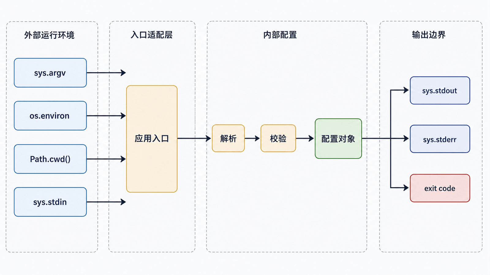

标准库模块应按职责选择：`datetime` 表达业务日期时间，`time` 提供时钟与休眠，`secrets` 生成安全令牌，`pathlib` 处理路径，`os`/`sys` 连接操作系统与解释器。

## 前置知识与学习目标

你应理解模块、异常和文件路径。学完后你应该能：

- 区分业务时间、持续时间与性能计时；
- 在 `random` 和 `secrets` 之间正确选择；
- 用 `pathlib` 构造跨平台路径，并理解当前工作目录；
- 从环境变量、命令行和标准流读取运行上下文。

## 时间：先确定语义

<!-- figure:s13-f01:start -->



<!-- figure:s13-f01:end -->

业务事件通常需要“时区感知”的 `datetime`；超时和耗时使用单调时钟 `time.monotonic()` 或 `perf_counter()`，不能用可能跳变的墙上时钟相减。

<!-- snippet: id=python-aware-datetime mode=run python=3.12-3.14 deps=stdlib -->

```python
from datetime import datetime, timezone
from zoneinfo import ZoneInfo

created_at = datetime(2026, 7, 17, 9, 30, tzinfo=ZoneInfo("Asia/Shanghai"))
stored = created_at.astimezone(timezone.utc)
restored = stored.astimezone(ZoneInfo("Asia/Shanghai"))

assert restored == created_at
assert stored.isoformat().endswith("+00:00")
```

不要混合有时区与无时区 `datetime`。跨系统存储可统一 UTC 与 ISO 8601，同时保留业务时区需求；夏令时地区还要处理模糊/不存在的本地时间。

<!-- snippet: id=python-monotonic-duration mode=run python=3.12-3.14 deps=stdlib -->

```python
from time import perf_counter

start = perf_counter()
sum(range(10_000))
elapsed = perf_counter() - start
assert elapsed >= 0
```

微基准应使用 `timeit` 并多次测量，本例只展示时钟语义。

## 随机：模拟与安全是两类问题

`random` 是可复现的伪随机生成器，适合测试、模拟和抽样；不要用于密码、重置链接或会话令牌。安全令牌使用 `secrets`。

<!-- snippet: id=python-random-vs-secrets mode=run python=3.12-3.14 deps=stdlib -->

```python
import random
import secrets

rng = random.Random(42)
sample = rng.sample(["A001", "A002", "A003"], k=2)
assert sample == ["A003", "A001"]

token = secrets.token_urlsafe(16)
assert isinstance(token, str) and len(token) >= 16
```

测试中创建局部 `Random(seed)`，避免修改全局生成器状态导致用例互相影响。

## pathlib：路径是对象，不是字符串拼接

<!-- snippet: id=python-pathlib-order-files mode=run python=3.12-3.14 deps=stdlib -->

```python
from pathlib import Path, PurePosixPath

relative = PurePosixPath("orders") / "2026" / "07.jsonl"
assert relative.as_posix() == "orders/2026/07.jsonl"

config_path = Path.cwd() / "config" / "order-report.ini"
assert config_path.name == "order-report.ini"
```

`Path.cwd()` 是进程当前工作目录，不是模块文件所在目录。资源相对包时使用 `importlib.resources`；用户路径先验证允许根目录。删除和移动是破坏性操作，必须检查解析后的目标。

## os 与 sys 的运行边界

<!-- figure:s13-f02:start -->



<!-- figure:s13-f02:end -->

- `os.environ` 读取环境变量，值都是字符串；机密信息不应打印；
- `os.name` 是粗粒度平台标识，功能检测通常优于平台分支；
- `sys.argv` 保存命令行参数，复杂 CLI 使用 `argparse`；
- `sys.stdin/stdout/stderr` 是标准流；诊断信息写 `stderr`；
- `sys.exit(code)` 实际抛出 `SystemExit`，入口层用非零码表示失败；
- `sys.version_info` 可用于明确的版本门槛，不要解析 `sys.version` 文本。

<!-- snippet: id=python-environment-parse mode=run python=3.12-3.14 deps=stdlib -->

```python
import os

workers = int(os.environ.get("ORDER_REPORT_WORKERS", "1"))
if workers < 1:
    raise ValueError("ORDER_REPORT_WORKERS 必须大于 0")
assert workers >= 1
```

## 常见误区与适用边界

- 时间戳不自带显示时区；同一瞬间可在不同时区显示为不同日期。
- `sleep(1)` 只保证至少暂停到可再次调度，不保证精确定时。
- `os.system()` 难以安全传参和捕获结果，外部程序交给第 14 篇的 `subprocess`。
- 不要在库模块导入时修改当前目录、环境变量或 `sys.path`。
- `functools.partial` 属于高阶函数工具，已由第 9/10 篇的函数对象模型覆盖，不再混入系统模块篇。

## 自检题

1. 测量函数耗时为什么应使用 `perf_counter()` 而不是 `datetime.now()`？
2. 生成密码重置令牌应使用 `random` 还是 `secrets`？
3. `Path("data.txt")` 相对的是脚本文件目录还是当前工作目录？

<details>
<summary>参考答案</summary>

1. `perf_counter` 适合测量持续时间且单调，墙上时间可能因校时跳变。
2. 使用 `secrets`。
3. 当前工作目录；不能假设等于脚本所在目录。

</details>

## 本篇总结

先区分业务时间与持续时间、模拟随机与安全随机、路径位置与运行位置。标准库模块职责清楚，代码才能跨平台且可测试。

## 下一篇衔接

下一篇组合安全摘要、子进程、日志、正则和特殊容器，重点讨论密码哈希边界、Shell 注入、日志证据与正则回溯风险。

## 资料来源

- [datetime 与 zoneinfo](https://docs.python.org/3.14/library/datetime.html)
- [time：时钟与性能计时](https://docs.python.org/3.14/library/time.html)
- [secrets：安全随机数](https://docs.python.org/3.14/library/secrets.html)
- [pathlib：面向对象路径](https://docs.python.org/3.14/library/pathlib.html)
