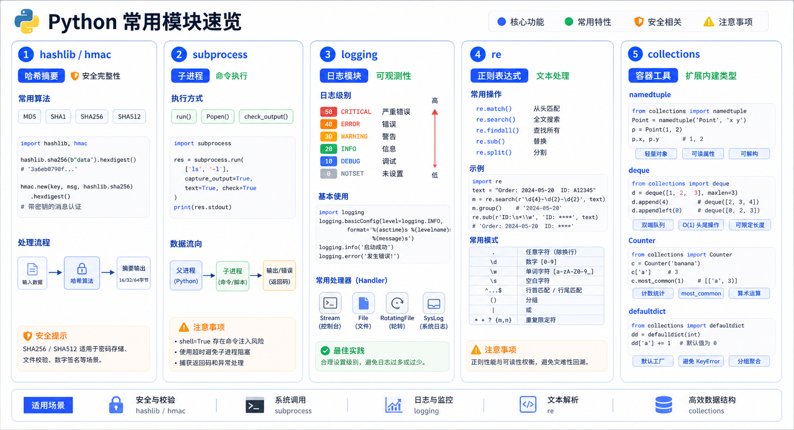

> Python 提供了丰富的标准模块来处理哈希算法、子进程、日志、正则表达式和特殊容器数据类型。本文将详细介绍 hashlib、subprocess、logging、re 和 collections 等常用模块的使用方法。



## hashlib 模块

`hashlib` 是哈希算法模块，提供 SHA1、SHA224、SHA256、SHA384、SHA512、MD5 等算法。

### 什么是哈希

哈希是一种算法，接受传入的内容，经过运算得到一串 hash 值。

**哈希值的特点**：

1. 只要传入的内容一样，得到的 hash 值必然一样
2. 不能由 hash 值返解成内容（单向函数）
3. 无论校验的内容有多大，得到的 hash 值长度是固定的

### 基本使用

<!-- snippet: id=python-common-modules-hashlib-subprocess-logging-re-01 mode=compile python=3.12-3.14 deps=stdlib -->
```python
import hashlib

# 计算 MD5
data = 'how to use md5 in python hashlib?'
md5 = hashlib.md5(data.encode('utf-8'))
print(md5.hexdigest())
# 输出: d26a53750bc40b38b65a520292f69306

# 计算 SHA256
sha256 = hashlib.sha256(data.encode('utf-8'))
print(sha256.hexdigest())
```

### 分块计算

如果数据量很大，可以分块多次调用 `update()`：

<!-- snippet: id=python-common-modules-hashlib-subprocess-logging-re-02 mode=compile python=3.12-3.14 deps=stdlib -->
```python
import hashlib

md5 = hashlib.md5()
md5.update(b'how to use md5 in ')
md5.update(b'python hashlib?')
print(md5.hexdigest())
# 输出: d03b3899d2d6ac723a4e70db7ca2b83f
```

### 中文加密

<!-- snippet: id=python-common-modules-hashlib-subprocess-logging-re-03 mode=compile python=3.12-3.14 deps=stdlib -->
```python
import hashlib

m1 = hashlib.sha512()
str_cn = '你好，世界'
m1.update(str_cn.encode("utf-8"))
print(m1.hexdigest())
```

### 加盐处理

为了增强安全性，可以对加密算法添加自定义 key：

<!-- snippet: id=python-common-modules-hashlib-subprocess-logging-re-04 mode=compile python=3.12-3.14 deps=stdlib -->
```python
import hashlib

# 加盐密码验证
passwds = ['alex3714', 'alex1313', 'alex94139413']

def make_passwd_dic(passwds):
    dic = {}
    for passwd in passwds:
        m = hashlib.md5()
        m.update(passwd.encode('utf-8'))
        dic[passwd] = m.hexdigest()
    return dic

def break_code(cryptograph, passwd_dic):
    for k, v in passwd_dic.items():
        if v == cryptograph:
            print('密码是===>%s' % k)

cryptograph = 'aee949757a2e698417463d47acac93df'
break_code(cryptograph, make_passwd_dic(passwds))
```

### hmac 模块

`hmac` 模块内部对 key 和内容进行进一步处理：

<!-- snippet: id=python-common-modules-hashlib-subprocess-logging-re-05 mode=compile python=3.12-3.14 deps=stdlib -->
```python
import hmac

h = hmac.new('alvin'.encode('utf8'))
h.update('hello'.encode('utf8'))
print(h.hexdigest())

# 必须保证：
# 1. hmac.new 括号内指定的初始 key 一样
# 2. update 的内容累加到一起是一样的
```

### 摘要算法的应用

1. **密码存储**：存储密码的哈希值而非明文
2. **文件完整性校验**：比较文件的哈希值
3. **数字签名**：验证数据完整性

> **注意**：摘要算法不是加密算法，不能用于加密，只能用于防篡改。

## subprocess 模块

`subprocess.run()` 是执行一次外部程序的默认入口。参数使用列表传递，避免经过 shell；同时设置超时、捕获文本输出并用 `check=True` 把非零退出码变成异常。

<!-- snippet: id=python-subprocess-safe-run mode=run python=3.12-3.14 deps=stdlib -->
```python
import subprocess
import sys

completed = subprocess.run(
    [sys.executable, "-I", "-c", "print('child-ok')"],
    check=True,
    capture_output=True,
    text=True,
    timeout=5,
)
assert completed.stdout.strip() == "child-ok"
```

当命令失败时，`CalledProcessError` 保存退出码和捕获到的输出；超时则抛 `TimeoutExpired`。只有确实需要持续交互时才使用 `Popen`，并通过 `communicate(timeout=...)` 同时读写，超时后先终止、再回收，避免死锁或僵尸进程。

<!-- snippet: id=python-subprocess-expected-failure mode=expected-error python=3.12-3.14 deps=stdlib error=CalledProcessError -->
```python
import subprocess
import sys

subprocess.run(
    [sys.executable, "-I", "-c", "raise SystemExit(3)"],
    check=True,
    timeout=5,
)
```

如果要实现“前一个程序的输出交给后一个程序”，创建两个 `Popen` 并直接连接管道，或在 Python 中处理捕获到的数据；不要把含用户输入的字符串交给 `shell=True`。

## logging 模块

`logging` 是 Python 的日志记录模块。

### 日志级别

| 级别 | 值 | 说明 |
|------|-----|------|
| CRITICAL | 50 | 严重错误 |
| ERROR | 40 | 错误 |
| WARNING | 30 | 警告 |
| INFO | 20 | 信息 |
| DEBUG | 10 | 调试 |
| NOTSET | 0 | 不设置 |

### 基本使用

<!-- snippet: id=python-common-modules-hashlib-subprocess-logging-re-10 mode=compile python=3.12-3.14 deps=stdlib -->
```python
import logging

logging.debug('调试debug')
logging.info('消息info')
logging.warning('警告warn')
logging.error('错误error')
logging.critical('严重critical')

# 默认级别为 WARNING 时才打印
```

### 配置日志输出

<!-- snippet: id=python-common-modules-hashlib-subprocess-logging-re-11 mode=compile python=3.12-3.14 deps=stdlib -->
```python
import logging

logging.basicConfig(
    filename='access.log',
    format='%(asctime)s - %(name)s - %(levelname)s - %(module)s: %(message)s',
    datefmt='%Y-%m-%d %H:%M:%S %p',
    level=10
)

logging.debug('调试debug')
logging.info('消息info')
```

### format 参数说明

| 格式串 | 说明 |
|--------|------|
| `%(name)s` | Logger 的名字 |
| `%(levelno)s` | 数字形式的日志级别 |
| `%(levelname)s` | 文本形式的日志级别 |
| `%(pathname)s` | 调用日志输出函数的模块完整路径名 |
| `%(filename)s` | 调用日志输出函数的模块文件名 |
| `%(module)s` | 调用日志输出函数的模块名 |
| `%(funcName)s` | 调用日志输出函数的函数名 |
| `%(lineno)d` | 调用日志输出函数的语句所在代码行 |
| `%(asctime)s` | 字符串形式的当前时间 |
| `%(thread)d` | 线程 ID |
| `%(threadName)s` | 线程名 |
| `%(process)d` | 进程 ID |
| `%(message)s` | 用户输出的消息 |

## re 模块

`re` 是 Python 的正则表达式模块。

### 正则表达式基础

<!-- snippet: id=python-common-modules-hashlib-subprocess-logging-re-12 mode=compile python=3.12-3.14 deps=stdlib -->
```python
import re

# 匹配
re.match('abc', 'abcdef')  # 从开头匹配
re.search('abc', 'defabc')  # 全局搜索

# 分割
re.split(r'[0-9]', 'a1b2c3')  # ['a', 'b', 'c', '']

# 替换
re.sub(r'\d', 'X', 'a1b2c3')  # aXbXcX

# 编译
pattern = re.compile(r'\d+')
pattern.findall('a1b2c3')  # ['1', '2', '3']
```

### 常用函数

<!-- snippet: id=python-common-modules-hashlib-subprocess-logging-re-13 mode=compile python=3.12-3.14 deps=stdlib -->
```python
import re

# findall: 返回所有匹配
print(re.findall(r'\d+', 'a1b22c333'))

# match: 从开头匹配
print(re.match('abc', 'abcdef'))

# search: 全局搜索第一个
print(re.search(r'\d+', 'abc123def456'))

# sub: 替换
print(re.sub(r'\d+', 'X', 'a1b2c3'))  # aXbXcX

# split: 分割
print(re.split(r'[0-9]+', 'a1b2c3'))  # ['a', 'b', 'c', '']
```

### 常用正则符号

| 符号 | 说明 | 示例 |
|------|------|------|
| `.` | 任意字符 | `a.c` 匹配 abc |
| `\d` | 数字 | `\d+` 匹配 123 |
| `\w` | 字母、数字、下划线 | `\w+` 匹配 abc_123 |
| `\s` | 空白字符 | `\s+` 匹配空格 |
| `^` | 开头 | `^abc` 匹配 abc 开头 |
| `$` | 结尾 | `abc$` 匹配 abc 结尾 |
| `*` | 0 或多个 | `a*` 匹配 0 个或多个 a |
| `+` | 1 或多个 | `a+` 匹配 1 个或多个 a |
| `?` | 0 或 1 个 | `a?` 匹配 0 个或 1 个 a |
| `{n}` | n 个 | `a{3}` 匹配 3 个 a |
| `{n,m}` | n 到 m 个 | `a{2,4}` 匹配 2-4 个 a |
| `[]` | 字符集 | `[abc]` 匹配 a、b 或 c |
| `()` | 分组 | `(abc)+` 匹配 abc 组 |

### 贪婪匹配

<!-- snippet: id=python-common-modules-hashlib-subprocess-logging-re-14 mode=compile python=3.12-3.14 deps=stdlib -->
```python
import re

# 贪婪匹配（默认）
print(re.findall(r'\d+', 'a123b456'))  # ['123', '456']

# 非贪婪匹配
print(re.findall(r'\d+?', 'a123b456'))  # ['1', '2', '3', '4', '5', '6']
```

## collections 模块

`collections` 提供特殊容器数据类型。

### namedtuple

<!-- snippet: id=python-common-modules-hashlib-subprocess-logging-re-15 mode=compile python=3.12-3.14 deps=stdlib -->
```python
from collections import namedtuple

# 创建命名元组
Point = namedtuple('Point', ['x', 'y'])
p = Point(1, 2)
print(p.x, p.y)  # 1 2
```

### deque

<!-- snippet: id=python-common-modules-hashlib-subprocess-logging-re-16 mode=compile python=3.12-3.14 deps=stdlib -->
```python
from collections import deque

# 创建双端队列
dq = deque()
dq.append(1)  # 右端添加
dq.appendleft(0)  # 左端添加
dq.pop()  # 右端弹出
dq.popleft()  # 左端弹出

# 限制长度
dq = deque(maxlen=3)
dq.append(1)
dq.append(2)
dq.append(3)
dq.append(4)  # 自动移除最老的元素
```

### Counter

<!-- snippet: id=python-common-modules-hashlib-subprocess-logging-re-17 mode=compile python=3.12-3.14 deps=stdlib -->
```python
from collections import Counter

# 计数
c = Counter('abracadabra')
print(c.most_common(3))  # 出现最多的 3 个字符

# 统计
print(Counter(['a', 'b', 'c', 'a', 'b', 'a']))
```

### OrderedDict

<!-- snippet: id=python-common-modules-hashlib-subprocess-logging-re-18 mode=compile python=3.12-3.14 deps=stdlib -->
```python
from collections import OrderedDict

# 有序字典（Python 3.7+ 普通字典已自动有序）
od = OrderedDict()
od['a'] = 1
od['b'] = 2
od['c'] = 3
```

### defaultdict

<!-- snippet: id=python-common-modules-hashlib-subprocess-logging-re-19 mode=compile python=3.12-3.14 deps=stdlib -->
```python
from collections import defaultdict

# 默认值字典
dd = defaultdict(list)  # 默认值为空列表
dd['key'].append(1)
print(dd['key'])  # [1]
```

## 小结

| 模块 | 用途 |
|------|------|
| **hashlib** | 哈希算法（MD5、SHA 系列） |
| **subprocess** | 执行系统命令和管理子进程 |
| **logging** | 日志记录 |
| **re** | 正则表达式 |
| **collections** | 特殊容器数据类型 |

掌握这些模块的使用，可以帮助你更好地处理安全、进程管理、日志记录、文本处理和数据结构相关的操作。
