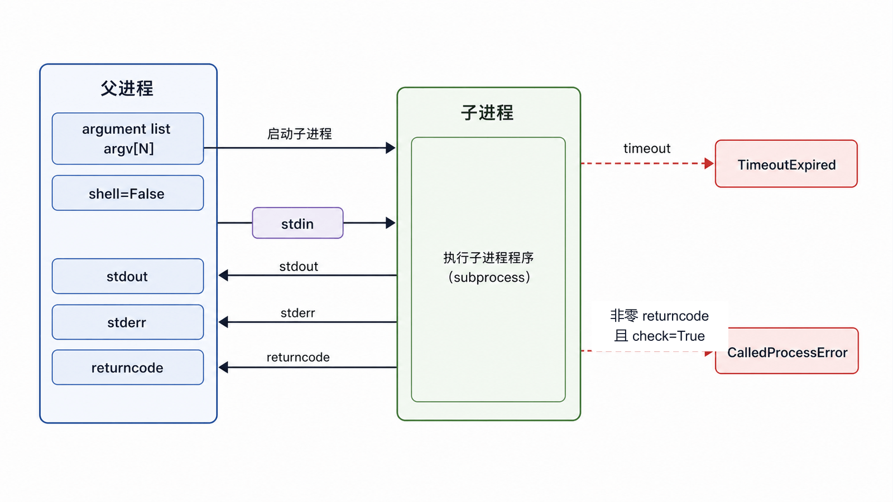
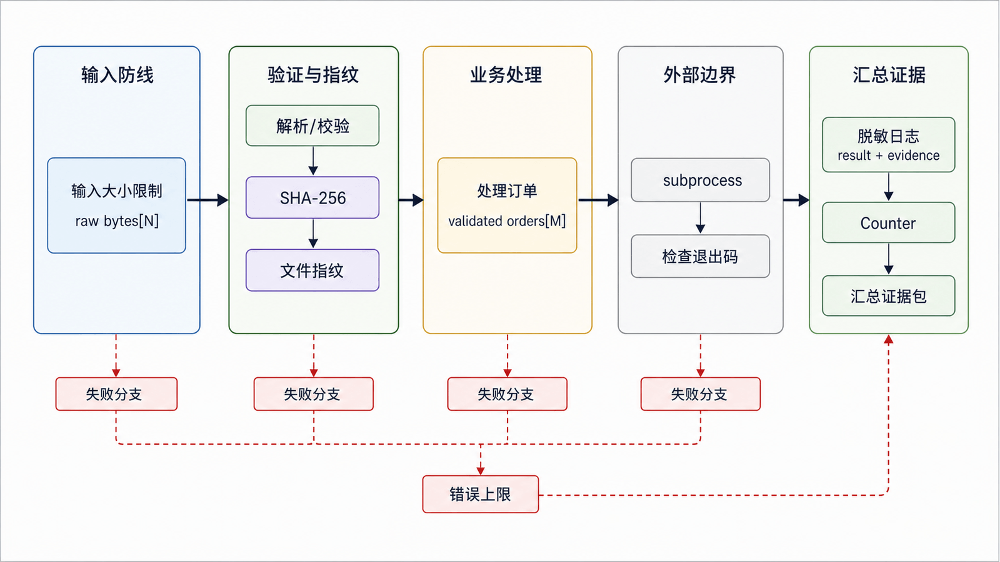

这五组模块解决不同工程问题：摘要验证完整性、子进程调用外部程序、日志保存证据、正则识别文本模式、特殊容器表达访问规律。把它们串成“万能脚本”前，必须先画出信任边界。

## 前置知识与学习目标

你应理解字节、异常、时间和迭代。学完后你应该能：

- 区分普通摘要、HMAC 与密码哈希；
- 用参数列表、超时和退出码安全调用子进程；
- 记录结构化、可诊断且不泄密的日志；
- 为简单模式选择正则，并识别回溯与输入大小风险。

## hashlib 与 hmac：完整性，不是保密

<!-- snippet: id=python-hash-stream mode=run python=3.12-3.14 deps=stdlib -->

```python
import hashlib

chunks = [b"A001,", b"39.80\n"]
digest = hashlib.sha256()
for chunk in chunks:
    digest.update(chunk)

assert digest.hexdigest() == hashlib.sha256(b"A001,39.80\n").hexdigest()
```

摘要相同不能证明内容保密，只能作为完整性指纹的一部分。需要验证“持有共享密钥的一方生成了消息”时使用 `hmac`，比较标签用 `hmac.compare_digest()`。

普通 SHA-256、MD5 加固定盐不适合存储密码；密码需要专用、可调成本的 KDF（如 `hashlib.scrypt` 或成熟认证框架），每个密码使用随机盐并保存参数。MD5/SHA-1 只应在兼容非安全协议时使用。

## subprocess：参数、超时、退出码

<!-- figure:s14-f01:start -->



<!-- figure:s14-f01:end -->

<!-- snippet: id=python-subprocess-safe-run mode=run python=3.12-3.14 deps=stdlib -->

```python
import subprocess
import sys

completed = subprocess.run(
    [sys.executable, "-I", "-c", "print('child-ok')"],
    check=True,
    capture_output=True,
    text=True,
    timeout=5,
)
assert completed.stdout.strip() == "child-ok"
```

参数用列表传递，避免 Shell 再解释；`check=True` 把非零退出码变成 `CalledProcessError`；`timeout` 限制等待；`text=True` 使用文本模式，必要时显式设置 `encoding`。只有确实需要 Shell 语法时才用 `shell=True`，并且不能拼接不可信输入。

## logging：记录事件而非拼接故事

<!-- snippet: id=python-logging-context mode=run python=3.12-3.14 deps=stdlib -->

```python
import logging

logger = logging.getLogger("order_report")
logger.addHandler(logging.NullHandler())
logger.info("order_processed id=%s count=%d", "A001", 2)
```

库代码不应擅自调用 `basicConfig()`；应用入口配置 handler、formatter、级别和轮转。异常边界用 `logger.exception(...)` 记录 traceback。令牌、密码、完整个人信息和支付数据必须脱敏或不记录。

## re：模式匹配，不是通用解析器

<!-- snippet: id=python-regex-order-line mode=run python=3.12-3.14 deps=stdlib -->

```python
import re

pattern = re.compile(r"^(?P<id>A\d{3}),(?P<status>paid|cancelled)$")
match = pattern.fullmatch("A001,paid")
assert match is not None
assert match.groupdict() == {"id": "A001", "status": "paid"}
```

需要整个字符串符合格式时用 `fullmatch`；只找第一个位置用 `search`；批量提取用 `finditer` 可避免一次构造大列表。对外部超长输入和含嵌套量词的模式要设大小边界，避免灾难性回溯。CSV、JSON、HTML 和编程语言应使用专用解析器。

## collections：让数据访问模式显式

<!-- snippet: id=python-collections-orders mode=run python=3.12-3.14 deps=stdlib -->

```python
from collections import Counter, defaultdict, deque

statuses = Counter(["paid", "paid", "cancelled"])
by_customer = defaultdict(list)
by_customer["Ada"].append("A001")
queue = deque(["A001", "A002"])

assert statuses["paid"] == 2
assert by_customer["Ada"] == ["A001"]
assert queue.popleft() == "A001"
```

`Counter` 统计频次，`defaultdict` 为缺失键创建值，`deque` 支持两端近似 O(1) 操作。若缺失键创建具有副作用，普通 `dict` 的显式分支更易审查。

## 组合为可审计任务

<!-- figure:s14-f02:start -->



<!-- figure:s14-f02:end -->

一个可靠批处理路径是：限制输入大小 → 用专用解析器/受控正则校验 → 计算 SHA-256 作为文件指纹 → 处理订单并记录事件 → 必要时以参数列表调用外部工具 → 检查退出码与输出 → 汇总 `Counter` 指标。每一步失败都应附带订单 ID 或文件指纹，而不是原始敏感内容。

## 常见误区与适用边界

- 哈希是摘要，不是加密；“加盐 MD5”仍不是现代密码存储。
- `capture_output=True` 会把全部输出放内存，大输出应流式处理或写文件。
- 根 logger 的重复 handler 会造成重复日志。
- 正则中的 `\w` 默认覆盖 Unicode 字符，不等同于 ASCII 字母数字下划线。
- `deque` 适合队列，不支持列表那样高效的中间随机访问。

## 自检题

1. 密码为什么不能直接保存 `sha256(password)`？
2. 外部命令参数来自用户时，为什么列表参数比拼接 Shell 字符串安全？
3. 校验整行订单格式应优先 `search` 还是 `fullmatch`？

<details>
<summary>参考答案</summary>

1. 普通摘要太快且缺少独立随机盐/成本参数，易被离线暴力破解；应使用密码 KDF 或认证框架。
2. 列表参数绕过 Shell 语法解释，降低注入风险。
3. `fullmatch`，它要求整段文本符合模式。

</details>

## 本篇总结

摘要、子进程、日志、正则和容器各有单一职责。可靠组合依赖信任边界、大小限制、超时、退出码、脱敏和专用解析器。

## 下一篇衔接

下一篇处理持久化与配置：在 JSON、pickle、shelve、XML、INI/TOML 和归档之间选择，并验证 schema、路径和反序列化信任边界。

## 资料来源

- [hashlib 与密码派生](https://docs.python.org/3.14/library/hashlib.html)
- [subprocess：子进程管理](https://docs.python.org/3.14/library/subprocess.html)
- [logging HOWTO](https://docs.python.org/3.14/howto/logging.html)
- [re 与 collections](https://docs.python.org/3.14/library/re.html)
