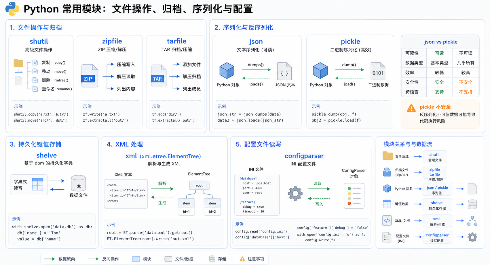

> Python 提供了丰富的标准模块来处理文件操作、序列化和配置文件。本文将详细介绍 shutil、json、pickle、shelve、xml 和 configparser 等常用模块的使用方法。



## shutil 模块

`shutil` 是高级的文件、文件夹、压缩包处理模块。

### 文件复制

```python
import shutil

# 复制文件内容
shutil.copyfileobj(open('old.xml', 'r'), open('new.xml', 'w'))

# 拷贝文件（目标文件无需存在）
shutil.copyfile('f1.log', 'f2.log')

# 仅拷贝权限
shutil.copymode('f1.log', 'f2.log')  # 目标文件必须存在

# 仅拷贝状态信息
shutil.copystat('f1.log', 'f2.log')

# 拷贝文件和权限
shutil.copy('f1.log', 'f2.log')

# 拷贝文件和状态信息
shutil.copy2('f1.log', 'f2.log')
```

### 文件夹操作

```python
# 递归拷贝文件夹（目标目录不能存在）
shutil.copytree('folder1', 'folder2', ignore=shutil.ignore_patterns('*.pyc', 'tmp*'))

# 递归拷贝（保留软链接）
shutil.copytree('f1', 'f2', symlinks=True, ignore=shutil.ignore_patterns('*.pyc', 'tmp*'))

# 递归删除文件夹
shutil.rmtree('folder1')

# 递归移动文件
shutil.move('folder1', 'folder3')
```

### 压缩包操作

```python
import shutil

# 创建压缩包
ret = shutil.make_archive("data_bak", 'gztar', root_dir='/data')

# 解压
shutil.unpack_archive("1111.zip")
```

### zipfile 模块

```python
import zipfile

# 压缩
z = zipfile.ZipFile('laxi.zip', 'w')
z.write('user_data.json')
z.close()

# 解压
z = zipfile.ZipFile("laxi.zip", "r")
z.extractall(path=".")
z.close()
```

### tarfile 模块

```python
import tarfile

# 压缩
t = tarfile.open(r'egon.tar', 'w')
t.add('/test1/a.py', arcname='a.bak')
t.add('/test1/b.py', arcname='b.bak')
t.close()

# 解压
t = tarfile.open('/tmp/egon.tar', 'r')
t.extractall('/egon')
t.close()
```

## json 与 pickle

### 什么是序列化

将原本的字典、列表等内容转换成一个字符串的过程就叫做**序列化**。

### 为什么不用 eval 反序列化

> **注意**：eval 方法安全性较低，不推荐使用。如果从文件中读出的是破坏性语句，后果不堪设想。

### 序列化的目的

1. **持久保存状态**：将数据保存到磁盘
2. **跨平台数据交互**：在不同系统/语言之间传递数据

## json 模块

JSON 是标准格式，比 XML 更快，可以在 Web 页面中直接读取。

### JSON 与 Python 数据类型对应

| JSON 类型 | Python 类型 |
|-----------|------------|
| `{}` | 字典 dict |
| `[]` | 列表 list |
| `string ""` | 字符串 str |
| `int/float` | int/float |
| `true/false` | True/False |
| `null` | None |

### json 模块核心函数

```python
import json

dic = {'k1': 'v1', 'k2': 'v2', 'k3': 'v3'}

# dumps：序列化（字典转字符串）
str_dic = json.dumps(dic)
print(type(str_dic), str_dic)
# <class 'str'> {"k3": "v3", "k1": "v1", "k2": "v2"}

# loads：反序列化（字符串转字典）
dic2 = json.loads(str_dic)
print(type(dic2), dic2)
# <class 'dict'> {'k1': 'v1', 'k2': 'v2', 'k3': 'v3'}

# dump：写入文件
f = open('json_file', 'w')
json.dump(dic, f)
f.close()

# load：读取文件
f = open('json_file')
dic2 = json.load(f)
f.close()
```

### ensure_ascii 参数

```python
import json

f = open('file', 'w')

# 中文显示
json.dump({'国籍': '中国'}, f)
json.dump({'国籍': '美国'}, f, ensure_ascii=False)

f.close()
```

### 其他参数说明

```python
import json

data = {'username': ['李华', '二愣子'], 'sex': 'male', 'age': 16}
json_dic = json.dumps(data, sort_keys=True, indent=2, separators=(',', ':'), ensure_ascii=False)
print(json_dic)
```

| 参数 | 说明 |
|------|------|
| `skipkeys` | 跳过非基本类型的 key |
| `ensure_ascii` | 是否使用 ASCII 编码 |
| `indent` | 缩进空格数 |
| `separators` | 分隔符元组 |
| `sort_keys` | 是否排序 keys |

## pickle 模块

`pickle` 支持 Python 中所有的数据类型。

```python
import pickle

user = {"name": "高跟", "password": "123", "height": 1.5, "hobby": ["吃", "喝", "赌", "飘", {1, 2, 3}]}

# dumps：序列化为字节
userbytes = pickle.dumps(user)

# loads：反序列化
user = pickle.loads(userbytes)

# dump：直接序列化到文件
with open("userdb.pkl", "wb") as f:
    pickle.dump(user, f)

# load：从文件反序列化
with open("userdb.pkl", "rb") as f:
    user = pickle.load(f)
```

> **注意**：pickle 序列化的数据只能被 Python 读取，无法与其他语言通用。

## shelve 模块

`shelve` 类似字典，可以直接对数据进行修改。

```python
import shelve

user = {"name": "高根"}

# 写入
s = shelve.open("userdb.shv")
s["user"] = user
s.close()

# 修改（需要 writeback=True）
s = shelve.open("userdb.shv", writeback=True)
print(s["user"])
s["user"]["age"] = 20
s.close()
```

## xml 模块

XML 是实现不同语言或程序之间数据交换的协议。

```python
import xml.etree.ElementTree as ET

# 解析 XML 文件
tree = ET.parse("d.xml")
root = tree.getroot()

# 获取所有人的年龄
for item in root.iter("age"):
    print(item.tag)      # 标签名称
    print(item.attrib)   # 标签的属性
    print(item.text)     # 文本内容

# find：找到第一个
print(root.find("age").attrib)

# findall：找到所有
print(root.findall("age"))

# 获取属性
stu = root.find("stu")
print(stu.get("age"))
print(stu.get("name"))

# 删除子标签
root.remove(stu)

# 添加子标签
newTag = ET.Element("新标签", {"属性": "值"})
root.append(newTag)

# 写入文件
tree.write("f.xml", encoding="utf-8")
```

### 创建 XML 文档

```python
import xml.etree.ElementTree as ET

new_xml = ET.Element("namelist")
name = ET.SubElement(new_xml, "name", attrib={"enrolled": "yes"})
age = ET.SubElement(name, "age", attrib={"checked": "no"})
sex = ET.SubElement(name, "sex")
sex.text = '33'

et = ET.ElementTree(new_xml)
et.write("test.xml", encoding="utf-8", xml_declaration=True)
```

## configparser 模块

`configparser` 用于处理配置文件，格式类似 Windows INI 文件。

### 配置文件示例

```ini
[db]
db_port = 3306
db_user = root
db_host = 127.0.0.1
db_pass = xgmtest

[concurrent]
processor = 20
thread = 10
```

### 读取配置

```python
import configparser

config = configparser.ConfigParser()
config.read('a.cfg')

# 查看所有标题
print(config.sections())

# 查看标题下的所有 key
print(config.options('section1'))

# 查看所有 key-value
print(config.items('section1'))

# 获取值
print(config.get('section1', 'user'))
print(config.getint('section1', 'age'))
print(config.getboolean('section1', 'is_admin'))
```

### 修改配置

```python
import configparser

config = configparser.ConfigParser()
config.read('a.cfg', encoding='utf-8')

# 删除标题
config.remove_section('section2')

# 删除选项
config.remove_option('section1', 'k1')

# 判断是否存在
print(config.has_section('section1'))
print(config.has_option('section1', 'user'))

# 添加标题和选项
config.add_section('egon')
config.set('egon', 'name', 'egon')
config.set('egon', 'age', '18')  # 必须是字符串

# 写入文件
config.write(open('a.cfg', 'w'))
```

## 小结

| 模块 | 用途 | 跨平台 |
|------|------|--------|
| **shutil** | 高级文件/文件夹操作 | 是 |
| **json** | 序列化（标准格式） | 是 |
| **pickle** | 序列化（Python 专用） | 否 |
| **shelve** | 持久化字典 | 否 |
| **xml** | XML 解析 | 是 |
| **configparser** | 配置文件处理 | 是 |

掌握这些模块的使用，可以帮助你更好地处理文件操作、数据序列化和配置管理。
