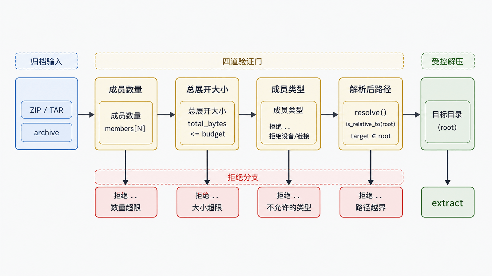
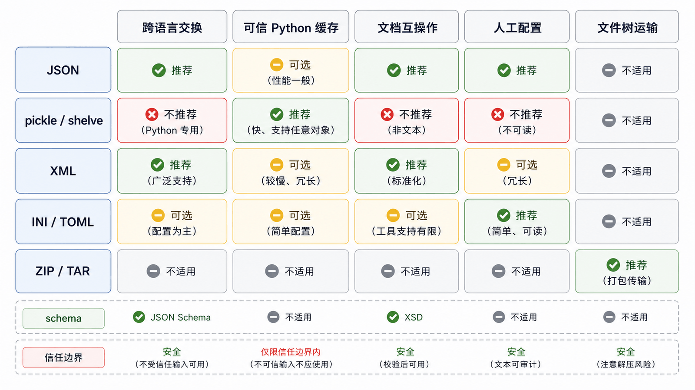

序列化选择首先取决于信任边界和兼容性，而不是“哪种能保存更多 Python 对象”。外部数据必须先限制大小、再解析、再验证结构；解析成功不等于业务有效。

## 前置知识与学习目标

你应理解文件、异常、路径和摘要。学完后你应该能：

- 按交换、内部缓存和配置需求选择格式；
- 对 JSON 结果做 schema 级校验；
- 明确 pickle/shelve 的代码执行风险；
- 在复制、删除和解压前验证目标路径。

## JSON：交换格式，解析后仍需验证

<!-- snippet: id=python-json-validated-roundtrip mode=run python=3.12-3.14 deps=stdlib -->

```python
import json

payload = '{"id":"A001","status":"paid","items":[{"quantity":2}]}'
order = json.loads(payload)

if not isinstance(order, dict) or not isinstance(order.get("id"), str):
    raise ValueError("invalid order shape")
if order.get("status") not in {"paid", "cancelled"}:
    raise ValueError("invalid status")
if not all(isinstance(item.get("quantity"), int) for item in order.get("items", [])):
    raise ValueError("invalid items")

encoded = json.dumps(order, ensure_ascii=False, sort_keys=True)
assert json.loads(encoded) == order
```

JSON 只定义对象、数组、字符串、数字、布尔和空值。`Decimal`、日期时间和自定义类需要明确编码协议；不要依赖 `default=str` 静默丢失类型语义。

## pickle 与 shelve：只接受可信数据

`pickle.loads()` 可在反序列化时导入模块并调用构造逻辑，因此恶意数据可能执行任意代码。它只适合同一信任域内、由当前应用生成并受完整性保护的数据；上传文件、Cookie、消息队列和网络缓存都不能直接反序列化。`shelve` 内部使用 pickle，风险相同，并且不提供并发数据库事务保证。

签名只能帮助发现篡改，不能解决密钥泄露、旧对象代码变化和长期兼容性。普通业务数据优先 JSON 或带 schema 的格式。

## XML：解析器选择与实体边界

`xml.etree.ElementTree` 适合受控 XML，但外部 XML 还需限制大小、深度和实体处理；高风险输入使用经过加固的解析方案。不要用正则解析 XML。

<!-- snippet: id=python-xml-small-document mode=run python=3.12-3.14 deps=stdlib -->

```python
from xml.etree import ElementTree as ET

root = ET.fromstring('<order id="A001"><status>paid</status></order>')
assert root.tag == "order"
assert root.get("id") == "A001"
assert root.findtext("status") == "paid"
```

## 配置：INI、TOML 与环境变量

`configparser` 读取 INI，所有原始值都是字符串，再用 `getint`/`getboolean` 等转换。`tomllib` 读取 TOML 并保留更多基础类型，但 Python 标准库只提供读取。机密值优先由部署环境的密钥系统注入，不提交到配置文件。

<!-- snippet: id=python-configparser-typed-read mode=run python=3.12-3.14 deps=stdlib -->

```python
from configparser import ConfigParser
from io import StringIO

config = ConfigParser()
config.read_file(StringIO("[report]\nworkers=2\nstrict=yes\n"))
workers = config.getint("report", "workers")
strict = config.getboolean("report", "strict")
assert (workers, strict) == (2, True)
```

配置必须定义默认值、必填项、范围和优先级，例如“命令行 > 环境变量 > 文件 > 内置默认”。

## shutil 与安全归档

<!-- figure:s15-f02:start -->



<!-- figure:s15-f02:end -->

`shutil` 负责复制、移动、删除和归档。递归删除前解析并确认绝对目标仍位于允许根目录。解压外部 ZIP/TAR 前限制成员数量、展开后总大小和单文件大小，并拒绝绝对路径、`..` 逃逸、设备文件和不期望的符号链接。

<!-- snippet: id=python-archive-path-check mode=run python=3.12-3.14 deps=stdlib -->

```python
from pathlib import Path
from tempfile import TemporaryDirectory

with TemporaryDirectory() as tmp:
    root = Path(tmp).resolve()
    member = Path("reports/2026-07.txt")
    target = (root / member).resolve()
    if not target.is_relative_to(root):
        raise ValueError("archive member escapes destination")
    assert target.is_relative_to(root)
```

这只是路径检查核心；完整解压还要逐成员检查类型、数量和大小。

## 格式选择矩阵

<!-- figure:s15-f01:start -->



<!-- figure:s15-f01:end -->

| 需求                 | 推荐          | 主要边界                 |
| -------------------- | ------------- | ------------------------ |
| 跨语言 API/文件      | JSON          | schema、数字精度、大小   |
| 受控 Python 临时缓存 | pickle/shelve | 仅可信输入、版本耦合     |
| 文档型互操作         | XML           | 实体、深度、大小         |
| 简单人工配置         | INI           | 值默认是字符串           |
| 结构化项目配置       | TOML          | 标准库只读               |
| 文件树运输           | ZIP/TAR       | 路径穿越、解压炸弹、链接 |

## 常见误区与适用边界

- JSON 对象键在协议中是字符串，整数键往返后语义会改变。
- `pickle` 不是“更高级 JSON”，也不适合长期公共格式。
- `shelve(writeback=True)` 会缓存访问对象并在关闭时回写，可能消耗大量内存。
- 写配置应使用 `with open(...)`，并采用第 6 篇的原子替换流程。
- 复制元数据用 `copy2` 也不能保证所有平台保留 ACL、所有者等完整语义。

## 自检题

1. `json.loads()` 成功后为什么仍要校验字段类型和范围？
2. 给 pickle 加 HMAC 后，能否安全加载任意互联网来源数据？
3. 解压归档时仅检查文件名不以 `/` 开头为什么不够？

<details>
<summary>参考答案</summary>

1. JSON 只保证语法结构，不保证业务 schema。
2. 不能。只有由受信方生成且密钥和流程可靠的数据才可考虑；pickle 本质仍能执行代码且版本耦合。
3. `..`、符号链接、驱动器路径等仍可能逃逸目标目录，还需解析后检查及成员类型/大小限制。

</details>

## 本篇总结

格式选择由信任、兼容和 schema 决定。解析前限制资源，解析后验证结构；反序列化和归档解压都必须视为安全边界。

## 下一篇衔接

最后一篇把前面能力汇总成可测试文本清洗流水线：规范化换行、切分字段、精确去前后缀、正则提取和结构化错误报告。

## 资料来源

- [json 与 pickle](https://docs.python.org/3.14/library/json.html)
- [pickle 安全警告](https://docs.python.org/3.14/library/pickle.html)
- [XML 安全注意事项](https://docs.python.org/3.14/library/xml.html#xml-security)
- [shutil 与归档操作](https://docs.python.org/3.14/library/shutil.html)
