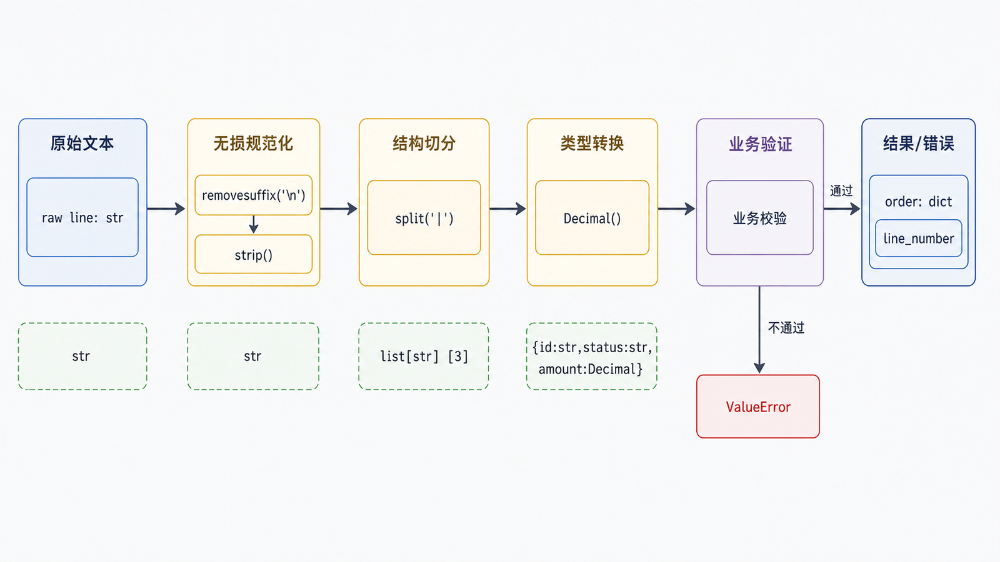
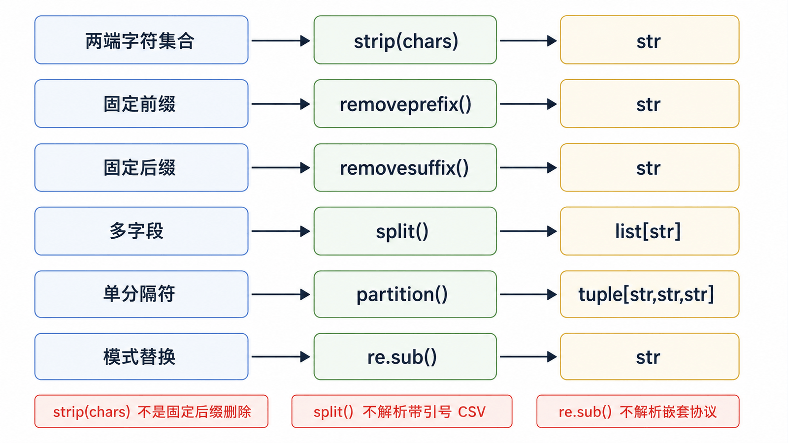

文本清洗不是“多写几个 replace”，而是一条有顺序、有输入合同、有失败输出的流水线。过度清洗会把坏数据伪装成好数据，因此每一步都应说明允许改变什么。

## 前置知识与学习目标

你应理解字符串不可变、文件编码、异常、正则和 JSON schema。学完后你应该能：

- 设计“规范化—切分—转换—验证—输出”流水线；
- 区分字符集合剥离、固定前后缀删除和分隔符切分；
- 用 `re.sub` 的捕获组或替换函数完成受控变换；
- 为清洗结果保留行号、原始片段和失败原因。

## 先定义输入合同

假设每行格式为：`订单号 | 状态 | 金额`，例如 `A001 | PAID | 39.80`。允许字段两侧空白和大小写差异，不允许缺字段、多字段、负金额或未知状态。

## 一条可运行的清洗流水线

<!-- figure:s16-f01:start -->



<!-- figure:s16-f01:end -->

<!-- snippet: id=python-text-order-pipeline mode=run python=3.12-3.14 deps=stdlib -->

```python
from decimal import Decimal, InvalidOperation

def parse_order_line(raw: str, *, line_number: int) -> dict[str, object]:
    normalized = raw.removesuffix("\n")
    fields = [field.strip() for field in normalized.split("|")]
    if len(fields) != 3:
        raise ValueError(f"line {line_number}: expected 3 fields")

    order_id, status, amount_text = fields
    status = status.lower()
    if not order_id or status not in {"paid", "cancelled"}:
        raise ValueError(f"line {line_number}: invalid id or status")
    try:
        amount = Decimal(amount_text)
    except InvalidOperation as exc:
        raise ValueError(f"line {line_number}: invalid amount") from exc
    if amount < 0:
        raise ValueError(f"line {line_number}: negative amount")
    return {"id": order_id, "status": status, "amount": amount}

order = parse_order_line(" A001 | PAID | 39.80\n", line_number=1)
assert order == {"id": "A001", "status": "paid", "amount": Decimal("39.80")}
```

中间状态依次为：原始行 `str` → 去单个换行的 `str` → 三字段 `list[str]` → 转换后的 `dict`。失败信息带行号，但不记录完整敏感原文。

## strip、前后缀与空白规范化

<!-- figure:s16-f02:start -->



<!-- figure:s16-f02:end -->

`strip()` 无参数时移除两端 Unicode 空白；`strip(chars)` 把参数当字符集合反复剥离，不是删除固定字符串。

<!-- snippet: id=python-strip-vs-prefix mode=run python=3.12-3.14 deps=stdlib -->

```python
assert "www.example.com".strip("com.") == "www.example"
assert "prefix-value".removeprefix("prefix-") == "value"
assert "report.txt".removesuffix(".txt") == "report"
```

读取行时若只想去换行，用 `removesuffix("\n")` 或 `rstrip("\r\n")`；直接 `strip()` 可能删掉业务有意义的首尾空格。

## split、rsplit 与 partition

- `split(sep, maxsplit)` 返回列表，适合字段数可验证的记录；
- `rsplit` 从右侧开始，适合左侧内容可能含分隔符；
- `partition(sep)` 永远返回 `(before, sep_or_empty, after)`，适合只切一次并显式检查分隔符是否存在；
- 无参数 `split()` 会把连续空白视为一个分隔区，并忽略两端空白。

<!-- snippet: id=python-partition-contract mode=run python=3.12-3.14 deps=stdlib -->

```python
key, separator, value = "status=paid".partition("=")
if not separator:
    raise ValueError("missing '='")
assert (key, value) == ("status", "paid")
```

CSV 的引号、转义和换行不能用 `split(",")` 正确处理，应使用 `csv` 模块。

## replace 与 re.sub

固定文本替换用 `str.replace`；需要模式、分组或条件替换时用 `re.sub`。

<!-- snippet: id=python-regex-controlled-rewrite mode=run python=3.12-3.14 deps=stdlib -->

```python
import re

text = "orderId=A001; userName=Ada"
snake = re.sub(r"([a-z0-9])([A-Z])", r"\1_\2", text).lower()
assert snake == "order_id=a001; user_name=ada"

masked = re.sub(r"(?<=A)\d{2}(?=\d)", "**", "A001")
assert masked == "A**1"
```

替换字符串中的反斜杠有独立语义；复杂替换优先传函数并使用 `match.group()`，可读性更高。

## 不要把验证变成修复

把未知状态一律替换为 `paid`、删掉负号、移除所有非 ASCII 字符，都会制造错误数据。可无损规范化的内容包括明确允许的大小写、换行和字段周边空白；会改变业务语义的内容应拒绝并进入人工修复流程。

## 批量处理与错误报告

<!-- snippet: id=python-text-batch-errors mode=compile python=3.12-3.14 deps=stdlib -->

```python
lines = ["A001|paid|10\n", "broken\n", "A003|cancelled|0\n"]
accepted, errors = [], []
for number, line in enumerate(lines, start=1):
    try:
        accepted.append(parse_order_line(line, line_number=number))
    except ValueError as exc:
        errors.append({"line": number, "error": str(exc)})

assert [row["id"] for row in accepted] == ["A001", "A003"]
assert errors[0]["line"] == 2
```

是否“遇错即停”或“收集全部错误”是产品决策；批处理通常需要错误上限，避免恶意输入制造无限报告。

## 常见误区与适用边界

- 切片按 Unicode 代码点索引，不等于用户看到的字素簇；复杂自然语言界面需专用库。
- `\w`、大小写转换和 Unicode 规范化具有语言边界；身份标识不要随意 `lower()`。
- 正则适合局部模式，不适合嵌套语法和完整结构化协议。
- 先限制输入行长度，再运行可能回溯的正则。
- 清洗流水线应幂等：对已清洗结果再运行，不应继续改变语义。

## 自检题

1. 为什么 `strip(".txt")` 不能用于删除文件扩展名？
2. 有引号和嵌入逗号的 CSV 为什么不能用 `split(",")`？
3. 清洗中为什么应保留行号和失败原因，而不是静默丢弃坏行？

<details>
<summary>参考答案</summary>

1. `strip` 把参数当字符集合从两端反复删除；固定后缀应使用 `removesuffix`。
2. CSV 有引号、转义和跨行字段语法，需要专用解析器维护状态。
3. 便于审计、修复和统计数据质量，避免坏数据被误当作成功处理。

</details>

## 本篇总结

可靠文本处理从合同开始，按顺序完成规范化、切分、转换与验证，并把失败作为结构化输出。只做无损规范化，不把语义错误“洗白”。

## 下一篇衔接

Python 基础系列到此形成完整闭环。建议把 `order_report` 拆成包并加入命令行入口、样例 JSONL、单元测试和日志，然后进入面向对象、迭代器/生成器、类型检查或测试工程专题。

## 资料来源

- [Python 文本序列类型 str](https://docs.python.org/3.14/library/stdtypes.html#text-sequence-type-str)
- [re：正则表达式操作](https://docs.python.org/3.14/library/re.html)
- [csv：CSV 文件读写](https://docs.python.org/3.14/library/csv.html)
- [Unicode HOWTO](https://docs.python.org/3.14/howto/unicode.html)
