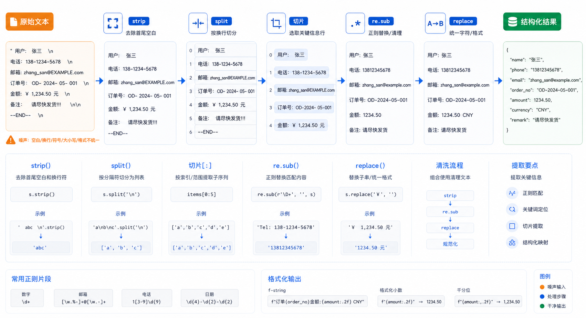

## 概述

文本处理是 Python 编程中最常见的需求之一。本教程将介绍四种最实用的文本处理技巧：

| 方法 | 用途 | 示例 |
|------|------|------|
| **字符串切割** | 按位置或分隔符拆分字符串 | `split()`, 切片 `str[start:end]` |
| **replace()** | 简单字符串替换 | `str.replace('旧', '新')` |
| **re.sub()** | 复杂的正则表达式替换 | `re.sub(r'正则', '替换', str)` |
| **strip()** | 去除字符串两端的空白字符 | `str.strip()` |



---

## 字符串切割

字符串切割主要有两种方式：**按分隔符切割** 和 **按位置切片**。

### 按分隔符切割：split()

`split()` 方法将字符串按照分隔符拆分成列表。

<!-- snippet: id=python-article-14a89b9fa1-01 mode=compile python=3.12-3.14 deps=stdlib -->
```python
# 基本语法：字符串.split(分隔符, 最大分割次数)
text = "苹果,香蕉,橙子,葡萄"

# 默认按空格分割
result = text.split(",")
print(result)  # ['苹果', '香蕉', '橙子', '葡萄']

# 指定分隔符和最大分割次数
text2 = "one|two|three|four|five"
result2 = text2.split("|", 2)  # 最多分割2次，产生3个元素
print(result2)  # ['one', 'two', 'three|four|five']
```

### 按位置切片

使用方括号 `[start:end]` 可以按位置截取字符串的某部分。

<!-- snippet: id=python-article-14a89b9fa1-02 mode=compile python=3.12-3.14 deps=stdlib -->
```python
text = "Hello World"

# 截取前5个字符
print(text[0:5])   # "Hello"
print(text[:5])    # "Hello"（省略起始位置默认为0）

# 截取第6个字符到最后
print(text[6:])    # "World"

# 从倒数第5个字符开始
print(text[-5:])    # "World"

# 逆序（步进为-1）
print(text[::-1])   # "dlroW olleH"
```

**切片语法详解：**

<!-- snippet: id=python-article-14a89b9fa1-03 mode=compile python=3.12-3.14 deps=stdlib -->
```python
字符串[start:end:step]
# start: 起始索引（包含）
# end: 结束索引（不包含）
# step: 步长（默认为1）

# 示例：every 2nd character from index 0 to 10
text = "ABCDEFGHIJ"
print(text[0:10:2])  # "ACEGI"
```

### 实战：处理带前缀的文本

假设有一批数据，每行都以序号开头（格式：`001: 内容`），我们需要去掉序号。

<!-- snippet: id=python-article-14a89b9fa1-04 mode=compile python=3.12-3.14 deps=stdlib -->
```python
lines = ["001: 第一条数据", "002: 第二条数据", "003: 第三条数据"]

cleaned_lines = []
for line in lines:
    # 方法1：使用切片去掉前4个字符
    # cleaned = line[4:]

    # 方法2：使用 split 按 ":" 分割后取第二部分
    cleaned = line.split(": ", 1)[1]  # maxsplit=1 只分割一次
    cleaned_lines.append(cleaned)

print(cleaned_lines)
# ['第一条数据', '第二条数据', '第三条数据']
```

---

## 字符串替换

### 简单替换：replace()

`replace()` 用于简单的字符串替换，不需要正则表达式。

<!-- snippet: id=python-article-14a89b9fa1-05 mode=compile python=3.12-3.14 deps=stdlib -->
```python
# 语法：字符串.replace(要替换的字符, 新字符, 替换次数)
text = "Hello World"

# 基本替换
result = text.replace("World", "Python")
print(result)  # "Hello Python"

# 替换空格为其他字符
text2 = "We Are Happy"
result2 = text2.replace(" ", "20%")
print(result2)  # "We20%Are20%Happy"

# 限制替换次数（从左到右最多替换max次）
text3 = "aaa bbb aaa ccc"
result3 = text3.replace("aaa", "XXX", 1)  # 只替换第一个
print(result3)  # "XXX bbb aaa ccc"
```

### 复杂替换：re.sub()

`re.sub()` 是正则表达式替换，功能更强大。

<!-- snippet: id=python-article-14a89b9fa1-06 mode=compile python=3.12-3.14 deps=stdlib -->
```python
import re

# 语法：re.sub(pattern, repl, string, count=0, flags=0)
# pattern: 正则表达式模式
# repl: 替换文本（可以是字符串或函数）
# string: 要处理的原始字符串
```

**参数说明：**

| 参数 | 说明 | 必选 |
|------|------|------|
| `pattern` | 正则表达式模式字符串 | ✅ |
| `repl` | 替换后的文本（字符串或函数） | ✅ |
| `string` | 要处理的原始字符串 | ✅ |
| `count` | 最大替换次数，0表示全部替换 | ❌ |
| `flags` | 正则标志位（如 `re.IGNORECASE`） | ❌ |

**基础示例：**

<!-- snippet: id=python-article-14a89b9fa1-07 mode=compile python=3.12-3.14 deps=stdlib -->
```python
import re

text = "We Are Happy"

# 将空格替换为 20%
pattern = re.compile(r' ')  # r'' 表示原始字符串，避免转义
result = re.sub(pattern, '20%', text)
print(result)  # "We20%Are20%Happy"

# 也可以直接写正则表达式
result2 = re.sub(r' ', '20%', text)
print(result2)  # "We20%Are20%Happy"
```

**多种模式的替换：**

<!-- snippet: id=python-article-14a89b9fa1-08 mode=compile python=3.12-3.14 deps=stdlib -->
```python
import re

# 替换所有数字
text = "订单号: A123, 价格: 456元, 数量: 7"
result = re.sub(r'\d+', '***', text)
print(result)  # "订单号: A***, 价格: ***元, 数量: ***"

# 替换所有非字母字符
text2 = "Hello! Are you ok? Yes!"
result2 = re.sub(r'[^a-zA-Z]', ' ', text2)
print(result2)  # "Hello  Are you ok  Yes "

# 替换连续空格为单个空格
text3 = "Hello    World   !"
result3 = re.sub(r' +', ' ', text3)  # 一个或多个空格
print(result3)  # "Hello World !"
```

**使用捕获组：**

<!-- snippet: id=python-article-14a89b9fa1-09 mode=compile python=3.12-3.14 deps=stdlib -->
```python
import re

# 捕获组：用括号 () 包裹的部分会被捕获
# $1, $2 表示第1、2个捕获组的内容
text = "手机：iPhone，价格：6999"
result = re.sub(r'：([^，]+)', r' -> \1', text)
print(result)  # "手机 -> iPhone，价格 -> 6999"

# 交换两个单词的位置
text2 = "John Smith"
result2 = re.sub(r'(\w+) (\w+)', r'\2 \1', text2)
print(result2)  # "Smith John"

# 将日期格式从 2024-01-15 转换为 15/01/2024
text3 = "日期: 2024-01-15"
result3 = re.sub(r'(\d{4})-(\d{2})-(\d{2})', r'\3/\2/\1', text3)
print(result3)  # "日期: 15/01/2024"
```

**使用函数作为替换规则：**

<!-- snippet: id=python-article-14a89b9fa1-10 mode=compile python=3.12-3.14 deps=stdlib -->
```python
import re

# 批量添加序号
def add_number(match):
    """为每个匹配添加序号"""
    return f"[{match.group(0)}]"

text = "苹果 香蕉 橙子"
result = re.sub(r'\w+', add_number, text)
print(result)  # "[苹果] [香蕉] [橙子]"

# 将数字乘以2
def double(match):
    return str(int(match.group(0)) * 2)

text2 = "价格: 100元, 数量: 5个"
result2 = re.sub(r'\d+', double, text2)
print(result2)  # "价格: 200元, 数量: 10个"

# 驼峰命名转下划线
def to_snake(match):
    word = match.group(0)
    return word.lower()

text3 = "userName, userAge, userEmail"
result3 = re.sub(r'[A-Z]', to_snake, text3)
print(result3)  # "user_name, user_age, user_email"（需进一步处理）
```

---

## 去除空白字符：strip()

`strip()` 系列函数用于去除字符串两端的空白字符。

### 基本用法

<!-- snippet: id=python-article-14a89b9fa1-11 mode=compile python=3.12-3.14 deps=stdlib -->
```python
text = "  Hello World  "

# 去除两端的空格
print(text.strip())   # "Hello World"

# 去除左端的空格
print(text.lstrip())  # "Hello World  "

# 去除右端的空格
print(text.rstrip())  # "  Hello World"
```

### 去除指定字符

<!-- snippet: id=python-article-14a89b9fa1-12 mode=compile python=3.12-3.14 deps=stdlib -->
```python
# strip() 可以去除自定义的字符集（按顺序逐个去除）
text = "...Hello World..."

# 去除两端的点
print(text.strip('.'))   # "Hello World..."

# 去除左端的点
print(text.lstrip('.'))  # "Hello World..."

# 去除右端的点
print(text.rstrip('.'))  # "...Hello World"

# 去除多个字符
text2 = "...Hello!!!"
print(text2.strip('.!'))  # "Hello"（依次去除 . 和 !）

# 去除行首的行号和空格，如 "1. " 或 "① "
text3 = "1. 第一条内容\n2. 第二条内容"
lines = text3.split('\n')
for line in lines:
    print(line.lstrip('0123456789. '))
# 输出:
# 第一条内容
# 第二条内容
```

### 实战：处理文件读取的每一行

从文件读取的文本通常包含换行符 `\n`，需要去除。

<!-- snippet: id=python-article-14a89b9fa1-13 mode=compile python=3.12-3.14 deps=stdlib -->
```python
# 读取文件并清理每一行
with open('data.txt', 'r', encoding='utf-8') as f:
    for line in f:
        line = line.strip()  # 去除换行符和前后空格
        if line:  # 跳过空行
            print(line)
```

---

## 综合实战

### 实战1：清洗用户数据

<!-- snippet: id=python-article-14a89b9fa1-14 mode=compile python=3.12-3.14 deps=stdlib -->
```python
import re

# 模拟从表单获取的用户数据
raw_data = """
   用户名    ：  ZhangSan
   邮箱      ：  zhangsan@example.com
   电话      ：  138-0013-8000
"""

# 清洗数据：去除多余空格和格式符号
def clean_data(text):
    # 1. 去除行首行尾空白
    text = text.strip()
    # 2. 去除多余空格（两个以上空格合并为一个）
    text = re.sub(r' +', ' ', text)
    # 3. 去除格式符号（：:）
    text = re.sub(r'[:：]', ':', text)
    # 4. 统一空格
    text = re.sub(r'\s+:\s+', ': ', text)
    return text

result = clean_data(raw_data)
print(result)
```

### 实战2：提取文本中的关键信息

<!-- snippet: id=python-article-14a89b9fa1-15 mode=compile python=3.12-3.14 deps=stdlib -->
```python
import re

log_text = """
[2024-01-15 10:30:45] INFO: 用户登录成功 - user_id: 1001
[2024-01-15 10:31:20] ERROR: 数据库连接失败 - host: localhost:3306
[2024-01-15 10:32:01] WARNING: 内存使用率超过 80%
"""

# 提取所有时间戳
timestamps = re.findall(r'\d{4}-\d{2}-\d{2} \d{2}:\d{2}:\d{2}', log_text)
print("时间戳:", timestamps)

# 提取日志级别和消息
pattern = r'\[.*?\]\s+(\w+):\s+(.*?)(?=\n|$)'
matches = re.findall(pattern, log_text)
for level, message in matches:
    print(f"级别: {level:8} | 消息: {message}")

# 提取 user_id
user_ids = re.findall(r'user_id:\s*(\d+)', log_text)
print("用户ID:", user_ids)
```

### 实战3：格式化代码

<!-- snippet: id=python-article-14a89b9fa1-16 mode=compile python=3.12-3.14 deps=stdlib -->
```python
import re

# 清理混乱的CSV数据
raw_csv = """
  姓名,   年龄,  城市
  张三,   25,   北京
  李四,  30,   上海
  王五,   28,  广州
"""

# 方法1：使用 split 和 strip 组合
def clean_csv_v1(text):
    lines = text.strip().split('\n')
    result = []
    for line in lines:
        # 按逗号分割，并清理每个字段
        fields = [f.strip() for f in line.split(',')]
        result.append(','.join(fields))
    return '\n'.join(result)

# 方法2：使用正则替换
def clean_csv_v2(text):
    # 先统一逗号周围的空格
    text = re.sub(r'\s*,\s*', ',', text)
    # 去除行首行尾空白
    text = re.sub(r'\n\s+', '\n', text.strip())
    return text

print(clean_csv_v1(raw_csv))
print("---")
print(clean_csv_v2(raw_csv))
```

---

## 小结

| 方法 | 使用场景 | 示例 |
|------|----------|------|
| `split()` | 按分隔符拆分字符串 | `"a,b,c".split(",")` |
| `[start:end]` | 按位置切片 | `"hello"[1:4]` |
| `replace()` | 简单文本替换 | `"hi".replace("i","ey")` |
| `re.sub()` | 正则表达式替换 | `re.sub(r'\d+', '*', s)` |
| `strip()` | 去除两端空白/字符 | `" hi ".strip()` |

> 💡 **提示**：如果只是简单的字符串替换，用 `replace()` 就够了；如果需要匹配模式（如数字、邮箱、日期等），则使用 `re.sub()`。
