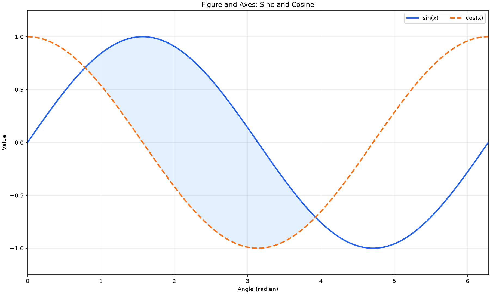
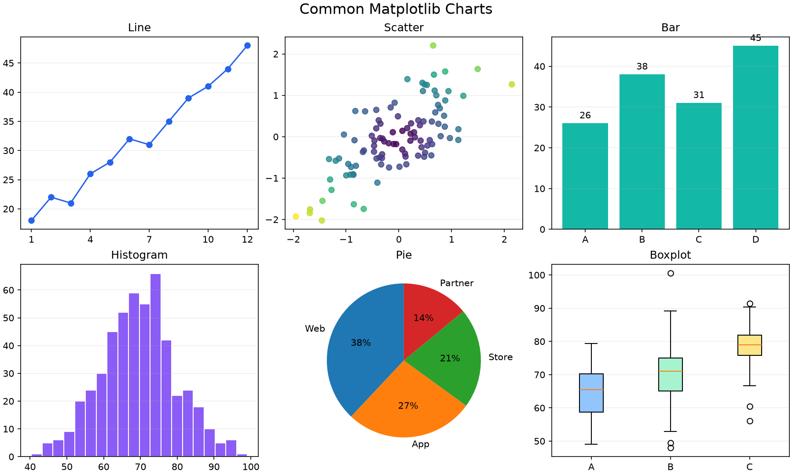
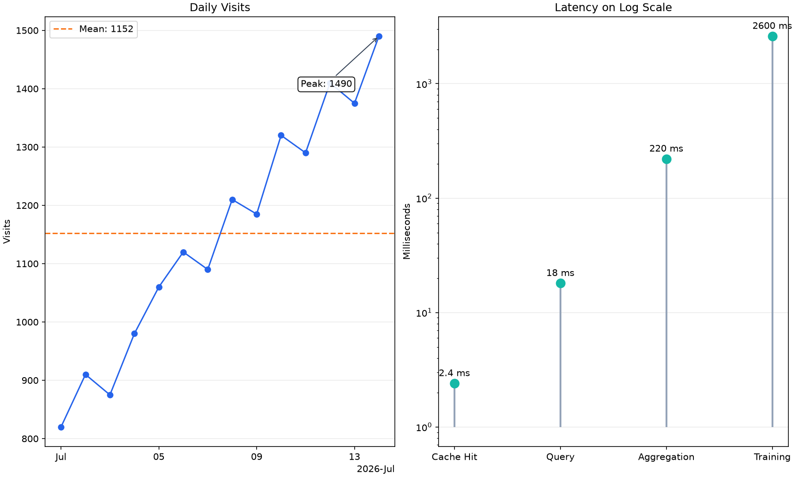
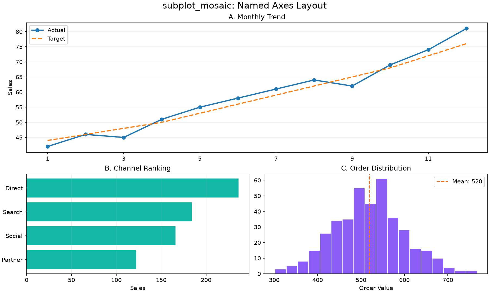
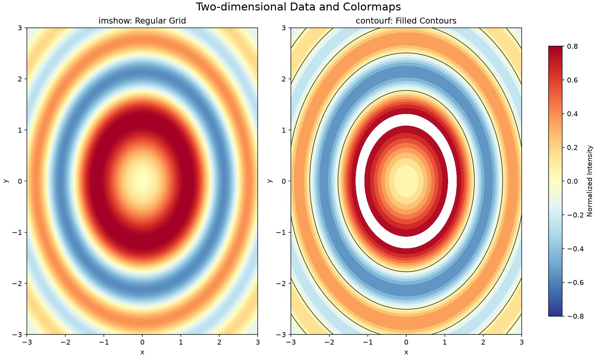
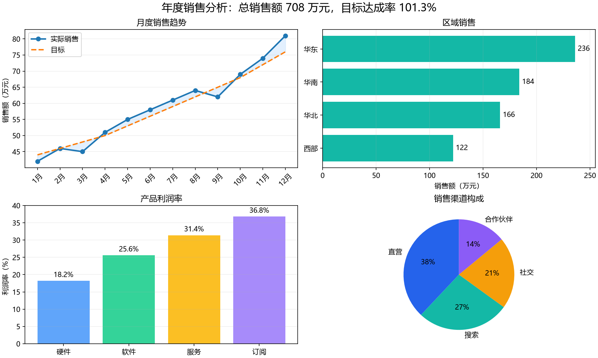

# Matplotlib 完全指南 - 数据可视化与图表绘制

## 简介

Matplotlib 是 Python 生态中最基础、最灵活的数据可视化库。它可以把
NumPy 数组、日期、分类数据等转换为折线图、散点图、柱状图、统计图和
二维颜色图，也是 Pandas、Seaborn 等可视化工具的重要基础。

### 核心特性

- **图表类型丰富**：覆盖常见的统计图、工程图和科学计算图
- **高度可定制**：可以控制颜色、线型、刻度、图例、注释和布局
- **面向对象接口**：通过 Figure 和 Axes 精确管理复杂图表
- **NumPy 集成**：可以直接绘制一维数组和二维矩阵
- **多种输出格式**：支持 PNG、SVG、PDF 等图片格式
- **跨平台后端**：既能交互显示，也能在服务器批量生成图片

### 应用场景

- **数据分析**：快速观察趋势、分布、相关性和异常值
- **科学研究**：展示实验数据、函数曲线、误差和二维场
- **业务报告**：绘制销售趋势、区域对比和指标仪表板
- **时间序列**：展示访问量、传感器数据和金融行情
- **论文与博客**：输出适合网页或印刷的高质量图片
- **批量报表**：在定时任务或无界面服务器中生成静态图表

## 安装与配置

### 安装 Matplotlib

使用包管理器安装时，NumPy、Pillow 等必需依赖通常会自动安装。

```bash
# 使用 pip 安装或升级
python -m pip install -U matplotlib

# 使用 conda-forge 安装
conda install -c conda-forge matplotlib

# 同时安装本教程使用的 NumPy
python -m pip install -U matplotlib numpy
```

### 导入与版本检查

```python
import matplotlib as mpl
import matplotlib.pyplot as plt
import numpy as np

print(f"Matplotlib version: {mpl.__version__}")
print(f"NumPy version: {np.__version__}")
print(f"Current backend: {mpl.get_backend()}")
```

Matplotlib 常用的标准导入方式如下：

```python
import matplotlib as mpl
import matplotlib.pyplot as plt
import numpy as np
```

| 别名  | 用途                               |
| ----- | ---------------------------------- |
| `mpl` | 访问全局配置、颜色规范化和后端信息 |
| `plt` | 创建 Figure、Axes 并管理显示       |
| `np`  | 创建和处理绘图所需的数值数组       |

> **最佳实践**：避免使用 `from pylab import *`。它会同时向命名空间导入
> NumPy 和 Matplotlib 的大量名称，容易产生覆盖和来源不明的问题。

### 交互环境与后端

后端（Backend）负责把图形显示到窗口、Notebook 或写入文件。桌面脚本
通常使用交互后端，服务器和 CI 环境则常使用非交互的 `Agg` 后端。

```python
import matplotlib as mpl

print(f"当前后端: {mpl.get_backend()}")
print(f"配置目录: {mpl.get_configdir()}")
print(f"缓存目录: {mpl.get_cachedir()}")
```

Jupyter 通常会在单元格结束时自动显示 Figure；普通 Python 脚本一般需要
显式调用 `plt.show()`。如果只保存文件而不显示窗口，可以使用 `Agg`。

```python
import matplotlib

# 必须在导入 pyplot 之前选择后端
matplotlib.use("Agg")

import matplotlib.pyplot as plt

fig, ax = plt.subplots()
ax.plot([1, 2, 3], [2, 4, 3])
fig.savefig("headless-chart.png", dpi=160)
plt.close(fig)
```

### 中文字体配置

字体名称必须对应系统中真实安装的字体。只设置 `SimHei` 会让没有该字体的
macOS 或 Linux 环境继续显示方框，因此更稳妥的方式是按候选列表检测。

```python
import matplotlib as mpl
from matplotlib import font_manager


def configure_chinese_font():
    """选择当前系统中已安装的常用中文字体。"""
    candidates = [
        "Microsoft YaHei",
        "PingFang SC",
        "Noto Sans CJK SC",
        "Source Han Sans SC",
        "WenQuanYi Micro Hei",
        "SimHei",
    ]
    installed = {
        item.name for item in font_manager.fontManager.ttflist
    }

    font_name = next(
        (name for name in candidates if name in installed),
        None,
    )
    if font_name is None:
        print("未检测到常用中文字体，中文可能显示为方框。")
        return None

    mpl.rcParams["font.family"] = "sans-serif"
    mpl.rcParams["font.sans-serif"] = [
        font_name,
        "DejaVu Sans",
    ]
    mpl.rcParams["axes.unicode_minus"] = False
    return font_name


print(f"使用字体: {configure_chinese_font()}")
```

> **注意**：`axes.unicode_minus = False` 可以避免部分中文字体无法显示
> Unicode 负号，但它不能解决中文字体本身缺失的问题。

## Figure、Axes、Axis 与 Artist

Matplotlib 使用一组相互包含的对象组织图表。名称相近的 `Axes` 和
`Axis` 含义不同，是初学时最容易混淆的地方。

| 对象     | 说明                                   | 常见操作                         |
| -------- | -------------------------------------- | -------------------------------- |
| `Figure` | 整张画布，可以包含一个或多个绘图区     | `savefig()`、`colorbar()`        |
| `Axes`   | 一个具体绘图区，是大多数绘图操作的入口 | `plot()`、`bar()`、`set_title()` |
| `Axis`   | x 轴或 y 轴，负责刻度、标签和缩放      | Locator、Formatter               |
| `Artist` | Figure 中所有可见对象的统称            | 线条、文字、矩形、图例等         |

### 创建第一个 Figure 和 Axes

`plt.subplots()` 会同时返回 Figure 和 Axes。下面的代码创建一张画布和
一个绘图区，并保存第一张示例图。

```python
# 示例图 1：Figure 与 Axes
import matplotlib.pyplot as plt
import numpy as np

x = np.linspace(0, 2 * np.pi, 240)
y_sin = np.sin(x)
y_cos = np.cos(x)

fig, ax = plt.subplots(
    figsize=(12, 7.2),
    layout="constrained",
)
ax.plot(
    x,
    y_sin,
    color="#2563EB",
    linewidth=2.4,
    label="sin(x)",
)
ax.plot(
    x,
    y_cos,
    color="#F97316",
    linewidth=2.4,
    linestyle="--",
    label="cos(x)",
)
ax.fill_between(
    x,
    y_sin,
    y_cos,
    where=y_sin >= y_cos,
    color="#93C5FD",
    alpha=0.25,
)
ax.set(
    title="Figure and Axes: Sine and Cosine",
    xlabel="Angle (radian)",
    ylabel="Value",
    xlim=(0, 2 * np.pi),
    ylim=(-1.25, 1.25),
)
ax.grid(alpha=0.25)
ax.legend(ncols=2)

fig.savefig(
    "matplotlib-figure-axes.png",
    dpi=150,
    facecolor="white",
)
plt.show()
plt.close(fig)
```



### 对象之间的关系

一张 Figure 可以包含多个 Axes；每个 Axes 通常包含 xAxis、yAxis 和多个
Artist。调用 `ax.plot()` 后得到的线条就是一个 `Line2D` Artist。

```python
import matplotlib.pyplot as plt

fig, ax = plt.subplots()
line, = ax.plot([1, 2, 3], [2, 4, 3])

print(type(fig).__name__)      # Figure
print(type(ax).__name__)       # Axes
print(type(ax.xaxis).__name__) # XAxis
print(type(line).__name__)     # Line2D

plt.close(fig)
```

> **最佳实践**：将 Axes 理解为“子图”，将 Axis 理解为“坐标轴”。
> 复杂图表应保留 `fig`、`ax` 引用，并优先调用 `ax.*` 方法。

### 面向对象接口与 pyplot 接口

Matplotlib 提供两种常见写法：

| 写法         | 特点                          | 适用场景                       |
| ------------ | ----------------------------- | ------------------------------ |
| 面向对象接口 | 显式操作 `Figure` 和 `Axes`   | 可复用函数、复杂布局、生产代码 |
| pyplot 接口  | 隐式操作“当前” Figure 和 Axes | Notebook 中的快速探索          |

面向对象写法：

```python
import matplotlib.pyplot as plt

fig, ax = plt.subplots(layout="constrained")
ax.plot([1, 2, 3], [2, 4, 3])
ax.set(title="Object-oriented style", xlabel="x", ylabel="y")
plt.show()
plt.close(fig)
```

pyplot 快捷写法：

```python
import matplotlib.pyplot as plt

plt.plot([1, 2, 3], [2, 4, 3])
plt.title("pyplot style")
plt.xlabel("x")
plt.ylabel("y")
plt.show()
plt.close()
```

两种写法都能绘图，但在多个子图或封装函数时，隐式的“当前 Axes”容易让
代码指向错误对象。本教程后续统一使用面向对象接口。

## 基本绘图流程

一个完整绘图任务通常包含六个步骤：

1. 准备数据
2. 创建 Figure 和 Axes
3. 调用 Axes 方法绘制数据
4. 添加标题、标签、图例和网格
5. 保存或显示 Figure
6. 批处理时关闭 Figure

### 折线图

`ax.plot()` 用于表示连续变化趋势，可以一次绘制一条或多条曲线。

```python
import matplotlib.pyplot as plt
import numpy as np

x = np.arange(1, 8)
sales = np.array([12, 15, 14, 18, 21, 20, 24])
target = np.array([13, 14, 16, 17, 19, 21, 23])

fig, ax = plt.subplots(figsize=(8, 4.8), layout="constrained")
ax.plot(
    x,
    sales,
    marker="o",
    linewidth=2,
    label="Sales",
)
ax.plot(
    x,
    target,
    marker="s",
    linestyle="--",
    label="Target",
)
ax.set(
    title="Weekly Sales",
    xlabel="Day",
    ylabel="Units",
    xticks=x,
)
ax.grid(axis="y", alpha=0.25)
ax.legend()

plt.show()
plt.close(fig)
```

### plot 常用参数

| 参数         | 说明                  | 示例                 |
| ------------ | --------------------- | -------------------- |
| `color`      | 线条颜色              | `color="#2563EB"`    |
| `linewidth`  | 线宽，单位为点        | `linewidth=2`        |
| `linestyle`  | 线型                  | `"-"`、`"--"`、`":"` |
| `marker`     | 数据点标记            | `"o"`、`"s"`、`"^"`  |
| `markersize` | 标记尺寸              | `markersize=6`       |
| `alpha`      | 不透明度，范围 0 到 1 | `alpha=0.7`          |
| `label`      | 图例标签              | `label="Sales"`      |
| `zorder`     | Artist 的前后层级     | `zorder=3`           |

### 使用 set 批量配置

`ax.set()` 可以在一次调用中设置标题、坐标标签、范围和刻度。

```python
import matplotlib.pyplot as plt
import numpy as np

x = np.linspace(-2, 2, 200)
y = x ** 2

fig, ax = plt.subplots(layout="constrained")
ax.plot(x, y)
ax.set(
    title="Parabola",
    xlabel="x",
    ylabel="x²",
    xlim=(-2, 2),
    ylim=(0, 4.2),
)
ax.grid(alpha=0.25)

plt.show()
plt.close(fig)
```

## 常用二维图表

不同图表回答的问题不同。先确定需要表达的关系，再选择绘图方法。

| 数据关系         | 推荐图表 | 主要方法          |
| ---------------- | -------- | ----------------- |
| 连续变化趋势     | 折线图   | `plot()`          |
| 两个变量的关系   | 散点图   | `scatter()`       |
| 分类数值比较     | 柱状图   | `bar()`、`barh()` |
| 单变量分布       | 直方图   | `hist()`          |
| 少量类别的占比   | 饼图     | `pie()`           |
| 分布与异常值     | 箱线图   | `boxplot()`       |
| 测量值与不确定性 | 误差线图 | `errorbar()`      |

### 常用图表画廊

下面使用相同的布局展示六种常用图表。随机数据统一使用
`np.random.default_rng(42)`，保证每次运行得到相同结果。

```python
# 示例图 2：常用图表画廊
import matplotlib.pyplot as plt
import numpy as np

rng = np.random.default_rng(42)
fig, axes = plt.subplots(
    2,
    3,
    figsize=(12, 7.2),
    layout="constrained",
)

# 1. 折线图
months = np.arange(1, 13)
trend = np.array([18, 22, 21, 26, 28, 32, 31, 35, 39, 41, 44, 48])
axes[0, 0].plot(months, trend, marker="o", color="#2563EB")
axes[0, 0].set_title("Line")
axes[0, 0].set_xticks([1, 4, 7, 10, 12])

# 2. 散点图
x = rng.normal(size=100)
y = 0.7 * x + rng.normal(scale=0.6, size=100)
colors = np.hypot(x, y)
axes[0, 1].scatter(
    x,
    y,
    c=colors,
    cmap="viridis",
    alpha=0.8,
)
axes[0, 1].set_title("Scatter")

# 3. 柱状图
categories = ["A", "B", "C", "D"]
values = [26, 38, 31, 45]
bars = axes[0, 2].bar(categories, values, color="#14B8A6")
axes[0, 2].bar_label(bars, padding=3)
axes[0, 2].set_title("Bar")

# 4. 直方图
samples = rng.normal(loc=70, scale=10, size=500)
axes[1, 0].hist(
    samples,
    bins=20,
    color="#8B5CF6",
    edgecolor="white",
)
axes[1, 0].set_title("Histogram")

# 5. 饼图
shares = [38, 27, 21, 14]
axes[1, 1].pie(
    shares,
    labels=["Web", "App", "Store", "Partner"],
    autopct="%1.0f%%",
    startangle=90,
)
axes[1, 1].set_title("Pie")

# 6. 箱线图
groups = [
    rng.normal(loc=65, scale=7, size=100),
    rng.normal(loc=72, scale=9, size=100),
    rng.normal(loc=78, scale=6, size=100),
]
box = axes[1, 2].boxplot(
    groups,
    tick_labels=["A", "B", "C"],
    orientation="vertical",
    patch_artist=True,
)
for patch, color in zip(
    box["boxes"],
    ["#93C5FD", "#A7F3D0", "#FDE68A"],
):
    patch.set_facecolor(color)
axes[1, 2].set_title("Boxplot")

for index, ax in enumerate(axes.flat):
    if index != 4:
        ax.grid(axis="y", alpha=0.2)

fig.suptitle("Common Matplotlib Charts", fontsize=16)
fig.savefig(
    "matplotlib-chart-gallery.png",
    dpi=150,
    facecolor="white",
)
plt.show()
plt.close(fig)
```



### 散点图

`ax.scatter()` 可以同时用位置、颜色和大小编码多个变量。`s` 表示标记面积，
与 `plot(markersize=...)` 的含义不同。

```python
import matplotlib.pyplot as plt
import numpy as np

rng = np.random.default_rng(42)
x = rng.normal(size=150)
y = 0.8 * x + rng.normal(scale=0.7, size=150)
score = np.hypot(x, y)
size = 30 + 90 * rng.random(150)

fig, ax = plt.subplots(figsize=(7, 5), layout="constrained")
points = ax.scatter(
    x,
    y,
    c=score,
    s=size,
    cmap="viridis",
    alpha=0.75,
    edgecolor="white",
    linewidth=0.5,
)
colorbar = fig.colorbar(points, ax=ax)
colorbar.set_label("Distance")
ax.set(title="Bubble Scatter", xlabel="Feature X", ylabel="Feature Y")
ax.grid(alpha=0.2)

plt.show()
plt.close(fig)
```

### 分组柱状图

多个系列比较时，应为每个系列设置相同的柱宽和稳定的位置偏移。

```python
import matplotlib.pyplot as plt
import numpy as np

products = ["A", "B", "C", "D"]
actual = np.array([36, 48, 42, 55])
target = np.array([40, 45, 46, 52])
positions = np.arange(len(products))
width = 0.36

fig, ax = plt.subplots(figsize=(8, 4.8), layout="constrained")
actual_bars = ax.bar(
    positions - width / 2,
    actual,
    width,
    label="Actual",
)
target_bars = ax.bar(
    positions + width / 2,
    target,
    width,
    label="Target",
)
ax.bar_label(actual_bars, padding=3)
ax.bar_label(target_bars, padding=3)
ax.set(
    title="Actual vs Target",
    ylabel="Units",
    xticks=positions,
    xticklabels=products,
)
ax.legend()
ax.grid(axis="y", alpha=0.2)

plt.show()
plt.close(fig)
```

### 直方图

直方图将连续数值划分到若干区间。`bins` 太少会隐藏结构，太多则容易放大
随机波动。

```python
import matplotlib.pyplot as plt
import numpy as np

rng = np.random.default_rng(42)
samples = rng.normal(loc=100, scale=15, size=1000)

fig, ax = plt.subplots(figsize=(8, 4.8), layout="constrained")
ax.hist(
    samples,
    bins="auto",
    density=True,
    color="#2563EB",
    alpha=0.75,
    edgecolor="white",
)
ax.axvline(
    samples.mean(),
    color="#DC2626",
    linestyle="--",
    label=f"Mean = {samples.mean():.1f}",
)
ax.set(title="Value Distribution", xlabel="Value", ylabel="Density")
ax.legend()

plt.show()
plt.close(fig)
```

### 饼图

饼图适合展示少量类别的整体占比。类别多、差异小时，排序后的柱状图通常
更容易比较。

```python
import matplotlib.pyplot as plt

labels = ["Direct", "Search", "Social", "Partner"]
shares = [42, 28, 18, 12]

fig, ax = plt.subplots(figsize=(7, 5), layout="constrained")
ax.pie(
    shares,
    labels=labels,
    autopct="%1.0f%%",
    startangle=90,
    colors=["#2563EB", "#14B8A6", "#F59E0B", "#8B5CF6"],
)
ax.set_title("Traffic Sources")
ax.set_aspect("equal")

plt.show()
plt.close(fig)
```

### 箱线图

箱线图通过中位数、四分位数、须和离群点比较多组分布。Matplotlib 3.11
使用 `tick_labels` 和 `orientation` 参数。

```python
import matplotlib.pyplot as plt
import numpy as np

rng = np.random.default_rng(42)
data = [
    rng.normal(loc=68, scale=7, size=120),
    rng.normal(loc=74, scale=9, size=120),
    rng.normal(loc=80, scale=6, size=120),
]

fig, ax = plt.subplots(figsize=(8, 4.8), layout="constrained")
result = ax.boxplot(
    data,
    tick_labels=["Group A", "Group B", "Group C"],
    orientation="vertical",
    patch_artist=True,
    showmeans=True,
)
for patch in result["boxes"]:
    patch.set_facecolor("#BFDBFE")
ax.set(title="Score Distribution", ylabel="Score")
ax.grid(axis="y", alpha=0.2)

plt.show()
plt.close(fig)
```

### 误差线图

误差线用于表达测量值及其不确定性，`xerr` 和 `yerr` 分别表示水平与垂直
误差。

```python
import matplotlib.pyplot as plt
import numpy as np

x = np.arange(1, 7)
measurement = np.array([12.1, 12.8, 13.5, 13.2, 14.1, 14.8])
uncertainty = np.array([0.4, 0.3, 0.5, 0.35, 0.45, 0.4])

fig, ax = plt.subplots(figsize=(8, 4.8), layout="constrained")
ax.errorbar(
    x,
    measurement,
    yerr=uncertainty,
    marker="o",
    capsize=4,
    color="#2563EB",
    ecolor="#64748B",
)
ax.set(
    title="Measurements with Uncertainty",
    xlabel="Experiment",
    ylabel="Value",
    xticks=x,
)
ax.grid(alpha=0.2)

plt.show()
plt.close(fig)
```

## 坐标轴与刻度

坐标轴决定数据如何映射到画布。除了范围，还需要考虑比例尺、刻度位置和
刻度文本格式。

### 范围与比例尺

```python
import matplotlib.pyplot as plt
import numpy as np

x = np.arange(1, 7)
y = 10.0 ** x

fig, axes = plt.subplots(
    1,
    2,
    figsize=(10, 4.5),
    layout="constrained",
)
axes[0].plot(x, y, marker="o")
axes[0].set(
    title="Linear Scale",
    xlabel="Stage",
    ylabel="Count",
)

axes[1].plot(x, y, marker="o")
axes[1].set_yscale("log")
axes[1].set(
    title="Log Scale",
    xlabel="Stage",
    ylabel="Count",
)

for ax in axes:
    ax.grid(alpha=0.25)

plt.show()
plt.close(fig)
```

> **注意**：对数轴不能直接表示 0 或负数。绘图前应确认数据范围，而不是
> 通过隐藏警告掩盖无效数据。

### Locator 与 Formatter

Locator 决定刻度放在哪里，Formatter 决定刻度显示成什么文本。

```python
import matplotlib.pyplot as plt
import numpy as np
from matplotlib.ticker import MultipleLocator, StrMethodFormatter

x = np.linspace(0, 10, 200)
y = 1200 * np.sin(x) + 5000

fig, ax = plt.subplots(figsize=(8, 4.8), layout="constrained")
ax.plot(x, y)
ax.xaxis.set_major_locator(MultipleLocator(2))
ax.xaxis.set_minor_locator(MultipleLocator(0.5))
ax.yaxis.set_major_formatter(StrMethodFormatter("{x:,.0f}"))
ax.set(title="Custom Ticks", xlabel="Time", ylabel="Requests")
ax.grid(which="major", alpha=0.3)
ax.grid(which="minor", alpha=0.1)

plt.show()
plt.close(fig)
```

### 日期与分类坐标

日期数据可以直接传给 `plot()`。`ConciseDateFormatter` 会根据时间跨度
减少重复的年月信息。

```python
import matplotlib.pyplot as plt
import numpy as np
from matplotlib.dates import AutoDateLocator, ConciseDateFormatter

dates = np.arange(
    np.datetime64("2026-01"),
    np.datetime64("2027-01"),
    dtype="datetime64[M]",
)
values = np.array(
    [82, 90, 88, 96, 105, 110, 108, 119, 123, 128, 132, 141]
)

fig, ax = plt.subplots(figsize=(9, 4.8), layout="constrained")
ax.plot(dates, values, marker="o")
locator = AutoDateLocator(minticks=4, maxticks=8)
ax.xaxis.set_major_locator(locator)
ax.xaxis.set_major_formatter(ConciseDateFormatter(locator))
ax.set(title="Monthly Sales", ylabel="Sales")
ax.grid(axis="y", alpha=0.25)

plt.show()
plt.close(fig)
```

分类标签可以直接作为 x 数据：

```python
import matplotlib.pyplot as plt

categories = ["Cache", "Database", "Search", "Model"]
latency = [2.4, 18, 220, 2600]

fig, ax = plt.subplots(figsize=(8, 4.8), layout="constrained")
ax.scatter(categories, latency, s=70)
ax.set_yscale("log")
ax.set(title="Latency by Operation", ylabel="Milliseconds")
ax.grid(axis="y", alpha=0.25)

plt.show()
plt.close(fig)
```

如果 `"1"`、`"2"` 这类字符串实际表示数值，应先转换类型，否则 Matplotlib
会把它们视为不同分类，并为每个字符串创建一个刻度。

### 次坐标轴

只有同一物理量的单位转换适合使用次坐标轴。两个没有直接换算关系的指标
放在双 y 轴上容易制造视觉误导。

```python
import matplotlib.pyplot as plt
import numpy as np


def celsius_to_fahrenheit(value):
    return value * 9 / 5 + 32


def fahrenheit_to_celsius(value):
    return (value - 32) * 5 / 9


hours = np.arange(0, 24, 2)
temperature = 18 + 7 * np.sin((hours - 6) * np.pi / 12)

fig, ax = plt.subplots(figsize=(8, 4.8), layout="constrained")
ax.plot(hours, temperature, marker="o")
ax.set(
    title="Temperature",
    xlabel="Hour",
    ylabel="Temperature (°C)",
)
secondary = ax.secondary_yaxis(
    "right",
    functions=(celsius_to_fahrenheit, fahrenheit_to_celsius),
)
secondary.set_ylabel("Temperature (°F)")
ax.grid(alpha=0.25)

plt.show()
plt.close(fig)
```

## 标题、图例、网格与注释

图表不仅要“画出来”，还要让读者知道数据、单位、比较对象和重要事件。

| 方法              | 作用                          |
| ----------------- | ----------------------------- |
| `ax.set_title()`  | 设置子图标题                  |
| `fig.suptitle()`  | 设置整张 Figure 的总标题      |
| `ax.set_xlabel()` | 设置 x 轴标签                 |
| `ax.set_ylabel()` | 设置 y 轴标签                 |
| `ax.legend()`     | 根据 Artist 的 label 创建图例 |
| `ax.grid()`       | 显示主网格或次网格            |
| `ax.text()`       | 在指定坐标放置文字            |
| `ax.annotate()`   | 添加文字、箭头和偏移          |

### 日期轴与峰值注释

`annotate()` 中的 `xy` 是箭头指向的数据坐标，`xytext` 是文字位置。
使用 `textcoords="offset points"` 可以让文字相对数据点偏移。

```python
# 示例图 3：坐标轴与注释
import matplotlib.pyplot as plt
import numpy as np
from matplotlib.dates import AutoDateLocator, ConciseDateFormatter

dates = np.arange(
    np.datetime64("2026-07-01"),
    np.datetime64("2026-07-15"),
)
visits = np.array(
    [820, 910, 875, 980, 1060, 1120, 1090,
     1210, 1185, 1320, 1290, 1410, 1375, 1490]
)

categories = ["Cache Hit", "Query", "Aggregation", "Training"]
latency = np.array([2.4, 18, 220, 2600])

fig, axes = plt.subplots(
    1,
    2,
    figsize=(12, 7.2),
    layout="constrained",
)

left = axes[0]
left.plot(dates, visits, marker="o", color="#2563EB")
left.axhline(
    visits.mean(),
    color="#F97316",
    linestyle="--",
    label=f"Mean: {visits.mean():.0f}",
)
peak_index = int(np.argmax(visits))
left.annotate(
    f"Peak: {visits[peak_index]}",
    xy=(dates[peak_index], visits[peak_index]),
    xytext=(-85, -55),
    textcoords="offset points",
    arrowprops={"arrowstyle": "->", "color": "#334155"},
    bbox={
        "boxstyle": "round,pad=0.3",
        "facecolor": "white",
        "alpha": 0.9,
    },
)
locator = AutoDateLocator(minticks=4, maxticks=7)
left.xaxis.set_major_locator(locator)
left.xaxis.set_major_formatter(ConciseDateFormatter(locator))
left.set(title="Daily Visits", ylabel="Visits")
left.grid(axis="y", alpha=0.25)
left.legend()

right = axes[1]
right.vlines(
    categories,
    ymin=1,
    ymax=latency,
    color="#94A3B8",
    linewidth=2,
)
right.scatter(
    categories,
    latency,
    s=90,
    color="#14B8A6",
    zorder=3,
)
right.set_yscale("log")
right.set(title="Latency on Log Scale", ylabel="Milliseconds")
right.grid(axis="y", alpha=0.25)
for category, value in zip(categories, latency):
    right.annotate(
        f"{value:g} ms",
        xy=(category, value),
        xytext=(0, 8),
        textcoords="offset points",
        ha="center",
    )

fig.savefig(
    "matplotlib-axis-annotation.png",
    dpi=150,
    facecolor="white",
)
plt.show()
plt.close(fig)
```



### 图例最佳实践

- 只为需要解释的 Artist 设置 `label`
- 图例不应遮挡关键数据，可以使用 `loc` 或放到 Axes 外部
- 线型、标记和颜色可以共同编码，避免只靠颜色区分
- 标签以下划线开头时，默认不会进入自动图例

```python
import matplotlib.pyplot as plt
import numpy as np

x = np.linspace(0, 6, 120)

fig, ax = plt.subplots(figsize=(8, 4.8), layout="constrained")
ax.plot(x, np.sin(x), label="Signal A")
ax.plot(x, np.cos(x), linestyle="--", label="Signal B")
ax.legend(loc="upper right", ncols=2, title="Series")
ax.set(title="Legend Configuration", xlabel="Time", ylabel="Value")
ax.grid(alpha=0.2)

plt.show()
plt.close(fig)
```

## 子图与布局

当一张 Figure 需要回答多个相关问题时，可以使用规则网格或语义布局组织
多个 Axes。

### 使用 subplots

```python
import matplotlib.pyplot as plt
import numpy as np

x = np.linspace(0, 2 * np.pi, 200)

fig, axes = plt.subplots(
    2,
    2,
    figsize=(10, 6),
    sharex=True,
    layout="constrained",
)

functions = [
    ("sin(x)", np.sin(x)),
    ("cos(x)", np.cos(x)),
    ("sin(2x)", np.sin(2 * x)),
    ("cos(2x)", np.cos(2 * x)),
]

for ax, (title, values) in zip(axes.flat, functions):
    ax.plot(x, values)
    ax.set_title(title)
    ax.grid(alpha=0.2)

plt.show()
plt.close(fig)
```

`plt.subplots(1, 1)` 返回单个 Axes，而多个子图通常返回 Axes 数组。二维
数组可以用 `axes.flat` 遍历。

### 使用 subplot_mosaic

`plt.subplot_mosaic()` 使用名称而不是数字索引访问子图，适合存在跨行或
跨列区域的复杂布局。

```python
# 示例图 4：语义化子图布局
import matplotlib.pyplot as plt
import numpy as np

rng = np.random.default_rng(42)
months = np.arange(1, 13)
actual = np.array([42, 46, 45, 51, 55, 58, 61, 64, 62, 69, 74, 81])
target = np.array([44, 46, 48, 50, 53, 56, 59, 62, 65, 68, 72, 76])
channels = ["Direct", "Search", "Social", "Partner"]
channel_sales = np.array([236, 184, 166, 122])
orders = rng.normal(loc=520, scale=85, size=400)

mosaic = [
    ["trend", "trend"],
    ["ranking", "distribution"],
]
fig, axes = plt.subplot_mosaic(
    mosaic,
    figsize=(12, 7.2),
    height_ratios=[1.3, 1],
    layout="constrained",
)

axes["trend"].plot(
    months,
    actual,
    marker="o",
    linewidth=2.2,
    label="Actual",
)
axes["trend"].plot(
    months,
    target,
    linestyle="--",
    linewidth=2,
    label="Target",
)
axes["trend"].set(
    title="A. Monthly Trend",
    ylabel="Sales",
    xticks=[1, 3, 5, 7, 9, 11],
)
axes["trend"].legend()
axes["trend"].grid(axis="y", alpha=0.2)

order = np.argsort(channel_sales)
axes["ranking"].barh(
    np.array(channels)[order],
    channel_sales[order],
    color="#14B8A6",
)
axes["ranking"].set(title="B. Channel Ranking", xlabel="Sales")
axes["ranking"].grid(axis="x", alpha=0.2)

axes["distribution"].hist(
    orders,
    bins=18,
    color="#8B5CF6",
    edgecolor="white",
)
axes["distribution"].axvline(
    orders.mean(),
    color="#F97316",
    linestyle="--",
    label=f"Mean: {orders.mean():.0f}",
)
axes["distribution"].set(
    title="C. Order Distribution",
    xlabel="Order Value",
)
axes["distribution"].legend()

fig.suptitle("subplot_mosaic: Named Axes Layout", fontsize=16)
fig.savefig(
    "matplotlib-subplot-layout.png",
    dpi=150,
    facecolor="white",
)
plt.show()
plt.close(fig)
```



### 布局选择

| 需求                       | 推荐方法                           |
| -------------------------- | ---------------------------------- |
| 规则的行列网格             | `plt.subplots()`                   |
| 子图需要按名称访问         | `plt.subplot_mosaic()`             |
| 子图需要跨行或跨列         | `plt.subplot_mosaic()` 或 GridSpec |
| 自动避让标题、图例和颜色条 | `layout="constrained"`             |

> **注意**：启用 `layout="constrained"` 后不要再调用 `tight_layout()`。
> 两种布局引擎不应在同一 Figure 上混用。

## 颜色、线型与样式

### 颜色表示方式

| 表示方式      | 示例                      |
| ------------- | ------------------------- |
| 单字符        | `"b"`、`"k"`              |
| 颜色名称      | `"royalblue"`             |
| 十六进制      | `"#2563EB"`               |
| RGB/RGBA 元组 | `(0.15, 0.39, 0.92, 0.8)` |
| 颜色循环编号  | `"C0"`、`"C1"`            |

### 临时样式

`mpl.rc_context()` 只在代码块内部修改配置，退出后自动恢复，适合函数和
批量任务。

```python
import matplotlib as mpl
import matplotlib.pyplot as plt
import numpy as np

style = {
    "axes.spines.top": False,
    "axes.spines.right": False,
    "axes.titlesize": 14,
    "axes.labelsize": 11,
    "grid.alpha": 0.25,
    "lines.linewidth": 2,
}
x = np.linspace(0, 10, 200)

with mpl.rc_context(style):
    fig, ax = plt.subplots(figsize=(8, 4.8), layout="constrained")
    ax.plot(x, np.sin(x), label="sin(x)")
    ax.plot(x, np.cos(x), linestyle="--", label="cos(x)")
    ax.set(title="Local Style", xlabel="x", ylabel="y")
    ax.grid()
    ax.legend()
    plt.show()
    plt.close(fig)
```

也可以使用内置样式表：

```python
import matplotlib.pyplot as plt
import numpy as np

x = np.linspace(0, 8, 160)

with plt.style.context("ggplot"):
    fig, ax = plt.subplots(layout="constrained")
    ax.plot(x, np.sin(x), label="sin(x)")
    ax.plot(x, np.cos(x), label="cos(x)")
    ax.set(title="Built-in Style")
    ax.legend()
    plt.show()
    plt.close(fig)
```

避免在共享库中直接修改全局 `rcParams`，否则调用方后续创建的图表也会
受到影响。

### Colormap 选择

| 数据类型           | 推荐色图类型 | 示例                 |
| ------------------ | ------------ | -------------------- |
| 从低到高的连续数值 | 顺序色图     | `viridis`、`cividis` |
| 以零或基准值为中心 | 发散色图     | `coolwarm`、`RdBu_r` |
| 没有顺序的类别     | 定性色图     | `tab10`、`Set2`      |

颜色不应成为唯一的信息通道。重要系列还应使用线型、标记或直接标签区分，
并避免使用明度变化不均匀的彩虹色图表达连续数值。

## 图像与二维数据

`imshow()` 适合规则网格矩阵，`contourf()` 适合用填充等高线展示连续场。

### imshow 常用参数

| 参数            | 说明                      |
| --------------- | ------------------------- |
| `cmap`          | 数值到颜色的映射          |
| `origin`        | 第 0 行显示在顶部还是底部 |
| `extent`        | 将数组索引映射到真实坐标  |
| `aspect`        | 像素或坐标轴的纵横比      |
| `interpolation` | 像素插值方式              |
| `norm`          | 数值归一化规则            |

### imshow、contourf 与 colorbar

对需要互相比较的子图，应复用同一个 `norm` 和 Colormap，保证相同数值
对应相同颜色。

```python
# 示例图 5：二维数据与颜色映射
import matplotlib as mpl
import matplotlib.pyplot as plt
import numpy as np

x = np.linspace(-3, 3, 240)
y = np.linspace(-3, 3, 180)
xx, yy = np.meshgrid(x, y)
radius_squared = xx ** 2 + yy ** 2
zz = np.sin(radius_squared) * np.exp(-0.12 * radius_squared)

norm = mpl.colors.Normalize(vmin=-0.8, vmax=0.8)
fig, axes = plt.subplots(
    1,
    2,
    figsize=(12, 7.2),
    layout="constrained",
)

image = axes[0].imshow(
    zz,
    origin="lower",
    extent=(x.min(), x.max(), y.min(), y.max()),
    cmap="RdYlBu_r",
    norm=norm,
    aspect="auto",
)
axes[0].set(
    title="imshow: Regular Grid",
    xlabel="x",
    ylabel="y",
)

levels = np.linspace(-0.8, 0.8, 17)
filled = axes[1].contourf(
    xx,
    yy,
    zz,
    levels=levels,
    cmap="RdYlBu_r",
    norm=norm,
)
axes[1].contour(
    xx,
    yy,
    zz,
    levels=[0],
    colors="#334155",
    linewidths=1,
)
axes[1].set(
    title="contourf: Filled Contours",
    xlabel="x",
    ylabel="y",
)

colorbar = fig.colorbar(
    image,
    ax=list(axes),
    shrink=0.88,
)
colorbar.set_label("Normalized Intensity")
fig.suptitle("Two-dimensional Data and Colormaps", fontsize=16)
fig.savefig(
    "matplotlib-colormap.png",
    dpi=150,
    facecolor="white",
)
plt.show()
plt.close(fig)
```



`imshow()` 默认把数组第 0 行放在顶部。展示笛卡尔坐标数据时常设置
`origin="lower"`；`extent` 则负责将行列索引映射为实际坐标。

### RGB 图像

形状为 `(height, width, 3)` 或 `(height, width, 4)` 的数组可以直接
作为 RGB 或 RGBA 图像显示。

```python
import matplotlib.pyplot as plt
import numpy as np

height, width = 160, 240
red = np.tile(np.linspace(0, 1, width), (height, 1))
green = np.tile(np.linspace(0, 1, height), (width, 1)).T
blue = np.full((height, width), 0.45)
image = np.dstack([red, green, blue])

fig, ax = plt.subplots(figsize=(7, 4.5), layout="constrained")
ax.imshow(image)
ax.set_title("Generated RGB Image")
ax.axis("off")

plt.show()
plt.close(fig)
```

## 保存图像与后端

### savefig 常用参数

| 参数          | 说明                 | 常用值                    |
| ------------- | -------------------- | ------------------------- |
| `fname`       | 输出路径或文件对象   | `"chart.png"`             |
| `dpi`         | 栅格图每英寸像素数   | `150`、`300`              |
| `format`      | 显式指定格式         | `"png"`、`"svg"`、`"pdf"` |
| `bbox_inches` | 保存范围             | `"tight"`                 |
| `facecolor`   | Figure 背景色        | `"white"`、`"none"`       |
| `transparent` | 是否透明背景         | `True`、`False`           |
| `metadata`    | 写入格式支持的元数据 | 字典                      |

### 保存不同格式

```python
import matplotlib.pyplot as plt
import numpy as np

x = np.linspace(0, 2 * np.pi, 240)

fig, ax = plt.subplots(figsize=(8, 4.8), layout="constrained")
ax.plot(x, np.sin(x))
ax.set(title="Export Example", xlabel="x", ylabel="sin(x)")
ax.grid(alpha=0.2)

# PNG 适合网页和位图展示
fig.savefig(
    "chart.png",
    dpi=160,
    bbox_inches="tight",
    facecolor="white",
)

# SVG 和 PDF 适合线条、文字和印刷
fig.savefig("chart.svg", bbox_inches="tight")
fig.savefig("chart.pdf", bbox_inches="tight")

plt.show()
plt.close(fig)
```

Figure 的像素尺寸大致等于 `figsize × dpi`。例如 `figsize=(8, 4.5)`、
`dpi=160` 会生成约 1280 × 720 像素的 PNG；`bbox_inches="tight"` 可能
根据内容进一步裁切边缘。

> **最佳实践**：先调用 `fig.savefig()`，再调用 `plt.show()`。某些环境的
> 阻塞式 `show()` 返回后，当前 Figure 可能已经关闭或取消注册。

### 批量生成与资源释放

```python
import matplotlib.pyplot as plt
import numpy as np

x = np.linspace(0, 10, 200)

for index, phase in enumerate([0, 0.5, 1.0], start=1):
    fig, ax = plt.subplots(figsize=(6, 3.5))
    ax.plot(x, np.sin(x + phase))
    ax.set_title(f"Phase {phase}")
    fig.savefig(f"phase-{index}.png", dpi=140)
    plt.close(fig)
```

批量任务中必须关闭不再使用的 Figure，否则图片对象、数组和渲染缓存会
持续占用内存。

### 无界面环境

可以通过环境变量为单次命令选择 Agg 后端：

```bash
# Linux 或 macOS
MPLBACKEND=Agg python build_charts.py

# PowerShell
$env:MPLBACKEND = "Agg"
python build_charts.py
```

不要在用户的全局 Shell 配置中永久设置 `MPLBACKEND`，否则交互环境也可能
意外失去窗口显示能力。

## 综合数据分析案例

下面使用 NumPy 数组创建一张销售分析仪表板。它同时展示月度趋势、目标、
区域销售、利润率和渠道构成。

```python
# 示例图 6：销售分析综合仪表板
import matplotlib as mpl
import matplotlib.pyplot as plt
import numpy as np
from matplotlib import font_manager


def configure_dashboard_font():
    candidates = [
        "Microsoft YaHei",
        "PingFang SC",
        "Noto Sans CJK SC",
        "Source Han Sans SC",
        "WenQuanYi Micro Hei",
        "SimHei",
    ]
    installed = {
        item.name for item in font_manager.fontManager.ttflist
    }
    font_name = next(
        (name for name in candidates if name in installed),
        None,
    )
    if font_name is not None:
        mpl.rcParams["font.sans-serif"] = [
            font_name,
            "DejaVu Sans",
        ]
        mpl.rcParams["axes.unicode_minus"] = False
    else:
        print("未找到中文字体，标题可能显示为方框。")


configure_dashboard_font()

months = np.arange(1, 13)
month_labels = [f"{month}月" for month in months]
sales = np.array([42, 46, 45, 51, 55, 58, 61, 64, 62, 69, 74, 81])
target = np.array([44, 46, 48, 50, 53, 56, 59, 62, 65, 68, 72, 76])

regions = ["华东", "华南", "华北", "西部"]
region_sales = np.array([236, 184, 166, 122])
products = ["硬件", "软件", "服务", "订阅"]
profit_margin = np.array([18.2, 25.6, 31.4, 36.8])
channels = ["直营", "搜索", "社交", "合作伙伴"]
channel_share = np.array([38, 27, 21, 14])

fig, axes = plt.subplots(
    2,
    2,
    figsize=(12, 7.2),
    layout="constrained",
)

# 月度销售趋势
trend_ax = axes[0, 0]
trend_ax.plot(
    months,
    sales,
    marker="o",
    linewidth=2.2,
    label="实际销售",
)
trend_ax.plot(
    months,
    target,
    linestyle="--",
    linewidth=2,
    label="目标",
)
trend_ax.fill_between(
    months,
    sales,
    target,
    color="#93C5FD",
    alpha=0.25,
)
trend_ax.set(
    title="月度销售趋势",
    ylabel="销售额（万元）",
    xticks=months,
    xticklabels=month_labels,
)
trend_ax.tick_params(axis="x", labelrotation=45)
trend_ax.grid(axis="y", alpha=0.2)
trend_ax.legend()

# 区域销售
region_ax = axes[0, 1]
order = np.argsort(region_sales)
bars = region_ax.barh(
    np.array(regions)[order],
    region_sales[order],
    color="#14B8A6",
)
region_ax.bar_label(bars, padding=4, fmt="%.0f")
region_ax.set(title="区域销售", xlabel="销售额（万元）")
region_ax.set_xlim(0, 255)
region_ax.grid(axis="x", alpha=0.2)

# 产品利润率
profit_ax = axes[1, 0]
profit_bars = profit_ax.bar(
    products,
    profit_margin,
    color=["#60A5FA", "#34D399", "#FBBF24", "#A78BFA"],
)
profit_ax.bar_label(profit_bars, padding=3, fmt="%.1f%%")
profit_ax.set(title="产品利润率", ylabel="利润率（%）")
profit_ax.set_ylim(0, 40)
profit_ax.grid(axis="y", alpha=0.2)

# 渠道构成
share_ax = axes[1, 1]
share_ax.pie(
    channel_share,
    labels=channels,
    autopct="%1.0f%%",
    startangle=90,
    colors=["#2563EB", "#14B8A6", "#F59E0B", "#8B5CF6"],
)
share_ax.set_title("销售渠道构成")
share_ax.set_aspect("equal")

total_sales = int(sales.sum())
achievement = sales.sum() / target.sum()
fig.suptitle(
    f"年度销售分析：总销售额 {total_sales} 万元，"
    f"目标达成率 {achievement:.1%}",
    fontsize=16,
)
fig.savefig(
    "matplotlib-sales-dashboard.png",
    dpi=150,
    facecolor="white",
)
plt.show()
plt.close(fig)
```



这个案例遵循了以下数据流：

1. 使用 NumPy 数组保存已经整理好的指标
2. 使用统一的 Figure 管理四个 Axes
3. 根据趋势、排名、比率和构成选择不同图表
4. 使用相同的颜色和间距规则保持视觉一致
5. 先保存 Figure，再显示并释放资源

## 常见问题与性能建议

### 常见问题速查

| 问题                   | 常见原因                               | 处理方法                                 |
| ---------------------- | -------------------------------------- | ---------------------------------------- |
| 中文显示为方框         | 系统没有匹配的中文字体                 | 安装字体并通过 `font_manager` 检测       |
| 脚本运行后没有窗口     | 当前使用 Agg 等非交互后端              | 检查 `mpl.get_backend()` 或直接保存文件  |
| 图片中文字被裁切       | Figure 太小或布局不合理                | 使用 constrained layout 并增大 `figsize` |
| 保存的图片为空         | 在阻塞式 `show()` 后才调用 pyplot 保存 | 先调用 `fig.savefig()`                   |
| 运行一段时间后内存增长 | 批量创建 Figure 后没有关闭             | 调用 `plt.close(fig)`                    |
| 图例遮挡数据           | 自动位置不合适                         | 调整 `loc`、`bbox_to_anchor` 或直接标注  |
| 绘制大量数据很慢       | 点数远超实际显示分辨率                 | 聚合、降采样或栅格化密集 Artist          |

### 大数据绘图

将百万级数据全部画到宽度只有一两千像素的图片上通常没有额外信息。可以
先按显示分辨率降采样。

```python
import matplotlib.pyplot as plt
import numpy as np

rng = np.random.default_rng(42)
x = np.linspace(0, 100, 200_000)
y = np.sin(x) + rng.normal(scale=0.12, size=x.size)

max_points = 2_000
step = max(1, x.size // max_points)

fig, ax = plt.subplots(figsize=(9, 4.8), layout="constrained")
ax.plot(
    x[::step],
    y[::step],
    linewidth=0.9,
    label=f"Displayed points: {x[::step].size:,}",
)
ax.set(title="Downsampled Signal", xlabel="Time", ylabel="Value")
ax.legend()
ax.grid(alpha=0.2)

plt.show()
plt.close(fig)
```

### 矢量图中的密集数据

SVG 和 PDF 中的每个散点都可能成为独立矢量对象。可以只栅格化密集数据，
同时保留文字和坐标轴为矢量。

```python
import matplotlib.pyplot as plt
import numpy as np

rng = np.random.default_rng(42)
x = rng.normal(size=20_000)
y = 0.5 * x + rng.normal(size=20_000)

fig, ax = plt.subplots(figsize=(7, 5), layout="constrained")
ax.scatter(
    x,
    y,
    s=5,
    alpha=0.25,
    rasterized=True,
)
ax.set(title="Rasterized Scatter in Vector Output")
fig.savefig("dense-scatter.pdf")
plt.close(fig)
```

### 实践清单

- 优先使用面向对象接口，显式保存 `fig` 和 `ax`
- 随机示例使用 `np.random.default_rng()` 和固定种子
- 复杂布局优先使用 `layout="constrained"`
- 为坐标轴写清变量、单位和时间范围
- 颜色条必须说明颜色代表的量
- 不使用截断坐标轴夸大差异
- 不把无关指标放到双 y 轴制造相关性
- 批量保存后调用 `plt.close(fig)`
- 绘图前完成缺失值、异常值和数据类型检查
- 根据网页、打印或编辑需求选择 PNG、SVG 或 PDF

> **最佳实践**：Matplotlib 负责表达已经整理好的数据。把复杂的数据清洗、
> 聚合和业务规则放在绘图代码之前，可以让图表更容易验证和复用。

---
