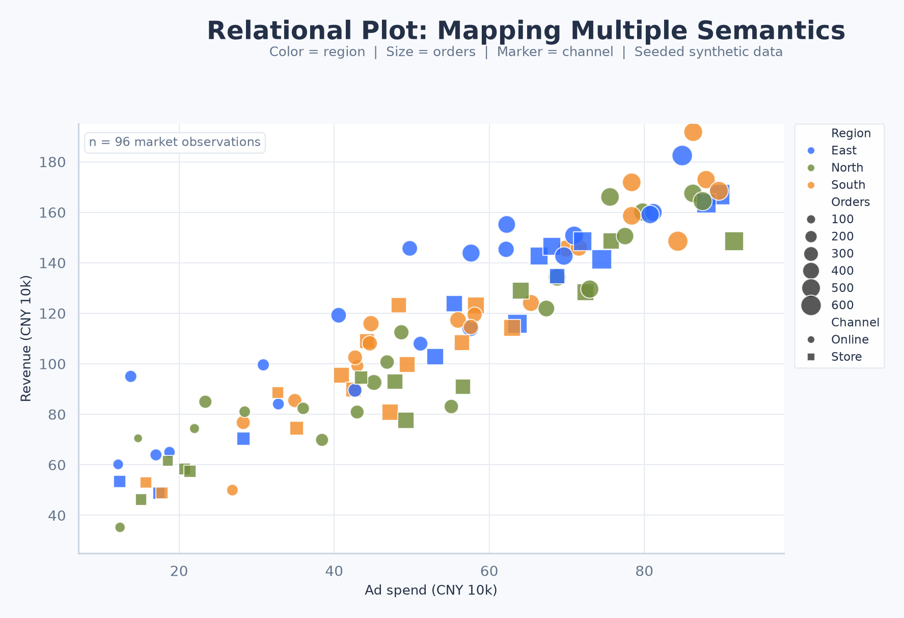
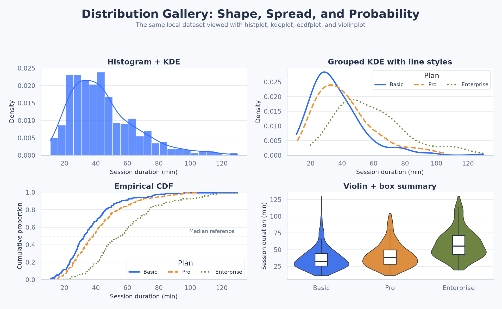
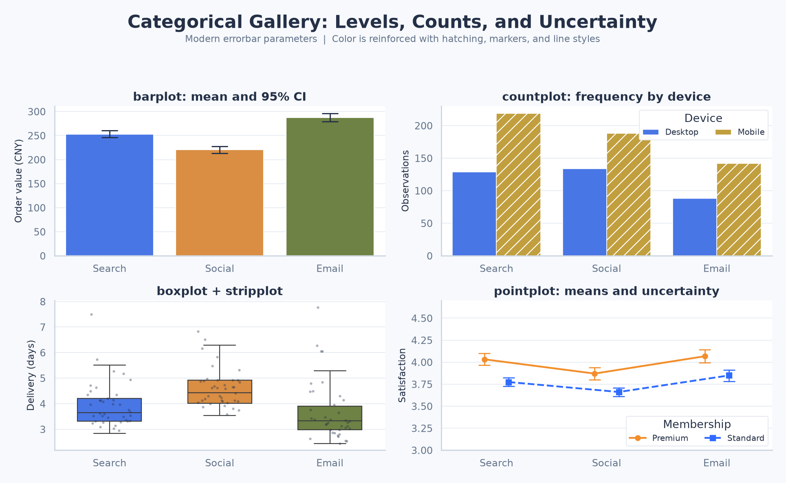
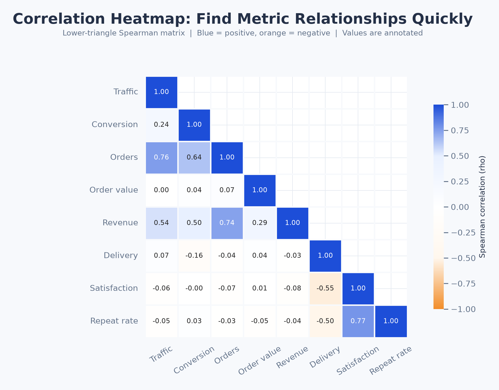
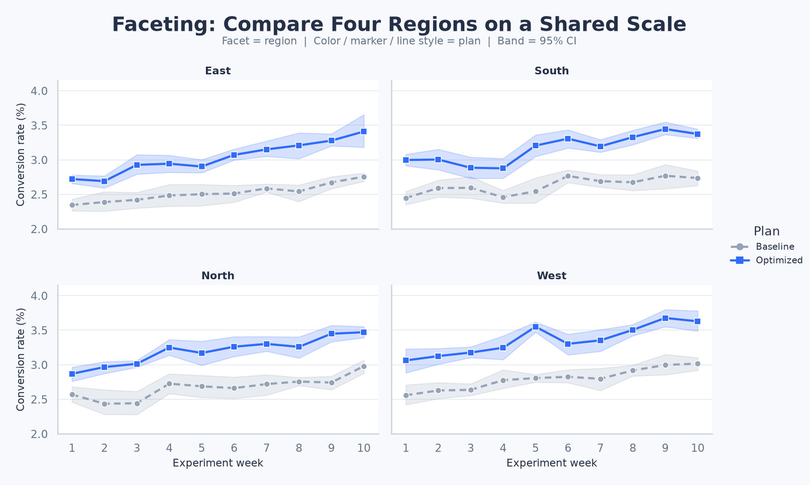
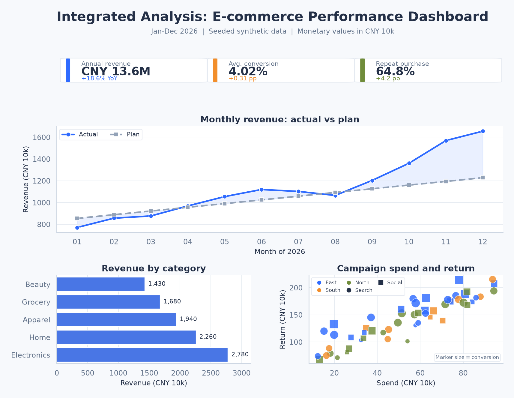

# Seaborn 完全指南 - 统计数据可视化

## 简介

Seaborn 是建立在 Matplotlib 之上的 Python 统计数据可视化库。它不仅提供了更美观的默认样式，还能直接理解 Pandas 数据表中的变量角色：把某列映射到横轴、纵轴、颜色、点大小、线型或分面后，Seaborn 会自动完成分组、统计估计、置信区间、图例和坐标轴标签。

Matplotlib 负责 Figure、Axes 等底层对象，Seaborn 更关注数据关系。实际项目常用 Seaborn 建立统计图，再用 Matplotlib 布局、注释和导出。

### 核心特性

- **面向数据表**：直接接收 Pandas DataFrame，并通过列名声明变量角色
- **统计语义映射**：使用 `hue`、`size`、`style` 等参数同时表达多个维度
- **内置统计计算**：可自动完成聚合、误差线、核密度估计和回归拟合
- **一致的图形体系**：关系、分布和分类图均提供统一的函数式接口
- **便捷的分面能力**：通过 `row`、`col` 把一个关系拆成可比较的小图
- **美观且可配置**：内置主题、上下文、颜色板，并可继续使用 Matplotlib API

### 应用场景

- **探索性数据分析**：快速检查变量关系、分布形状、异常点和分组差异
- **业务指标分析**：展示销售趋势、转化率、客单价、交付时长等指标
- **实验结果比较**：用分面、误差线和分布图比较实验组与对照组
- **统计建模辅助**：在正式建模前观察回归趋势、残差结构和变量相关性
- **研究与报告制图**：统一主题、颜色和图形语义，生成可复现的静态图表

> **定位提示**：Seaborn 擅长探索性统计图，不是交互式仪表板框架；需要像素级控制或非常规图形时直接使用 Matplotlib。

## 安装与基础配置

本文以 **Seaborn 0.13.2** 为基准。固定版本能够避免旧教程中的参数与当前行为不一致。

### 安装 Seaborn

```bash
# 安装本文使用的固定版本
pip install "seaborn[stats]==0.13.2"

# Conda 环境也可以直接安装
conda install seaborn=0.13.2

# 查看已经安装的版本
python -c "import seaborn as sns; print(sns.__version__)"
```

`stats` 可选依赖组会补充部分统计功能所需的包。Seaborn 的核心依赖包括 NumPy、Pandas 和 Matplotlib；部分高级统计计算还会使用 SciPy、statsmodels。

### 标准导入与主题

```python
import matplotlib.pyplot as plt
import pandas as pd
import seaborn as sns

print(f"Seaborn version: {sns.__version__}")

# 一次设置，影响此后创建的 Matplotlib / Seaborn 图形
sns.set_theme(
    context="notebook",
    style="whitegrid",
    palette="colorblind",
    font_scale=1.0,
)

demo = pd.DataFrame({
    "month": ["Jan", "Feb", "Mar", "Apr"],
    "sales": [82, 91, 88, 105],
})

sns.lineplot(data=demo, x="month", y="sales", marker="o")
plt.title("Monthly sales")
plt.tight_layout()
plt.show()
```

### 常用配置速查

| 配置         | 作用                      | 常见值                                            |
| ------------ | ------------------------- | ------------------------------------------------- |
| `context`    | 控制文字和线条的整体缩放  | `paper`、`notebook`、`talk`、`poster`             |
| `style`      | 控制背景、网格和刻度      | `white`、`dark`、`whitegrid`、`darkgrid`、`ticks` |
| `palette`    | 设置默认颜色循环          | `deep`、`muted`、`colorblind`、`Set2`             |
| `font`       | 设置字体族                | 系统中可用的字体名称                              |
| `font_scale` | 在 context 基础上缩放字体 | `0.8`、`1.0`、`1.2`                               |
| `rc`         | 覆盖 Matplotlib rcParams  | `{"figure.dpi": 120}`                             |

只想临时改变一张图时，可组合 `with sns.plotting_context("talk"), sns.axes_style("ticks"):`，退出上下文后自动恢复，避免样式泄漏。

> **最佳实践**：在脚本入口调用一次 `sns.set_theme()`，函数内部尽量接收 `ax` 并返回 `Axes`。这样样式集中、图形易于测试，也便于把多个小图组合到同一 Figure。

## 准备确定性的本地数据

官方示例经常使用 `sns.load_dataset("tips")`。这个函数会从在线数据仓库读取样例，首次执行通常需要网络，因此生产代码和可复现教程不应依赖它。本文主要使用固定种子在本地构造数据。

下面的数据生成方式会在多个章节中出现。`np.random.default_rng(42)` 创建独立的随机数生成器，相同环境下可得到一致的数据。

```python
import numpy as np
import pandas as pd

rng = np.random.default_rng(42)
n = 180

region = rng.choice(["华东", "华南", "华北"], size=n, p=[0.4, 0.35, 0.25])
channel = rng.choice(["线上", "门店"], size=n)
ad_spend = rng.uniform(8, 80, size=n)
region_bonus = pd.Series(region).map({"华东": 18, "华南": 10, "华北": 5}).to_numpy()
sales = 45 + 2.1 * ad_spend + region_bonus + rng.normal(0, 18, size=n)

sales_df = pd.DataFrame({
    "date": pd.date_range("2025-01-01", periods=n, freq="D"),
    "region": region,
    "channel": channel,
    "ad_spend": ad_spend.round(2),
    "sales": sales.round(2),
    "orders": rng.poisson(lam=np.clip(sales / 12, 2, None)),
})

print(sales_df.head())
print(sales_df.dtypes)
```

> **数据安全**：演示数据可以直接生成，真实数据则应先处理缺失值、类型和异常值，并确认每一行代表什么观测单位。漂亮的图形不能修复错误的数据口径。

## Seaborn 的数据模型

### 长表与宽表

Seaborn 最自然的输入是“整洁数据”或长表：

- 每一行是一条观测
- 每一列是一个变量
- 每一个单元格是一个值

例如，四个地区两个月的收入应表示为三列，而不是为每个地区建立一列。

| month | region | revenue |
| ----- | ------ | ------- |
| Jan   | 华东   | 120     |
| Jan   | 华南   | 98      |
| Feb   | 华东   | 135     |
| Feb   | 华南   | 107     |

长表能够明确指定 `x="month"`、`y="revenue"`、`hue="region"`。宽表也可以直接绘制，但列名会被隐式当作分组，能够使用的统计语义更少。

```python
import matplotlib.pyplot as plt
import pandas as pd
import seaborn as sns

wide = pd.DataFrame(
    {
        "华东": [120, 135, 142, 150],
        "华南": [98, 107, 119, 128],
        "华北": [88, 92, 101, 109],
    },
    index=pd.Index(["Jan", "Feb", "Mar", "Apr"], name="month"),
)

# 宽表转长表：保留变量的真实含义
long = wide.reset_index().melt(
    id_vars="month",
    var_name="region",
    value_name="revenue",
)

ax = sns.lineplot(data=long, x="month", y="revenue", hue="region", marker="o")
ax.set(title="Revenue by region", xlabel="Month", ylabel="Revenue")
plt.tight_layout()
plt.show()
```

### 语义映射：hue、size 与 style

统计语义把数据列映射为视觉属性：

| 参数          | 视觉通道     | 适合的数据         | 注意事项                       |
| ------------- | ------------ | ------------------ | ------------------------------ |
| `hue`         | 颜色         | 类别或连续值       | 连续值会使用渐变色及数值归一化 |
| `size`        | 点大小或线宽 | 有序值、连续值     | 面积差异不适合精确比较         |
| `style`       | 点形或线型   | 少量类别           | 类别过多会降低辨识度           |
| `row` / `col` | 分面行列     | 少量类别           | 小图过多会挤压画布             |
| `units`       | 独立采样单元 | 重复测量、个体轨迹 | 常与 `estimator=None` 配合     |
| `weights`     | 观测权重     | 抽样权重、频数     | 支持范围因函数而异             |

同一变量可以同时映射为颜色和形状，提高黑白打印或色觉缺陷场景下的辨识度：

```python
import matplotlib.pyplot as plt
import numpy as np
import pandas as pd
import seaborn as sns

rng = np.random.default_rng(42)
n = 90
df = pd.DataFrame({
    "ad_spend": rng.uniform(10, 70, n),
    "conversion": rng.uniform(0.02, 0.15, n),
    "region": rng.choice(["华东", "华南", "华北"], n),
    "orders": rng.integers(20, 220, n),
})

ax = sns.scatterplot(
    data=df,
    x="ad_spend",
    y="conversion",
    hue="region",
    style="region",
    size="orders",
    sizes=(30, 240),
    alpha=0.75,
)
ax.set(title="Semantic mappings", xlabel="Ad spend", ylabel="Conversion rate")
ax.legend(bbox_to_anchor=(1.02, 1), loc="upper left", borderaxespad=0)
plt.tight_layout()
plt.show()
```

> **编码原则**：颜色适合表达分组，位置适合精确比较，大小只适合表达大致量级。不要为了“多维”把过多语义堆在一张图上；读者解码图形所花的时间也属于分析成本。

## 两层函数式 API

Seaborn 的传统函数式 API 分为 **axes-level** 和 **figure-level** 两层。理解返回对象与尺寸单位，是组合图形时最重要的基础。

### axes-level 函数

axes-level 函数只在一个 Matplotlib `Axes` 上绘图，通常返回 `matplotlib.axes.Axes`。它们支持 `ax=`，因此最适合嵌入 `plt.subplots()` 创建的布局。

```python
import matplotlib.pyplot as plt
import numpy as np
import pandas as pd
import seaborn as sns

df = pd.DataFrame({
    "group": ["A", "A", "A", "B", "B", "B"],
    "score": [72, 78, 81, 75, 84, 90],
})

fig, axes = plt.subplots(1, 2, figsize=(9, 3.6))
sns.boxplot(data=df, x="group", y="score", ax=axes[0])
np.random.seed(42)  # 固定 stripplot 的抖动位置
sns.stripplot(data=df, x="group", y="score", color="0.2", ax=axes[0])
sns.histplot(data=df, x="score", bins=6, ax=axes[1])

axes[0].set_title("Group comparison")
axes[1].set_title("Score distribution")
fig.tight_layout()
plt.show()
```

### figure-level 函数

figure-level 函数管理自己的 Figure，并可通过 `row`、`col` 自动分面。它们不接收 `ax=`，返回 Seaborn 网格对象：

| 图形家族 | axes-level                                         | figure-level | 返回对象      |
| -------- | -------------------------------------------------- | ------------ | ------------- |
| 关系图   | `scatterplot`、`lineplot`                          | `relplot`    | `FacetGrid`   |
| 分布图   | `histplot`、`kdeplot`、`ecdfplot`、`rugplot`       | `displot`    | `FacetGrid`   |
| 分类图   | `stripplot`、`boxplot`、`violinplot`、`barplot` 等 | `catplot`    | `FacetGrid`   |
| 联合分布 | —                                                  | `jointplot`  | `JointGrid`   |
| 成对关系 | —                                                  | `pairplot`   | `PairGrid`    |
| 层次聚类 | —                                                  | `clustermap` | `ClusterGrid` |

```python
import matplotlib.pyplot as plt
import pandas as pd
import seaborn as sns

df = pd.DataFrame({
    "month": [1, 2, 3, 1, 2, 3, 1, 2, 3],
    "sales": [82, 91, 105, 75, 88, 96, 69, 79, 90],
    "region": ["华东"] * 3 + ["华南"] * 3 + ["华北"] * 3,
})

g = sns.relplot(
    data=df,
    x="month",
    y="sales",
    col="region",
    kind="line",
    marker="o",
    height=3.2,     # 每个分面的高度，单位为英寸
    aspect=0.9,     # 每个分面的宽高比
)
g.set_axis_labels("Month", "Sales")
g.set_titles("Region: {col_name}")
g.figure.subplots_adjust(top=0.8)
g.figure.suptitle("Regional trend")
plt.show()
```

### 如何选择

- 已经有 `fig, axes = plt.subplots(...)`：选择 axes-level
- 需要按类别分面：优先选择 figure-level
- 只画一张简单图：二者都可以，axes-level 更容易精细控制
- 希望复用 Matplotlib 布局：不要把 figure-level 函数硬塞进已有 Axes
- 需要逐面映射自定义函数：使用 `FacetGrid`

> **尺寸区别**：axes-level 使用 Figure 的 `figsize=(总宽, 总高)`；figure-level 使用单个分面的 `height` 和 `aspect`。三列分面设置 `height=3, aspect=1` 时，总宽度大约为 9 英寸，而不是 3 英寸。

## 常用函数速查

| 分析问题             | 推荐函数                      | 主要参数                             |
| -------------------- | ----------------------------- | ------------------------------------ |
| 两个连续变量是否相关 | `scatterplot()`               | `hue`、`style`、`size`、`alpha`      |
| 指标随时间如何变化   | `lineplot()`                  | `estimator`、`errorbar`、`units`     |
| 数值如何分布         | `histplot()`                  | `bins`、`stat`、`multiple`、`kde`    |
| 比较平滑分布形状     | `kdeplot()`                   | `bw_adjust`、`fill`、`common_norm`   |
| 查看所有点及累计比例 | `ecdfplot()`                  | `stat`、`complementary`              |
| 比较类别的稳健分布   | `boxplot()`                   | `hue`、`dodge`、`whis`、`showfliers` |
| 查看类别分布形状     | `violinplot()`                | `density_norm`、`inner`、`split`     |
| 展示原始观测         | `stripplot()` / `swarmplot()` | `jitter`、`dodge`、`size`            |
| 比较均值及不确定性   | `pointplot()` / `barplot()`   | `estimator`、`errorbar`、`capsize`   |
| 查看线性趋势         | `regplot()` / `lmplot()`      | `order`、`robust`、`logistic`        |
| 查看相关矩阵         | `heatmap()`                   | `annot`、`mask`、`center`、`cmap`    |

图形选择应该由问题决定，而不是由函数名决定。要比较完整分布时，箱线图或小提琴图通常比仅展示均值的柱形图更诚实；要观察时间趋势时，折线的采样顺序和聚合单位比颜色更加重要。

## 关系图：散点与折线

### scatterplot：观察变量关系

散点图保留每条观测，是探索相关性、簇和异常值的首选。连续 `hue` 可以通过 `hue_norm` 固定颜色范围，避免不同子图使用不同的颜色标尺。

```python
import matplotlib.pyplot as plt
import numpy as np
import pandas as pd
import seaborn as sns

rng = np.random.default_rng(42)
n = 120
df = pd.DataFrame({
    "ad_spend": rng.uniform(5, 85, n),
    "sales": rng.normal(150, 35, n),
    "margin": rng.uniform(0.08, 0.38, n),
    "channel": rng.choice(["线上", "门店"], n),
})

ax = sns.scatterplot(
    data=df,
    x="ad_spend",
    y="sales",
    hue="margin",
    hue_norm=(0, 0.4),
    palette="viridis",
    style="channel",
    s=70,
    alpha=0.8,
)
ax.set(title="Sales and advertising", xlabel="Ad spend", ylabel="Sales")
plt.tight_layout()
plt.show()
```

### lineplot：趋势、聚合与重复测量

`lineplot()` 默认会对相同 `x` 上的多个 `y` 求均值并绘制置信区间。如果每一行本来就是一个按顺序连接的观测，显式设置 `estimator=None`，否则 Seaborn 可能执行不符合业务含义的聚合。

```python
import matplotlib.pyplot as plt
import numpy as np
import pandas as pd
import seaborn as sns

rng = np.random.default_rng(42)
days = np.arange(1, 15)
records = []

for store in ["S1", "S2", "S3", "S4"]:
    baseline = rng.normal(80, 5)
    for day in days:
        records.append({
            "store": store,
            "day": day,
            "sales": baseline + day * 2.3 + rng.normal(0, 4),
        })

df = pd.DataFrame(records)

ax = sns.lineplot(
    data=df,
    x="day",
    y="sales",
    units="store",       # 每家门店是一条独立轨迹
    estimator=None,       # 不跨门店聚合
    color="#4C72B0",
    alpha=0.55,
    marker="o",
)
ax.set(title="Repeated measurements", xlabel="Day", ylabel="Sales")
plt.tight_layout()
plt.show()
```

若目标是总体趋势，则保留默认均值聚合，并用 `errorbar=("ci", 95)`、`n_boot=1000`、`seed=42` 明确且复现不确定性。



## 分布图：从直方图到 ECDF

只看均值会隐藏偏态、长尾、多峰和异常值。分布图回答的是“数值通常落在哪里”“不同组是否有不同形状”“极端值有多少”等问题。

### histplot：直方图

`histplot()` 将连续值分箱后计数，结果容易理解，但图形会随分箱规则变化。

```python
import matplotlib.pyplot as plt
import numpy as np
import pandas as pd
import seaborn as sns

rng = np.random.default_rng(42)
df = pd.DataFrame({
    "amount": np.concatenate([
        rng.gamma(shape=2.2, scale=45, size=300),
        rng.gamma(shape=3.0, scale=36, size=300),
    ]),
    "channel": np.repeat(["线上", "门店"], 300),
})

ax = sns.histplot(
    data=df,
    x="amount",
    hue="channel",
    bins="auto",
    stat="density",
    common_norm=False,
    element="step",
    fill=False,
)
ax.set(title="Order amount distribution", xlabel="Amount", ylabel="Density")
plt.tight_layout()
plt.show()
```

`stat` 决定纵轴含义：

| `stat`                       | 含义             | 适合场景              |
| ---------------------------- | ---------------- | --------------------- |
| `count`                      | 每个箱中的观测数 | 比较样本量相近的组    |
| `frequency`                  | 计数除以箱宽     | 箱宽不一致时比较频数  |
| `probability` / `proportion` | 每箱占总样本比例 | 解释“有多少比例”      |
| `percent`                    | 百分比           | 面向非技术读者        |
| `density`                    | 总面积归一化为 1 | 与 KDE 叠加或比较形状 |

比较不同样本量的分组时，要有意识地选择 `common_norm`。`False` 表示每组单独归一化，适合比较形状；`True` 保留各组在总体中的权重。

### kdeplot：核密度估计

KDE 用平滑曲线估计概率密度。它没有直方图的箱边界，但带宽会直接影响结论：带宽太小产生虚假波峰，太大则抹平真实结构。

```python
import matplotlib.pyplot as plt
import numpy as np
import pandas as pd
import seaborn as sns

rng = np.random.default_rng(42)
df = pd.DataFrame({
    "delivery_minutes": np.r_[
        rng.normal(32, 6, 240),
        rng.normal(42, 9, 240),
    ],
    "service": np.repeat(["标准", "高峰"], 240),
})

ax = sns.kdeplot(
    data=df,
    x="delivery_minutes",
    hue="service",
    fill=True,
    common_norm=False,
    bw_adjust=0.9,
    cut=0,                 # 不把曲线延伸到样本范围外
    alpha=0.35,
)
ax.set(title="Delivery time KDE", xlabel="Minutes", ylabel="Density")
plt.tight_layout()
plt.show()
```

> **边界问题**：KDE 不知道变量的物理边界。金额、年龄、时长等非负变量可能被平滑到 0 以下。可以使用 `cut=0`、`clip=(0, None)`，同时保留直方图或 ECDF 作为校验。

### ecdfplot：经验累积分布

ECDF 不需要选择分箱或带宽。横轴任一点对应“样本中有多少比例小于等于该值”，尤其适合比较分位数和服务等级目标。

```python
import matplotlib.pyplot as plt
import numpy as np
import pandas as pd
import seaborn as sns

rng = np.random.default_rng(42)
df = pd.DataFrame({
    "latency_ms": np.r_[
        rng.lognormal(mean=4.1, sigma=0.35, size=250),
        rng.lognormal(mean=4.25, sigma=0.4, size=250),
    ],
    "version": np.repeat(["v1", "v2"], 250),
})

ax = sns.ecdfplot(data=df, x="latency_ms", hue="version")
ax.axhline(0.95, color="0.4", linestyle="--", linewidth=1)
ax.set(title="Latency ECDF", xlabel="Latency (ms)", ylabel="Cumulative proportion")
plt.tight_layout()
plt.show()
```

### 二维分布

点过密时，可以把二维空间分箱或估计二维密度。`thresh` 隐藏低密度区域，`levels` 控制等密度线层级。

```python
import matplotlib.pyplot as plt
import numpy as np
import pandas as pd
import seaborn as sns

rng = np.random.default_rng(42)
x = rng.normal(0, 1, 1200)
y = 0.7 * x + rng.normal(0, 0.65, 1200)
df = pd.DataFrame({"x": x, "y": y})

fig, axes = plt.subplots(1, 2, figsize=(10, 4))
sns.histplot(data=df, x="x", y="y", bins=35, cbar=True, ax=axes[0])
sns.kdeplot(data=df, x="x", y="y", fill=True, levels=8, thresh=0.05, ax=axes[1])
axes[0].set_title("2D histogram")
axes[1].set_title("2D KDE")
fig.tight_layout()
plt.show()
```



### 分布图选型

| 目的                     | 首选图形              | 需要检查的参数                    |
| ------------------------ | --------------------- | --------------------------------- |
| 展示真实分箱计数         | 直方图                | `bins`、`binwidth`、`stat`        |
| 平滑比较分布形状         | KDE                   | `bw_adjust`、`cut`、`common_norm` |
| 比较分位数和尾部         | ECDF                  | 是否使用 `complementary=True`     |
| 给主图补充每个观测位置   | Rug                   | 数据量和线条遮挡                  |
| 观察两个变量的高密度区域 | 二维直方图 / 二维 KDE | 分箱、阈值、颜色标尺              |

建议至少改变一次 `bins` 或 `bw_adjust`，观察结论是否稳定。可视化参数本身就是分析假设的一部分。

## 分类图：类别之间如何不同

分类图大致分为三类：展示每个观测的散点图、展示分布的箱线/小提琴图，以及展示统计估计的点图/柱形图。选择时应优先保留能够支持结论的信息。

### stripplot 与 swarmplot

`stripplot()` 在分类轴附近加入随机抖动，速度较快；`swarmplot()` 尝试避免点重叠，轮廓更清楚，但大数据上计算慢且可能无法完全排开。

```python
import matplotlib.pyplot as plt
import numpy as np
import pandas as pd
import seaborn as sns

rng = np.random.default_rng(42)
df = pd.DataFrame({
    "plan": np.repeat(["基础版", "专业版", "企业版"], 45),
    "satisfaction": np.r_[
        rng.normal(72, 10, 45),
        rng.normal(80, 8, 45),
        rng.normal(84, 7, 45),
    ],
})

np.random.seed(42)  # 固定 stripplot 的抖动位置
ax = sns.stripplot(
    data=df,
    x="plan",
    y="satisfaction",
    jitter=0.22,
    alpha=0.55,
    size=5,
    color="#4C72B0",
)
ax.set(title="Every observation", xlabel="Plan", ylabel="Satisfaction")
plt.tight_layout()
plt.show()
```

### boxplot：稳健摘要

箱线图显示中位数、四分位区间、须和潜在离群点。默认须通常延伸至距离四分位数不超过 1.5 倍 IQR 的最远观测；须外的点不等于错误数据。

```python
import matplotlib.pyplot as plt
import numpy as np
import pandas as pd
import seaborn as sns

rng = np.random.default_rng(42)
df = pd.DataFrame({
    "region": np.repeat(["华东", "华南", "华北"], 80),
    "delivery": np.r_[
        rng.gamma(7, 4, 80),
        rng.gamma(8, 4.2, 80),
        rng.gamma(6, 5, 80),
    ],
    "member": np.tile(np.repeat(["会员", "非会员"], 40), 3),
})

ax = sns.boxplot(
    data=df,
    x="region",
    y="delivery",
    hue="member",
    gap=0.12,
    whis=1.5,
    showfliers=True,
)
ax.set(title="Delivery distribution", xlabel="Region", ylabel="Minutes")
plt.tight_layout()
plt.show()
```

### violinplot：密度与摘要结合

小提琴图利用 KDE 展示形状。样本很少时曲线可能给人“精确分布”的错觉，因此最好叠加原始点或标注样本量。

```python
import matplotlib.pyplot as plt
import numpy as np
import pandas as pd
import seaborn as sns

rng = np.random.default_rng(42)
df = pd.DataFrame({
    "period": np.repeat(["活动前", "活动后"], 100),
    "spend": np.r_[rng.gamma(3, 30, 100), rng.gamma(4, 32, 100)],
})

ax = sns.violinplot(
    data=df,
    x="period",
    y="spend",
    inner="quart",
    density_norm="width",  # 0.13+ 的现代参数名
    cut=0,
    color="#72B7B2",
)
np.random.seed(42)  # 固定 stripplot 的抖动位置
sns.stripplot(
    data=df,
    x="period",
    y="spend",
    color="0.2",
    alpha=0.25,
    size=2.5,
    ax=ax,
)
ax.set(title="Spend before and after campaign")
plt.tight_layout()
plt.show()
```

### pointplot 与 barplot：统计估计

`pointplot()` 用点与线比较统计量，不会暗示数值从零起填充；`barplot()` 使用柱高表示估计值，适合确实需要基准面积的场景。二者默认都会进行聚合，必须写清估计量和误差线。

```python
import matplotlib.pyplot as plt
import numpy as np
import pandas as pd
import seaborn as sns

rng = np.random.default_rng(42)
df = pd.DataFrame({
    "channel": np.repeat(["搜索", "社交", "邮件"], 90),
    "device": np.tile(np.repeat(["桌面端", "移动端"], 45), 3),
    "conversion": np.r_[
        rng.beta(5, 45, 90),
        rng.beta(4, 46, 90),
        rng.beta(6, 44, 90),
    ],
})

ax = sns.pointplot(
    data=df,
    x="channel",
    y="conversion",
    hue="device",
    estimator="mean",
    errorbar=("ci", 95),
    n_boot=1000,
    seed=42,
    dodge=0.25,
    capsize=0.12,
    markers=["o", "s"],
)
ax.set(title="Mean conversion with 95% CI", ylabel="Conversion rate")
plt.tight_layout()
plt.show()
```

### 误差线的含义

Seaborn 0.12 起使用 `errorbar=` 统一配置误差线：

| 写法                  | 含义                   | 回答的问题             |
| --------------------- | ---------------------- | ---------------------- |
| `errorbar="sd"`       | 均值上下一个标准差     | 数据本身有多分散       |
| `errorbar=("pi", 95)` | 95% 百分位区间         | 大多数观测落在哪里     |
| `errorbar="se"`       | 均值上下一个标准误     | 均值估计有多精确       |
| `errorbar=("ci", 95)` | bootstrap 95% 置信区间 | 重复抽样时均值如何波动 |
| `errorbar=None`       | 不显示误差线           | 只展示估计值           |

标准差、百分位区间描述数据离散度；标准误、置信区间描述估计不确定性。它们不能互换。置信区间重叠与否也不能直接替代正式假设检验。

### 原生数值尺度与类别顺序

分类图默认把横轴值放在等距位置。日期或数值类别可用 `native_scale=True` 保留真实距离；字符串类别应显式指定 `order=` 或转成有序 `CategoricalDtype`，不要依赖偶然出现顺序。



> **最佳实践**：样本量允许时，用“分布摘要 + 原始点”代替单独的柱形图。读者既能看到中心位置，也能看到离散度、样本量和异常观测。

## 回归与残差图

### regplot 与 lmplot

`regplot()` 是 axes-level 函数；`lmplot()` 是支持 `row`、`col`、`hue` 分面的 figure-level 函数。默认拟合普通最小二乘直线，并通过 bootstrap 估计回归线的不确定性。

```python
import matplotlib.pyplot as plt
import numpy as np
import pandas as pd
import seaborn as sns

rng = np.random.default_rng(42)
x = rng.uniform(5, 80, 160)
y = 35 + 2.4 * x + rng.normal(0, 20, 160)
df = pd.DataFrame({"ad_spend": x, "sales": y})

ax = sns.regplot(
    data=df,
    x="ad_spend",
    y="sales",
    ci=95,
    n_boot=1000,
    seed=42,
    scatter_kws={"alpha": 0.5, "s": 35},
    line_kws={"color": "#C44E52", "linewidth": 2},
)
ax.set(title="Exploratory linear trend")
plt.tight_layout()
plt.show()
```

注意：`ci=` 在 `regplot()` / `lmplot()` 中仍是当前回归接口参数；需要迁移的是 `barplot()`、`pointplot()`、`lineplot()` 等估计型函数中的旧 `ci=`。

常用拟合选项如下：

| 参数                  | 作用                   | 使用前提                  |
| --------------------- | ---------------------- | ------------------------- |
| `order=2`             | 多项式回归             | 弯曲趋势有业务依据        |
| `robust=True`         | 稳健线性回归           | 少量强离群点影响明显      |
| `logistic=True`       | Logistic 回归          | 因变量为 0/1              |
| `lowess=True`         | 局部加权平滑           | 探索非线性形状，不提供 CI |
| `x_estimator=np.mean` | 按离散横轴水平估计中心 | 横轴只有少数取值          |
| `x_bins=n`            | 将横轴分箱展示估计点   | 点多且趋势被遮挡          |

### residplot：检查残差结构

残差图不是正式诊断的全部，但可以快速发现非线性、异方差和异常点。

```python
import matplotlib.pyplot as plt
import numpy as np
import pandas as pd
import seaborn as sns

rng = np.random.default_rng(42)
x = np.linspace(0, 10, 120)
y = 5 + 3 * x + 0.22 * x**2 + rng.normal(0, 3, 120)
df = pd.DataFrame({"x": x, "y": y})

ax = sns.residplot(
    data=df,
    x="x",
    y="y",
    lowess=True,
    scatter_kws={"alpha": 0.55},
    line_kws={"color": "#C44E52"},
)
ax.axhline(0, color="0.3", linewidth=1)
ax.set(title="Residual structure")
plt.tight_layout()
plt.show()
```

> **重要限制**：Seaborn 回归图用于探索和沟通，不会替你验证独立性、同方差、共线性等模型假设，也不应代替 statsmodels、SciPy 或专业统计软件给出的系数、检验和诊断。

## 矩阵图与多变量探索

### heatmap：把矩阵映射为颜色

相关系数矩阵适合使用以 0 为中心的发散色板。遮住重复的上三角并固定 `vmin=-1, vmax=1`，可以减少冗余且保证不同报告之间颜色含义一致。

```python
import matplotlib.pyplot as plt
import numpy as np
import pandas as pd
import seaborn as sns

rng = np.random.default_rng(42)
x = rng.normal(size=180)
df = pd.DataFrame({
    "ad_spend": x,
    "visits": 0.75 * x + rng.normal(0, 0.6, 180),
    "orders": 0.55 * x + rng.normal(0, 0.8, 180),
    "returns": -0.25 * x + rng.normal(0, 0.9, 180),
})
corr = df.corr(numeric_only=True)
mask = np.triu(np.ones_like(corr, dtype=bool), k=1)

ax = sns.heatmap(
    corr,
    mask=mask,
    annot=True,
    fmt=".2f",
    cmap="vlag",
    center=0,
    vmin=-1,
    vmax=1,
    square=True,
    linewidths=0.5,
    cbar_kws={"label": "Pearson r", "shrink": 0.8},
)
ax.set_title("Correlation matrix")
plt.tight_layout()
plt.show()
```

`annot` 也可以接收一个与数据同形状的字符串矩阵。行列很多时应关闭数字标注、扩大画布或只展示业务相关子集，否则热力图会变成无法阅读的彩色表格。



### pairplot、jointplot 与 clustermap

| 函数           | 作用                     | 典型控制项                           |
| -------------- | ------------------------ | ------------------------------------ |
| `pairplot()`   | 同时查看多个变量两两关系 | `vars`、`hue`、`corner`、`diag_kind` |
| `jointplot()`  | 联合关系加边缘分布       | `kind`、`height`、`ratio`、`space`   |
| `clustermap()` | 对矩阵行列聚类并重排     | `metric`、`method`、`standard_scale` |

```python
import matplotlib.pyplot as plt
import numpy as np
import pandas as pd
import seaborn as sns

rng = np.random.default_rng(42)
n = 90
df = pd.DataFrame({
    "sales": rng.normal(160, 30, n),
    "profit": rng.normal(35, 10, n),
    "orders": rng.poisson(18, n),
    "region": rng.choice(["华东", "华南", "华北"], n),
})

g = sns.pairplot(
    data=df,
    vars=["sales", "profit", "orders"],
    hue="region",
    corner=True,
    diag_kind="hist",
    plot_kws={"alpha": 0.55, "s": 30},
)
g.figure.suptitle("Pairwise exploration", y=1.02)
plt.show()
```

数据量和变量数较大时，`pairplot()` 的图数量按平方增长。应先选择少量变量并抽样。`clustermap()` 依赖 SciPy，且会重排矩阵；输出中的相邻关系是聚类结果，不再是原始业务顺序。

## 分面与 FacetGrid

figure-level 函数已覆盖大多数分面需求。只有在需要映射自定义绘图函数或逐面增加参考线时，才直接创建 `FacetGrid`。

```python
import matplotlib.pyplot as plt
import numpy as np
import pandas as pd
import seaborn as sns

rng = np.random.default_rng(42)
df = pd.DataFrame({
    "value": np.r_[rng.normal(70, 8, 100), rng.normal(82, 10, 100)],
    "region": np.tile(np.repeat(["华东", "华南"], 50), 2),
    "channel": np.repeat(["线上", "门店"], 100),
})

g = sns.FacetGrid(
    df,
    row="channel",
    col="region",
    margin_titles=True,
    height=2.6,
    aspect=1.15,
)
g.map_dataframe(sns.histplot, x="value", bins=12, color="#4C72B0")
g.refline(x=75, color="#C44E52", linestyle="--")
g.set_axis_labels("Value", "Count")
g.set_titles(col_template="{col_name}", row_template="{row_name}")
g.tight_layout()
plt.show()
```

`map_dataframe()` 会把每个分面对应的数据子集通过 `data=` 传给函数，比旧式 `map()` 更适合接收列名的 Seaborn 函数。分面时还需注意：

- 保持共享坐标尺度，才能直接比较；确有量级差异再关闭 `sharex` / `sharey`
- 用 `col_wrap` 把过多列折行，避免生成一张极宽图片
- 用 `hue_order`、`palette` 固定所有分面的类别颜色
- 缺失类别可能导致某些分面为空，应在绘图前检查分组计数



## 主题、颜色与可访问性

### 颜色板选择

| 数据含义       | 色板类型 | 示例                         |
| -------------- | -------- | ---------------------------- |
| 无序类别       | 定性色板 | `colorblind`、`deep`、`Set2` |
| 从低到高       | 顺序色板 | `viridis`、`crest`、`rocket` |
| 围绕中点的偏差 | 发散色板 | `vlag`、`icefire`、`RdBu_r`  |

不要只用红色/绿色区分关键状态；可同时使用形状、线型或直接标签。连续色板应保持亮度单调，发散色板要为中点赋予业务含义。屏幕上好看的颜色，还应检查灰度打印、投影和深浅背景下是否可辨。

### 与 Matplotlib 组合和导出

```python
import matplotlib.pyplot as plt
import pandas as pd
import seaborn as sns

df = pd.DataFrame({"month": [1, 2, 3, 4], "sales": [80, 92, 88, 108]})
fig, ax = plt.subplots(figsize=(7, 4))
sns.lineplot(data=df, x="month", y="sales", marker="o", ax=ax)

peak = df.loc[df["sales"].idxmax()]
ax.annotate(
    "Peak",
    xy=(peak["month"], peak["sales"]),
    xytext=(-45, 25),
    textcoords="offset points",
    arrowprops={"arrowstyle": "->"},
)
ax.set(title="Monthly sales", xlabel="Month", ylabel="Sales")
fig.tight_layout()
fig.savefig("sales.png", dpi=180, bbox_inches="tight", facecolor="white")
fig.savefig("sales.svg", bbox_inches="tight")
plt.close(fig)
```

位图报告通常使用 PNG 和足够的 `dpi`；需要缩放或印刷时优先 SVG/PDF。批量脚本在保存后调用 `plt.close(fig)`，避免 Figure 累积占用内存。figure-level 返回对象则通过 `g.figure.savefig(...)` 导出。

## seaborn.objects 简述

`seaborn.objects` 提供声明式、可组合接口，将数据映射、图形标记和统计变换分开表达。它仍被官方标记为实验性接口，本文只作认识，不把它作为主教学 API。

```python
import numpy as np
import pandas as pd
import seaborn.objects as so

rng = np.random.default_rng(42)
x = np.linspace(0, 10, 60)
df = pd.DataFrame({
    "x": x,
    "y": 2.5 * x + rng.normal(0, 3, len(x)),
    "group": np.where(x < 5, "前半段", "后半段"),
})

(
    so.Plot(df, x="x", y="y", color="group")
    .add(so.Dot(alpha=0.65))
    .add(so.Line(), so.PolyFit(order=1))
    .label(title="Objects interface", x="Input", y="Output", color="Group")
    .layout(size=(7, 4))
    .show()
)
```

Objects 适合用统一语法组合 mark、stat 和 move；传统函数式 API 的资料更多、生态更稳定，现有项目不必为了语法统一而立即重写。

## 0.13 版本迁移指南

| 旧写法                      | 0.13.2 推荐写法                                               |
| --------------------------- | ------------------------------------------------------------- |
| `sns.distplot(x)`           | `sns.histplot(x=x)`、`sns.kdeplot(x=x)` 或 `sns.displot(x=x)` |
| `sns.set(...)`              | `sns.set_theme(...)`                                          |
| 估计型函数 `ci=95`          | `errorbar=("ci", 95)`                                         |
| 分类图只传 `palette=`       | 把分组列显式传给 `hue=`；无需图例时设 `legend=False`          |
| `violinplot(scale=...)`     | `density_norm=...`                                            |
| `violinplot(scale_hue=...)` | `common_norm=not scale_hue`                                   |
| `violinplot(bw=...)`        | `bw_method=...` 与 `bw_adjust=...`                            |
| `pointplot(join=False)`     | `linestyle="none"`                                            |
| `errcolor`、`errwidth`      | `err_kws={"color": ..., "linewidth": ...}`                    |

不要机械地全局替换：回归家族的 `regplot()` / `lmplot()` 仍使用 `ci=`。升级后应把弃用警告当成待处理任务，并通过固定版本、视觉回归图和关键统计值测试确认行为。

## 性能与常见问题

### 性能建议

- 先用 Pandas 聚合到图表需要的粒度，不要让数百万明细点同时进入绘图层
- 散点过密时使用抽样、透明度、二维直方图；`swarmplot()` 只用于较小样本
- 限制 `pairplot()` 的 `vars`，限制分面数量，并避免在循环中重复设置主题
- 复用已计算的透视表、相关矩阵，批量出图后及时 `plt.close()`
- 优化前先计时；KDE、bootstrap、聚类通常比普通散点和直方图更昂贵

### FAQ

**中文显示为方框怎么办？** Matplotlib 必须找到支持中文的本机字体，可在项目入口设置 `plt.rcParams["font.sans-serif"]`；部署机器也要安装同一字体。不要把仅在个人电脑存在的字体名写死后假设服务器可用。

**图例遮挡数据怎么办？** axes-level 图可用 `sns.move_legend(ax, "upper left", bbox_to_anchor=(1, 1))`；网格对象把 `g` 传给 `move_legend`。保存时配合 `bbox_inches="tight"`。

**Seaborn 如何处理缺失值？** 多数函数会丢弃当前映射变量中的缺失观测，但不同图可能得到不同样本量。绘图前应统计缺失值，并在报告中标注有效样本数。

**为什么同一数据每次置信区间略有不同？** bootstrap 含随机抽样。在支持的函数中设置 `seed=42`，同时固定包版本；不要把图上像素级差异误认为业务变化。

## 综合实战：销售分析仪表板

下面把确定性数据、聚合、统计语义和 Matplotlib 布局组合起来。四个视图分别回答趋势、地区差异、订单分布和“地区 × 渠道”交叉表现。

```python
import matplotlib.pyplot as plt
import numpy as np
import pandas as pd
import seaborn as sns

rng = np.random.default_rng(42)
n = 240
df = pd.DataFrame({
    "date": pd.date_range("2025-01-01", periods=n, freq="D"),
    "region": rng.choice(["华东", "华南", "华北"], n),
    "channel": rng.choice(["线上", "门店"], n),
    "orders": rng.poisson(18, n),
})
bonus = df["region"].map({"华东": 28, "华南": 16, "华北": 8})
df["sales"] = (55 + df["orders"] * 6.5 + bonus + rng.normal(0, 18, n)).round(2)
df["month"] = df["date"].dt.to_period("M").dt.to_timestamp()

monthly = df.groupby(["month", "region"], as_index=False)["sales"].sum()
matrix = df.pivot_table(
    index="region", columns="channel", values="sales", aggfunc="mean"
)

sns.set_theme(style="whitegrid", palette="colorblind")
# 按操作系统替换为实际安装的中文字体
plt.rcParams["font.sans-serif"] = ["Microsoft YaHei", "SimHei", "DejaVu Sans"]
plt.rcParams["axes.unicode_minus"] = False
fig, axes = plt.subplots(2, 2, figsize=(12, 8))
sns.lineplot(data=monthly, x="month", y="sales", hue="region", marker="o", ax=axes[0, 0])
sns.barplot(data=df, x="region", y="sales", hue="region", legend=False,
            errorbar=("ci", 95), seed=42, ax=axes[0, 1])
sns.histplot(
    data=df,
    x="orders",
    hue="channel",
    element="step",
    fill=False,
    ax=axes[1, 0],
)
sns.heatmap(matrix, annot=True, fmt=".1f", cmap="crest", ax=axes[1, 1])

for ax, title in zip(axes.flat, ["月度趋势", "地区均值", "订单分布", "平均销售额"]):
    ax.set_title(title)
fig.suptitle("销售表现综合分析", fontsize=16, fontweight="bold")
fig.tight_layout()
plt.show()
```

基于相同的组织思路，还可以加入 KPI 卡片、计划基准和品类排行。下图展示一个扩展后的电商分析仪表板。



实战中还应在图旁写明指标口径、时间范围、有效样本量和误差线含义。仪表板负责组织证据，结论仍应来自可复核的数据计算。

## 总结

学习 Seaborn 的关键不是记住所有参数，而是建立稳定流程：先确认观测单位与数据形状，再选择匹配问题的图形，通过语义映射表达必要维度，最后检查统计假设、可访问性和导出结果。函数式 API 足以覆盖大多数分析；需要组合布局时回到 Matplotlib，需要声明式组合时再评估实验性的 Objects 接口。

---
