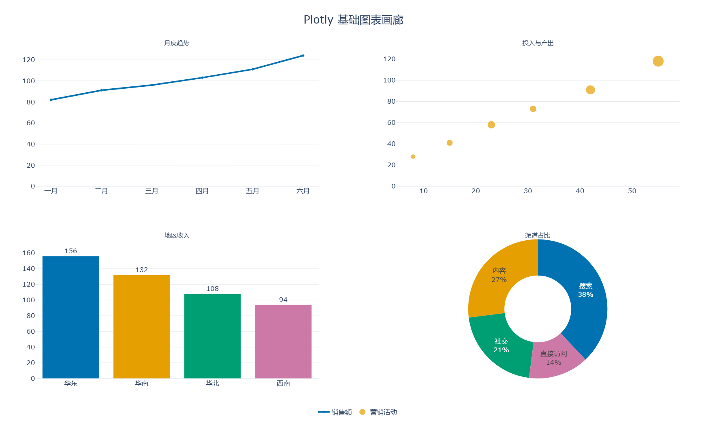
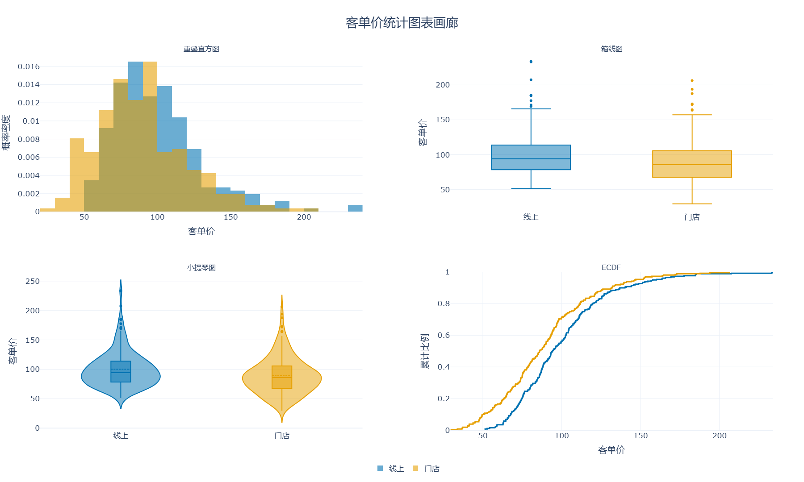
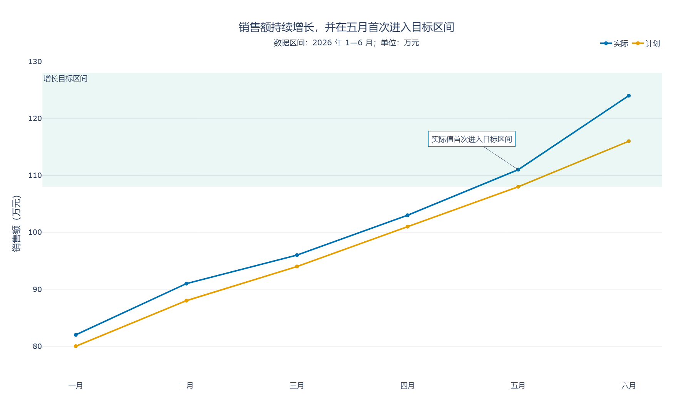
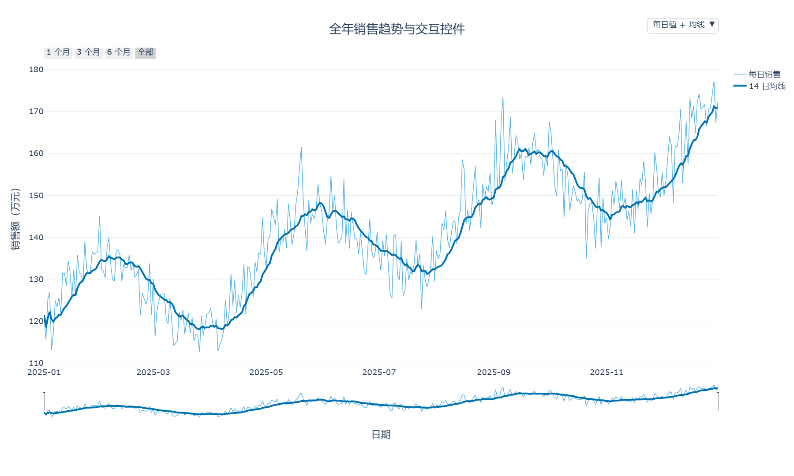
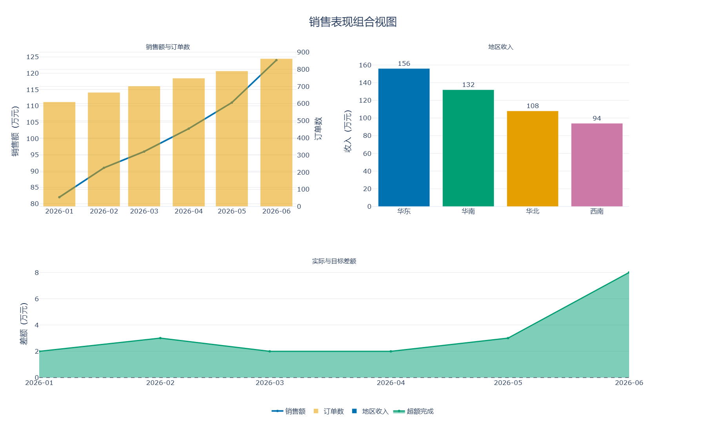
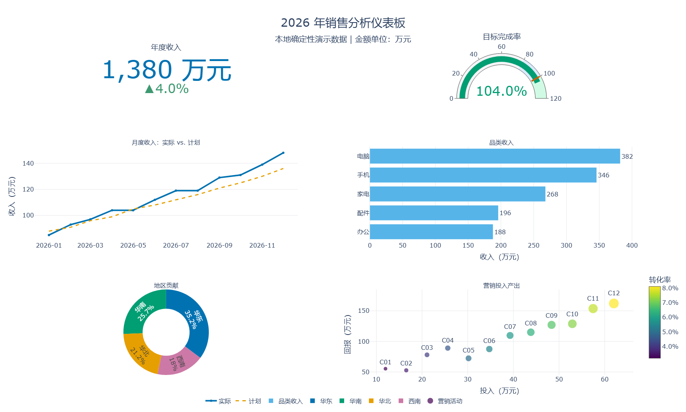

# Plotly 完全指南 - 交互式数据可视化

## 简介

Plotly 是面向浏览器的交互式数据可视化库。它把数据、图形样式和交互状态组织成一个 `Figure`，再交给 Plotly.js 在 Jupyter、浏览器或 Web 页面中渲染。缩放、平移、框选、悬停提示、图例筛选和图片下载等能力默认可用，不需要逐个编写前端事件。

Plotly.py 提供两层常用接口：

- **Plotly Express（`plotly.express`）**：高级函数，一次调用即可完成分组、颜色、分面、动画和图例，适合探索和常规业务图表
- **Graph Objects（`plotly.graph_objects`）**：直接组合 trace 与 layout，适合子图、复杂控件和精细定制

### 核心特性

- **原生交互**：内置缩放、悬停、选择、图例显隐、范围滑块和播放控件
- **声明式 Figure**：图形可转为字典或 JSON，便于保存、复用和调试
- **图表类型丰富**：覆盖统计图、金融图、三维图、地图、动画和多轴组合图
- **数据接口统一**：可接收 Python 列表、NumPy 数组、Pandas DataFrame 等数据
- **多环境输出**：同一个 Figure 可显示在 Notebook、浏览器，也可导出 HTML 或静态图片
- **渐进式定制**：先用 Plotly Express 快速成图，再用 `update_*` 和 Graph Objects 精修

### 应用场景

- 探索性数据分析与可交互报告
- 产品、运营和销售指标看板
- 时间序列、实验结果与多维数据比较
- 地理位置、轨迹及区域指标展示
- 需要分享为独立 HTML 的分析结果

| 工具       | 强项                            | 典型输出             | 适合场景                   |
| ---------- | ------------------------------- | -------------------- | -------------------------- |
| Matplotlib | 底层控制、论文级静态制图        | PNG、SVG、PDF        | 精细排版、科研绘图         |
| Seaborn    | 统计语义与美观的默认统计图      | Matplotlib 静态图    | 探索分布、关系和类别差异   |
| Plotly     | 浏览器交互、动画与可分享 Figure | HTML、Notebook、图片 | 交互分析、演示和轻量仪表板 |

> **定位提示**：Plotly 能生成“像仪表板”的组合图，但它本身不是完整应用框架。需要服务端查询、跨图联动或用户输入回调时，可进一步使用 Dash；本文只讲 Plotly.py。

## 安装与配置

本文以 [**Plotly.py 6.9.0**](https://github.com/plotly/plotly.py/releases/tag/v6.9.0) 为验证基线。固定版本有助于避免旧教程中的参数、地图 trace 和图片导出方式与当前版本不一致。

### 安装 Plotly

```bash
# 安装 Plotly Express 所需依赖，以及本文 DataFrame 示例使用的 Pandas
python -m pip install "plotly[express]==6.9.0" pandas

# Jupyter 中使用 FigureWidget
python -m pip install "jupyterlab>=4" "anywidget>=0.9.13"

# 导出 PNG、SVG、PDF 等静态图片
python -m pip install "kaleido>=1,<2"

# Conda 环境（包含 Notebook 与静态导出依赖）
conda install -c conda-forge plotly=6.9.0 pandas numpy jupyterlab anywidget python-kaleido
```

Plotly 6 的 `FigureWidget` 应运行在 Notebook 7、当前 JupyterLab 或兼容的 VS Code Notebook 环境中，并安装 `anywidget`。Kaleido v1 不再自带浏览器，静态导出需要系统中已有兼容的 Chrome 或 Chromium；机器尚未安装时，可执行 `plotly_get_chrome`，或由运维统一安装并在部署环境中验证。

### 检查版本与 renderer

```python
import plotly
import plotly.express as px
import plotly.io as pio

print(f"Plotly version: {plotly.__version__}")
print(f"默认 renderer: {pio.renderers.default!r}")
print(pio.renderers)  # 查看当前环境支持的 renderer

fig = px.line(
    x=["一月", "二月", "三月", "四月"],
    y=[82, 91, 88, 105],
    markers=True,
    labels={"x": "月份", "y": "销售额"},
    title="月度销售趋势",
    template="plotly_white",
)

# 脚本环境可显式使用浏览器；Notebook 通常让 Plotly 自动选择
fig.show(renderer="browser")
```

常见 renderer 包括 `browser`、`jupyterlab`、`notebook_connected`、`vscode`、`png` 和 `json`。可在程序入口设置 `pio.renderers.default = "browser"`，也可以只在某次 `show()` 时指定，避免全局设置影响其他环境。

> **最佳实践**：库代码只负责返回 Figure，由调用方决定 renderer、交互配置和输出路径。这样同一个绘图函数能同时服务 Notebook、测试脚本和 Web 导出。

## Figure 核心结构

Plotly Figure 由三个可序列化部分组成：

| 部分     | 类型              | 作用                                     |
| -------- | ----------------- | ---------------------------------------- |
| `data`   | trace 元组        | 保存折线、散点、柱形等数据及其视觉编码   |
| `layout` | `go.Layout`       | 保存标题、坐标轴、图例、模板、注释和控件 |
| `frames` | `go.Frame` 的元组 | 保存动画每一帧中需要更新的数据           |

`config` 不属于 Figure。它控制 modebar、滚轮缩放、响应式尺寸和“下载图片”按钮等渲染行为，应传给 `fig.show(config=...)` 或 `fig.write_html(config=...)`。

### 查看 data、layout 与 frames

```python
import plotly.graph_objects as go

fig = go.Figure(
    data=[
        go.Bar(
            x=["A", "B", "C"],
            y=[32, 45, 38],
            name="销售额",
            marker_color="#0072B2",
        )
    ],
    layout=go.Layout(
        title="Figure 的三个组成部分",
        template="plotly_white",
        xaxis_title="品类",
        yaxis_title="万元",
    ),
    frames=[
        go.Frame(
            name="预测",
            data=[go.Bar(x=["A", "B", "C"], y=[36, 49, 44])],
        )
    ],
)

print(type(fig.data), len(fig.data))
print(fig.data[0].type, fig.data[0].name)
print(fig.layout.title.text)
print([frame.name for frame in fig.frames])
```

trace 是“如何画一组数据”的对象。一个 Figure 可以有多个 trace，例如实际值折线、计划值折线和异常点散点；layout 则对整张图生效。

### Figure 与 config 的边界

```python
import plotly.graph_objects as go

fig = go.Figure(
    go.Scatter(x=[1, 2, 3], y=[4, 7, 5], mode="lines+markers")
)
fig.update_layout(title="Figure 与渲染配置", template="plotly_white")

config = {
    "displaylogo": False,
    "scrollZoom": True,
    "responsive": True,
    "toImageButtonOptions": {
        "format": "png",
        "filename": "trend",
        "width": 1200,
        "height": 700,
        "scale": 1,
    },
}

figure_dict = fig.to_dict()
print(figure_dict.keys())       # data、layout
print("config" in figure_dict)  # False
fig.show(config=config)
```

`fig.to_dict()` 适合检查 Python 对象，`fig.to_json()` 适合保存或传输。两者都只描述 Figure，不会包含 renderer 配置。

## Plotly Express 与 graph_objects

### 如何选择

| 需求                             | 推荐接口                        |
| -------------------------------- | ------------------------------- |
| 单表快速探索、颜色分组、分面     | Plotly Express                  |
| 一次调用自动生成多个 trace       | Plotly Express                  |
| 从零组合不同图形类型             | Graph Objects                   |
| 多坐标轴、复杂子图、按钮和动画帧 | Graph Objects + `make_subplots` |
| 已有 Express 图，只需精修        | Express + `update_*`            |

### Plotly Express：从列名声明图形

```python
import pandas as pd
import plotly.express as px

df = pd.DataFrame({
    "月份": ["一月", "二月", "三月", "四月"] * 2,
    "地区": ["华东"] * 4 + ["华南"] * 4,
    "销售额": [82, 91, 96, 108, 70, 76, 85, 93],
})

fig = px.line(
    df,
    x="月份",
    y="销售额",
    color="地区",
    markers=True,
    category_orders={"月份": ["一月", "二月", "三月", "四月"]},
    template="plotly_white",
    title="地区销售趋势",
)
fig.show()
```

Plotly Express 返回的仍然是普通 `go.Figure`。高级接口与底层接口不是两套互不兼容的系统。

### Graph Objects：显式添加 trace

```python
import plotly.graph_objects as go

months = ["一月", "二月", "三月", "四月"]
fig = go.Figure()
fig.add_trace(
    go.Scatter(
        x=months,
        y=[82, 91, 96, 108],
        name="实际",
        mode="lines+markers",
        line={"color": "#0072B2", "width": 3},
    )
)
fig.add_trace(
    go.Scatter(
        x=months,
        y=[80, 88, 94, 102],
        name="计划",
        mode="lines",
        line={"color": "#E69F00", "dash": "dash"},
    )
)
fig.update_layout(
    title="实际与计划",
    xaxis_title="月份",
    yaxis_title="销售额",
    template="plotly_white",
    hovermode="x unified",
)
fig.show()
```

### 先快速成图，再逐层修改

```python
import pandas as pd
import plotly.express as px

df = pd.DataFrame({
    "产品": ["键盘", "鼠标", "显示器", "耳机"],
    "销售额": [36, 28, 52, 31],
    "目标": [34, 30, 48, 35],
})

fig = px.bar(
    df,
    x="产品",
    y="销售额",
    text_auto=".0f",
    color="销售额",
    color_continuous_scale="Blues",
    template="plotly_white",
)
fig.add_scatter(
    x=df["产品"],
    y=df["目标"],
    name="目标",
    mode="lines+markers",
    line={"color": "#D55E00", "width": 3},
)
fig.update_traces(textposition="outside", selector={"type": "bar"})
fig.update_layout(
    title="产品销售额与目标",
    coloraxis_showscale=False,
    yaxis_title="万元",
)
fig.update_yaxes(range=[0, 60])
fig.show()
```

### 常用修改方法速查

| 方法                            | 修改范围                       |
| ------------------------------- | ------------------------------ |
| `add_trace()`                   | 新增一个 trace                 |
| `update_traces()`               | 批量修改符合 selector 的 trace |
| `update_layout()`               | 修改标题、模板、图例和全局布局 |
| `update_xaxes()/update_yaxes()` | 修改一个或多个坐标轴           |
| `add_hline()/add_vline()`       | 添加水平或垂直参考线           |
| `add_annotation()`              | 添加文本、箭头或说明           |

> **最佳实践**：常规图先用 Plotly Express 表达数据语义，只有在布局、trace 类型或交互行为超出其能力时再下沉到 Graph Objects。

## 数据准备

Plotly 不替代数据清洗。绘图前仍应确认一行代表什么观测、列类型是否正确、时间是否排序、类别是否完整、缺失值如何处理。

### Python 列表

```python
import plotly.graph_objects as go

dates = ["2026-01-01", "2026-01-02", "2026-01-03", "2026-01-04"]
visitors = [820, 910, 870, 1030]

fig = go.Figure(
    go.Scatter(
        x=dates,
        y=visitors,
        mode="lines+markers",
        marker={"size": 9},
        name="访客数",
    )
)
fig.update_layout(
    title="每日访客数",
    xaxis_title="日期",
    yaxis_title="人次",
    template="plotly_white",
)
fig.show()
```

### NumPy 数组与固定随机种子

```python
import numpy as np
import plotly.express as px

rng = np.random.default_rng(42)
x = np.linspace(0, 10, 80)
y = np.sin(x) + rng.normal(0, 0.12, size=x.size)

fig = px.scatter(
    x=x,
    y=y,
    labels={"x": "时间", "y": "观测值"},
    title="带噪声的周期信号",
    template="plotly_white",
)
fig.add_scatter(x=x, y=np.sin(x), mode="lines", name="理论曲线")
fig.show()
```

固定种子只能保证随机数据生成过程可复现；还应固定依赖版本，并避免依赖会随时间变化的在线数据源。

### Pandas 长表与宽表

```python
import pandas as pd
import plotly.express as px

wide = pd.DataFrame({
    "月份": ["一月", "二月", "三月", "四月"],
    "华东": [120, 135, 142, 150],
    "华南": [98, 107, 119, 128],
    "华北": [88, 92, 101, 109],
})

# 宽表可以一次把多列映射为多条线
fig_wide = px.line(
    wide,
    x="月份",
    y=["华东", "华南", "华北"],
    markers=True,
    labels={"value": "销售额", "variable": "地区"},
    template="plotly_white",
)

# 长表明确保留变量语义，后续更容易使用 color、facet 和 animation
long = wide.melt(
    id_vars="月份",
    var_name="地区",
    value_name="销售额",
)
fig_long = px.line(
    long,
    x="月份",
    y="销售额",
    color="地区",
    markers=True,
    template="plotly_white",
)
fig_long.show()
```

| 数据形状 | 优点                               | 局限                                   |
| -------- | ---------------------------------- | -------------------------------------- |
| 宽表     | 表格紧凑，适合快速画多列           | 列名隐式承担分组，难以继续映射其他语义 |
| 长表     | `color`、`facet`、`animation` 清晰 | 行数更多，需要先 `melt()`              |

### 内置数据集

```python
import plotly.express as px

# px.data 中的数据随 Plotly 包分发，不需要联网下载
gapminder = px.data.gapminder()
latest = gapminder.query("year == 2007")

fig = px.scatter(
    latest,
    x="gdpPercap",
    y="lifeExp",
    size="pop",
    color="continent",
    hover_name="country",
    log_x=True,
    size_max=48,
    labels={"gdpPercap": "人均 GDP", "lifeExp": "预期寿命"},
    title="收入、寿命与人口",
    template="plotly_white",
)
fig.show()
```

`px.data.iris()`、`px.data.tips()`、`px.data.stocks()` 和 `px.data.gapminder()` 适合学习 API。业务教程应优先使用确定性的本地数据，避免读者把样例字段误当作真实口径。

## 基础图表

| 函数                   | 主要用途                 | 常用语义参数                            |
| ---------------------- | ------------------------ | --------------------------------------- |
| `px.line()`            | 趋势与连续变化           | `color`、`line_group`、`markers`        |
| `px.scatter()`         | 变量关系与多维编码       | `color`、`symbol`、`size`、`hover_data` |
| `px.bar()`             | 类别比较与构成           | `color`、`barmode`、`text_auto`         |
| `px.pie()`             | 少量类别的占比           | `names`、`values`、`hole`               |
| `px.histogram()`       | 分布、频数与概率密度     | `nbins`、`histnorm`、`marginal`         |
| `px.box()/px.violin()` | 分布摘要与密度形状       | `points`、`box`、`color`                |
| `px.imshow()`          | 矩阵与二维数值           | `text_auto`、`zmin`、`zmax`             |
| `px.scatter_3d()`      | 三维变量关系             | `x`、`y`、`z`、`color`                  |
| `px.scatter_map()`     | 经纬度点位与地理指标分布 | `lat`、`lon`、`map_style`               |

### 折线图：先排序再连接

折线会按数据出现顺序连接点，并不会自动按日期排序。

```python
import pandas as pd
import plotly.express as px

df = pd.DataFrame({
    "日期": pd.to_datetime(["2026-01-03", "2026-01-01", "2026-01-04", "2026-01-02"]),
    "销售额": [96, 82, 105, 91],
}).sort_values("日期")

fig = px.line(
    df,
    x="日期",
    y="销售额",
    markers=True,
    title="日销售趋势",
    template="plotly_white",
)
fig.update_traces(line={"width": 3})
fig.show()
```

### 散点图：同时表达多个维度

```python
import numpy as np
import pandas as pd
import plotly.express as px

rng = np.random.default_rng(42)
n = 80
df = pd.DataFrame({
    "广告投入": rng.uniform(5, 80, n),
    "渠道": rng.choice(["搜索", "内容", "社交"], n),
    "地区": rng.choice(["华东", "华南"], n),
    "订单数": rng.integers(20, 140, n),
})
df["销售额"] = (
    35 + 2.2 * df["广告投入"] + 0.3 * df["订单数"] + rng.normal(0, 16, n)
)

fig = px.scatter(
    df,
    x="广告投入",
    y="销售额",
    color="渠道",
    symbol="地区",
    size="订单数",
    size_max=24,
    opacity=0.75,
    hover_data={"订单数": True, "广告投入": ":.1f", "销售额": ":.1f"},
    template="plotly_white",
    title="广告投入与销售额",
)
fig.show()
```

颜色、形状和大小可以同时编码变量，但不等于越多越好。读者需要频繁往返图例时，通常说明图形已经超载。

### 折线、散点、柱形与饼图（环形图）画廊

下面的完整示例使用 Graph Objects 组合四类基础图，并导出本文的第一张预览图。这里先把 `make_subplots(rows, cols)` 理解为网格容器：`add_trace(..., row, col)` 指定图形所在面板，饼图一类非坐标轴图形通过 `specs` 声明为 `domain`；完整参数会在“分面、子图与双 Y 轴”章节讲解。

```python
from pathlib import Path

import plotly.graph_objects as go
from plotly.subplots import make_subplots

colors = ["#0072B2", "#E69F00", "#009E73", "#CC79A7"]
months = ["一月", "二月", "三月", "四月", "五月", "六月"]

fig = make_subplots(
    rows=2,
    cols=2,
    specs=[[{"type": "xy"}, {"type": "xy"}],
           [{"type": "xy"}, {"type": "domain"}]],
    subplot_titles=("月度趋势", "投入与产出", "地区收入", "渠道占比"),
    horizontal_spacing=0.12,
    vertical_spacing=0.16,
)
fig.add_trace(
    go.Scatter(
        x=months,
        y=[82, 91, 96, 103, 111, 124],
        mode="lines+markers",
        name="销售额",
        line={"color": colors[0], "width": 4},
    ),
    row=1,
    col=1,
)
fig.add_trace(
    go.Scatter(
        x=[8, 15, 23, 31, 42, 55],
        y=[28, 41, 58, 73, 91, 118],
        mode="markers",
        name="营销活动",
        marker={"color": colors[1], "size": [12, 16, 20, 17, 24, 29]},
    ),
    row=1,
    col=2,
)
fig.add_trace(
    go.Bar(
        x=["华东", "华南", "华北", "西南"],
        y=[156, 132, 108, 94],
        name="收入",
        marker_color=colors,
        text=[156, 132, 108, 94],
        textposition="outside",
        showlegend=False,
    ),
    row=2,
    col=1,
)
fig.add_trace(
    go.Pie(
        labels=["搜索", "内容", "社交", "直接访问"],
        values=[38, 27, 21, 14],
        hole=0.48,
        marker_colors=colors,
        textinfo="label+percent",
        name="渠道占比",
        showlegend=False,
    ),
    row=2,
    col=2,
)
fig.update_layout(
    title={"text": "Plotly 基础图表画廊", "x": 0.5, "font": {"size": 28}},
    template="plotly_white",
    width=1800,
    height=1080,
    margin={"l": 90, "r": 70, "t": 120, "b": 80},
    legend={"orientation": "h", "y": -0.08, "x": 0.5, "xanchor": "center"},
    font={"size": 17},
    paper_bgcolor="white",
    plot_bgcolor="white",
)
fig.update_xaxes(showgrid=False)
fig.update_yaxes(gridcolor="#E5E7EB", rangemode="tozero")

Path("images").mkdir(exist_ok=True)
fig.write_image("images/plotly-chart-gallery.png", width=1800, height=1080, scale=1)
fig.show()
```



`go.Pie(hole=0.48)` 生成的是饼图的环形变体。饼图适合少量类别的占比概览；类别多、数值相近或需要精确比较时，排序后的柱形图通常更清楚。

## 统计图表

### 直方图与箱线图

```python
import numpy as np
import pandas as pd
import plotly.express as px

rng = np.random.default_rng(42)
df = pd.DataFrame({
    "渠道": np.repeat(["线上", "门店"], 160),
    "客单价": np.concatenate([
        rng.lognormal(mean=4.55, sigma=0.28, size=160),
        rng.lognormal(mean=4.40, sigma=0.34, size=160),
    ]),
})

hist = px.histogram(
    df,
    x="客单价",
    color="渠道",
    nbins=28,
    barmode="overlay",
    opacity=0.65,
    marginal="box",
    histnorm="probability density",
    template="plotly_white",
    title="客单价分布",
)
hist.show()
```

`nbins` 是期望的最大分箱数量，最终边界由 Plotly 计算。比较组间形状时应使用一致分箱，并明确纵轴是计数、比例还是概率密度。

### 小提琴图与 ECDF

ECDF（经验累积分布）直接表示“小于等于某值的观测比例”，不依赖分箱宽度；箱线图负责稳健摘要，小提琴图负责展示密度形状。

```python
from pathlib import Path

import numpy as np
import plotly.graph_objects as go
from plotly.subplots import make_subplots

rng = np.random.default_rng(42)
online = rng.lognormal(4.58, 0.30, 260)
store = rng.lognormal(4.42, 0.35, 260)
colors = {"线上": "#0072B2", "门店": "#E69F00"}

fig = make_subplots(
    rows=2,
    cols=2,
    subplot_titles=("重叠直方图", "箱线图", "小提琴图", "ECDF"),
    horizontal_spacing=0.12,
    vertical_spacing=0.16,
)
for name, values in [("线上", online), ("门店", store)]:
    fig.add_trace(
        go.Histogram(
            x=values,
            name=name,
            opacity=0.58,
            marker_color=colors[name],
            nbinsx=26,
            histnorm="probability density",
            legendgroup=name,
            showlegend=True,
        ),
        row=1,
        col=1,
    )
    fig.add_trace(
        go.Box(
            x=[name] * len(values),
            y=values,
            name=name,
            marker_color=colors[name],
            boxpoints="outliers",
            legendgroup=name,
            showlegend=False,
        ),
        row=1,
        col=2,
    )
    fig.add_trace(
        go.Violin(
            x=[name] * len(values),
            y=values,
            name=name,
            marker_color=colors[name],
            box_visible=True,
            meanline_visible=True,
            legendgroup=name,
            showlegend=False,
        ),
        row=2,
        col=1,
    )
    sorted_values = np.sort(values)
    cumulative = np.arange(1, len(values) + 1) / len(values)
    fig.add_trace(
        go.Scatter(
            x=sorted_values,
            y=cumulative,
            mode="lines",
            line={"shape": "hv", "width": 3, "color": colors[name]},
            name=name,
            legendgroup=name,
            showlegend=False,
        ),
        row=2,
        col=2,
    )

fig.update_layout(
    title={"text": "客单价统计图表画廊", "x": 0.5, "font": {"size": 28}},
    template="plotly_white",
    barmode="overlay",
    width=1800,
    height=1080,
    margin={"l": 90, "r": 70, "t": 120, "b": 80},
    legend={"orientation": "h", "y": -0.08, "x": 0.5, "xanchor": "center"},
    font={"size": 17},
    paper_bgcolor="white",
    plot_bgcolor="white",
)
fig.update_xaxes(title_text="客单价", row=1, col=1)
fig.update_yaxes(title_text="概率密度", row=1, col=1)
fig.update_yaxes(title_text="客单价", row=1, col=2)
fig.update_yaxes(title_text="客单价", row=2, col=1)
fig.update_xaxes(title_text="客单价", row=2, col=2)
fig.update_yaxes(title_text="累计比例", range=[0, 1], row=2, col=2)

Path("images").mkdir(exist_ok=True)
fig.write_image(
    "images/plotly-statistical-gallery.png",
    width=1800,
    height=1080,
    scale=1,
)
fig.show()
```



Plotly Express 也提供 `px.box()`、`px.violin()` 和 `px.ecdf()`。组合子图时直接使用 Graph Objects 更容易控制每个面板的 trace。

## 样式与布局

视觉样式应服务于比较关系。先确定需要突出什么，再设置模板、颜色、类别顺序、坐标范围和注释。

### 模板、颜色与类别顺序

Plotly 内置 `plotly_white`、`plotly_dark`、`simple_white`、`ggplot2` 等模板。离散类别使用定性色板，连续数值使用连续色标，围绕有意义中点的正负变化使用发散色标。

```python
from pathlib import Path

import pandas as pd
import plotly.express as px

months = ["一月", "二月", "三月", "四月", "五月", "六月"]
df = pd.DataFrame({
    "月份": months * 2,
    "类型": ["实际"] * 6 + ["计划"] * 6,
    "销售额": [82, 91, 96, 103, 111, 124, 80, 88, 94, 101, 108, 116],
})

fig = px.line(
    df,
    x="月份",
    y="销售额",
    color="类型",
    markers=True,
    category_orders={"月份": months, "类型": ["实际", "计划"]},
    color_discrete_map={"实际": "#0072B2", "计划": "#E69F00"},
    template="plotly_white",
)
fig.update_traces(line={"width": 4}, marker={"size": 10})
fig.update_layout(
    title={
        "text": "销售额持续增长，并在五月首次进入目标区间",
        "subtitle": {"text": "数据区间：2026 年 1—6 月；单位：万元"},
        "x": 0.5,
        "font": {"size": 28},
    },
    xaxis_title=None,
    yaxis_title="销售额（万元）",
    hovermode="x unified",
    legend={
        "title": None,
        "orientation": "h",
        "y": 1.08,
        "x": 1,
        "xanchor": "right",
    },
    width=1800,
    height=1080,
    margin={"l": 110, "r": 80, "t": 160, "b": 90},
    font={"size": 19},
    paper_bgcolor="white",
    plot_bgcolor="white",
)
fig.add_hrect(
    y0=108,
    y1=128,
    fillcolor="#009E73",
    opacity=0.08,
    line_width=0,
    annotation_text="增长目标区间",
    annotation_position="top left",
)
fig.add_annotation(
    x="五月",
    y=111,
    text="实际值首次进入目标区间",
    showarrow=True,
    arrowhead=2,
    ax=-120,
    ay=-80,
    bgcolor="white",
    bordercolor="#0072B2",
    borderpad=8,
)
fig.update_xaxes(showgrid=False)
fig.update_yaxes(gridcolor="#E5E7EB", range=[74, 130], tickformat=",.0f")

Path("images").mkdir(exist_ok=True)
fig.write_image("images/plotly-style-layout.png", width=1800, height=1080, scale=1)
fig.show()
```



### 坐标轴与注释

```python
import plotly.graph_objects as go

fig = go.Figure(
    go.Bar(
        x=["产品 A", "产品 B", "产品 C", "产品 D"],
        y=[125000, 98000, 146000, 113000],
        marker_color=["#0072B2", "#56B4E9", "#009E73", "#CC79A7"],
        text=[125000, 98000, 146000, 113000],
        texttemplate="%{text:,.0f}",
        textposition="outside",
    )
)
fig.update_layout(
    title="产品收入",
    template="plotly_white",
    xaxis_title=None,
    yaxis_title="收入（元）",
    showlegend=False,
)
fig.update_yaxes(
    tickformat=",.0f",
    rangemode="tozero",
    gridcolor="#E5E7EB",
)
fig.add_hline(
    y=120000,
    line_dash="dash",
    line_color="#D55E00",
    annotation_text="目标：120,000",
    annotation_position="top left",
)
fig.show()
```

> **可访问性提示**：不要只依赖红绿区分。结合线型、点形、直接标签或分面，并检查浅色文字与背景的对比度。

## 悬停与交互控件

Plotly 的交互首先用于“按需显示细节”，而不是把所有字段都塞进悬停框。保留能帮助判断的数据，隐藏内部 ID 与重复信息。

### hover_data 与 hovertemplate

```python
import pandas as pd
import plotly.express as px

df = pd.DataFrame({
    "门店": ["浦东店", "徐汇店", "南山店", "朝阳店"],
    "地区": ["华东", "华东", "华南", "华北"],
    "收入": [126500, 104800, 117300, 98500],
    "利润率": [0.182, 0.157, 0.204, 0.139],
    "内部编号": ["S001", "S002", "S003", "S004"],
})

fig = px.scatter(
    df,
    x="收入",
    y="利润率",
    color="地区",
    hover_name="门店",
    hover_data={
        "收入": ":,.0f",
        "利润率": ":.1%",
        "内部编号": False,
    },
    custom_data=["门店", "地区"],
    template="plotly_white",
    title="门店收入与利润率",
)
fig.update_traces(
    marker={"size": 18},
    hovertemplate=(
        "<b>%{customdata[0]}</b><br>"
        "地区：%{customdata[1]}<br>"
        "收入：%{x:,.0f} 元<br>"
        "利润率：%{y:.1%}"
        "<extra></extra>"
    ),
)
fig.show()
```

`<extra></extra>` 会移除悬停框旁默认显示的 trace 名称。`custom_data` 只负责把额外字段带到浏览器端，不会自动显示。注意，手写 `hovertemplate` 会替换 Plotly Express 根据 `hover_data` 自动生成的悬停内容；此后要在模板中自行写出希望展示的全部字段和格式。

### modebar、范围滑块与下拉按钮

```python
from pathlib import Path

import numpy as np
import pandas as pd
import plotly.graph_objects as go

rng = np.random.default_rng(42)
dates = pd.date_range("2025-01-01", periods=365, freq="D")
sales = 120 + np.linspace(0, 42, len(dates)) + 11 * np.sin(np.arange(365) / 18)
sales = sales + rng.normal(0, 5, len(dates))
rolling = pd.Series(sales).rolling(14, min_periods=1).mean()

fig = go.Figure()
fig.add_trace(
    go.Scatter(
        x=dates,
        y=sales,
        name="每日销售",
        mode="lines",
        line={"color": "#56B4E9", "width": 1.5},
        visible=True,
    )
)
fig.add_trace(
    go.Scatter(
        x=dates,
        y=rolling,
        name="14 日均线",
        mode="lines",
        line={"color": "#0072B2", "width": 4},
        visible=True,
    )
)
fig.update_layout(
    title={"text": "全年销售趋势与交互控件", "x": 0.5, "font": {"size": 28}},
    template="plotly_white",
    hovermode="x unified",
    width=1800,
    height=1080,
    margin={"l": 100, "r": 70, "t": 150, "b": 130},
    font={"size": 18},
    paper_bgcolor="white",
    plot_bgcolor="white",
    xaxis={
        "title": "日期",
        "rangeselector": {
            "buttons": [
                {"count": 1, "label": "1 个月", "step": "month", "stepmode": "backward"},
                {"count": 3, "label": "3 个月", "step": "month", "stepmode": "backward"},
                {"count": 6, "label": "6 个月", "step": "month", "stepmode": "backward"},
                {"step": "all", "label": "全部"},
            ]
        },
        "rangeslider": {"visible": True, "thickness": 0.1},
        "showgrid": False,
        "tickformat": "%Y-%m",
    },
    yaxis={"title": "销售额（万元）", "gridcolor": "#E5E7EB"},
    updatemenus=[
        {
            "type": "dropdown",
            "direction": "down",
            "x": 1,
            "xanchor": "right",
            "y": 1.16,
            "buttons": [
                {
                    "label": "每日值 + 均线",
                    "method": "update",
                    "args": [{"visible": [True, True]}, {"title.text": "全年销售趋势与交互控件"}],
                },
                {
                    "label": "只看平滑趋势",
                    "method": "update",
                    "args": [{"visible": [False, True]}, {"title.text": "14 日移动平均趋势"}],
                },
            ],
        }
    ],
)

config = {
    "displaylogo": False,
    "scrollZoom": True,
    "responsive": True,
    "modeBarButtonsToRemove": ["lasso2d"],
}

Path("images").mkdir(exist_ok=True)
fig.write_image(
    "images/plotly-interactive-controls.png",
    width=1800,
    height=1080,
    scale=1,
)
fig.show(config=config)
```



静态 PNG 只能展示控件外观；真正的缩放、按钮切换和悬停需要在 Notebook 或 HTML 中体验。

## 分面、子图与双 Y 轴

### 分面：用统一尺度做小多图

```python
import numpy as np
import pandas as pd
import plotly.express as px

rng = np.random.default_rng(42)
dates = pd.date_range("2026-01-01", periods=12, freq="MS")
records = []
for region, base in [("华东", 120), ("华南", 102), ("华北", 90), ("西南", 84)]:
    for index, date in enumerate(dates):
        records.append({
            "日期": date,
            "地区": region,
            "销售额": base + index * 4.2 + rng.normal(0, 4),
        })
df = pd.DataFrame(records)

fig = px.line(
    df,
    x="日期",
    y="销售额",
    facet_col="地区",
    facet_col_wrap=2,
    color="地区",
    markers=True,
    template="plotly_white",
    title="地区月度趋势",
)
fig.update_yaxes(matches="y")  # 统一尺度，避免视觉上夸大差异
fig.for_each_annotation(lambda item: item.update(text=item.text.split("=")[-1]))
fig.update_layout(showlegend=False)
fig.show()
```

分面的优势是重复相同视觉结构，让读者比较模式。若各面板尺度差异极大，可以解除 `matches`，但必须明确提示坐标范围不同。

### make_subplots 与 secondary_y

```python
from pathlib import Path

import pandas as pd
import plotly.graph_objects as go
from plotly.subplots import make_subplots

months = pd.date_range("2026-01-01", periods=6, freq="MS")
actual = [82, 91, 96, 103, 111, 124]
target = [80, 88, 94, 101, 108, 116]
orders = [610, 665, 702, 748, 790, 862]

fig = make_subplots(
    rows=2,
    cols=2,
    specs=[
        [{"secondary_y": True}, {"type": "bar"}],
        [{"type": "scatter", "colspan": 2}, None],
    ],
    subplot_titles=("销售额与订单数", "地区收入", "实际与目标差额"),
    row_heights=[0.58, 0.42],
    vertical_spacing=0.18,
    horizontal_spacing=0.12,
)
fig.add_trace(
    go.Scatter(
        x=months,
        y=actual,
        name="销售额",
        mode="lines+markers",
        line={"color": "#0072B2", "width": 4},
    ),
    row=1,
    col=1,
    secondary_y=False,
)
fig.add_trace(
    go.Bar(
        x=months,
        y=orders,
        name="订单数",
        marker_color="#E69F00",
        opacity=0.55,
    ),
    row=1,
    col=1,
    secondary_y=True,
)
fig.add_trace(
    go.Bar(
        x=["华东", "华南", "华北", "西南"],
        y=[156, 132, 108, 94],
        name="地区收入",
        marker_color=["#0072B2", "#009E73", "#E69F00", "#CC79A7"],
        text=[156, 132, 108, 94],
        textposition="outside",
    ),
    row=1,
    col=2,
)
fig.add_trace(
    go.Scatter(
        x=months,
        y=[value - plan for value, plan in zip(actual, target)],
        name="超额完成",
        mode="lines+markers",
        fill="tozeroy",
        line={"color": "#009E73", "width": 3},
    ),
    row=2,
    col=1,
)
fig.add_hline(
    y=0,
    line_color="#6B7280",
    line_dash="dash",
    row=2,
    col=1,
)
fig.update_yaxes(title_text="销售额（万元）", row=1, col=1, secondary_y=False)
fig.update_yaxes(title_text="订单数", row=1, col=1, secondary_y=True)
fig.update_yaxes(title_text="收入（万元）", row=1, col=2)
fig.update_yaxes(title_text="差额（万元）", row=2, col=1)
fig.update_layout(
    title={"text": "销售表现组合视图", "x": 0.5, "font": {"size": 28}},
    template="plotly_white",
    width=1800,
    height=1080,
    margin={"l": 100, "r": 100, "t": 130, "b": 85},
    legend={"orientation": "h", "y": -0.08, "x": 0.5, "xanchor": "center"},
    font={"size": 17},
    hovermode="x unified",
    paper_bgcolor="white",
    plot_bgcolor="white",
)
fig.update_xaxes(showgrid=False)
fig.update_xaxes(tickformat="%Y-%m", dtick="M1", row=1, col=1)
fig.update_xaxes(tickformat="%Y-%m", dtick="M1", row=2, col=1)
fig.update_yaxes(gridcolor="#E5E7EB")

Path("images").mkdir(exist_ok=True)
fig.write_image("images/plotly-subplot-layout.png", width=1800, height=1080, scale=1)
fig.show()
```



> **双轴提示**：双 Y 轴可能让无关序列看起来高度相关。只在单位不同且时间轴一致、关系确实需要同屏观察时使用，并用清晰颜色和轴标题对应 trace。

## 动画图表

动画适合展示状态随时间变化，不适合替代精确比较。播放时人的工作记忆有限，关键结论仍应在标题、注释或静态小多图中说明。

### Plotly Express 动画

**问题**：为什么播放时点会跳动、坐标轴也不断改变？

**答案**：为同一实体设置稳定的 `animation_group`，保证每帧类别集合一致，并显式设置 `range_x`、`range_y`。

**原理**：自动范围会根据每帧数据重新计算，视觉位移同时包含“数据变化”和“坐标变化”，容易造成误判。

**完整示例**：

```python
import pandas as pd
import plotly.express as px

records = []
for quarter, multiplier in [("Q1", 1.00), ("Q2", 1.08), ("Q3", 1.16), ("Q4", 1.25)]:
    for product, sales, margin in [
        ("产品 A", 82, 0.18),
        ("产品 B", 68, 0.24),
        ("产品 C", 105, 0.15),
        ("产品 D", 54, 0.29),
    ]:
        records.append({
            "季度": quarter,
            "产品": product,
            "销售额": sales * multiplier,
            "利润率": margin + (multiplier - 1) * 0.08,
            "订单数": int(sales * multiplier * 7),
        })
df = pd.DataFrame(records)

fig = px.scatter(
    df,
    x="销售额",
    y="利润率",
    size="订单数",
    color="产品",
    animation_frame="季度",
    animation_group="产品",
    category_orders={"季度": ["Q1", "Q2", "Q3", "Q4"]},
    range_x=[45, 145],
    range_y=[0.12, 0.34],
    size_max=42,
    template="plotly_white",
    title="产品表现随季度变化",
)
fig.show()
```

### 使用 frames 自定义动画

```python
import numpy as np
import plotly.graph_objects as go

x = np.linspace(0, 2 * np.pi, 120)
frame_names = [f"相位 {index}" for index in range(12)]

fig = go.Figure(
    data=[
        go.Scatter(
            x=x,
            y=np.sin(x),
            mode="lines",
            line={"color": "#0072B2", "width": 4},
        )
    ],
    frames=[
        go.Frame(
            name=name,
            data=[go.Scatter(x=x, y=np.sin(x + index * np.pi / 6))],
        )
        for index, name in enumerate(frame_names)
    ],
)
fig.update_layout(
    title="正弦波相位动画",
    template="plotly_white",
    xaxis={"range": [0, 2 * np.pi], "title": "x"},
    yaxis={"range": [-1.2, 1.2], "title": "sin(x)"},
    updatemenus=[
        {
            "type": "buttons",
            "buttons": [
                {
                    "label": "播放",
                    "method": "animate",
                    "args": [None, {"frame": {"duration": 120}, "fromcurrent": True}],
                },
                {
                    "label": "暂停",
                    "method": "animate",
                    "args": [[None], {"mode": "immediate", "frame": {"duration": 0}}],
                },
            ],
        }
    ],
    sliders=[
        {
            "steps": [
                {
                    "label": name.replace("相位 ", ""),
                    "method": "animate",
                    "args": [[name], {"mode": "immediate", "frame": {"duration": 0}}],
                }
                for name in frame_names
            ]
        }
    ],
)
fig.show()
```

## 高级图表

### 热力图

```python
import pandas as pd
import plotly.express as px

matrix = pd.DataFrame(
    [
        [1.00, 0.78, 0.42, -0.18],
        [0.78, 1.00, 0.51, -0.11],
        [0.42, 0.51, 1.00, -0.36],
        [-0.18, -0.11, -0.36, 1.00],
    ],
    index=["销售额", "订单数", "广告投入", "退货率"],
    columns=["销售额", "订单数", "广告投入", "退货率"],
)

fig = px.imshow(
    matrix,
    text_auto=".2f",
    color_continuous_scale="RdBu_r",
    color_continuous_midpoint=0,
    zmin=-1,
    zmax=1,
    aspect="auto",
    title="指标相关系数",
    template="plotly_white",
)
fig.update_layout(coloraxis_colorbar_title="相关系数")
fig.show()
```

相关热力图展示的是相关关系，不是因果关系。比较多张热力图时固定 `zmin`、`zmax` 和中点，避免相同颜色在不同图中代表不同数值。

### 三维散点图

```python
import numpy as np
import pandas as pd
import plotly.express as px

rng = np.random.default_rng(42)
n = 120
df = pd.DataFrame({
    "广告投入": rng.uniform(10, 100, n),
    "折扣率": rng.uniform(0, 0.3, n),
    "地区": rng.choice(["华东", "华南", "华北"], n),
})
df["销售额"] = (
    40 + 1.8 * df["广告投入"] + 95 * df["折扣率"] + rng.normal(0, 18, n)
)

fig = px.scatter_3d(
    df,
    x="广告投入",
    y="折扣率",
    z="销售额",
    color="地区",
    opacity=0.78,
    template="plotly_white",
    title="投入、折扣与销售额",
)
fig.update_traces(marker={"size": 5})
fig.show()
```

三维图允许旋转查看结构，但透视会妨碍精确比较。若二维分面或颜色已经能回答问题，应优先使用二维图。

### MapLibre 地图

Plotly 6 推荐使用新版 [MapLibre 地图 API](https://plotly.com/python/mapbox-to-maplibre/)。Plotly Express 函数以 `_map` 结尾，底层 trace 是 `go.Scattermap`，布局属性是 `layout.map`。下面使用无需访问令牌的 OpenStreetMap 样式。

```python
import pandas as pd
import plotly.express as px

cities = pd.DataFrame({
    "城市": ["北京", "上海", "广州", "深圳", "成都", "杭州"],
    "纬度": [39.9042, 31.2304, 23.1291, 22.5431, 30.5728, 30.2741],
    "经度": [116.4074, 121.4737, 113.2644, 114.0579, 104.0668, 120.1551],
    "订单数": [1280, 1560, 990, 1120, 870, 940],
    "区域": ["华北", "华东", "华南", "华南", "西南", "华东"],
})

fig = px.scatter_map(
    cities,
    lat="纬度",
    lon="经度",
    size="订单数",
    color="区域",
    hover_name="城市",
    hover_data={"订单数": ":,", "纬度": False, "经度": False},
    size_max=36,
    zoom=3,
    center={"lat": 31.2, "lon": 111.5},
    map_style="open-street-map",
    title="重点城市订单分布",
    height=650,
)
fig.update_layout(margin={"l": 0, "r": 0, "t": 60, "b": 0})
fig.show()
```

底图瓦片仍需要网络。离线环境可以使用 `map_style="white-bg"` 并叠加本地 GeoJSON，也可以部署可访问的本地瓦片服务。若改用 `scatter_geo` 等地理 trace，仍要自备本地 TopoJSON/GeoJSON，不能默认依赖 Plotly 的在线地理资源。无论采用哪种方式，都应核对地图数据许可。

## Jupyter、浏览器与导出

| 方法                 | 输出位置                    | 是否保留交互    |
| -------------------- | --------------------------- | --------------- |
| `fig.show()`         | 当前 renderer               | 取决于 renderer |
| `pio.show(fig)`      | 当前或临时指定的 renderer   | 取决于 renderer |
| `fig.write_html()`   | 独立 HTML 文件              | 是              |
| `fig.to_html()`      | HTML 字符串或页面片段       | 是              |
| `fig.write_image()`  | PNG、JPEG、WebP、SVG 或 PDF | 否              |
| `pio.write_images()` | 批量生成多张静态图片        | 否              |

### 显示 Figure 与传入 config

```python
import plotly.express as px
import plotly.io as pio

fig = px.bar(
    x=["A", "B", "C"],
    y=[32, 45, 38],
    labels={"x": "品类", "y": "销量"},
    title="品类销量",
    template="plotly_white",
)

config = {
    "displaylogo": False,
    "responsive": True,
    "scrollZoom": False,
}

# 普通脚本使用浏览器；Jupyter 中可省略 renderer 让环境自动选择
pio.show(fig, renderer="browser", config=config)
```

在 JupyterLab 或 VS Code 中，`fig.show()` 一般会自动选择 MIME renderer。部署前应在目标环境中实际验证，不要假设开发机选择的 renderer 在无图形界面的服务器上同样可用。

### 导出独立 HTML

```python
from pathlib import Path

import plotly.express as px

output_dir = Path("plotly-output")
output_dir.mkdir(exist_ok=True)
fig = px.line(
    x=[1, 2, 3, 4],
    y=[10, 14, 13, 18],
    markers=True,
    title="可分享的交互图",
    template="plotly_white",
)

# 自包含文件：体积较大，但离线打开时仍可交互
fig.write_html(
    output_dir / "standalone.html",
    include_plotlyjs=True,
    full_html=True,
    auto_open=False,
    config={"displaylogo": False, "responsive": True},
)

# CDN 文件更小，但打开时必须联网加载 Plotly.js
fig.write_html(
    output_dir / "cdn.html",
    include_plotlyjs="cdn",
    full_html=True,
    auto_open=False,
)
```

若同一页面嵌入多张图，应只加载一次 Plotly.js，避免每个 Figure 都重复携带数 MB 的运行时代码。

### Kaleido 静态导出

```python
from pathlib import Path

import plotly.express as px
import plotly.io as pio

output_dir = Path("plotly-output")
output_dir.mkdir(exist_ok=True)

fig1 = px.bar(
    x=["A", "B", "C"],
    y=[32, 45, 38],
    template="plotly_white",
    title="柱形图",
)
fig2 = px.line(
    x=[1, 2, 3, 4],
    y=[10, 14, 13, 18],
    markers=True,
    template="plotly_white",
    title="折线图",
)

fig1.write_image(output_dir / "chart.png", width=1200, height=700, scale=2)
fig1.write_image(output_dir / "chart.svg", width=1200, height=700)
fig1.write_image(output_dir / "chart.pdf", width=1200, height=700)

# 批量导出比逐张启动导出流程更高效
pio.write_images(
    fig=[fig1, fig2],
    file=[output_dir / "bar.png", output_dir / "line.png"],
    width=1200,
    height=700,
    scale=1,
)
```

[Kaleido v1](https://plotly.com/python/static-image-export/) 需要 Chrome 或 Chromium。CI 中应把浏览器安装、字体和导出测试写入环境配置；中文字体缺失时，图片中的文字可能变成方框。

## 综合实战：销售分析仪表板

下面使用确定性的本地数据建立一个组合 Figure。顶部显示 KPI，中间比较月度实际与计划以及品类收入，底部观察地区贡献和营销活动投入产出。

```python
from pathlib import Path

import numpy as np
import pandas as pd
import plotly.graph_objects as go
from plotly.subplots import make_subplots

rng = np.random.default_rng(42)
months = pd.date_range("2026-01-01", periods=12, freq="MS")
target = np.array([88, 91, 96, 99, 105, 108, 112, 116, 121, 125, 130, 136])
actual = target + np.array([-3, 2, 1, 5, -1, 4, 7, 3, 8, 6, 9, 12])
orders = np.array([620, 655, 690, 728, 751, 788, 836, 860, 915, 948, 1002, 1080])

categories = pd.DataFrame({
    "品类": ["电脑", "手机", "家电", "配件", "办公"],
    "收入": [382, 346, 268, 196, 188],
})
regions = pd.DataFrame({
    "地区": ["华东", "华南", "华北", "西南"],
    "收入": [486, 354, 292, 248],
})
campaigns = pd.DataFrame({
    "活动": [f"C{i:02d}" for i in range(1, 13)],
    "投入": np.linspace(12, 62, 12),
})
campaigns["回报"] = (
    28 + 2.05 * campaigns["投入"] + rng.normal(0, 9, len(campaigns))
).round(1)
campaigns["转化率"] = np.linspace(0.032, 0.081, 12)

total_revenue = float(actual.sum())
achievement = total_revenue / float(target.sum())
assert categories["收入"].sum() == regions["收入"].sum() == total_revenue

fig = make_subplots(
    rows=3,
    cols=2,
    specs=[
        [{"type": "indicator"}, {"type": "indicator"}],
        [{"type": "xy"}, {"type": "xy"}],
        [{"type": "domain"}, {"type": "xy"}],
    ],
    row_heights=[0.20, 0.42, 0.38],
    vertical_spacing=0.15,
    horizontal_spacing=0.12,
    subplot_titles=("", "", "月度收入：实际 vs. 计划", "品类收入", "地区贡献", "营销投入产出"),
)
fig.add_trace(
    go.Indicator(
        mode="number+delta",
        value=total_revenue,
        number={"suffix": " 万元", "valueformat": ",.0f", "font": {"color": "#0072B2"}},
        delta={"reference": float(target.sum()), "relative": True, "valueformat": ".1%"},
        title={"text": "年度收入"},
    ),
    row=1,
    col=1,
)
fig.add_trace(
    go.Indicator(
        mode="number+gauge",
        value=achievement * 100,
        number={"suffix": "%", "valueformat": ".1f", "font": {"color": "#009E73"}},
        gauge={
            "axis": {"range": [0, 120]},
            "bar": {"color": "#009E73"},
            "steps": [
                {"range": [0, 80], "color": "#F3F4F6"},
                {"range": [80, 100], "color": "#DBEAFE"},
                {"range": [100, 120], "color": "#D1FAE5"},
            ],
            "threshold": {"line": {"color": "#D55E00", "width": 4}, "value": 100},
        },
        title={"text": "目标完成率"},
    ),
    row=1,
    col=2,
)
fig.add_trace(
    go.Scatter(
        x=months,
        y=actual,
        name="实际",
        mode="lines+markers",
        line={"color": "#0072B2", "width": 4},
        customdata=orders,
        hovertemplate="%{x|%Y-%m}<br>收入：%{y:.0f} 万元<br>订单：%{customdata:,}<extra></extra>",
    ),
    row=2,
    col=1,
)
fig.add_trace(
    go.Scatter(
        x=months,
        y=target,
        name="计划",
        mode="lines",
        line={"color": "#E69F00", "width": 3, "dash": "dash"},
        hovertemplate="%{x|%Y-%m}<br>计划：%{y:.0f} 万元<extra></extra>",
    ),
    row=2,
    col=1,
)
fig.add_trace(
    go.Bar(
        x=categories["收入"],
        y=categories["品类"],
        orientation="h",
        name="品类收入",
        marker_color="#56B4E9",
        text=categories["收入"],
        texttemplate="%{text:.0f}",
        textposition="outside",
        hovertemplate="%{y}<br>收入：%{x:.0f} 万元<extra></extra>",
    ),
    row=2,
    col=2,
)
fig.add_trace(
    go.Pie(
        labels=regions["地区"],
        values=regions["收入"],
        hole=0.55,
        marker_colors=["#0072B2", "#009E73", "#E69F00", "#CC79A7"],
        textinfo="label+percent",
        name="地区贡献",
    ),
    row=3,
    col=1,
)
fig.add_trace(
    go.Scatter(
        x=campaigns["投入"],
        y=campaigns["回报"],
        mode="markers+text",
        text=campaigns["活动"],
        textposition="top center",
        name="营销活动",
        marker={
            "size": campaigns["转化率"] * 330,
            "color": campaigns["转化率"],
            "colorscale": "Viridis",
            "showscale": True,
            "colorbar": {
                "title": "转化率",
                "tickformat": ".1%",
                "x": 1.02,
                "len": 0.28,
                "y": 0.18,
            },
            "line": {"color": "white", "width": 1},
        },
        hovertemplate=(
            "%{text}<br>投入：%{x:.1f} 万元<br>"
            "回报：%{y:.1f} 万元<br>转化率：%{marker.color:.1%}<extra></extra>"
        ),
    ),
    row=3,
    col=2,
)

fig.update_yaxes(title_text="收入（万元）", gridcolor="#E5E7EB", row=2, col=1)
fig.update_xaxes(
    showgrid=False,
    tickformat="%Y-%m",
    dtick="M2",
    row=2,
    col=1,
)
fig.update_xaxes(title_text="收入（万元）", gridcolor="#E5E7EB", row=2, col=2)
fig.update_yaxes(categoryorder="total ascending", row=2, col=2)
fig.update_xaxes(title_text="投入（万元）", gridcolor="#E5E7EB", row=3, col=2)
fig.update_yaxes(
    title_text="回报（万元）",
    gridcolor="#E5E7EB",
    range=[45, 185],
    row=3,
    col=2,
)
fig.update_layout(
    title={
        "text": "2026 年销售分析仪表板",
        "subtitle": {"text": "本地确定性演示数据｜金额单位：万元"},
        "x": 0.5,
        "font": {"size": 30},
    },
    template="plotly_white",
    width=1800,
    height=1080,
    margin={"l": 90, "r": 120, "t": 140, "b": 80},
    legend={"orientation": "h", "y": -0.06, "x": 0.5, "xanchor": "center"},
    font={"size": 16},
    hovermode="closest",
    paper_bgcolor="white",
    plot_bgcolor="white",
)

Path("images").mkdir(exist_ok=True)
fig.write_image("images/plotly-sales-dashboard.png", width=1800, height=1080, scale=1)
fig.write_html(
    "plotly-sales-dashboard.html",
    include_plotlyjs=True,
    full_html=True,
    auto_open=False,
    config={"displaylogo": False, "responsive": True},
)
fig.show(config={"displaylogo": False, "responsive": True})
```



真实项目还应在图旁写清时间范围、金额单位、订单去重规则、退款口径与数据更新时间。Figure 负责呈现证据，指标定义仍应来自统一的数据模型。

## 性能优化与常见问题

### 时间顺序与颜色类型

**问题**：折线为什么来回折返，散点图中的数字类别为什么出现连续色条？

**答案**：折线绘图前按时间排序；在散点图中，用作类别的数字编码先转成字符串或分类类型。

**错误写法**：

```python
import pandas as pd
import plotly.express as px

df = pd.DataFrame({
    "日期": pd.to_datetime(["2026-01-03", "2026-01-01", "2026-01-02"]),
    "销售额": [96, 82, 91],
    "门店等级": [1, 1, 2],
})

# 错误 1：折线按原始行顺序连接
bad_line = px.line(df, x="日期", y="销售额")

# 错误 2：散点图把数字等级解释为连续变量
bad_color = px.scatter(df, x="日期", y="销售额", color="门店等级")

# 正确：先排序，并显式把等级转换成离散类别
clean = df.sort_values("日期").assign(
    门店等级=lambda data: data["门店等级"].astype(str)
)
good_line = px.line(
    clean,
    x="日期",
    y="销售额",
    markers=True,
    template="plotly_white",
)
good_color = px.scatter(
    clean,
    x="日期",
    y="销售额",
    color="门店等级",
    category_orders={"门店等级": ["1", "2"]},
    template="plotly_white",
)
good_line.show()
good_color.show()
```

### 大数据量与 WebGL

浏览器最终要接收并渲染数据。先聚合到图形真正需要的粒度，再考虑 WebGL、抽样或分箱；把数百万原始点全部发送给浏览器通常不是最好的第一步。

```python
import numpy as np
import pandas as pd
import plotly.express as px

rng = np.random.default_rng(42)
n = 100_000
df = pd.DataFrame({
    "x": rng.normal(size=n),
    "y": rng.normal(size=n),
})

fig = px.scatter(
    df,
    x="x",
    y="y",
    render_mode="webgl",
    opacity=0.28,
    title="WebGL 大规模散点",
    template="plotly_white",
)
fig.update_traces(marker={"size": 3})
fig.show()
```

`render_mode="webgl"` 或 `go.Scattergl` 能利用 GPU 绘制大量点，但会占用浏览器 WebGL 上下文和显存，部分样式及矢量导出的表现也与 SVG trace 不同。应在目标设备上测试，而不是仅凭点数选择。

### FigureWidget 回调的边界

```python
from IPython.display import display
import plotly.graph_objects as go

figure = go.FigureWidget(
    data=[
        go.Scatter(
            x=[1, 2, 3, 4],
            y=[12, 18, 15, 23],
            mode="lines+markers",
            name="销售额",
        )
    ],
    layout={"template": "plotly_white", "title": "点击数据点查看详情"},
)

output = go.FigureWidget(
    data=[go.Indicator(mode="number", value=0, title={"text": "所选值"})]
)

def handle_click(trace, points, state):
    if points.point_inds:
        selected = trace.y[points.point_inds[0]]
        output.data[0].value = selected

figure.data[0].on_click(handle_click)
display(figure, output)  # 在 Jupyter 内核中运行，需要 anywidget
```

`FigureWidget` 的 Python 回调依赖仍在运行的 Jupyter 内核。导出为独立 HTML 后，这类 Python 回调不会继续工作；需要服务端回调、鉴权或跨组件状态管理时，应使用 Dash 等应用框架。

### 常见问题速查

| 现象                 | 常见原因                    | 处理方式                                      |
| -------------------- | --------------------------- | --------------------------------------------- |
| 动画坐标轴不断变化   | 每帧自动计算范围            | 固定 `range_x`、`range_y`，保持类别集合一致   |
| HTML 文件过大        | 每张图重复内嵌 Plotly.js    | 单页只加载一次，或在可联网场景使用 CDN        |
| 静态图片导出失败     | 未安装 Kaleido 或兼容浏览器 | 安装 Kaleido v1 与 Chrome，并检查 CI 环境     |
| 中文变成方框         | 导出机器缺少中文字体        | 安装并验证字体，不只在开发机检查              |
| 图例颜色前后不一致   | 类别出现顺序随数据改变      | 设置 `category_orders`、`color_discrete_map`  |
| 悬停很慢             | trace 和点过多、字段过多    | 聚合、抽样、减少 hover 字段，必要时使用 WebGL |
| 独立 HTML 中回调失效 | 回调依赖 Python 内核        | 使用纯前端控件，或升级为 Dash 应用            |

### 最佳实践清单

- 先验证数据口径、类型、排序和缺失值，再选择图形
- 优先用 Plotly Express 建图，再用 `update_*` 和 Graph Objects 定制
- 连续色、离散色和发散色分别对应不同数据语义
- 动画固定轴范围，分面尽量共享尺度，双轴谨慎使用
- 大数据先聚合或抽样，再评估 WebGL
- 分享前同时测试交互 HTML、静态图片、字体和目标浏览器
- 将数据准备与 Figure 构建封装为函数，让调用方决定 `show`、`config` 与导出方式

学习 Plotly 的关键不是记住所有图表函数，而是理解 Figure：数据进入 trace，样式与坐标进入 layout，时间状态进入 frames，运行时行为进入 config。掌握这条边界后，就能从一张快速探索图逐步构建可复用、可验证、可分享的交互式可视化。
