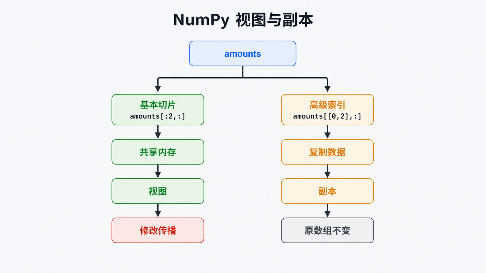

# Python NumPy 详解：从 Shape 到向量化

## 前置知识与学习目标

你需要会写 Python 列表、切片和函数。本文只解决一个问题：**如何先推导数组的 Shape 与内存关系，再写出结果可预测的向量化计算？**

完成后你应能：

- 用 `[B,T,C]` 一类记号解释每个轴的业务含义；
- 在运行前判断广播是否成立、聚合后 Shape 如何变化；
- 区分基本切片的视图与高级索引的副本，避免隐式修改原数据。

贯穿示例是一张订单金额表：3 个订单、4 个商品，输入 `amounts` 的 Shape 为 `[3,4]`，折扣 `discount` 的 Shape 为 `[3,1]`。

## 直觉：数组不是“更快的列表”

`ndarray` 是**同构的 N 维数据块**。`shape` 描述每个轴的长度，`dtype` 描述每个元素的编码，`strides` 描述沿各轴移动一步要跨过多少字节。三者共同决定“数据是什么、如何解释内存”。

```python
import numpy as np

amounts = np.array(
    [[10.0, 20.0, 30.0, 40.0],
     [12.0, 18.0, 25.0, 35.0],
     [8.0, 16.0, 24.0, 32.0]],
    dtype=np.float64,
)

print(amounts.shape)    # (3, 4)
print(amounts.dtype)    # float64
print(amounts.strides)  # 常见连续布局下为 (32, 8)
```

`strides` 依赖实际布局，不能把某个输出值当作跨平台常量；真正稳定的是它与 `dtype.itemsize`、布局之间的关系。

## 核心机制：广播从尾轴向前对齐

两个维度在对应位置**相等**，或其中一个为 `1`，才可以广播。若轴数不同，先在左侧补 `1`。因此 `[3,4]` 与 `[3,1]` 可得到 `[3,4]`，而 `[3,4]` 与 `[3]` 无法按“每个订单一个折扣”广播，因为尾轴 `4` 与 `3` 冲突。

<!-- figure-anchor:s43-f01 -->

## 广播与聚合的 Shape 推导

![订单金额 [3,4] 与折扣 [3,1] 广播为净额 [3,4]，再沿不同 axis 聚合为 [3] 或 [1,4]](./images/s43-f01-numpy-broadcast-axis-shape.png)

```python
discount = np.array([[0.90], [0.80], [1.00]])  # [3,1]
net = amounts * discount                        # [3,4]
order_total = net.sum(axis=1)                   # [3]
column_total = net.sum(axis=0, keepdims=True)   # [1,4]

assert net.shape == (3, 4)
assert order_total.shape == (3,)
assert column_total.shape == (1, 4)
```

`axis=1` 表示消去商品轴，所以 `[3,4] → [3]`；`keepdims=True` 保留被聚合的轴为长度 `1`，便于后续广播。不要背“按行/按列”，要问：**哪个轴被消去了？**

## 视图、副本与状态变化



基本切片通常返回共享数据的视图；布尔索引和整数数组索引返回副本。`reshape()` 在布局允许时也可能返回视图，因此若需要隔离修改，应显式 `.copy()`。

```python
first_two = amounts[:2, :]      # 基本切片：通常共享内存
selected = amounts[[0, 2], :]   # 高级索引：副本

assert np.shares_memory(amounts, first_two)
assert not np.shares_memory(amounts, selected)

safe = amounts[:2, :].copy()
safe[0, 0] = 999
assert amounts[0, 0] == 10
```

判断时使用 `np.shares_memory()` 或 `np.may_share_memory()`，不要依赖“看起来像新变量”。

## 随机数与可复现验证

新代码优先创建局部 `Generator`，避免修改进程级全局随机状态。

```python
rng = np.random.default_rng(42)
sample = rng.normal(loc=100, scale=15, size=(2, 3))
assert sample.shape == (2, 3)
```

固定种子只保证同一生成算法与兼容版本下便于复现实验，不应当用于密码、令牌或安全抽样。

## 常见误区与适用边界

- `a * b` 是逐元素乘法；矩阵乘法使用 `a @ b`，并先检查内维是否相等。
- `np.empty()` 的内容未初始化，不是随机数，也不能在赋值前读取。
- 向量化能减少 Python 循环开销，但巨大临时数组仍会消耗内存；必要时分块计算。
- NumPy 适合同构数值数组；带列名、缺失值和表连接的数据流程通常交给 Pandas。

## 三道自检题

1. `[8,1,64] + [1,10,64]` 的结果 Shape 是什么？
2. `x.sum(axis=0)` 对 `[3,4]` 做了什么？
3. 为什么修改 `x[:, :2]` 可能影响 `x`，而修改 `x[[0, 2]]` 通常不会？

<details>
<summary>展开答案</summary>

1. `[8,10,64]`，三个轴都满足相等或其中一个为 `1`。
2. 消去第 0 轴，把 3 组数据聚合为 Shape `[4]`。
3. 前者是基本切片，通常共享底层数据；后者是高级索引，返回副本。

</details>

## 本篇总结

NumPy 的可靠用法从 Shape 推导开始：先标注轴语义，再检查广播与聚合，最后确认内存是否共享。速度是结果，可解释的数据模型才是前提。

## 下一篇衔接

下一篇把“结构化数据”从数值数组扩展到 HTML 解析树，重点不是背选择器，而是建立“输入文档 → 解析树 → 定位 → 提取 → 校验”的稳定链路。

## 资料来源

- [NumPy User Guide](https://numpy.org/doc/stable/user/)
- [Broadcasting](https://numpy.org/doc/stable/user/basics.broadcasting.html)
- [Copies and views](https://numpy.org/doc/stable/user/basics.copies.html)
- [Random sampling](https://numpy.org/doc/stable/reference/random/index.html)
