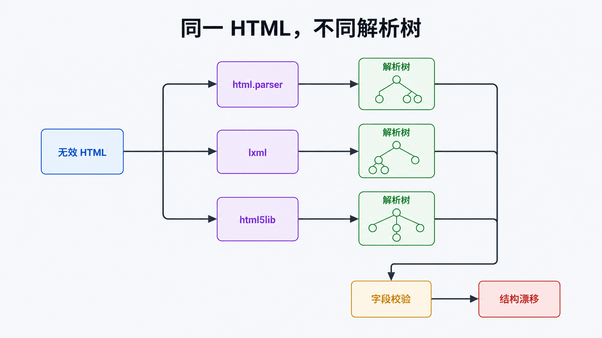

# Python Beautiful Soup 详解：稳定解析 HTML

## 前置知识与学习目标

你需要理解 HTML 标签、属性和 CSS 选择器。本文的核心问题是：**如何把不完全可信的 HTML 变成可验证的结构化记录，而不是写出“今天能跑”的脆弱选择器？**

完成后你应能解释解析器为何影响树结构，区分 `select_one()` 与 `select()` 的返回契约，并为缺失字段和页面结构漂移建立失败边界。

## 真实场景：供应商商品页

输入是一段商品卡片 HTML，输出必须是 `[{sku, name, price}]`。网络请求不属于 Beautiful Soup 的职责：请求超时、重试、robots 规则与授权应在抓取层处理；本文从已经取得的 HTML 字符串开始。

## 核心机制：先构树，再查询

Beautiful Soup 把文本交给底层解析器，得到由 `BeautifulSoup`、`Tag`、`NavigableString` 等对象组成的树，再通过查找 API 或 SoupSieve CSS 选择器定位节点。

<!-- figure-anchor:s44-f01 -->

## 解析器如何改变结果



```python
from bs4 import BeautifulSoup

broken = "<ul><li>A<li>B</ul>"
for parser in ("html.parser", "lxml", "html5lib"):
    soup = BeautifulSoup(broken, parser)
    print(parser, [item.get_text(strip=True) for item in soup.select("li")])
```

无效 HTML 可能被不同解析器修复成不同的树。生产代码应显式写出解析器并锁定依赖：

- `html.parser`：标准库自带，部署简单；
- `lxml`：速度快，适合可控环境；
- `html5lib`：更接近浏览器的 HTML5 修复规则，但通常更慢；
- XML：显式使用 `"xml"` 或 `"lxml-xml"`，不要按 HTML 规则处理命名空间和自闭合标签。

## 最小可运行提取器

```python
from bs4 import BeautifulSoup

HTML = """
<section id="catalog">
  <article class="product" data-sku="A-001">
    <h2>机械键盘</h2><span class="price">¥399.00</span>
  </article>
  <article class="product" data-sku="A-002">
    <h2>无线鼠标</h2><span class="price">¥129.00</span>
  </article>
</section>
"""

def parse_products(html: str) -> list[dict[str, str]]:
    soup = BeautifulSoup(html, "html.parser")
    catalog = soup.select_one("#catalog")
    if catalog is None:
        raise ValueError("missing #catalog")

    rows = []
    for card in catalog.select("article.product[data-sku]"):
        name = card.select_one("h2")
        price = card.select_one(".price")
        if name is None or price is None:
            raise ValueError(f"incomplete product: {card.get('data-sku')}")
        rows.append({
            "sku": card["data-sku"],
            "name": name.get_text(" ", strip=True),
            "price": price.get_text(strip=True),
        })
    return rows

result = parse_products(HTML)
assert result[0] == {"sku": "A-001", "name": "机械键盘", "price": "¥399.00"}
```

中间状态依次是：原始字符串 → 解析树 → `#catalog` 根节点 → 商品卡片集合 → 已校验记录。`find()`/`select_one()` 找不到时返回 `None`；`find_all()`/`select()` 返回集合，不能把它们混用。

## 漂移检测与失败边界

对外部页面，空结果未必代表“没有商品”，也可能是选择器失效。至少记录输入来源、解析器、卡片数、字段缺失数，并对异常比例报警。若正文由 JavaScript 运行后才出现，Beautiful Soup 不会执行脚本，应改用浏览器自动化或站点 API。

不要把整页 `prettify()` 写入正常日志，它可能包含个人信息或令牌；只保留脱敏的局部证据。

## 常见误区与适用边界

- `.string` 只适合结构很简单的节点；通用文本提取优先 `get_text(" ", strip=True)`。
- `class` 在 Python 中是关键字，查找 API 使用 `class_=`；复杂组合通常用 CSS 选择器更清楚。
- 选择器越长不代表越稳定；优先业务属性、语义标签和局部根节点，避免依赖 `nth-child`。
- Beautiful Soup 擅长容错解析与易用查询；极高吞吐或仅需 XPath 时可直接评估 `lxml`。

## 三道自检题

1. 为什么必须显式指定解析器？
2. `select_one()` 找不到节点时应如何处理？
3. 页面源代码没有目标数据，但浏览器中能看到，问题可能在哪一层？

<details>
<summary>展开答案</summary>

1. 不同环境安装的解析器不同，无效 HTML 的修复结果也可能不同。
2. 它返回 `None`；在访问属性前检查，并按字段是否必需决定报错、跳过或记录缺失。
3. 数据可能由 JavaScript 或后续 API 请求生成，Beautiful Soup 只解析已有文本，不执行脚本。

</details>

## 本篇总结

稳定解析依赖明确契约：固定解析器、限定查询根、校验必需字段、监控结构漂移。选择器只是这条链路中的一环。

## 下一篇衔接

当抓取或解析耗时不适合阻塞 Web 请求时，需要把工作交给任务队列。下一篇将建立 Celery 的消息、Worker、确认与幂等模型。

## 资料来源

- [Beautiful Soup Documentation](https://beautiful-soup-4.readthedocs.io/en/latest/)
- [Soup Sieve CSS selector reference](https://facelessuser.github.io/soupsieve/)
