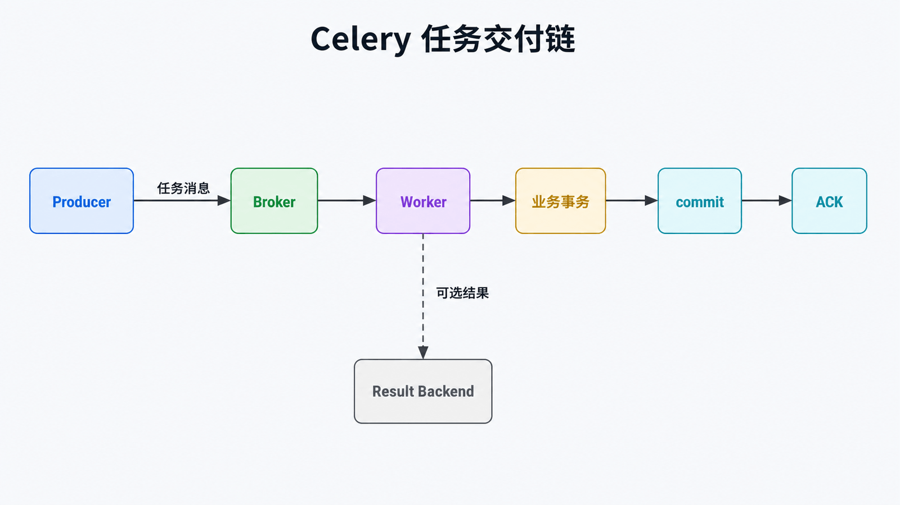
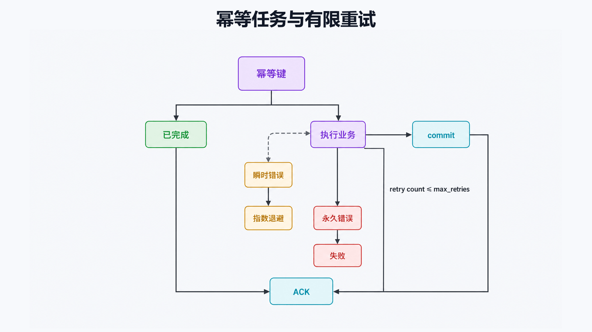

# Python Celery 详解：可靠的异步任务边界

## 前置知识与学习目标

你需要理解函数、进程和消息队列的基本概念。本文只回答：**Web 请求把任务交给 Celery 后，系统如何知道任务是否真正完成，并在重复投递时保持业务正确？**

完成后你应能解释 Broker、Worker、Result Backend 的职责，区分发布成功、执行成功与结果可查询，并写出有边界的重试与幂等任务。

## 直觉：`.delay()` 不是远程函数调用

调用 `.delay()` 通常只表示生产者把“任务名 + 参数”序列化为消息并尝试发送到 Broker。它不保证 Worker 已执行，更不保证数据库写入成功。`AsyncResult` 是任务标识和状态查询句柄，不是业务事务。

<!-- figure-anchor:s45-f01 -->

## 一次任务的调用链与状态



主路径为：Producer → Broker → Worker → 业务副作用 → ACK；Result Backend 是可选旁路。发布确认解决 Producer 到 Broker 的接管，消费确认解决 Worker 到 Broker 的处理结果，两者不能相互替代。

## 最小配置与任务

```python
from celery import Celery

app = Celery(
    "order_jobs",
    broker="redis://127.0.0.1:6379/0",
    backend="redis://127.0.0.1:6379/1",
)
app.conf.update(
    task_serializer="json",
    accept_content=["json"],
    result_serializer="json",
    task_track_started=True,
)

@app.task(
    bind=True,
    autoretry_for=(TimeoutError,),
    retry_backoff=True,
    retry_jitter=True,
    max_retries=5,
)
def import_catalog(self, import_id: str) -> dict[str, str]:
    # 真实实现应先检查 import_id 是否已完成，再写入同一幂等键。
    return {"import_id": import_id, "status": "done"}
```

```bash
celery -A tasks worker --loglevel=INFO
```

生产者只传递小而稳定的标识符：

```python
result = import_catalog.delay("imp-20260717-001")
print(result.id)
```

不要把 ORM 对象、文件句柄或大块二进制数据塞进消息；传 ID，让 Worker 在自己的事务与连接中重新读取。

## 幂等、确认与重试



可靠任务通常按以下顺序设计：

1. 用业务幂等键查询是否已经完成；
2. 在事务中写入结果或状态；
3. 提交业务事务；
4. 任务返回后再确认消息（若使用 `acks_late=True`）。

`acks_late` 会扩大重投递可能性，因此任务必须幂等。重试只用于超时、临时断连等瞬时错误；参数错误、权限错误等永久失败应快速终止。设置指数退避、抖动和最大次数，避免重试风暴。

Celery 不能让“数据库提交”和“消息 ACK”天然成为同一个原子事务。关键事件可采用事务发件箱（outbox）：业务事务同时写业务表和待发布事件，再由独立发布器发送。

## 定时任务与结果边界

Celery Beat 是调度器，不是 Worker；同一调度计划通常只运行一个 Beat 实例，或使用具备互斥能力的调度方案。结果 Backend 适合状态查询和短期结果，不应替代业务数据库；不需要结果时可 `ignore_result=True`。

不要在任务内部同步等待另一个任务的 `.get()`，这会占住 Worker 槽位并可能造成死锁。使用 chain、group、chord 等 Canvas 原语表达依赖。

## 常见误区与适用边界

- “调用成功”不等于“任务完成”；HTTP 响应应返回任务 ID 或业务作业 ID。
- 超时等待结果不会自动终止 Worker 中的任务。
- Celery 适合秒级到分钟级后台工作；要求强一致、毫秒级同步响应的逻辑应留在请求事务内。
- 队列长度不是唯一健康指标，还要观察最老消息年龄、失败率、重试率和执行时延。

## 三道自检题

1. Broker 与 Result Backend 分别保存什么？
2. 为什么 `acks_late=True` 必须配合幂等任务？
3. 哪些错误适合自动重试？

<details>
<summary>展开答案</summary>

1. Broker 传递待执行消息；Result Backend 可选地保存任务状态和返回值。
2. Worker 在提交业务结果后、ACK 前崩溃会导致消息再次投递，重复执行必须无额外副作用。
3. 网络超时、临时限流等瞬时错误；确定的参数、认证和业务规则错误不应盲目重试。

</details>

## 本篇总结

Celery 的核心不是“异步语法”，而是跨进程、跨网络的交付边界。用业务幂等键、有限重试、明确 ACK 时机和可观测状态，才能把任务做成可靠系统组件。

## 下一篇衔接

异步导入后的文章需要被搜索。下一篇比较搜索抽象与 Django/PostgreSQL 原生全文搜索，并解释查询、向量、排名和索引为何必须保持一致。

## 资料来源

- [Celery Tasks](https://docs.celeryq.dev/en/stable/userguide/tasks.html)
- [Celery Calling Tasks](https://docs.celeryq.dev/en/stable/userguide/calling.html)
- [Celery Canvas](https://docs.celeryq.dev/en/stable/userguide/canvas.html)
- [Celery Periodic Tasks](https://docs.celeryq.dev/en/stable/userguide/periodic-tasks.html)
