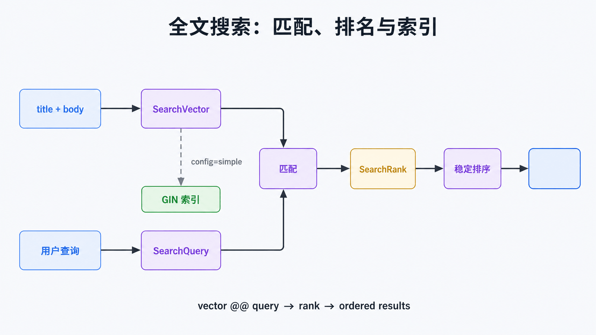

# Python Haystack 与 Django 全文搜索：从查询到索引

## 前置知识与学习目标

你需要会使用 Django ORM，并了解数据库索引的作用。本文的唯一核心问题是：**搜索文本如何经过规范化、匹配、排名和索引，得到可解释且可扩展的结果？**

完成后你应能选择 Haystack 或原生 PostgreSQL 路线，解释 `SearchVector`、`SearchQuery`、`SearchRank` 的调用链，并发现“查询表达式与索引表达式不一致”的性能错误。

## 先做技术边界决策

Haystack 提供统一的 `SearchIndex`/`SearchQuerySet` 抽象，适合需要切换或同时接入 Elasticsearch、Solr 等后端的项目。若数据已经在 PostgreSQL，搜索需求以站内文本、权重、排名和高亮为主，Django 的 `django.contrib.postgres.search` 更短、更容易随数据库事务保持一致。

本文选择 Django 6 + PostgreSQL 原生全文搜索；保留 Haystack 作为“多后端抽象”边界，不把两套 API 混在同一个最小示例中。

<!-- figure-anchor:s46-f01 -->

## 搜索调用链：文档、查询、排名、索引



文本字段先被 `SearchVector` 转为 `tsvector`，用户输入被 `SearchQuery` 转为 `tsquery`；匹配运算筛选候选，`SearchRank` 计算相关性，GIN 索引加速向量匹配。分词配置与权重属于这条契约的一部分。

## 最小查询

```python
from django.contrib.postgres.search import SearchQuery, SearchRank, SearchVector

vector = (
    SearchVector("title", weight="A", config="simple")
    + SearchVector("body", weight="B", config="simple")
)
query = SearchQuery("NumPy 广播", search_type="websearch", config="simple")

results = (
    Article.objects
    .annotate(rank=SearchRank(vector, query))
    .filter(rank__gte=0.05)
    .order_by("-rank", "-published_at", "id")
)
```

输入是用户查询字符串；中间状态是 `tsquery`、匹配候选和 `rank`；输出是带稳定次级排序的文章集合。`websearch` 语法适合普通搜索框，若允许 `raw` 语法，必须明确输入可信边界。Django 6 的 `Lexeme` 可安全构造带运算符的词项。

## 让索引表达式与查询一致

当数据量超过几百条且查询频繁时，逐行计算向量会变贵。可为与查询相同的向量表达式建立函数式 GIN 索引：

```python
from django.contrib.postgres.indexes import GinIndex
from django.contrib.postgres.search import SearchVector
from django.db import models

class Article(models.Model):
    title = models.CharField(max_length=200)
    body = models.TextField()

    class Meta:
        indexes = [
            GinIndex(
                SearchVector("title", "body", config="simple"),
                name="article_search_gin",
            )
        ]
```

若查询使用不同 `config`、字段组合或表达式，优化器可能无法使用这个索引。先用真实查询和 `EXPLAIN (ANALYZE, BUFFERS)` 验证，再决定是否维护 `SearchVectorField`；后者还需要触发器或写入流程保持同步。

## 质量验证与边界

搜索不是只测“有结果”。建立小型标注集，至少检查：应命中的文章、必须排在前面的结果、不应出现的结果、空查询、停用词、中文分词与拼写误差。PostgreSQL 内置配置对中文分词能力有限，中文召回质量要求高时应评估分词扩展或专用搜索引擎。

Haystack 也不会消除索引更新、重建、别名切换和后端一致性问题；它统一的是调用接口，不是运维语义。

## 常见误区与适用边界

- `icontains` 是子串匹配，不等同全文搜索，也无法提供同样的语言处理和排名。
- 只按 `rank` 排序可能不稳定；添加时间和主键作为平局规则。
- 高亮片段是展示数据，输出到 HTML 前仍要遵守转义策略。
- 多租户查询必须先加租户过滤，不能依赖搜索词隔离数据。

## 三道自检题

1. `SearchVector` 与 `SearchQuery` 分别表示什么？
2. 为什么 GIN 索引与查询的 `config` 必须一致？
3. 什么时候更适合引入 Haystack 或专用搜索引擎？

<details>
<summary>展开答案</summary>

1. 前者表示规范化后的可搜索文档，后者表示规范化后的用户查询。
2. PostgreSQL 只有在索引表达式能覆盖查询表达式时才可能使用该索引。
3. 需要多后端抽象、复杂中文分析、大规模分布式检索或搜索引擎特有能力时。

</details>

## 本篇总结

搜索是一条可验证的数据链，而不是一个输入框。先固定文档、查询、配置和排名契约，再用匹配的索引和标注集验证性能与质量。

## 下一篇衔接

搜索日志与订单明细常以表格进入分析流程。下一篇用 Pandas 建立“读取 → 校验 → 清洗 → 聚合 → 合并 → 输出”的可审计管道。

## 资料来源

- [Django 6 Full text search](https://docs.djangoproject.com/en/6.0/ref/contrib/postgres/search/)
- [PostgreSQL Full Text Search](https://www.postgresql.org/docs/current/textsearch.html)
- [Haystack documentation](https://django-haystack.readthedocs.io/en/master/)
