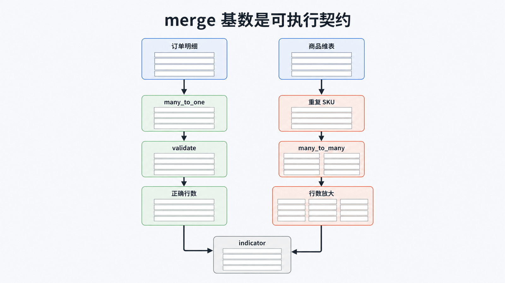

# Python Pandas 详解：可审计的数据管道

## 前置知识与学习目标

你应理解 Python 字典、列表以及 NumPy 的 Shape 与 dtype。本文只解决：**怎样把一组表格变换写成输入、Schema、中间状态和输出都可检查的数据管道？**

完成后你应能区分标签对齐与位置运算，安全处理缺失值，验证 `merge()` 的基数，并避免链式赋值和静默类型漂移。

## 直觉：DataFrame 是“带标签的列集合”

`DataFrame.shape` 仍是 `[R,C]`，但每一列可以有独立 dtype，行与列都有标签。Pandas 运算默认按标签对齐，不是单纯按位置拼接；这既强大，也会产生意外的 `NaN`。

```python
import pandas as pd

left = pd.Series([10, 20], index=["A", "B"])
right = pd.Series([1, 2], index=["B", "C"])
print(left + right)  # 只有标签 B 同时存在，其余位置为缺失值
```

## 贯穿示例与 Schema

输入是订单明细 `[4,5]`：`order_id`、`sku`、`qty`、`unit_price`、`region`。先在读取边界声明类型，再验证业务约束。

<!-- figure-anchor:s47-f01 -->

## 从原始表到地区汇总的状态变化

![订单表从 [4,5] 经 Schema 校验和清洗到 [3,5]，派生 amount 后为 [3,6]，按地区汇总为 [2,3] 并对账](./images/s47-f01-pandas-pipeline-shape.png)

```python
from io import StringIO
import pandas as pd

CSV = """order_id,sku,qty,unit_price,region
O-1,A-1,2,19.90,east
O-1,B-2,1,5.00,east
O-2,A-1,3,19.90,west
O-3,C-3,,8.50,east
"""

orders = pd.read_csv(
    StringIO(CSV),
    dtype={"order_id": "string", "sku": "string", "region": "category"},
)
orders["qty"] = orders["qty"].astype("Int64")

if orders[["order_id", "sku", "unit_price"]].isna().any().any():
    raise ValueError("required field is missing")
if (orders["unit_price"] < 0).any():
    raise ValueError("unit_price must be non-negative")

clean = orders.dropna(subset=["qty"]).copy()
clean["amount"] = clean["qty"] * clean["unit_price"]

summary = (
    clean.groupby("region", observed=True, as_index=False)
    .agg(order_count=("order_id", "nunique"), revenue=("amount", "sum"))
    .sort_values(["revenue", "region"], ascending=[False, True])
)

assert clean.shape == (3, 6)
assert summary["revenue"].sum() == clean["amount"].sum()
```

关键中间状态是：原始 `[4,5]` → 去除缺少数量的记录 `[3,5]` → 增加金额列 `[3,6]` → 地区汇总 `[2,3]`。删除数据必须记录原因和数量；真实项目常把无效行送入隔离表，而不是静默丢弃。

## 合并时验证基数



`merge()` 最危险的错误不是报错，而是多对多连接造成行数爆炸。把预期关系写进代码：

```python
products = pd.DataFrame({
    "sku": pd.Series(["A-1", "B-2", "C-3"], dtype="string"),
    "category": ["keyboard", "accessory", "accessory"],
})

enriched = clean.merge(
    products,
    on="sku",
    how="left",
    validate="many_to_one",
    indicator=True,
)
assert (enriched["_merge"] == "both").all()
```

`validate="many_to_one"` 把“商品维表每个 SKU 唯一”变成可执行契约；`indicator=True` 暴露未匹配记录。

## 赋值、Copy-on-Write 与边界

使用 `.loc[行条件, 列] = 值` 做一次明确赋值，避免 `df[mask]["col"] = ...`。Pandas 3 的 Copy-on-Write 让派生对象表现为独立副本，但链式赋值仍不表达“修改哪个对象”，不应依赖旧版的偶然行为。

Pandas 适合内存内或可分块的表格分析。数据明显大于内存、需要分布式执行或严格 SQL 事务时，应考虑数据库、Polars/DuckDB 或分布式引擎，并用同一 Schema 和对账规则迁移。

## 常见误区与适用边界

- `object` dtype 可能混合多种 Python 对象；文本优先显式 `string`，可空整数使用 `Int64`。
- `NaN`、`pd.NA` 和 `None` 语义不同，比较缺失值使用 `isna()`。
- `inplace=True` 不等于更省内存，也不利于管道式审阅；优先显式重新赋值。
- 浮点数不适合精确财务结算；示例用于分析，结算应使用十进制或最小货币单位整数。

## 三道自检题

1. 两个 Series 相加为何会出现新的缺失值？
2. `merge(validate="many_to_one")` 保护了什么？
3. 为什么清洗后要做总额对账？

<details>
<summary>展开答案</summary>

1. Pandas 按索引标签对齐，任一侧缺少标签时结果为缺失。
2. 它断言右表连接键唯一，防止意外多对多连接放大行数。
3. 证明筛选、计算和聚合没有静默丢失或重复数据。

</details>

## 本篇总结

可靠 Pandas 管道把 Schema、Shape、连接基数和对账条件写成代码。API 调用只是手段，能解释每一步数据状态才是完成标准。

## 下一篇衔接

下一篇处理另一类外部数据：图片。Pillow 同样需要明确“解码 → 方向校正 → 模式转换 → 缩放 → 编码”的状态链和安全边界。

## 资料来源

- [pandas User Guide](https://pandas.pydata.org/docs/user_guide/)
- [Copy-on-Write](https://pandas.pydata.org/docs/user_guide/copy_on_write.html)
- [Merge, join, concatenate and compare](https://pandas.pydata.org/docs/user_guide/merging.html)
- [Working with missing data](https://pandas.pydata.org/docs/user_guide/missing_data.html)
