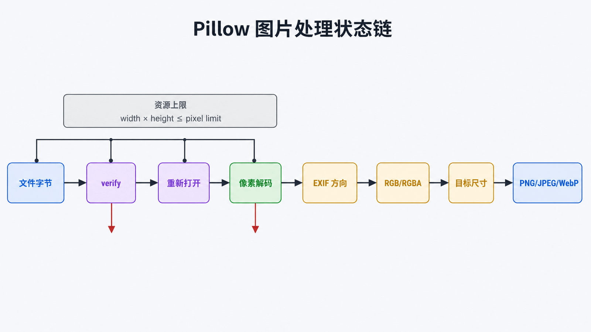

# Python Pillow 详解：安全的图片处理管道

## 前置知识与学习目标

你需要会使用文件路径与上下文管理器。本文的核心问题是：**如何把不可信的上传图片转换为尺寸、方向、颜色和元数据都可预测的输出？**

完成后你应能解释 `Image.open()` 的延迟解码生命周期，区分像素尺寸与颜色模式，并构造“验证 → 校正 → 转换 → 缩放 → 编码”的安全管道。

## 直觉：打开文件不等于像素已进入内存

`Image.open()` 先识别格式并读取元数据，像素通常在 `load()` 或首次处理时才解码。单帧图片解码后可脱离文件；多帧图片仍可能需要底层文件以 `seek()` 到其他帧。因此应使用上下文管理器，并在退出前完成所需帧的读取或复制。

<!-- figure-anchor:s48-f01 -->

## 图片从字节到输出文件的状态链



一张上传图依次经过：文件字节 → 格式与尺寸检查 → 像素解码 → EXIF 方向校正 → `RGB/RGBA` 模式 → 目标尺寸 → PNG/JPEG/WebP 编码。每一步都可能失败，不能把扩展名当成真实格式。

## 最小可运行缩略图管道

```python
from pathlib import Path
import warnings

from PIL import Image, ImageOps, UnidentifiedImageError

def make_thumbnail(source: Path, target: Path, size: tuple[int, int] = (800, 800)) -> None:
    warnings.simplefilter("error", Image.DecompressionBombWarning)

    try:
        with Image.open(source) as opened:
            opened.verify()  # 校验容器；verify 后必须重新打开才能解码

        with Image.open(source) as opened:
            image = ImageOps.exif_transpose(opened)
            image.load()
            image = image.convert("RGB")
            image.thumbnail(size, Image.Resampling.LANCZOS)

            target.parent.mkdir(parents=True, exist_ok=True)
            image.save(target, format="JPEG", quality=85, optimize=True)
    except (UnidentifiedImageError, OSError, Image.DecompressionBombError) as exc:
        raise ValueError(f"invalid image: {source.name}") from exc
```

输入是路径，输出是最大边不超过 800 的 JPEG。`thumbnail()` 保持宽高比并原地修改对象；若需要固定画布，可根据语义选择 `ImageOps.contain()`、`fit()` 或 `pad()`，三者的裁剪行为不同。

## 模式、透明度与编码

- `RGB`：三通道彩色，无 Alpha；适合 JPEG。
- `RGBA`：四通道，含透明度；适合需要透明背景的 PNG/WebP。
- `L`：灰度；`P`：调色板索引。

把 `RGBA` 直接保存为 JPEG 会失败或丢失透明语义。必须先选择背景色进行 Alpha 合成，再转为 `RGB`。格式与内容目标应一起决定：照片常用 JPEG/WebP，透明图与精确线条常用 PNG。

## 不可信输入的安全边界

压缩炸弹可用很小文件声明巨量像素。不要在生产环境把 `Image.MAX_IMAGE_PIXELS` 设为 `None`；将 `DecompressionBombWarning` 升级为错误，并在应用或容器层限制文件字节数、像素数、CPU、内存与处理时间。

EXIF、XMP、PNG 文本块和 ICC profile 都是输入数据，不应未经校验写入数据库或页面。公开输出若不需要元数据，应创建新图像或保存时不传入原元数据，并在 CI 中验证结果。

## 常见误区与适用边界

- `verify()` 不解码完整像素，且调用后应重新打开文件。
- `resize()` 强制得到指定尺寸，可能拉伸；`thumbnail()` 保持比例且不放大。
- Pillow 适合单机解码与变换，不负责上传鉴权、对象存储一致性或任务调度。
- 超大图批量处理应交给受资源限制的 Worker，并记录输入哈希、格式、尺寸、耗时和失败原因。

## 三道自检题

1. 为什么 `Image.open()` 后文件仍可能保持打开？
2. `verify()` 后为什么要重新打开图片？
3. 将透明 PNG 转成 JPEG 前必须做什么决策？

<details>
<summary>展开答案</summary>

1. 它采用延迟解码，像素或后续帧可能仍需从文件读取。
2. `verify()` 会检查容器并使对象不再适合后续像素加载。
3. 选择背景色进行 Alpha 合成，再转换为 `RGB`。

</details>

## 本篇总结

Pillow 管道的可靠性来自显式状态：真实格式、像素上限、方向、模式、尺寸和编码参数都要验证。图片不是“打开后保存”这么简单。

## 下一篇衔接

处理后的商品数据需要写入数据库。下一篇使用 PyMySQL 解释参数绑定、事务边界和连接资源，避免把“执行 SQL”误当成“数据已安全提交”。

## 资料来源

- [Pillow File handling](https://pillow.readthedocs.io/en/stable/reference/open_files.html)
- [Pillow Image module](https://pillow.readthedocs.io/en/stable/reference/Image.html)
- [Pillow Security](https://pillow.readthedocs.io/en/stable/handbook/security.html)
- [Pillow ImageOps](https://pillow.readthedocs.io/en/stable/reference/ImageOps.html)
